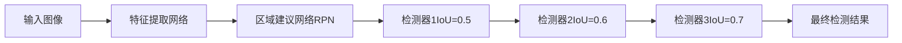

# Cascade R-CNN原理与代码实例讲解

## 1. 背景介绍

### 1.1 目标检测发展历程

目标检测是计算机视觉领域的一个重要研究方向,旨在从图像或视频中检测出感兴趣的目标并确定其位置。近年来,深度学习技术的发展极大地推动了目标检测的进步。从2012年AlexNet在ImageNet图像分类竞赛中的突破性表现,到R-CNN、Fast R-CNN、Faster R-CNN等二阶段检测算法的提出,再到YOLO、SSD等单阶段检测算法的兴起,目标检测的性能不断提升。

### 1.2 Cascade R-CNN的提出

尽管已有的目标检测算法取得了很大进展,但在精度和速度的权衡、小目标检测、位置精确定位等方面仍存在挑战。为了进一步提升目标检测的性能,2018年何凯明等人提出了Cascade R-CNN。该方法基于Faster R-CNN框架,通过级联多个检测器来逐步提高检测质量,在COCO数据集上取得了当时最好的结果。

## 2. 核心概念与联系

### 2.1 Faster R-CNN回顾

为了理解Cascade R-CNN,我们首先回顾一下Faster R-CNN的基本原理。Faster R-CNN是一种两阶段目标检测算法,主要包括以下步骤:

1. 利用预训练的卷积神经网络提取图像特征
2. 通过区域建议网络(RPN)生成候选区域(Region Proposals)
3. 对候选区域进行分类和位置精修(Classification and Bounding Box Regression)

其中,分类和位置精修是通过一个检测器(如Fast R-CNN)完成的。

### 2.2 Cascade R-CNN核心思想

Cascade R-CNN的核心思想是,不止使用一个检测器,而是级联多个越来越严格的检测器,每个检测器都以前一个检测器的输出作为输入,通过逐步提高IoU阈值来训练检测器。这样可以不断提高检测质量,同时保持较高的检测效率。

具体来说,Cascade R-CNN包含以下关键点:

- 多阶段检测器级联:使用多个阶段的检测器,每个阶段的检测器都比前一阶段更严格,通过逐步提高IoU阈值来训练。
- 检测器间信息传递:每个阶段的检测器都以前一阶段检测器的输出作为输入,充分利用前一阶段的信息。
- 共享特征:所有阶段的检测器共享同一个特征提取网络,避免了重复计算。

下图展示了Cascade R-CNN的整体架构:



## 3. 核心算法原理具体操作步骤

### 3.1 特征提取

与Faster R-CNN类似,Cascade R-CNN首先使用预训练的卷积神经网络(如ResNet)对输入图像进行特征提取,得到特征图。这一步是所有阶段检测器共享的。

### 3.2 区域建议生成

接下来,通过区域建议网络(RPN)在特征图上生成候选区域。RPN通过一系列卷积、分类和回归操作,提出可能包含目标的区域。这一步也与Faster R-CNN相同。

### 3.3 级联检测器

生成候选区域后,Cascade R-CNN的核心部分就开始了。不同于Faster R-CNN只使用一个检测器,Cascade R-CNN使用多个阶段的检测器,每个阶段的检测器都以前一阶段的输出作为输入。

设总共有 $T$ 个阶段的检测器。对于第 $t$ 个阶段的检测器,其训练过程如下:

1. 从前一阶段检测器($t-1$)的输出中选择正样本。正样本的选择标准是与真值框的IoU大于一个阈值 $u_t$,其中阈值 $u_t$ 随着阶段数 $t$ 的增加而增大,即 $u_1<u_2<...<u_T$。
2. 对选出的正样本进行分类和位置精修,得到该阶段检测器的输出。
3. 基于该阶段检测器的输出,更新正样本集合,进入下一阶段的训练。

测试时,输入图像依次经过 $T$ 个阶段的检测器,最后一个阶段的输出即为最终的检测结果。

### 3.4 损失函数

每个阶段的检测器都有自己的分类损失和回归损失,总的损失函数是所有阶段损失的加权和:

$$
L = \sum_{t=1}^{T} \alpha_t (L_{cls}^t + \lambda L_{reg}^t)
$$

其中 $\alpha_t$ 为第 $t$ 阶段的权重系数,$L_{cls}^t$ 和 $L_{reg}^t$ 分别为第 $t$ 阶段的分类损失和回归损失,$\lambda$ 为平衡因子。

分类损失采用交叉熵损失,回归损失采用Smooth L1损失,与Faster R-CNN中相同。

## 4. 数学模型和公式详细讲解举例说明

### 4.1 IoU的计算

IoU(Intersection over Union)是评估检测框与真值框重合度的常用指标。给定两个矩形框 $A$ 和 $B$,其IoU定义为:

$$
IoU = \frac{|A \cap B|}{|A \cup B|} = \frac{|A \cap B|}{|A| + |B| - |A \cap B|}
$$

其中 $|A \cap B|$ 表示两个框的交集面积,$|A \cup B|$ 表示两个框的并集面积。IoU的取值范围为 $[0, 1]$,越大表示两个框的重合度越高。

举例来说,假设检测框 $A$ 的坐标为 $(x_1, y_1, x_2, y_2) = (20, 30, 70, 90)$,真值框 $B$ 的坐标为 $(25, 40, 80, 100)$,则它们的交集为 $(25, 40, 70, 90)$,并集为 $(20, 30, 80, 100)$。计算可得:

$$
|A \cap B| = (70-25) \times (90-40) = 2250 \\
|A \cup B| = (80-20) \times (100-30) - 2250 = 4200 \\
IoU = \frac{2250}{4200} \approx 0.536
$$

### 4.2 分类损失

分类损失采用交叉熵损失函数。对于第 $t$ 阶段的检测器,设真值标签为 $y \in \{0, 1\}$,预测概率为 $p \in [0, 1]$,则交叉熵损失定义为:

$$
L_{cls}^t = \begin{cases}
-\log(p), & y = 1 \\
-\log(1-p), & y = 0
\end{cases}
$$

举例来说,假设一个候选区域的真值标签为1(即为正样本),经过检测器预测为正样本的概率为0.8,则其分类损失为:

$$
L_{cls}^t = -\log(0.8) \approx 0.223
$$

### 4.3 回归损失

回归损失采用Smooth L1损失函数。对于第 $t$ 阶段的检测器,设真值框坐标为 $(x, y, w, h)$,预测框坐标为 $(\hat{x}, \hat{y}, \hat{w}, \hat{h})$,则Smooth L1损失定义为:

$$
L_{reg}^t = \sum_{i \in \{x, y, w, h\}} \text{Smooth}_{L1}(t_i - \hat{t}_i)
$$

其中

$$
\text{Smooth}_{L1}(x) = \begin{cases}
0.5x^2, & |x| < 1 \\
|x| - 0.5, & |x| \geq 1
\end{cases}
$$

$t_i$ 和 $\hat{t}_i$ 分别表示真值和预测值的归一化坐标:

$$
t_x = (x - x_a) / w_a, \quad t_y = (y - y_a) / h_a \\
t_w = \log(w / w_a), \quad t_h = \log(h / h_a) \\
\hat{t}_x = (\hat{x} - x_a) / w_a, \quad \hat{t}_y = (\hat{y} - y_a) / h_a \\
\hat{t}_w = \log(\hat{w} / w_a), \quad \hat{t}_h = \log(\hat{h} / h_a)
$$

其中 $(x_a, y_a, w_a, h_a)$ 为候选区域(锚框)的坐标和尺寸。

举例来说,假设候选区域的坐标为 $(20, 30, 60, 80)$,真值框坐标为 $(25, 35, 70, 90)$,预测框坐标为 $(28, 32, 65, 85)$,则归一化后的坐标差为:

$$
t_x - \hat{t}_x = (25 - 20) / 60 - (28 - 20) / 60 \approx -0.050 \\
t_y - \hat{t}_y = (35 - 30) / 80 - (32 - 30) / 80 \approx 0.025 \\
t_w - \hat{t}_w = \log(70 / 60) - \log(65 / 60) \approx 0.062 \\
t_h - \hat{t}_h = \log(90 / 80) - \log(85 / 80) \approx 0.045
$$

代入Smooth L1函数可得回归损失:

$$
L_{reg}^t = 0.5 \times (0.050^2 + 0.025^2) + 0.062 - 0.5 + 0.045 - 0.5 \approx 0.003
$$

## 5. 项目实践：代码实例和详细解释说明

下面我们通过一个简单的代码实例来演示如何使用Cascade R-CNN进行目标检测。这里我们使用PyTorch实现。

```python
import torch
import torch.nn as nn
import torchvision

# 定义Cascade R-CNN模型
class CascadeRCNN(nn.Module):
    def __init__(self, num_classes, num_stages=3):
        super(CascadeRCNN, self).__init__()
        self.num_classes = num_classes
        self.num_stages = num_stages
        
        # 特征提取网络
        self.backbone = torchvision.models.resnet50(pretrained=True)
        self.backbone = nn.Sequential(*list(self.backbone.children())[:-2])
        
        # 区域建议网络
        self.rpn = torchvision.models.detection.rpn.RegionProposalNetwork(
            1024, 3, 256, 0.5, (0.5, 1.0, 2.0), 2000, 2000
        )
        
        # 检测头
        self.heads = nn.ModuleList()
        for stage in range(num_stages):
            r_fc = nn.Linear(1024, 1024)
            c_fc = nn.Linear(1024, num_classes)
            self.heads.append(
                torchvision.models.detection.faster_rcnn.TwoMLPHead(1024, r_fc, c_fc)
            )
    
    def forward(self, images, targets=None):
        # 特征提取
        features = self.backbone(images)
        
        # 区域建议
        proposals, _ = self.rpn(images, features)
        
        # 检测头
        detections = proposals
        losses = {}
        for stage, head in enumerate(self.heads):
            class_logits, box_regression = head(features, detections)
            
            if self.training:
                # 计算损失
                matched_idxs = []
                for target in targets:
                    iou = torchvision.ops.box_iou(detections, target['boxes'])
                    iou_max, iou_argmax = iou.max(dim=1)
                    matched_idx = iou_argmax[iou_max >= self.iou_thresholds[stage]]
                    matched_idxs.append(matched_idx)
                
                cls_loss, reg_loss = fastrcnn_loss(
                    class_logits, box_regression, 
                    concat_matched_idxs, concat_targets
                )
                losses.update({
                    f'stage{stage+1}_cls_loss': cls_loss, 
                    f'stage{stage+1}_reg_loss': reg_loss
                })
            
            # 位置精修
            detections = refine_detections(detections, box_regression)
            
            if not self.training:
                # 根据分类分数过滤检测框
                scores = class_logits.softmax(1)[:, 1:]
                keep = torchvision.ops.batched_nms(detections, scores, torch.ones_like(scores), 0.5)
                detections = detections[keep]
        
        if self.training:
            return losses
        else:
            return detections
        
# 定义损失函数        
def fastrcnn_loss(