# Cloudera Manager原理与代码实例讲解

## 1.背景介绍

随着大数据时代的到来,海量数据的存储、处理和分析成为了企业面临的重大挑战。Apache Hadoop作为开源的大数据处理框架,凭借其分布式存储和计算能力,成为了大数据解决方案的核心。然而,手动部署和管理Hadoop集群是一项复杂且耗时的任务,需要大量的时间和专业知识。为了简化这一过程,Cloudera公司开发了Cloudera Manager,一款用于部署、管理和监控Hadoop集群的集中管理工具。

Cloudera Manager通过提供直观的Web界面和自动化工具,使得管理员能够轻松地配置、监控和维护Hadoop集群。它支持多种Hadoop发行版,包括Cloudera的CDH(Cloudera Distribution Hadoop)和Apache的开源版本。Cloudera Manager不仅可以管理Hadoop核心组件,还可以管理生态系统中的其他大数据组件,如HBase、Impala、Spark等。

在本文中,我们将深入探讨Cloudera Manager的原理和架构,并通过代码实例来演示其关键功能和使用方法。无论您是大数据初学者还是经验丰富的管理员,本文都将为您提供全面的Cloudera Manager知识。

## 2.核心概念与联系

在深入探讨Cloudera Manager的原理之前,让我们先了解一些核心概念:

### 2.1 Hadoop集群

Hadoop集群是一组紧密协作的计算机节点,共同执行大数据处理任务。典型的Hadoop集群包括以下组件:

- **NameNode**: 管理HDFS(Hadoop分布式文件系统)的元数据和文件系统命名空间。
- **DataNode**: 存储实际数据块并执行数据块的创建、删除和复制操作。
- **ResourceManager**: 负责管理和调度集群资源,并监控应用程序的执行。
- **NodeManager**: 运行在每个数据节点上,负责启动和监控容器(Container)。

### 2.2 Cloudera Manager架构

Cloudera Manager采用了主从架构,包括以下主要组件:

- **Server**: 作为中心管理节点,负责管理整个Hadoop集群的生命周期。
- **Agent**: 运行在每个集群节点上,负责监控主机并执行Server发送的指令。
- **管理服务(Management Services)**: 提供核心功能,如活动监控、警报、报告等。
- **数据库**: 存储集群配置信息、监控数据和审计记录。

```mermaid
graph TD
    subgraph Cloudera Manager Server
        Server[Server]
        ActivityMonitor[Activity Monitor]
        AlertPublisher[Alert Publisher]
        HostMonitor[Host Monitor]
        ServiceMonitor[Service Monitor]
        EventServer[Event Server]
        NavigatorMetadataServer[Navigator Metadata Server]
        ReportsManager[Reports Manager]
        BatchTruncater[Batch Truncater]
    end

    subgraph Cluster Nodes
        Node1[Node 1]
        Node2[Node 2]
        Node3[Node 3]
        NodeN[Node N]
    end

    Database[(Database)]

    Server --> |Manages| Node1
    Server --> |Manages| Node2
    Server --> |Manages| Node3
    Server --> |Manages| NodeN
    Server --> |Stores data| Database
    ActivityMonitor --> |Monitors| Node1
    ActivityMonitor --> |Monitors| Node2
    ActivityMonitor --> |Monitors| Node3
    ActivityMonitor --> |Monitors| NodeN
    AlertPublisher --> |Publishes alerts| Node1
    AlertPublisher --> |Publishes alerts| Node2
    AlertPublisher --> |Publishes alerts| Node3
    AlertPublisher --> |Publishes alerts| NodeN
    HostMonitor --> |Monitors hosts| Node1
    HostMonitor --> |Monitors hosts| Node2
    HostMonitor --> |Monitors hosts| Node3
    HostMonitor --> |Monitors hosts| NodeN
    ServiceMonitor --> |Monitors services| Node1
    ServiceMonitor --> |Monitors services| Node2
    ServiceMonitor --> |Monitors services| Node3
    ServiceMonitor --> |Monitors services| NodeN
    EventServer --> |Processes events| Node1
    EventServer --> |Processes events| Node2
    EventServer --> |Processes events| Node3
    EventServer --> |Processes events| NodeN
    NavigatorMetadataServer --> |Manages metadata| Node1
    NavigatorMetadataServer --> |Manages metadata| Node2
    NavigatorMetadataServer --> |Manages metadata| Node3
    NavigatorMetadataServer --> |Manages metadata| NodeN
    ReportsManager --> |Generates reports| Node1
    ReportsManager --> |Generates reports| Node2
    ReportsManager --> |Generates reports| Node3
    ReportsManager --> |Generates reports| NodeN
    BatchTruncater --> |Truncates data| Database
```



上图展示了Cloudera Manager的架构,其中Server作为中心管理节点,通过Agent与集群节点进行通信。各个管理服务负责不同的功能,如活动监控、警报发布、主机监控、服务监控等。数据库用于存储集群配置信息、监控数据和审计记录。

## 3.核心算法原理具体操作步骤

Cloudera Manager的核心功能包括自动化部署、配置管理、集群监控、服务管理等。让我们深入探讨其中一些关键算法原理和操作步骤。

### 3.1 自动化部署

自动化部署是Cloudera Manager的一大核心功能,它可以大大简化Hadoop集群的部署过程。部署过程包括以下主要步骤:

1. **集群规划**: 根据业务需求和硬件资源,规划集群的节点数量、角色分配和配置参数。

2. **软件分发**: Cloudera Manager将所需的软件包分发到各个集群节点。

3. **配置管理**: 根据集群规划,自动生成并分发配置文件到各个节点。

4. **服务启动**: 按照预定义的顺序,启动各个Hadoop服务,如HDFS、YARN、Hive等。

5. **健康检查**: 监控服务启动状态,并执行必要的故障恢复操作。

自动化部署算法的核心思想是将复杂的部署过程分解为多个可重用的步骤,并通过集中管理和自动化执行这些步骤。这种方式可以大大减少人工干预,提高部署效率和一致性。

### 3.2 配置管理

配置管理是Cloudera Manager的另一个核心功能。Hadoop集群中的每个服务都需要大量的配置参数,手动管理这些参数是一项艰巨的任务。Cloudera Manager通过集中式配置管理,简化了这一过程。

配置管理的主要步骤包括:

1. **配置模型**: 定义配置模型,描述服务、角色及其配置参数之间的关系。

2. **配置验证**: 在应用新配置之前,验证配置的完整性和一致性。

3. **配置分发**: 将新配置分发到相应的集群节点。

4. **配置应用**: 在集群节点上应用新配置,并重启受影响的服务。

5. **配置回滚**: 如果新配置导致问题,可以快速回滚到之前的配置状态。

配置管理算法的核心思想是将配置视为一个整体,并通过集中式管理和自动化操作来维护配置的一致性。这种方式可以减少人为错误,提高配置管理的效率和可靠性。

## 4.数学模型和公式详细讲解举例说明

在大数据领域,数学模型和公式扮演着重要的角色。Cloudera Manager也采用了一些数学模型和公式来优化集群性能和资源利用率。

### 4.1 负载均衡模型

负载均衡是确保集群资源得到充分利用的关键。Cloudera Manager采用了一种基于成本函数的负载均衡模型,旨在最小化集群中各个节点的负载差异。

设有n个节点,每个节点i的负载为$l_i$,则集群的总负载为$L = \sum_{i=1}^{n} l_i$。我们定义成本函数为:

$$J(l_1, l_2, \ldots, l_n) = \sum_{i=1}^{n} (l_i - \frac{L}{n})^2$$

成本函数$J$表示各个节点负载与均衡负载之间的平方差之和。通过最小化$J$,我们可以实现负载均衡。

Cloudera Manager采用了一种基于模拟退火的启发式算法来求解这个优化问题。该算法通过反复尝试不同的负载分配方案,并根据一定的概率接受或拒绝新的方案,最终converge到一个近似最优解。

### 4.2 资源调度模型

在Hadoop集群中,ResourceManager负责管理和调度集群资源,以满足各个应用程序的资源需求。Cloudera Manager提供了一种基于公平调度器的资源调度模型。

设有m个应用程序,每个应用程序j的资源需求为$r_j$,集群的总资源为$R$。我们定义公平份额为:

$$s_j = \frac{r_j}{\sum_{k=1}^{m} r_k} \cdot R$$

公平份额$s_j$表示应用程序j在资源分配时应获得的资源份额。

为了实现公平调度,Cloudera Manager采用了一种基于最大-最小公平份额算法的调度策略。该算法通过迭代地调整各个应用程序的资源分配,使得每个应用程序获得的资源尽可能接近其公平份额。

这种资源调度模型可以确保集群资源得到合理分配,避免出现资源浪费或饥饿现象。

## 5.项目实践:代码实例和详细解释说明

为了更好地理解Cloudera Manager的工作原理,让我们通过一个实际项目来演示其关键功能。在本节中,我们将部署一个简单的Hadoop集群,并使用Cloudera Manager进行管理和监控。

### 5.1 环境准备

在开始之前,我们需要准备以下环境:

- 3台Linux服务器(可以是虚拟机)
- Cloudera Manager Server和Agent软件包
- MySQL数据库

首先,在一台服务器上安装Cloudera Manager Server,在其他两台服务器上安装Cloudera Manager Agent。然后,配置MySQL数据库并将其与Cloudera Manager Server关联。

### 5.2 集群部署

接下来,我们将使用Cloudera Manager来部署一个Hadoop集群。具体步骤如下:

1. 在Cloudera Manager Web界面中,选择"集群安装向导"。

2. 指定要安装的Hadoop服务,如HDFS、YARN、Hive等。

3. 选择集群节点,并为每个节点分配相应的角色。

4. 配置各个服务的参数,如数据目录、内存大小等。

5. 检查配置并开始部署过程。

6. 等待部署完成,并检查服务的运行状态。

下面是一段示例代码,展示了如何使用Cloudera Manager的Python API来部署一个HDFS服务:

```python
from cm_api.api_client import ApiResource

# 连接到Cloudera Manager Server
cm = ApiResource("http://cm_server_host:7180", username="admin", password="admin")

# 创建HDFS服务
hdfs = cm.create_hdfs("HDFS-1")

# 配置HDFS服务
hdfs.update_config({"dfs_replication": 3})

# 分配HDFS角色
nn_host = cm.get_host("nn_host.example.com")
dn_hosts = [cm.get_host("dn_host1.example.com"), cm.get_host("dn_host2.example.com")]
hdfs.create_role("NAMENODE", "NAMENODE", nn_host)
hdfs.create_role("DATANODE", "DATANODE", dn_hosts)

# 部署HDFS服务
cm.deploy_client_config()
hdfs.restart()
```

这段代码演示了如何使用Cloudera Manager的Python API来创建HDFS服务、配置参数、分配角色和部署服务。您可以根据需要调整参数和角色分配。

### 5.3 集群监控

部署完成后,我们可以使用Cloudera Manager来监控集群的运行状态。Cloudera Manager提供了丰富的监控指标和可视化工具,包括:

- **主机监控**: 监控每个主机的CPU、内存、磁盘和网络利用率。

- **服务监控**: 监控各个Hadoop服务的运行状态,如HDFS的数据节点状态、YARN的应用程序状态等。

- **活动监控**: 跟踪集群中正在运行的作业和查询,提供详细的执行信息。

- **警报管理**: 设置监控阈值,并在出现异常情况时发送警报通知。

下面是一段示例代码,展示了如何使用Cloudera Manager的Python API来获取HDFS的监控数据:

```python
from cm_api.endpoints.services import ApiServiceStatus

# 获取HDFS服务
hdfs = cm.get_service("HDFS-1")

# 获取HDFS的状态
hdfs_status = ApiServiceStatus(hdfs.get_status())

# 打印HDFS的基本信息
print(f"HDFS状态: {hdfs_status.status}")
print(f"HDFS健康状况: {hdfs_status.healthSummary}")

# 获取NameNode的