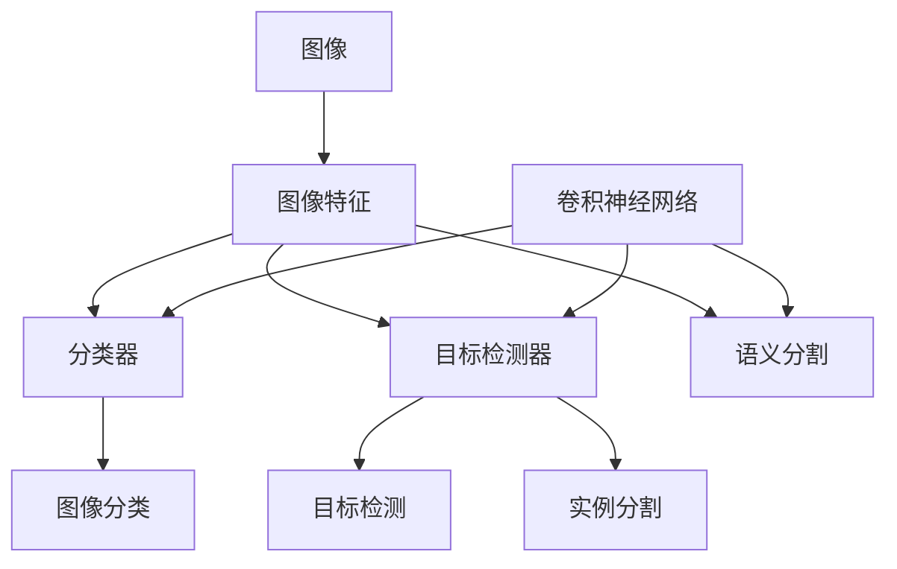

# Computer Vision (CV) 原理与代码实战案例讲解

## 1.背景介绍

### 1.1 计算机视觉的定义与意义

计算机视觉（Computer Vision，简称CV）是一门研究如何使计算机能够"看懂"数字图像或视频的科学。它旨在赋予计算机类似人类视觉的感知能力,从而能够识别、跟踪和测量图像中的目标,进而做出相应的决策。计算机视觉技术在工业自动化、医学成像、人机交互、自动驾驶等领域有着广泛的应用前景。

### 1.2 计算机视觉的发展历程

计算机视觉的研究始于20世纪60年代早期。1963年,Larry Roberts在麻省理工学院人工智能实验室完成了他的开创性博士论文《Machine Perception of Three-Dimensional Solids》,标志着计算机视觉的诞生。此后,David Marr、Tomaso Poggio等学者相继提出了计算机视觉的层次结构理论,为后来的研究奠定了理论基础。

进入21世纪以来,随着计算机硬件性能的飞速发展和海量数据的积累,以深度学习为代表的人工智能技术取得了突破性进展。2012年,Alex Krizhevsky等人提出的深度卷积神经网络AlexNet在ImageNet图像分类竞赛中大幅刷新了此前的最佳成绩,开启了深度学习在计算机视觉领域的崛起。此后,计算机视觉技术进入了快速发展的新阶段。

### 1.3 计算机视觉的主要研究内容

计算机视觉主要研究如何通过分析数字图像或视频中的视觉信息,从中提取对场景或物体的描述,进而实现对目标的检测、识别、跟踪、三维重建等任务。其主要研究内容包括:

- 图像处理:对图像进行滤波、增强、分割等预处理操作,为后续的视觉任务提供良好的输入。
- 特征提取与匹配:从图像中提取能够表征目标特性的特征(如SIFT、HOG等),并建立特征之间的对应关系。  
- 目标检测:判断图像中是否存在感兴趣的目标,并给出其位置和大小。
- 图像分类与识别:对图像整体或其中的目标物体进行语义层面的分类。
- 物体跟踪:在视频序列中持续定位被跟踪目标的位置。
- 语义分割:对图像的每个像素赋予语义标签。
- 三维重建:根据二维图像恢复场景的三维结构。

## 2.核心概念与联系

### 2.1 图像

图像是计算机视觉的基本输入,通常可以看作是一个二维矩阵,矩阵的每个元素对应图像上的一个像素。常见的图像有二值图像、灰度图像和彩色图像。其中,彩色图像一般采用RGB色彩空间,由红、绿、蓝三个颜色通道组成。

### 2.2 图像特征

图像特征是指从图像中提取出的对图像内容具有显著表征作用的量,常用于目标检测、图像匹配等任务。按照特征的表示形式,可分为全局特征和局部特征。

全局特征描述了整幅图像的全局属性,如颜色直方图、Gist特征等。而局部特征则聚焦于图像的局部区域,如角点、斑块等。常用的局部特征包括SIFT、SURF、ORB等。基于深度学习的方法可以自动学习到更加鲁棒和判别力强的特征表示。

### 2.3 分类器

分类器用于对输入的特征向量进行判别,预测其所属的类别标签。常用的分类器包括支持向量机(SVM)、随机森林、Softmax分类器等。近年来,卷积神经网络(CNN)凭借其强大的特征学习和分类能力,成为图像分类任务的主流方法。

### 2.4 卷积神经网络

卷积神经网络(CNN)是一种专门用于处理网格拓扑结构数据(如图像)的深度神经网络。它的基本组成单元是卷积层和池化层,通过堆叠多个这样的层,CNN能够自动学习到层次化的特征表示。全连接层接在卷积层之后,用于图像的分类。著名的CNN网络包括LeNet、AlexNet、VGGNet、GoogLeNet、ResNet等。

### 2.5 目标检测

目标检测旨在定位图像中感兴趣的目标,并给出其类别和位置(通常用边界框表示)。传统的目标检测方法多为两阶段,先通过启发式方法(如选择性搜索)产生候选区域,再对候选区域进行分类和位置精修。以R-CNN系列为代表的方法将CNN引入目标检测,极大地提升了检测性能。而YOLO、SSD等单阶段方法可以实现实时检测。

### 2.6 语义分割

语义分割是对图像的每个像素赋予一个语义标签(如人、车、建筑等)。早期的语义分割方法多采用图模型(如条件随机场)进行建模求解。FCN、U-Net等基于CNN的方法实现了端到端的语义分割,其编码-解码结构和跳跃连接的设计可以兼顾分割的语义级别和位置精度。

### 2.7 实例分割

实例分割在语义分割的基础上,进一步区分出不同的个体实例。Mask R-CNN通过在目标检测的基础上添加一个与边界框平行的分割支路,实现了对实例的同时检测和分割。

### 核心概念之间的联系

下图展示了计算机视觉中几个核心概念之间的联系:

## 3.核心算法原理具体操作步骤

### 3.1 图像分类算法

图像分类是计算机视觉的基础任务之一,旨在判断一幅图像的语义类别。以经典的卷积神经网络分类算法为例,其主要步骤如下:

1. 图像预处理:将输入图像缩放到固定尺寸(如224x224),并进行归一化处理。
2. 特征提取:图像依次通过若干个卷积层和池化层,提取层次化的特征表示。每个卷积层由多个卷积核组成,通过与前一层特征图进行卷积操作,得到本层的特征图。池化层对特征图进行下采样,既减小了参数量,又提供了一定程度的平移不变性。
3. 特征展平:将最后一个卷积层输出的多通道特征图展平成一维向量。
4. 分类:展平后的特征向量通过1-2个全连接层,最后接Softmax层输出各个类别的概率。
5. 训练:使用带标签的图像数据对CNN进行训练,优化目标为交叉熵损失函数。
6. 推断:用训练好的CNN对新图像进行前向传播,取Softmax层输出概率最大的类别作为预测结果。

### 3.2 目标检测算法

目标检测需要同时预测图像中目标的类别和位置。以经典的两阶段检测算法Faster R-CNN为例,其主要步骤如下:

1. 骨干网络:输入图像通过预训练的CNN骨干网络(如ResNet),提取多尺度的卷积特征图。
2. 区域建议网络(RPN):在卷积特征图上滑动一个小网络,判断每个位置是否包含目标(前景/背景分类),并回归目标的边界框(bbox回归)。通过RPN生成一系列矩形候选区域(Region of Interest, RoI)。
3. RoI Pooling:从骨干网络的不同阶段提取RoI对应的特征,通过RoI Pooling层将它们池化到固定尺寸。
4. 检测头:pooling后的特征向量通过两个全连接层,分别进行目标分类和边界框回归,得到每个RoI的类别和位置。
5. 训练:Faster R-CNN的训练分为RPN和检测头两个阶段,分别优化二者的损失函数。
6. 后处理:对检测头输出的预测框进行阈值过滤和非极大值抑制,得到最终的检测结果。

### 3.3 语义分割算法

语义分割需要预测图像每个像素的类别标签。以经典的FCN算法为例,其主要步骤如下:

1. 骨干网络:输入图像通过CNN骨干网络,提取不同尺度的卷积特征图。
2. 上采样:通过反卷积或双线性插值等上采样操作,将特征图恢复到输入图像的分辨率。
3. 跳跃连接:将骨干网络浅层的高分辨率特征与上采样后的深层低分辨率特征进行融合,兼顾分割的语义信息和位置信息。
4. 像素分类:对上采样后的特征图的每个像素位置做Softmax分类,得到该位置属于各个类别的概率。
5. 训练:以像素级别的交叉熵损失函数为优化目标,端到端训练FCN网络。 
6. 推断:用训练好的FCN对新图像进行前向传播,对每个像素位置取概率最大的类别作为预测标签,得到密集的分割结果。

## 4.数学模型和公式详细讲解举例说明

### 4.1 卷积操作

卷积是CNN的核心操作,可以提取图像的局部特征。二维卷积的数学定义为:

$$ (f*g)(i,j) = \sum_m \sum_n f(m,n)g(i-m,j-n) $$

其中,$f$为输入图像,$g$为卷积核,$(i,j)$为像素位置。卷积操作可以看作是卷积核在图像上滑动,并在每个位置计算加权和。

举例来说,假设我们有一个3x3的图像和一个2x2的卷积核:

$$
\begin{bmatrix} 
1 & 2 & 3\\ 
4 & 5 & 6\\
7 & 8 & 9
\end{bmatrix} *
\begin{bmatrix}
1 & 0\\
0 & 1
\end{bmatrix}
$$

则卷积结果为:

$$
\begin{bmatrix}
1*1+2*0+4*0+5*1 & 2*1+3*0+5*0+6*1\\
4*1+5*0+7*0+8*1 & 5*1+6*0+8*0+9*1
\end{bmatrix}=
\begin{bmatrix}
6 & 8\\
12 & 14
\end{bmatrix}
$$

### 4.2 池化操作

池化操作对输入特征图进行下采样,既减小了参数量,又提供了特征的平移不变性。常见的池化操作包括最大池化和平均池化。

以2x2最大池化为例,对于输入特征图的每个2x2区域,输出该区域内的最大值,数学表示为:

$$
y(i,j) = \max_{0 \leq m,n < 2} x(2i+m, 2j+n)
$$

其中,$x$为输入特征图,$y$为输出特征图,$(i,j)$为输出特征图上的位置索引。

举例来说,对于输入特征图:

$$
\begin{bmatrix}
1 & 2 & 3 & 4\\
5 & 6 & 7 & 8\\
9 & 10 & 11 & 12\\
13 & 14 & 15 & 16
\end{bmatrix}
$$

经过2x2最大池化后,输出特征图为:

$$
\begin{bmatrix}
6 & 8\\
14 & 16
\end{bmatrix}
$$

### 4.3 Softmax分类器

Softmax分类器将输入特征向量映射为各个类别的概率分布。假设输入特征向量为$\mathbf{z} \in \mathbb{R}^K$,Softmax函数定义为:

$$
\sigma(\mathbf{z})_j = \frac{e^{z_j}}{\sum_{k=1}^K e^{z_k}}, \quad j=1,\ldots,K
$$

其中,$\sigma(\mathbf{z})_j$表示第$j$个类别的概率,$K$为