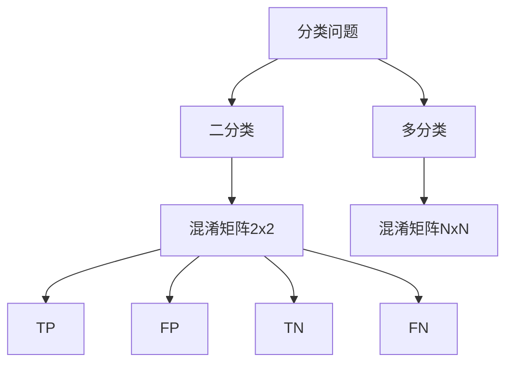

# Confusion Matrix 原理与代码实战案例讲解

## 1.背景介绍

在机器学习和模式识别领域中,Confusion Matrix(混淆矩阵)是一种用于评估分类模型性能的重要工具。它提供了关于分类模型预测结果的全面视图,显示了模型对每个类别的预测准确性以及误分类的情况。通过分析混淆矩阵,我们可以深入了解模型的优缺点,并采取适当的措施来改进模型的性能。

## 2.核心概念与联系

### 2.1 混淆矩阵的定义

混淆矩阵是一个矩阵表格,其行表示实际类别,列表示预测类别。每个单元格的值代表了该类别的实例数量。理想情况下,对角线上的值应该是最大的,因为这表示预测正确的实例数量。

### 2.2 混淆矩阵与分类问题的关系

在二分类问题中,混淆矩阵是一个2x2的矩阵,包含四个值:真正例(TP)、假正例(FP)、真负例(TN)和假负例(FN)。在多分类问题中,混淆矩阵的维度等于类别数量。



## 3.核心算法原理具体操作步骤

### 3.1 构建混淆矩阵

构建混淆矩阵的步骤如下:

1. 获取模型预测结果和真实标签
2. 初始化一个NxN的零矩阵(N为类别数量)
3. 遍历每个预测结果和真实标签
4. 将预测正确的实例计入对角线单元格
5. 将预测错误的实例计入相应的非对角线单元格

### 3.2 计算评估指标

基于混淆矩阵,我们可以计算多种评估指标,例如准确率、精确率、召回率、F1分数等。

```python
def compute_metrics(conf_mat):
    TP = np.diag(conf_mat)
    FP = conf_mat.sum(axis=0) - TP 
    FN = conf_mat.sum(axis=1) - TP
    TN = conf_mat.sum() - (FP + FN + TP)
    
    precision = TP / (TP + FP)
    recall = TP / (TP + FN)
    accuracy = (TP + TN) / conf_mat.sum()
    f1 = 2 * (precision * recall) / (precision + recall)
    
    return precision, recall, accuracy, f1
```

## 4.数学模型和公式详细讲解举例说明

### 4.1 混淆矩阵的数学表示

假设我们有K个类别,混淆矩阵可以表示为:

$$
C = \begin{bmatrix}
c_{11} & c_{12} & \cdots & c_{1K} \\
c_{21} & c_{22} & \cdots & c_{2K} \\
\vdots & \vdots & \ddots & \vdots \\
c_{K1} & c_{K2} & \cdots & c_{KK}
\end{bmatrix}
$$

其中,$$c_{ij}$$表示被预测为第j类而实际属于第i类的实例数量。

### 4.2 评估指标的数学公式

基于混淆矩阵,我们可以计算以下评估指标:

1. **准确率 (Accuracy)**

$$\text{Accuracy} = \frac{\sum_{i=1}^{K} c_{ii}}{\sum_{i=1}^{K}\sum_{j=1}^{K}c_{ij}}$$

2. **精确率 (Precision)**

$$\text{Precision}_i = \frac{c_{ii}}{\sum_{j=1}^{K}c_{ji}}$$

3. **召回率 (Recall)**

$$\text{Recall}_i = \frac{c_{ii}}{\sum_{j=1}^{K}c_{ij}}$$

4. **F1分数**

$$\text{F1}_i = 2 \times \frac{\text{Precision}_i \times \text{Recall}_i}{\text{Precision}_i + \text{Recall}_i}$$

通过分析这些指标,我们可以全面评估模型的性能。

## 5.项目实践:代码实例和详细解释说明

让我们通过一个实际案例来演示如何计算和可视化混淆矩阵。我们将使用scikit-learn库中的iris数据集,并训练一个逻辑回归分类器。

```python
from sklearn.datasets import load_iris
from sklearn.linear_model import LogisticRegression
from sklearn.model_selection import train_test_split
from sklearn.metrics import confusion_matrix
import matplotlib.pyplot as plt
import seaborn as sns

# 加载数据集
iris = load_iris()
X, y = iris.data, iris.target

# 拆分训练集和测试集
X_train, X_test, y_train, y_test = train_test_split(X, y, test_size=0.2, random_state=42)

# 训练逻辑回归模型
clf = LogisticRegression()
clf.fit(X_train, y_train)

# 预测测试集
y_pred = clf.predict(X_test)

# 计算混淆矩阵
conf_mat = confusion_matrix(y_test, y_pred)
print("Confusion Matrix:\n", conf_mat)

# 可视化混淆矩阵
plt.figure(figsize=(8, 6))
sns.heatmap(conf_mat, annot=True, cmap="Blues", fmt="d", xticklabels=iris.target_names, yticklabels=iris.target_names)
plt.xlabel("Predicted Labels")
plt.ylabel("True Labels")
plt.title("Confusion Matrix")
plt.show()
```

上述代码将输出混淆矩阵,并使用seaborn库可视化混淆矩阵。可视化结果可以直观地显示模型在每个类别上的预测表现。

```
Confusion Matrix:
 [[13  0  0]
 [ 0  9  1]
 [ 0  3  4]]
```


从可视化结果中,我们可以看到模型在第一类和第二类上的预测效果较好,但在第三类上存在一些误分类情况。根据这些信息,我们可以采取相应的措施来改进模型的性能,如增加训练数据、调整模型超参数或尝试不同的模型架构。

## 6.实际应用场景

混淆矩阵在各种领域都有广泛的应用,例如:

- **计算机视觉**: 用于评估图像分类、目标检测和语义分割模型的性能。
- **自然语言处理**: 评估文本分类、情感分析和命名实体识别模型。
- **医疗诊断**: 评估疾病诊断模型,帮助医生更好地理解模型的误差来源。
- **金融风险管理**: 评估欺诈检测和信用评分模型的性能。
- **网络安全**: 评估入侵检测和恶意软件检测系统的性能。

无论在哪个领域,混淆矩阵都是一种有效的工具,可以帮助我们深入了解模型的优缺点,并采取相应的措施来改进模型的性能。

## 7.工具和资源推荐

以下是一些与混淆矩阵相关的有用工具和资源:

- **scikit-learn**: Python机器学习库,提供了计算混淆矩阵和其他评估指标的函数。
- **Matplotlib和Seaborn**: Python数据可视化库,可用于可视化混淆矩阵。
- **TensorFlow和PyTorch**: 深度学习框架,提供了计算和可视化混淆矩阵的功能。
- **Confusion Matrix Explorer**: 一个交互式在线工具,可以帮助您可视化和分析混淆矩阵。
- **Confusion Matrix Playground**: 另一个在线工具,允许您探索不同的混淆矩阵并计算各种评估指标。

此外,还有许多关于混淆矩阵的教程、博客文章和视频资源,可以帮助您更深入地理解和应用这一概念。

## 8.总结:未来发展趋势与挑战

混淆矩阵是一种有效的工具,可以帮助我们评估分类模型的性能。然而,随着机器学习模型和应用场景的不断发展,混淆矩阵也面临一些挑战和发展趋势:

1. **高维和不平衡数据**: 对于高维数据和不平衡数据集,传统的混淆矩阵可能难以提供足够的见解。需要开发新的可视化技术和评估指标来处理这些情况。

2. **解释性和可解释性**:随着模型变得越来越复杂,解释模型预测的重要性也在不断增加。混淆矩阵可以与其他解释技术相结合,以提供更全面的模型解释。

3. **在线学习和动态环境**: 在线学习和动态环境中,模型的性能可能会随时间而变化。需要开发动态混淆矩阵和评估技术,以跟踪模型性能的变化。

4. **多标签和多任务学习**: 在多标签和多任务学习场景中,需要扩展混淆矩阵的概念,以适应多个输出和任务。

5. **集成学习和元学习**: 对于集成模型和元学习模型,需要开发新的技术来综合和可视化多个模型的混淆矩阵。

总的来说,混淆矩阵将继续在机器学习和模式识别领域发挥重要作用。通过不断创新和发展,混淆矩阵将能够满足未来更复杂和多样化的需求。

## 9.附录:常见问题与解答

1. **什么是混淆矩阵?**

混淆矩阵是一种用于评估分类模型性能的工具。它显示了模型对每个类别的预测准确性以及误分类的情况。

2. **如何解释混淆矩阵?**

混淆矩阵的行表示实际类别,列表示预测类别。对角线上的值代表预测正确的实例数量,非对角线上的值代表误分类的实例数量。

3. **什么是真正例(TP)、假正例(FP)、真负例(TN)和假负例(FN)?**

- 真正例(TP):被正确预测为正例的实例数量。
- 假正例(FP):被错误预测为正例的实例数量。
- 真负例(TN):被正确预测为负例的实例数量。
- 假负例(FN):被错误预测为负例的实例数量。

4. **如何计算准确率、精确率、召回率和F1分数?**

- 准确率 = (TP + TN) / (TP + FP + TN + FN)
- 精确率 = TP / (TP + FP)
- 召回率 = TP / (TP + FN)
- F1分数 = 2 * (精确率 * 召回率) / (精确率 + 召回率)

5. **为什么混淆矩阵对于评估模型性能很重要?**

混淆矩阵提供了关于模型预测结果的全面视图,包括正确预测和误分类的情况。通过分析混淆矩阵,我们可以深入了解模型的优缺点,并采取适当的措施来改进模型的性能。

6. **如何可视化混淆矩阵?**

可以使用Python的数据可视化库(如Matplotlib和Seaborn)来可视化混淆矩阵。通常使用热力图来显示混淆矩阵,其中颜色深浅代表值的大小。

7. **除了分类问题,混淆矩阵还可以应用于其他任务吗?**

是的,混淆矩阵也可以应用于其他任务,如目标检测、语义分割和异常检测等。只要任务涉及预测和真实值的比较,混淆矩阵就可以用于评估模型性能。

8. **如何处理高维和不平衡数据集的混淆矩阵?**

对于高维和不平衡数据集,传统的混淆矩阵可能难以提供足够的见解。需要开发新的可视化技术和评估指标来处理这些情况,如使用归一化的混淆矩阵或基于成本的评估指标。

9. **混淆矩阵与其他模型评估技术相比有何优缺点?**

混淆矩阵的优点是直观且易于解释,可以提供关于模型预测结果的全面视图。但它也有一些缺点,如对于高维和不平衡数据集可能难以提供足够的见解,并且无法直接反映模型的置信度或不确定性。因此,通常需要将混淆矩阵与其他评估技术(如ROC曲线、校准曲线等)结合使用,以获得