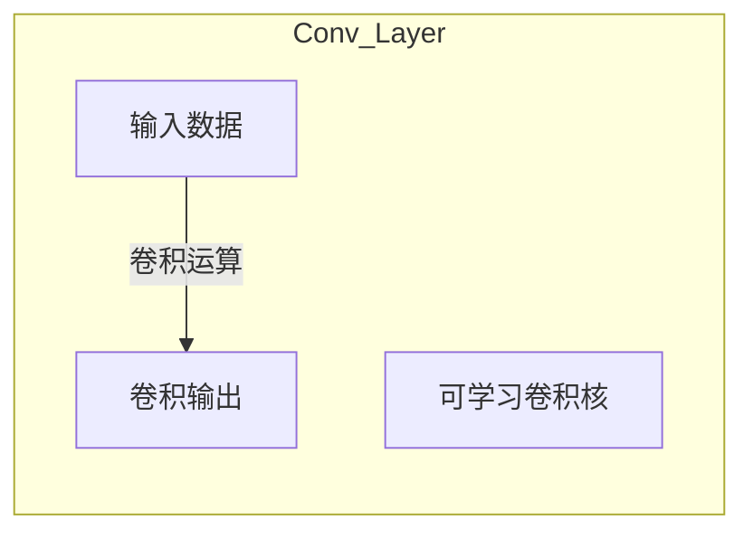
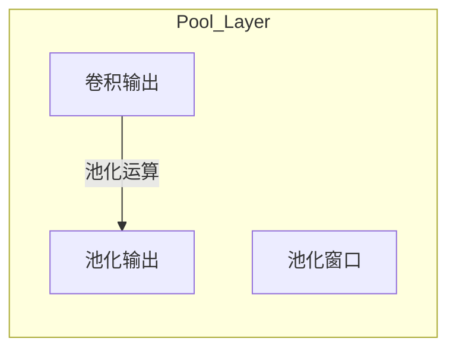
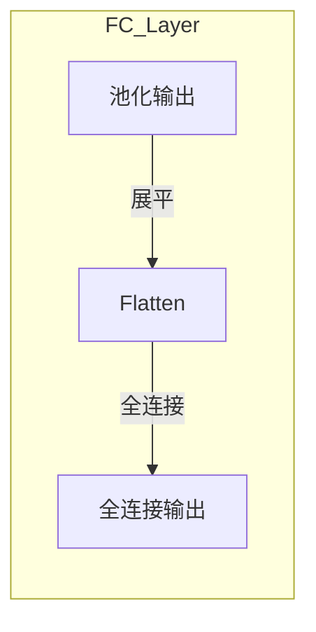
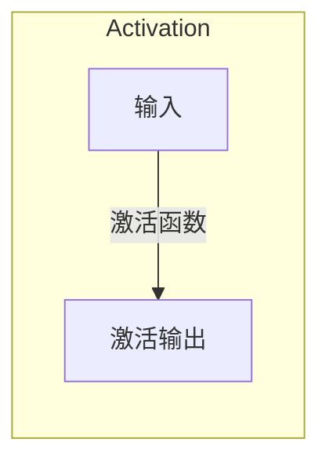
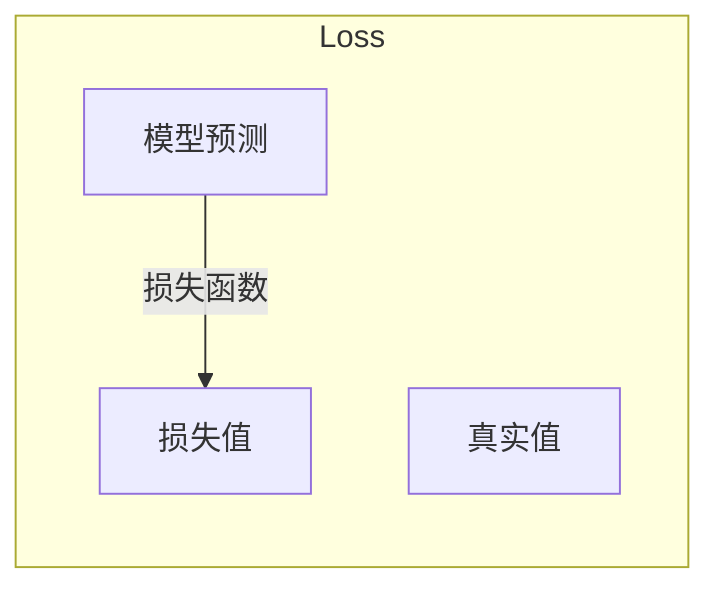
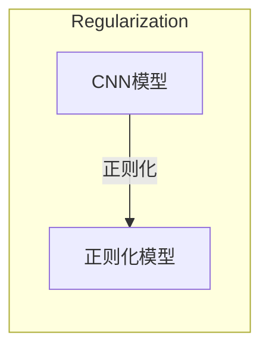

# Convolutional Neural Networks (CNN) 原理与代码实战案例讲解

## 1.背景介绍

在深度学习领域,卷积神经网络(Convolutional Neural Networks, CNN)是一种革命性的人工神经网络模型,它在计算机视觉、图像识别、语音识别、自然语言处理等领域展现出了卓越的性能。CNN的诞生源于对生物视觉系统的研究,旨在模拟视觉皮层中神经元对于局部感受野的响应特征。

CNN具有局部连接、权值共享和空间下采样等特点,使其能够有效地捕获输入数据的局部特征,并对其进行组合和抽象,从而形成更高层次的语义表示。与传统的全连接神经网络相比,CNN在处理高维数据(如图像和视频)时表现出了更高的效率和准确性。

随着深度学习技术的不断发展,CNN在图像分类、目标检测、语义分割等领域取得了突破性的进展,成为计算机视觉领域不可或缺的核心技术。同时,CNN也被广泛应用于自然语言处理、语音识别等其他领域,展现出了强大的通用建模能力。

## 2.核心概念与联系

CNN由多个卷积层、池化层、全连接层等组成,每一层都扮演着不同的角色,共同构建了一个端到端的神经网络模型。下面我们来介绍CNN中的几个核心概念:

### 2.1 卷积层(Convolutional Layer)

卷积层是CNN的核心组成部分,它通过卷积运算在输入数据上提取局部特征。卷积运算的基本思想是使用一个可学习的卷积核(也称为滤波器kernel)在输入数据上滑动,计算卷积核与输入数据的点积,从而获得新的特征映射。

卷积核的大小、步长和填充策略都是可以调整的超参数,它们决定了卷积层的感受野大小和输出特征图的尺寸。通过堆叠多个卷积层,CNN能够逐层捕获从低级到高级的特征表示。

### 2.2 池化层(Pooling Layer)

池化层通常跟在卷积层之后,其主要目的是降低特征图的空间分辨率,从而减少后续层的计算量和参数数量。同时,池化层也具有一定的平移不变性,能够提高模型对于小的位移和扭曲的鲁棒性。

常见的池化操作包括最大池化(Max Pooling)和平均池化(Average Pooling),它们分别计算池化窗口内元素的最大值或平均值作为输出。池化窗口的大小和步长也是可调整的超参数。

### 2.3 全连接层(Fully Connected Layer)

在CNN的最后几层通常是全连接层,它们将前面卷积层和池化层提取的高级特征进行整合,并输出最终的分类或回归结果。全连接层的每个神经元与前一层的所有神经元相连,因此参数量较大。

为了防止过拟合,全连接层通常会使用Dropout技术,即在训练时随机丢弃一部分神经元,从而减少神经元之间的相关性。

### 2.4 激活函数(Activation Function)

在CNN中,激活函数被广泛应用于卷积层和全连接层的输出,以引入非线性因素。常见的激活函数包括ReLU(整流线性单元)、Sigmoid、Tanh等。适当的激活函数能够增强模型的表达能力,同时也有助于梯度的传播和收敛。

### 2.5 损失函数(Loss Function)

损失函数用于衡量模型预测值与真实值之间的差异,是训练CNN模型的关键。常见的损失函数包括交叉熵损失(Cross-Entropy Loss)、均方误差损失(Mean Squared Error Loss)等,具体选择取决于任务类型(分类或回归)。

通过优化算法(如梯度下降)最小化损失函数,CNN模型的参数可以不断更新,从而逐步拟合训练数据。

### 2.6 正则化(Regularization)

为了防止CNN模型过拟合,通常需要采取一些正则化策略,如L1/L2正则化、Dropout、数据增广等。正则化的目的是在保持模型泛化能力的同时,避免模型过度拟合训练数据。

## 3.核心算法原理具体操作步骤

CNN的核心算法原理包括前向传播(Forward Propagation)和反向传播(Backward Propagation)两个阶段,下面我们将详细介绍这两个阶段的具体操作步骤。

### 3.1 前向传播

前向传播是CNN模型对输入数据进行计算并产生输出的过程,具体步骤如下:

1. **输入数据**:将输入数据(如图像)输入到CNN模型中。

2. **卷积层**:在卷积层中,输入数据与可学习的卷积核进行卷积运算,产生新的特征映射。卷积运算的具体步骤如下:
   a. 将卷积核在输入数据上滑动,计算卷积核与输入数据的点积。
   b. 根据步长和填充策略,确定卷积核的滑动位置。
   c. 对每个滑动位置计算的点积结果进行汇总,形成新的特征映射。

3. **激活函数**:对卷积层的输出应用激活函数(如ReLU),引入非线性因素。

4. **池化层**:在池化层中,对激活后的特征映射进行下采样,降低空间分辨率。池化操作的具体步骤如下:
   a. 将池化窗口在特征映射上滑动。
   b. 根据池化策略(如最大池化或平均池化),计算池化窗口内元素的最大值或平均值。
   c. 将计算结果作为新的特征映射的元素。

5. **重复卷积和池化**:重复执行卷积层、激活函数和池化层的操作,逐层提取更高级的特征表示。

6. **展平**:在全连接层之前,将高维特征映射展平为一维向量。

7. **全连接层**:全连接层将展平后的特征向量与权重矩阵相乘,产生新的特征表示。

8. **输出层**:根据任务类型(分类或回归),输出层会应用合适的激活函数(如Softmax或线性函数),产生最终的输出结果。

### 3.2 反向传播

反向传播是CNN模型参数更新的关键步骤,它通过计算损失函数相对于模型参数的梯度,并使用优化算法(如梯度下降)来更新参数,从而最小化损失函数。具体步骤如下:

1. **计算损失函数**:根据模型输出和真实标签,计算损失函数的值(如交叉熵损失或均方误差损失)。

2. **计算梯度**:通过反向传播算法,计算损失函数相对于各层参数(权重和偏置)的梯度。反向传播的基本思想是利用链式法则,从输出层开始逐层计算梯度。

3. **更新参数**:使用优化算法(如随机梯度下降或Adam优化器)根据计算得到的梯度,更新各层的权重和偏置参数。

4. **重复迭代**:重复执行前向传播、计算损失函数、计算梯度和更新参数的过程,直到模型收敛或达到预设的迭代次数。

在反向传播过程中,还可以应用一些技巧来加速收敛和提高模型性能,如批量归一化(Batch Normalization)、学习率调度(Learning Rate Scheduling)等。

通过不断迭代优化,CNN模型的参数会逐渐收敛到一个较优的状态,从而提高模型在训练数据和测试数据上的性能表现。

## 4.数学模型和公式详细讲解举例说明

CNN中涉及到许多数学模型和公式,下面我们将详细讲解其中的几个关键部分。

### 4.1 卷积运算

卷积运算是CNN中最核心的运算,它通过卷积核在输入数据上滑动,计算点积并生成新的特征映射。设输入数据为$I$,卷积核为$K$,则卷积运算可以表示为:

$$
O(i, j) = \sum_{m} \sum_{n} I(i+m, j+n) \cdot K(m, n)
$$

其中,$(i, j)$表示输出特征映射的位置,$(m, n)$表示卷积核的位置。通过调整卷积核的大小、步长和填充策略,可以控制输出特征映射的尺寸和感受野大小。

例如,对于一个$5\times5$的输入数据$I$和一个$3\times3$的卷积核$K$,卷积运算的过程如下:

$$
I = \begin{bmatrix}
1 & 2 & 3 & 4 & 5\\
6 & 7 & 8 & 9 & 10\\
11 & 12 & 13 & 14 & 15\\
16 & 17 & 18 & 19 & 20\\
21 & 22 & 23 & 24 & 25
\end{bmatrix}, \quad
K = \begin{bmatrix}
1 & 0 & 1\\
0 & 1 & 0\\
1 & 0 & 1
\end{bmatrix}
$$

假设步长为1,无填充,则输出特征映射$O$的计算过程如下:

$$
O(1, 1) = 1\cdot1 + 2\cdot0 + 3\cdot1 + 6\cdot0 + 7\cdot1 + 8\cdot0 + 11\cdot1 + 12\cdot0 + 13\cdot1 = 22
$$

$$
O = \begin{bmatrix}
22 & 26 & 30 & 26 & 15\\
38 & 53 & 60 & 53 & 30\\
54 & 80 & 90 & 80 & 45\\
38 & 53 & 60 & 53 & 30\\
22 & 26 & 30 & 26 & 15
\end{bmatrix}
$$

可以看出,卷积运算能够捕获输入数据的局部特征,并通过堆叠多个卷积层来提取更高级的特征表示。

### 4.2 池化运算

池化运算是CNN中另一个重要的操作,它通过下采样特征映射来减少计算量和参数数量。最常见的池化方式是最大池化(Max Pooling),它取池化窗口内的最大值作为输出。设输入特征映射为$I$,池化窗口大小为$k\times k$,步长为$s$,则最大池化运算可以表示为:

$$
O(i, j) = \max_{m=0}^{k-1} \max_{n=0}^{k-1} I(i\cdot s+m, j\cdot s+n)
$$

其中,$(i, j)$表示输出特征映射的位置。

例如,对于一个$4\times4$的输入特征映射$I$,使用$2\times2$的最大池化窗口和步长为2,则池化运算的过程如下:

$$
I = \begin{bmatrix}
1 & 3 & 2 & 4\\
5 & 6 & 7 & 8\\
9 & 7 & 5 & 6\\
3 & 2 & 1 & 4
\end{bmatrix}
$$

$$
O = \begin{bmatrix}
6 & 8\\
9 & 7
\end{bmatrix}
$$

可以看出,最大池化运算能够保留特征映射中的最大值,从而实现了特征的下采样和平移不变性。

### 4.3 全连接层

全连接层是CNN中用于整合高级特征并产生最终输出的层。