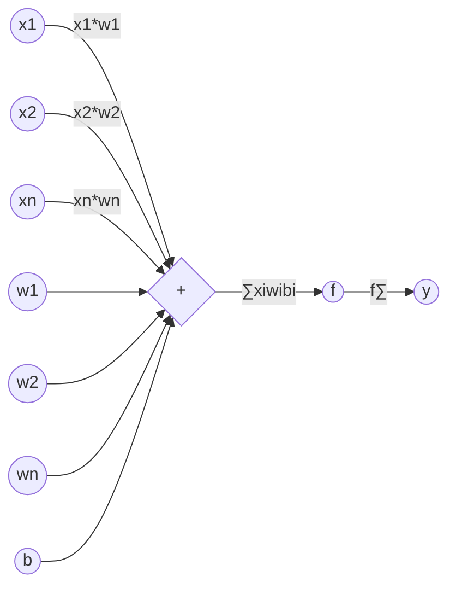
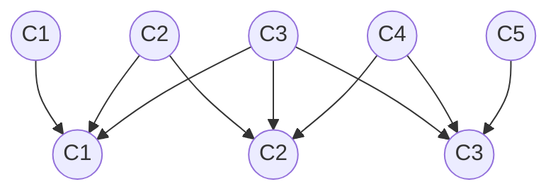
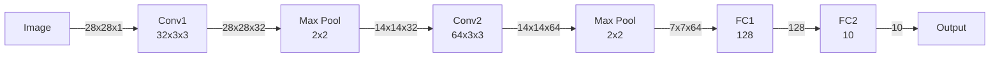

# Convolutional Neural Networks (CNN)原理与代码实例讲解

## 1. 背景介绍
### 1.1 深度学习与人工智能的发展
近年来,人工智能(Artificial Intelligence, AI)技术取得了突飞猛进的发展,其中最为瞩目的当属深度学习(Deep Learning, DL)。作为机器学习的一个分支,深度学习通过构建多层神经网络,模拟人脑的信息处理机制,在图像识别、语音识别、自然语言处理等领域取得了令人瞩目的成就。

### 1.2 CNN的兴起
在深度学习的诸多模型中,卷积神经网络(Convolutional Neural Networks, CNN)凭借其出色的特征提取和学习能力,成为了计算机视觉领域的宠儿。自从2012年AlexNet在ImageNet图像分类竞赛中大放异彩,CNN就一发不可收拾,成为了学术界和工业界竞相研究的热点。

### 1.3 CNN的应用领域  
如今,CNN已经被广泛应用于图像分类、目标检测、语义分割、人脸识别等诸多视觉任务中,并取得了业界领先的性能。一些经典的CNN模型如VGGNet、GoogLeNet、ResNet等,更是成为了新模型设计的基础。可以说,要想在计算机视觉领域有所建树,掌握CNN的原理和实现是必不可少的。

## 2. 核心概念与联系
### 2.1 人工神经元
CNN是一种特殊的人工神经网络。要理解CNN,我们需要先从最基本的组成单元——人工神经元谈起。如图所示:



人工神经元接收一组输入`x1,x2,...,xn`,每个输入上都有一个权重`w1,w2,...,wn`。神经元将输入与权重相乘,再加上一个偏置项`b`,将结果送入激活函数`f`,最终得到神经元的输出`y`。用公式表示为:

$$y = f(\sum_{i=1}^{n} x_i w_i + b)$$

### 2.2 感受野
在CNN中,每个神经元只与前一层的部分神经元相连,这个部分称为该神经元的感受野(Receptive Field)。如图所示:



图中,第二层的每个神经元与第一层的3个相邻神经元相连,这3个神经元就是该神经元的感受野。通过局部连接,CNN可以大大减少参数数量,同时增强网络提取局部特征的能力。

### 2.3 卷积层
卷积层(Convolutional Layer)是CNN的核心组件。卷积层由若干个卷积核(Filter)组成,每个卷积核其实就是一组权重参数。卷积核在输入特征图上滑动,与局部区域进行点积运算,得到输出特征图。这个过程称为卷积操作(Convolution)。如图所示:

```mermaid
graph LR
  subgraph Input
    i1((1)) i2((0)) i3((2))
    i4((2)) i5((1)) i6((2))  
    i7((0)) i8((1)) i9((1))
  end
  
  subgraph Filter
    f1((1)) f2((0)) 
    f3((1)) f4((2))
  end
  
  subgraph Output
    o1((5)) o2((4))
    o3((3)) o4((4)) 
  end
  
  i1 --> f1
  i2 --> f2
  i4 --> f3
  i5 --> f4
  
  f1 --> |1x1+0x0+2x1+1x2=5| o1
  f2 --> o1
  f3 --> o1
  f4 --> o1
  
  i2 --> |0x1+2x0+1x1+2x2=5| o2
  i3 --> o2
  i5 --> o2
  i6 --> o2
  
  i4 --> |2x1+1x0+0x1+1x2=4| o3
  i5 --> o3
  i7 --> o3
  i8 --> o3
  
  i5 --> |1x1+2x0+1x1+1x2=4| o4
  i6 --> o4
  i8 --> o4
  i9 --> o4
```

图中,输入特征图大小为3x3,卷积核大小为2x2,最终得到2x2的输出特征图。可见,卷积操作可以提取输入特征图的局部特征。

### 2.4 池化层
除了卷积层,CNN中还常用池化层(Pooling Layer)来降低特征图的空间分辨率,从而减少参数数量,控制过拟合。常见的池化操作有最大池化(Max Pooling)和平均池化(Average Pooling)。如图所示:

```mermaid
graph TD
  subgraph Input
    i1((1)) i2((3)) i3((2)) i4((1))
    i5((2)) i6((9)) i7((1)) i8((3))  
    i9((1)) i10((2)) i11((3)) i12((3))
    i13((5)) i14((1)) i15((2)) i16((1))
  end
  
  subgraph Max Pooling
    m1((9)) m2((3))
    m3((5)) m4((3))
  end
  
  subgraph Average Pooling 
    a1((2.25)) a2((2.0))  
    a3((2.75)) a4((1.75))
  end
  
  i1 --> m1
  i2 --> m1
  i5 --> m1
  i6 --> m1
  
  i3 --> m2
  i4 --> m2
  i7 --> m2
  i8 --> m2
  
  i9 --> m3
  i10 --> m3
  i13 --> m3
  i14 --> m3
  
  i11 --> m4
  i12 --> m4
  i15 --> m4
  i16 --> m4
  
  i1 --> a1
  i2 --> a1
  i5 --> a1
  i6 --> a1
  
  i3 --> a2
  i4 --> a2
  i7 --> a2
  i8 --> a2
  
  i9 --> a3
  i10 --> a3
  i13 --> a3
  i14 --> a3
  
  i11 --> a4
  i12 --> a4
  i15 --> a4
  i16 --> a4
```

图中,对4x4的输入特征图进行2x2的最大池化和平均池化,分别得到2x2的输出特征图。池化操作可以提取特征图的全局信息,同时具有平移不变性。

### 2.5 全连接层
在若干个卷积层和池化层之后,CNN最后一般会接上一到多个全连接层(Fully Connected Layer),用于融合特征,完成分类或回归任务。全连接层其实就是常见的多层感知机(MLP),神经元之间全互连。

## 3. 核心算法原理具体操作步骤
下面我们以一个简单的CNN为例,详细讲解其训练和推理的具体步骤。假设我们要构建一个用于手写数字识别的CNN,输入为28x28的灰度图像,输出为0~9共10个类别的预测概率。

### 3.1 网络结构设计
首先我们要设计CNN的网络结构。一个简单的设计如下:



该网络由2个卷积层、2个池化层和2个全连接层组成。第一个卷积层有32个3x3的卷积核,第二个卷积层有64个3x3的卷积核。池化层均为2x2的最大池化。第一个全连接层有128个神经元,第二个全连接层有10个神经元,对应10个类别的输出。

### 3.2 前向传播
有了网络结构,我们就可以进行前向传播,即输入一张图像,经过各层的计算,得到最终的预测输出。以第一个卷积层为例,详细步骤如下:

1. 将输入图像(28x28)与32个卷积核(3x3)进行卷积操作,得到32个特征图(28x28)
2. 对每个特征图加上偏置项
3. 对每个特征图应用激活函数(如ReLU),得到第一个卷积层的输出

用公式表示为:

$$
Conv1_{i,j,k} = f(\sum_{m=0}^{2} \sum_{n=0}^{2} \sum_{c=0}^{0} Image_{i+m,j+n,c} \cdot Filter_{m,n,c,k} + b_k)
$$

其中`i,j`为特征图的空间坐标,`k`为卷积核的编号,`m,n`为卷积核内部坐标,`c`为输入图像的通道数(灰度图为1)。`f`为激活函数,`b`为偏置项。

其他层的前向传播与此类似,依次计算即可得到整个网络的输出。

### 3.3 损失函数
为了衡量网络预测输出与真实标签之间的差异,我们需要定义一个损失函数(Loss Function)。对于多分类问题,常用的损失函数是交叉熵(Cross Entropy):

$$
Loss = -\sum_{i=1}^{N} \sum_{j=1}^{C} y_{ij} \log(\hat{y}_{ij})
$$

其中`N`为样本数,`C`为类别数。`y`为真实标签的one-hot编码,`ŷ`为网络预测输出经过Softmax归一化的概率值。

### 3.4 反向传播
定义了损失函数之后,我们就可以通过反向传播(Back Propagation)算法来训练网络的参数了。反向传播的目的是计算损失函数对每个参数的梯度,然后根据梯度下降法更新参数,使损失函数最小化。以第二个全连接层为例,详细步骤如下:

1. 计算损失函数对第二个全连接层输出的梯度:
$$
\frac{\partial Loss}{\partial FC2} = \hat{y} - y
$$

2. 计算损失函数对第二个全连接层权重的梯度:
$$
\frac{\partial Loss}{\partial W_{FC2}} = \frac{\partial Loss}{\partial FC2} \cdot FC1^T
$$

3. 计算损失函数对第二个全连接层偏置的梯度:
$$
\frac{\partial Loss}{\partial b_{FC2}} = \frac{\partial Loss}{\partial FC2}
$$

4. 计算损失函数对第一个全连接层输出的梯度:
$$
\frac{\partial Loss}{\partial FC1} = W_{FC2}^T \cdot \frac{\partial Loss}{\partial FC2}
$$

其他层的梯度计算与此类似,利用链式法则层层反向传播,直到输入层。

### 3.5 参数更新
有了每个参数的梯度,我们就可以用梯度下降法来更新参数了。以第二个全连接层的权重为例:

$$
W_{FC2} := W_{FC2} - \alpha \cdot \frac{\partial Loss}{\partial W_{FC2}}
$$

其中`α`为学习率(Learning Rate),控制每次更新的步长。偏置的更新与此类似。

### 3.6 训练过程
将前向传播、损失函数计算、反向传播、参数更新结合起来,就得到了完整的训练过程:

```mermaid
graph LR
  A[输入样本] --> B[前向传播]
  B --> C[计算损失函数]
  C