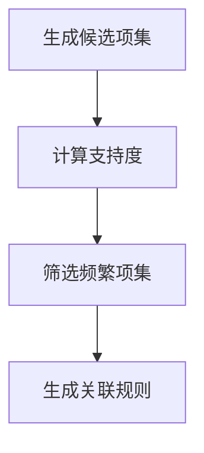
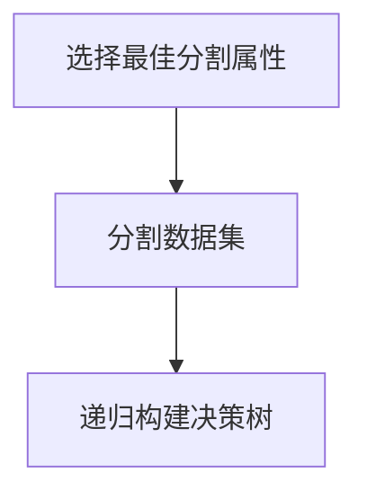
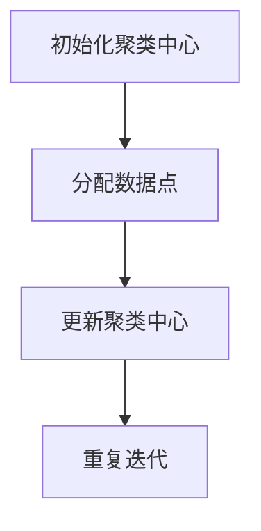

# Data Mining 原理与代码实战案例讲解

## 1.背景介绍

数据挖掘（Data Mining）是从大量数据中提取有用信息和知识的过程。随着大数据时代的到来，数据挖掘技术在各个领域的应用越来越广泛。无论是商业决策、市场分析、医疗诊断，还是科学研究，数据挖掘都发挥着重要作用。本文将深入探讨数据挖掘的核心概念、算法原理、数学模型，并通过实际代码案例进行详细讲解，帮助读者更好地理解和应用数据挖掘技术。

## 2.核心概念与联系

### 2.1 数据挖掘的定义

数据挖掘是指从大量数据中发现隐藏的、有价值的模式和知识的过程。它涉及统计学、机器学习、数据库技术等多个领域。

### 2.2 数据挖掘的步骤

数据挖掘通常包括以下几个步骤：

1. 数据准备：数据清洗、数据集成、数据变换。
2. 数据挖掘：选择合适的算法进行模式发现。
3. 模式评估：评估挖掘出的模式是否有用。
4. 知识表示：将有用的模式转化为易于理解的知识。

### 2.3 数据挖掘与机器学习的关系

数据挖掘和机器学习密切相关。数据挖掘更多关注从数据中提取知识，而机器学习则关注算法的设计和优化。两者相辅相成，共同推动数据科学的发展。

## 3.核心算法原理具体操作步骤

### 3.1 关联规则挖掘

关联规则挖掘用于发现数据项之间的关联关系。常用算法包括Apriori和FP-Growth。

#### 3.1.1 Apriori算法

Apriori算法通过迭代生成频繁项集，并从中提取关联规则。其核心步骤如下：

1. 生成候选项集。
2. 计算候选项集的支持度。
3. 筛选出频繁项集。
4. 从频繁项集中生成关联规则。



### 3.2 分类算法

分类算法用于将数据分为不同的类别。常用算法包括决策树、支持向量机和神经网络。

#### 3.2.1 决策树算法

决策树通过递归地将数据集分割成子集，最终形成树状结构。其核心步骤如下：

1. 选择最佳分割属性。
2. 根据分割属性将数据集分割成子集。
3. 对每个子集递归地构建决策树。



### 3.3 聚类算法

聚类算法用于将数据分为不同的组。常用算法包括K-means和层次聚类。

#### 3.3.1 K-means算法

K-means算法通过迭代优化聚类中心，将数据点分配到最近的聚类中心。其核心步骤如下：

1. 初始化聚类中心。
2. 将数据点分配到最近的聚类中心。
3. 更新聚类中心。
4. 重复步骤2和3，直到聚类中心不再变化。



## 4.数学模型和公式详细讲解举例说明

### 4.1 关联规则挖掘的数学模型

关联规则挖掘的核心是支持度和置信度。支持度表示某个项集在数据集中出现的频率，置信度表示在某个项集出现的条件下，另一个项集出现的概率。

$$
\text{支持度}(A) = \frac{\text{出现次数}(A)}{\text{总记录数}}
$$

$$
\text{置信度}(A \rightarrow B) = \frac{\text{支持度}(A \cup B)}{\text{支持度}(A)}
$$

### 4.2 决策树的数学模型

决策树的核心是信息增益。信息增益表示通过某个属性分割数据集后，数据集的不确定性减少的程度。

$$
\text{信息增益}(D, A) = \text{熵}(D) - \sum_{v \in \text{值}(A)} \frac{|D_v|}{|D|} \text{熵}(D_v)
$$

其中，熵的计算公式为：

$$
\text{熵}(D) = - \sum_{i=1}^{n} p_i \log_2 p_i
$$

### 4.3 K-means的数学模型

K-means的核心是最小化数据点到聚类中心的距离平方和。

$$
J = \sum_{i=1}^{k} \sum_{x \in C_i} ||x - \mu_i||^2
$$

其中，$C_i$表示第$i$个聚类，$\mu_i$表示第$i$个聚类的中心。

## 5.项目实践：代码实例和详细解释说明

### 5.1 关联规则挖掘代码实例

以下是使用Python实现Apriori算法的代码示例：

```python
from itertools import combinations

def apriori(transactions, min_support):
    itemsets = {}
    for transaction in transactions:
        for item in transaction:
            if item in itemsets:
                itemsets[item] += 1
            else:
                itemsets[item] = 1

    itemsets = {k: v for k, v in itemsets.items() if v >= min_support}
    freq_itemsets = [set([k]) for k in itemsets.keys()]

    while freq_itemsets:
        new_itemsets = []
        for i in range(len(freq_itemsets)):
            for j in range(i + 1, len(freq_itemsets)):
                union_set = freq_itemsets[i] | freq_itemsets[j]
                if len(union_set) == len(freq_itemsets[i]) + 1:
                    count = sum([1 for transaction in transactions if union_set.issubset(transaction)])
                    if count >= min_support:
                        new_itemsets.append(union_set)
        freq_itemsets = new_itemsets
        for itemset in freq_itemsets:
            itemsets[frozenset(itemset)] = sum([1 for transaction in transactions if itemset.issubset(transaction)])

    return itemsets

transactions = [['牛奶', '面包', '黄油'], ['面包', '黄油'], ['牛奶', '面包'], ['牛奶', '黄油']]
min_support = 2
result = apriori(transactions, min_support)
print(result)
```

### 5.2 决策树代码实例

以下是使用Python实现决策树算法的代码示例：

```python
from sklearn.datasets import load_iris
from sklearn.tree import DecisionTreeClassifier
from sklearn import tree
import matplotlib.pyplot as plt

# 加载数据集
iris = load_iris()
X, y = iris.data, iris.target

# 训练决策树模型
clf = DecisionTreeClassifier()
clf = clf.fit(X, y)

# 可视化决策树
plt.figure(figsize=(12, 8))
tree.plot_tree(clf, filled=True, feature_names=iris.feature_names, class_names=iris.target_names)
plt.show()
```

### 5.3 K-means代码实例

以下是使用Python实现K-means算法的代码示例：

```python
from sklearn.cluster import KMeans
import numpy as np
import matplotlib.pyplot as plt

# 生成数据
X = np.random.rand(100, 2)

# 训练K-means模型
kmeans = KMeans(n_clusters=3)
kmeans.fit(X)

# 可视化聚