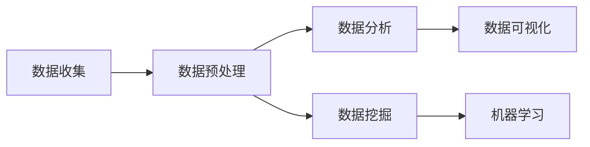

## 1.背景介绍

数据科学，是一个全新的学科领域，它涵盖了统计学、计算机科学、信息科学等多个学科的知识。数据科学的目标是从大量的、复杂的、各种类型的数据中发现知识和洞察。在这个信息爆炸的时代，数据科学正在成为一种新的生产力和竞争力。

## 2.核心概念与联系

数据科学的核心概念包括数据收集、数据预处理、数据分析、数据可视化、数据挖掘、机器学习等。这些概念之间的关系可以用下面的 Mermaid 流程图来表示：

## 3.核心算法原理具体操作步骤

数据科学的核心算法包括线性回归、逻辑回归、决策树、随机森林、支持向量机、k-近邻算法、聚类算法等。这些算法的具体操作步骤如下：

1. 数据收集：从各种数据源收集数据，包括数据库、文件、网络等。
2. 数据预处理：清洗数据，处理缺失值和异常值，进行数据转换和数据规范化。
3. 数据分析：使用统计方法和数据可视化工具对数据进行探索性分析，发现数据的规律和趋势。
4. 数据挖掘：使用机器学习算法对数据进行挖掘，发现数据的模式和关系。
5. 数据可视化：使用数据可视化工具将数据和分析结果以图形的形式展现出来，帮助用户理解和解释数据。

## 4.数学模型和公式详细讲解举例说明

数据科学的数学模型和公式包括概率论和统计学的基础知识、线性代数的基础知识、优化理论的基础知识等。以线性回归为例，线性回归的数学模型可以表示为：

$$
y = ax + b +