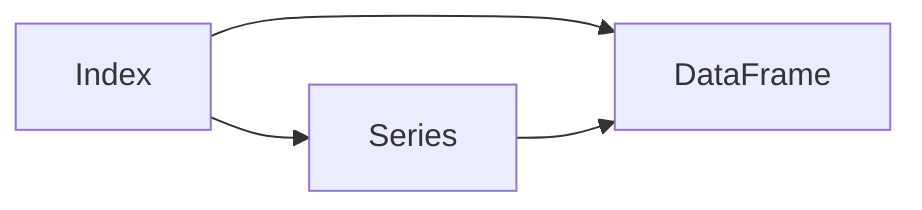

# DataFrame原理与代码实例讲解

## 1. 背景介绍

在数据科学和数据分析领域,高效处理和分析结构化数据是一项关键任务。而在Python生态系统中,pandas库凭借其强大的数据处理能力,尤其是DataFrame这一数据结构,已经成为了数据分析的标准工具。本文将深入探讨DataFrame的原理,并通过代码实例讲解其用法,帮助读者更好地掌握这一重要工具。

### 1.1 pandas库简介
### 1.2 DataFrame在数据分析中的重要性
### 1.3 文章的主要内容和目标

## 2. 核心概念与联系

要理解DataFrame,首先需要了解其核心概念以及它们之间的关系。本节将介绍Series、DataFrame、Index等关键概念,并阐明它们之间的联系。

### 2.1 Series
#### 2.1.1 Series的定义
#### 2.1.2 Series的特点
#### 2.1.3 Series的创建方法

### 2.2 DataFrame  
#### 2.2.1 DataFrame的定义
#### 2.2.2 DataFrame的特点
#### 2.2.3 DataFrame的创建方法

### 2.3 Index
#### 2.3.1 Index的定义
#### 2.3.2 Index的作用
#### 2.3.3 Index的创建方法

### 2.4 核心概念之间的关系



## 3. 核心算法原理与具体操作步骤

DataFrame的强大之处在于其丰富的数据操作方法。本节将介绍DataFrame的核心算法原理,并给出具体的操作步骤。

### 3.1 数据选择与过滤
#### 3.1.1 按标签选择数据
#### 3.1.2 按位置选择数据 
#### 3.1.3 布尔索引
#### 3.1.4 数据过滤

### 3.2 数据合并与连接
#### 3.2.1 concat
#### 3.2.2 merge
#### 3.2.3 join

### 3.3 数据分组与聚合
#### 3.3.1 groupby
#### 3.3.2 聚合函数
#### 3.3.3 apply和transform

### 3.4 数据重塑与透视
#### 3.4.1 pivot
#### 3.4.2 melt
#### 3.4.3 stack和unstack

## 4. 数学模型和公式详解

DataFrame的许多操作都涉及到数学模型和公式。本节将详细讲解其中的几个重要模型,并给出举例说明。

### 4.1 移动窗口函数
#### 4.1.1 滑动窗口模型
$$ y_t = \frac{1}{w} \sum_{i=0}^{w-1} x_{t-i} $$
其中$w$为窗口大小,$x_t$为时间序列在$t$时刻的值,$y_t$为$t$时刻的移动平均值。

#### 4.1.2 加权移动平均模型
$$ y_t = \frac{\sum_{i=0}^{w-1} w_i x_{t-i}}{\sum_{i=0}^{w-1} w_i} $$
其中$w_i$为第$i$个权重。

### 4.2 分组聚合模型

对于分组聚合操作,可以用如下数学模型表示:
$$ y_k = f(\{x_i | i \in G_k\}) $$
其中$G_k$表示第$k$个分组,$f$为聚合函数,如sum、mean等。

## 5. 项目实践:代码实例和详解

本节将通过具体的代码实例,演示如何使用DataFrame进行数据分析。每个实例都将给出详细的代码解释。

### 5.1 数据加载与预处理
```python
import pandas as pd

# 从CSV文件加载数据
df = pd.read_csv('data.csv') 

# 查看前几行数据
print(df.head())

# 检查缺失值
print(df.isnull().sum())

# 填充缺失值
df.fillna(0, inplace=True)
```

### 5.2 数据选择与过滤
```python
# 按标签选择列
print(df['column_name'])

# 按位置选择行
print(df.iloc[0:5])

# 布尔索引
print(df[df['column_name'] > 0])
```

### 5.3 数据合并与连接
```python
# 按行合并两个DataFrame
df_concat = pd.concat([df1, df2])

# 按列合并两个DataFrame
df_merge = pd.merge(df1, df2, on='key')
```

### 5.4 数据分组与聚合
```python
# 按某列分组并计算均值
df_group = df.groupby('column_name').mean()

# 对每个分组应用自定义函数
df_apply = df.groupby('column_name').apply(lambda x: x.max() - x.min())
```

## 6. 实际应用场景

DataFrame在实际数据分析项目中有广泛的应用。本节将列举几个典型的应用场景。

### 6.1 金融数据分析
### 6.2 用户行为分析
### 6.3 销售数据分析

## 7. 工具和资源推荐

要熟练掌握DataFrame,除了理论知识外,还需要借助一些工具和资源。本节将推荐几个有用的工具和学习资源。

### 7.1 Jupyter Notebook
### 7.2 pandas官方文档
### 7.3 数据分析在线课程

## 8. 总结:未来发展趋势与挑战

DataFrame已经成为数据分析的利器,但其发展仍面临一些挑战。本节将总结DataFrame的未来发展趋势,并指出可能的挑战。

### 8.1 与大数据平台的整合 
### 8.2 更好的可视化支持
### 8.3 更高的计算性能

## 9. 附录:常见问题与解答

### 9.1 如何处理大量缺失值?
### 9.2 如何优化DataFrame的内存使用?
### 9.3 如何处理文本数据?

作者: 禅与计算机程序设计艺术 / Zen and the Art of Computer Programming