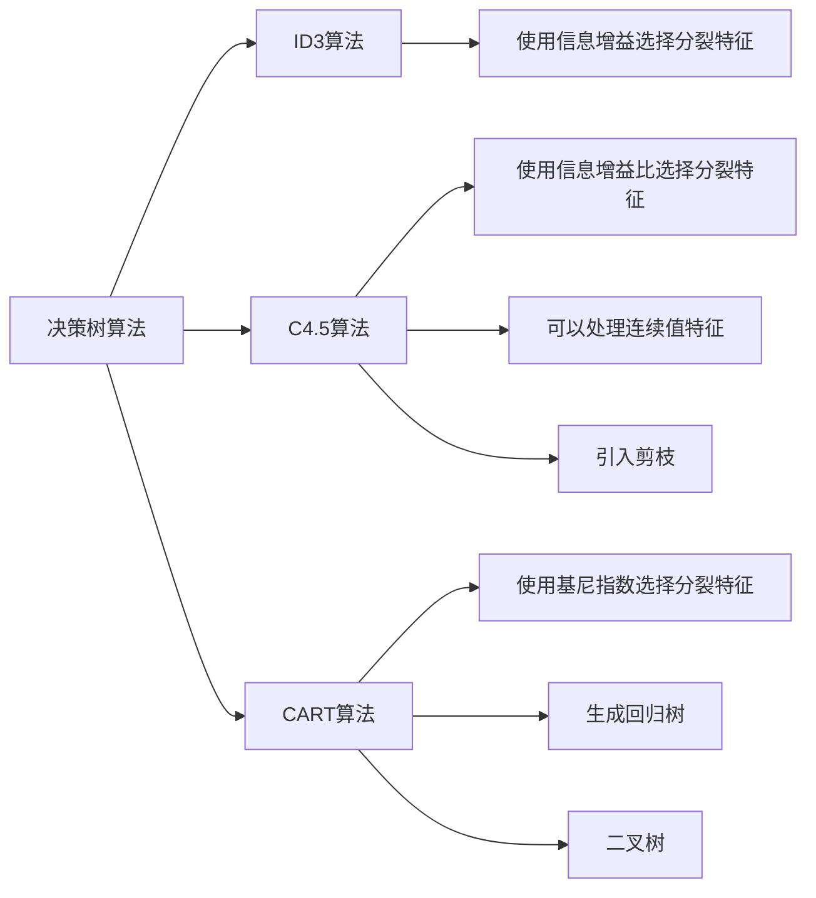

# Decision Trees 原理与代码实战案例讲解

## 1. 背景介绍

### 1.1 什么是决策树
决策树(Decision Tree)是一种常见的机器学习算法,属于监督式学习。它可以用于解决分类和回归问题,在实际应用中有着广泛的应用。决策树通过对数据进行递归划分,构建一个树形结构的预测模型。树的每个内部节点表示对某个属性的测试,每个分支代表一个测试输出,每个叶节点存储一个类别标签。

### 1.2 决策树的优缺点

决策树算法具有以下优点:
- 易于理解和解释:决策树模型的结构直观,非专业人士也能轻松理解。  
- 数据准备简单:不需要做太多数据预处理和归一化等操作。
- 既能处理数值型数据,也能处理类别型数据。
- 可以同时处理多分类问题。
- 使用白盒模型,可以清楚看到哪些特征更重要。
- 计算速度快,适合大规模数据。

决策树算法的主要缺点有:
- 容易过拟合,泛化能力较差。可以通过剪枝等方法缓解。
- 对缺失值和异常值敏感。  
- 可能会创建有偏的树,若某些类别占主导地位会影响决策树学习。
- 不适合特征数量非常多的情况,容易陷入维度灾难。

### 1.3 决策树的应用场景

决策树在很多领域都有广泛应用,比如:
- 金融领域:信用评分、贷款审批、客户分类等
- 医疗领域:疾病诊断、药物分类、医疗保险欺诈检测等  
- 营销领域:客户流失预测、产品推荐、广告投放等
- 工业领域:设备故障诊断、良品率预测等
- 其他领域如人力资源、教育、电信等行业也有大量应用

## 2. 核心概念与联系

### 2.1 信息熵
信息熵(Information Entropy)衡量的是一个随机变量的不确定性。设X是一个离散型随机变量,其概率分布为:
$$P(X=x_i)=p_i,\quad i=1,2,...,n$$
则随机变量X的信息熵定义为:
$$H(X)=-\sum_{i=1}^np_i\log p_i$$

信息熵越大,随机变量的不确定性就越大。当概率分布均匀时,熵最大;当只有一个事件发生的概率为1时,熵最小为0。

### 2.2 信息增益
信息增益(Information Gain)衡量的是一个特征对训练数据集的分类能力。设训练数据集为D,类别数为k,第k类样本所占的比例为$p_k(k=1,2,...,K)$,则数据集D的信息熵为:
$$H(D)=-\sum_{k=1}^Kp_k\log_2 p_k$$

设特征A有n个不同的取值$\{a_1,a_2,...,a_n\}$,根据特征A的取值将D划分为n个子集$\{D_1,D_2,...,D_n\}$,记子集$D_i$中属于第k类的样本的集合为$D_{ik}$,则特征A对数据集D的信息增益为:
$$Gain(D,A)=H(D)-\sum_{i=1}^n\frac{|D_i|}{|D|}H(D_i)$$
其中,$|D|$和$|D_i|$分别表示数据集D和子集$D_i$的样本个数。

一般地,信息增益越大的特征,对数据集的分类能力越强。ID3算法使用信息增益来选择最优分裂特征。

### 2.3 信息增益比
信息增益比(Gain Ratio)在信息增益的基础上除以数据集关于特征A的熵,对信息增益进行归一化。设特征A对数据集D的熵为:
$$H_A(D)=-\sum_{i=1}^n\frac{|D_i|}{|D|}\log_2\frac{|D_i|}{|D|}$$

则特征A对数据集D的信息增益比为:
$$GainRatio(D,A)=\frac{Gain(D,A)}{H_A(D)}$$

信息增益比对特征值较多的特征有一定惩罚作用,能够减少过拟合,是C4.5算法用来选择最优特征的指标。

### 2.4 基尼指数
基尼指数(Gini Index)反映了从数据集D中随机抽取两个样本,其类别标记不一致的概率。设数据集D中第k类样本所占的比例为$p_k(k=1,2,...,K)$,则数据集D的基尼指数为:
$$Gini(D)=\sum_{k=1}^Kp_k(1-p_k)=1-\sum_{k=1}^Kp_k^2$$

特征A的基尼指数定义为:
$$Gini\_index(D,A)=\sum_{i=1}^n\frac{|D_i|}{|D|}Gini(D_i)$$

基尼指数越小,数据集的纯度越高。CART分类树生成算法使用基尼指数最小化准则选择最优特征。

### 2.5 决策树算法之间的联系

## 3. 核心算法原理具体操作步骤

### 3.1 ID3算法

ID3算法的核心是在决策树的每个节点上使用信息增益准则选择特征,递归地构建决策树。具体步骤如下:

1. 设训练数据集为D,类别数为K,候选特征集合为A。
2. 如果D中所有样本属于同一类别,则将该类别作为节点的标记,返回单节点树;
3. 如果A为空集,则将D中样本数最多的类别作为该节点的标记,返回单节点树;
4. 否则,计算A中每个特征对D的信息增益,选择信息增益最大的特征$A_g$作为分裂特征;
5. 如果$A_g$的信息增益小于阈值,则将D中样本数最多的类别作为该节点的标记,返回单节点树;
6. 否则,对$A_g$的每一个可能值$a_i$,依$A_g=a_i$将D分割为若干非空子集$D_i$,将$A_g$从A中移除;
7. 对每个子集$D_i$,以$D_i$为训练集,以A为特征集,递归调用步骤1-6,得到子树,返回以$A_g$为根节点的子树。

### 3.2 C4.5算法

C4.5算法是对ID3算法的改进,主要变化有:

1. 用信息增益比代替信息增益来选择特征,减少偏向于选择值较多的特征。
2. 能够完成对连续属性的离散化处理。
3. 引入了剪枝操作。在决策树构造完成后,自底向上对非叶节点进行考察,若将该节点替换为叶节点能带来泛化性能提升,则将该节点替换为叶节点。
4. 能够对不完整数据进行处理。

### 3.3 CART算法

CART算法既可以生成分类树,也可以生成回归树。生成分类树时,选择分裂特征的准则是基尼指数最小化准则。CART算法的大致流程如下:

1. 对每个特征的每个取值,将数据集D分成两部分D1和D2,计算分裂后的基尼指数。
2. 在所有可能的特征A以及它们所有可能的切分点t中,选择基尼指数最小的特征及其对应的切分点作为最优分裂特征和最优切分点。即$A_g$和$t_g$使得
$$Gini\_index(D,A_g,t_g)=\min_{A,t}Gini\_index(D,A,t)$$
3. 用选定的最优分裂特征和最优切分点,将数据集分割成两个子集。
4. 继续对两个子集递归地调用步骤1-3,直至满足停止条件。
5. 生成CART决策树。

## 4. 数学模型和公式详细讲解举例说明

这里以信息增益的计算为例进行详细说明。假设有如下训练数据集:

| 编号 | 色泽 | 根蒂 | 敲声 | 纹理 | 脐部 | 触感 | 好瓜 |
|------|------|------|------|------|------|------|------|
| 1    | 青绿 | 蜷缩 | 浊响 | 清晰 | 凹陷 | 硬滑 | 是   |
| 2    | 乌黑 | 蜷缩 | 沉闷 | 清晰 | 凹陷 | 硬滑 | 是   |  
| 3    | 乌黑 | 蜷缩 | 浊响 | 清晰 | 凹陷 | 硬滑 | 是   |
| 4    | 青绿 | 蜷缩 | 沉闷 | 清晰 | 凹陷 | 硬滑 | 是   |
| 5    | 浅白 | 蜷缩 | 浊响 | 清晰 | 凹陷 | 硬滑 | 是   |
| 6    | 青绿 | 稍蜷 | 浊响 | 清晰 | 稍凹 | 软粘 | 是   |
| 7    | 乌黑 | 稍蜷 | 浊响 | 稍糊 | 稍凹 | 软粘 | 是   |
| 8    | 乌黑 | 稍蜷 | 浊响 | 清晰 | 稍凹 | 硬滑 | 是   |
| 9    | 乌黑 | 稍蜷 | 沉闷 | 稍糊 | 稍凹 | 硬滑 | 否   |  
| 10   | 青绿 | 硬挺 | 清脆 | 清晰 | 平坦 | 软粘 | 否   |
| 11   | 浅白 | 硬挺 | 清脆 | 模糊 | 平坦 | 硬滑 | 否   |
| 12   | 浅白 | 蜷缩 | 浊响 | 模糊 | 平坦 | 软粘 | 否   |
| 13   | 青绿 | 稍蜷 | 浊响 | 稍糊 | 凹陷 | 硬滑 | 否   |
| 14   | 浅白 | 稍蜷 | 沉闷 | 稍糊 | 凹陷 | 硬滑 | 否   |
| 15   | 乌黑 | 稍蜷 | 浊响 | 清晰 | 稍凹 | 软粘 | 否   |
| 16   | 浅白 | 蜷缩 | 浊响 | 模糊 | 平坦 | 硬滑 | 否   |
| 17   | 青绿 | 蜷缩 | 沉闷 | 稍糊 | 稍凹 | 硬滑 | 否   |

首先,计算数据集D的信息熵。该数据集中正例(好瓜)占8/17,反例占9/17,因此数据集D的信息熵为:
$$H(D)=-(\frac{8}{17}\log_2\frac{8}{17}+\frac{9}{17}\log_2\frac{9}{17})=0.998$$

接下来,以"色泽"特征为例,计算其信息增益。"色泽"特征有3个取值:青绿、乌黑和浅白,根据这一特征的不同取值可以将D划分为3个子集,分别记为$D_1,D_2,D_3$。对每个子集计算其信息熵:
$$H(D_1)=-(\frac{3}{6}\log_2\frac{3}{6}+\frac{3}{6}\log_2\frac{3}{6})=1.000$$
$$H(D_2)=-(\frac{4}{6}\log_2\frac{4}{6}+\frac{2}{6}\log_2\frac{2}{6})=0.918$$  
$$H(D_3)=-(\frac{1}{5}\log_2\frac{1}{5}+\frac{4