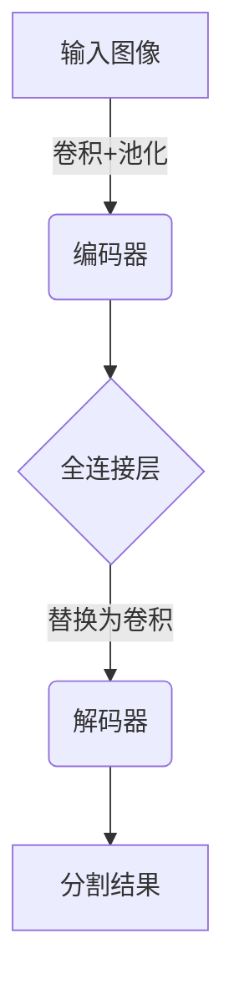
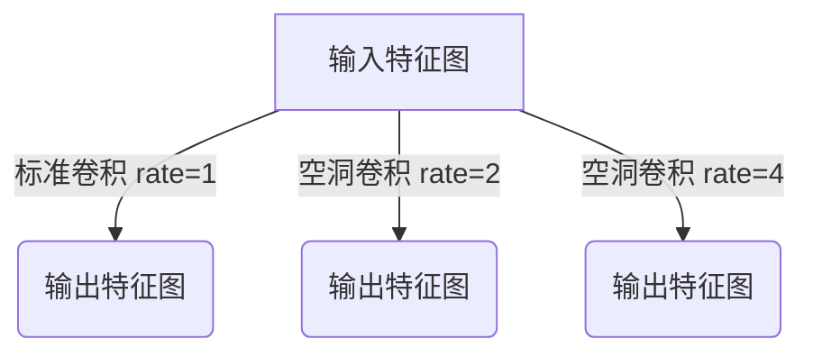
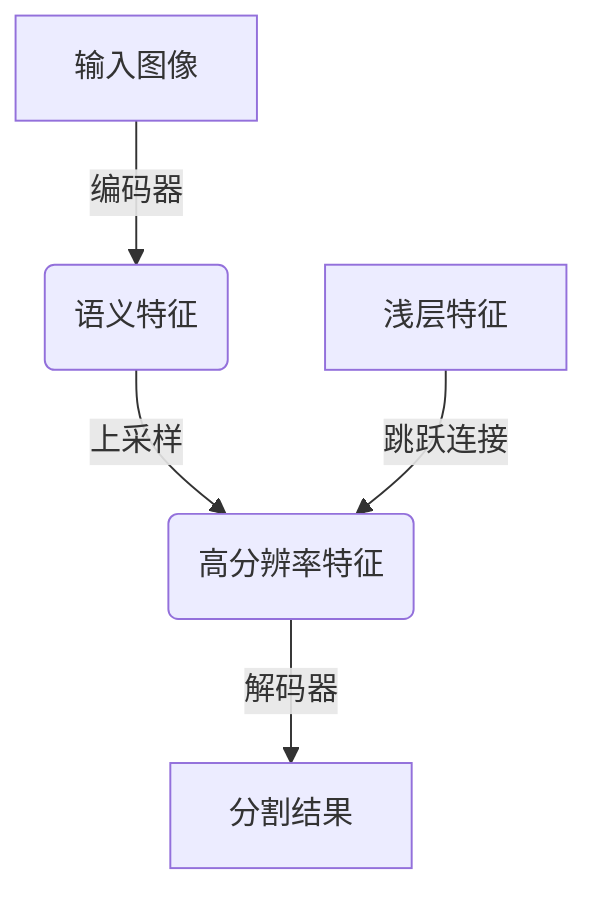
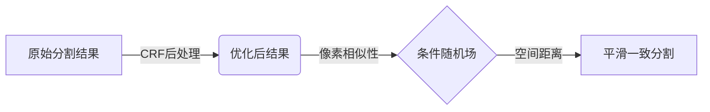

# DeepLab系列原理与代码实例讲解

## 1.背景介绍

### 1.1 语义分割的重要性

在计算机视觉领域,语义分割是一项关键任务,旨在将图像中的每个像素分配给一个预定义的类别标签。它广泛应用于无人驾驶、增强现实、医学图像分析等诸多领域。与传统的图像分类和目标检测任务相比,语义分割能够提供更加精细的像素级别的预测,从而获得更加丰富和精确的场景理解。

### 1.2 DeepLab系列的重要贡献

DeepLab是由谷歌研究团队开发的一系列卷积神经网络模型,专门用于语义分割任务。自2014年首次发布以来,DeepLab系列模型在语义分割领域产生了深远影响,不断推进着该领域的技术进步。DeepLab的核心贡献包括:

- 提出了"空洞(atrous)卷积"技术,有效扩大感受野而不增加参数量
- 引入了"编码-解码"架构,融合多尺度上下文信息
- 设计了有效的数据增广和后处理策略,提高模型的泛化能力
- 持续优化网络结构和训练策略,不断刷新语义分割的最高精度记录

### 1.3 本文概述

本文将全面介绍DeepLab系列模型的核心原理、算法细节、代码实现,以及在实际应用中的实践经验。我们将从DeepLab v1开始逐步讲解各个版本的创新点,并深入探讨其中的关键技术,如空洞卷积、编码-解码架构、上采样策略等。同时,我们也将分享在实际项目中使用DeepLab进行语义分割的实战经验和技巧,帮助读者更好地掌握和应用这一领先的语义分割模型。

## 2.核心概念与联系

### 2.1 全卷积网络(FCN)

DeepLab系列建立在全卷积网络(Fully Convolutional Network, FCN)的基础之上。FCN是语义分割领域的开山之作,它将传统的卷积神经网络扩展到了像素级别的密集预测任务。FCN的核心思想是替换最后的全连接层为卷积层,从而获得对应于输入图像的每个像素位置的特征响应。这种设计使得网络能够接受任意尺寸的输入图像,并输出相应尺寸的分割结果。

### 2.2 空洞卷积(Atrous Convolution)

空洞卷积是DeepLab系列中一个关键技术,用于扩大卷积核的感受野而不增加参数量和计算复杂度。传统的卷积核只能捕获局部的空间信息,而语义分割任务需要模型具备更大的感受野来捕获更广泛的上下文信息。

空洞卷积通过在卷积核内引入"空洞率"(dilation rate)参数,使卷积核的采样位置在空间上变得更加分散,从而扩大了感受野的覆盖范围。空洞率为1时,即为标准卷积。当空洞率增加时,感受野也随之线性增大,而参数量保持不变。

### 2.3 编码-解码架构

DeepLab v2及更高版本采用了编码-解码架构,融合了多尺度的上下文信息。编码器部分通常使用预训练的骨干网络(如VGG、ResNet等)来提取不同尺度的特征,而解码器部分则通过上采样和跳跃连接将低级特征与高级语义特征进行融合,以生成高分辨率的分割结果。

这种架构的优势在于,编码器能够捕获丰富的语义信息,而解码器则能够恢复精细的空间细节。通过跳跃连接,低级特征中的细节信息可以有效地传递到最终的分割结果中,从而提高分割的精确性和边缘保留能力。

### 2.4 条件随机场(CRF)

条件随机场(Conditional Random Field, CRF)是一种常用的结构化预测模型,可以有效地融合像素级别的局部特征和全局上下文信息。DeepLab系列中广泛使用了全连接的CRF作为后处理步骤,以进一步优化和细化分割结果。

CRF模型将图像中的每个像素视为一个节点,并根据像素之间的相似性和空间距离建立边缘连接。通过迭代优化,CRF可以将相似的像素归为同一类别,从而产生更加平滑和一致的分割结果。CRF的引入显著提高了DeepLab在细节保留和边缘检测方面的性能。

## 3.核心算法原理具体操作步骤

在本节中,我们将详细介绍DeepLab系列模型的核心算法原理和具体操作步骤,包括空洞卷积、编码-解码架构、上采样策略等关键技术。

### 3.1 空洞卷积(Atrous Convolution)

空洞卷积是DeepLab系列中一个关键技术,用于扩大卷积核的感受野而不增加参数量和计算复杂度。它的具体操作步骤如下:

1. 定义空洞率(dilation rate)参数r,表示卷积核元素之间的采样间隔。当r=1时,即为标准卷积。

2. 对于一个k×k的卷积核,其感受野大小为(k+r(k-1))×(k+r(k-1))。例如,当k=3且r=2时,感受野大小为7×7。

3. 在卷积运算时,根据空洞率r,对卷积核元素进行稀疏采样,即每隔r-1个位置采样一个值。

4. 将稀疏采样后的卷积核与输入特征图进行卷积运算,得到输出特征图。

5. 通过调节空洞率r,可以有效地控制感受野的大小,从而捕获更广泛的上下文信息。

空洞卷积的优势在于,它可以在不增加参数量和计算复杂度的情况下,显著扩大卷积核的感受野。这对于语义分割任务中需要捕获丰富上下文信息的情况非常有帮助。

### 3.2 编码-解码架构

DeepLab v2及更高版本采用了编码-解码架构,融合了多尺度的上下文信息。其具体操作步骤如下:

1. **编码器**部分:
   - 使用预训练的骨干网络(如VGG、ResNet等)作为编码器。
   - 通过多个卷积层和下采样层,逐步提取不同尺度的特征表示。
   - 高层特征具有丰富的语义信息,但空间分辨率较低。

2. **解码器**部分:
   - 对编码器输出的高层特征进行上采样,恢复空间分辨率。
   - 采用跳跃连接,将低层特征与上采样后的高层特征进行融合。
   - 通过一系列卷积层和上采样层,逐步恢复分割结果的空间分辨率。

3. **跳跃连接**:
   - 将编码器中的低层特征与解码器中对应尺度的特征进行concatenate或element-wise相加。
   - 低层特征具有丰富的细节信息,可以补充高层特征缺失的空间细节。
   - 有助于提高分割结果的精确性和边缘保留能力。

编码-解码架构的优势在于,它能够有效地融合不同尺度的上下文信息,捕获丰富的语义特征和细节特征,从而产生高质量的分割结果。

### 3.3 上采样策略

在编码-解码架构中,上采样策略对于恢复高分辨率分割结果至关重要。DeepLab系列采用了多种上采样策略,包括双线性插值、反卷积(也称作转置卷积)等。具体操作步骤如下:

1. **双线性插值**:
   - 对低分辨率特征图进行双线性插值,将其上采样到所需的高分辨率。
   - 插值过程中,会根据相邻像素的值进行加权平均,从而产生新的像素值。
   - 双线性插值计算简单,但可能会导致一定程度的细节丢失和模糊现象。

2. **反卷积(转置卷积)**:
   - 反卷积是一种学习式的上采样方法,通过卷积核和步长参数控制上采样过程。
   - 在训练过程中,反卷积层的参数会不断优化,以产生更精细的高分辨率特征图。
   - 相比双线性插值,反卷积能够更好地保留细节信息,但计算开销较大。

3. **组合策略**:
   - DeepLab v3+等版本采用了组合策略,结合了双线性插值和反卷积的优点。
   - 首先使用双线性插值进行初步上采样,然后通过反卷积进一步优化和细化结果。
   - 这种组合策略能够在保持计算效率的同时,产生高质量的高分辨率分割结果。

上采样策略的选择需要权衡计算开销和结果质量。在实际应用中,可以根据具体需求和硬件资源情况进行合理选择。

## 4.数学模型和公式详细讲解举例说明

在本节中,我们将详细讲解DeepLab系列模型中涉及的数学模型和公式,并通过具体示例加深理解。

### 4.1 空洞卷积公式

空洞卷积(Atrous Convolution)是DeepLab系列中一个关键技术,用于扩大卷积核的感受野而不增加参数量和计算复杂度。其数学公式如下:

$$
y[i] = \sum_{k}^{K} \sum_{l}^{L} x[i+r \cdot k] \cdot w[k, l]
$$

其中:

- $y[i]$表示输出特征图的第$i$个位置的值。
- $x$表示输入特征图。
- $w$表示卷积核权重。
- $K$和$L$分别表示卷积核的高度和宽度。
- $r$表示空洞率(dilation rate),控制卷积核元素之间的采样间隔。

当$r=1$时,即为标准卷积。当$r>1$时,卷积核元素之间的采样间隔增加,从而扩大了感受野的覆盖范围。

例如,对于一个$3\times3$的卷积核,当$r=1$时,其感受野大小为$3\times3$;当$r=2$时,感受野大小为$7\times7$;当$r=4$时,感受野大小为$15\times15$。通过调节$r$的值,我们可以有效地控制感受野的大小,从而捕获更广泛的上下文信息。

### 4.2 条件随机场(CRF)模型

条件随机场(Conditional Random Field, CRF)是一种常用的结构化预测模型,可以有效地融合像素级别的局部特征和全局上下文信息。DeepLab系列中广泛使用了全连接的CRF作为后处理步骤,以进一步优化和细化分割结果。

CRF模型的能量函数可以表示为:

$$
E(x) = \sum_{i} \theta_i(x_i) + \sum_{i,j} \theta_{ij}(x_i, x_j)
$$

其中:

- $x$表示像素标签分配。
- $\theta_i(x_i)$表示像素$i$的单个节点势函数,反映了像素$i$被分配给标签$x_i$的概率。
- $\theta_{ij}