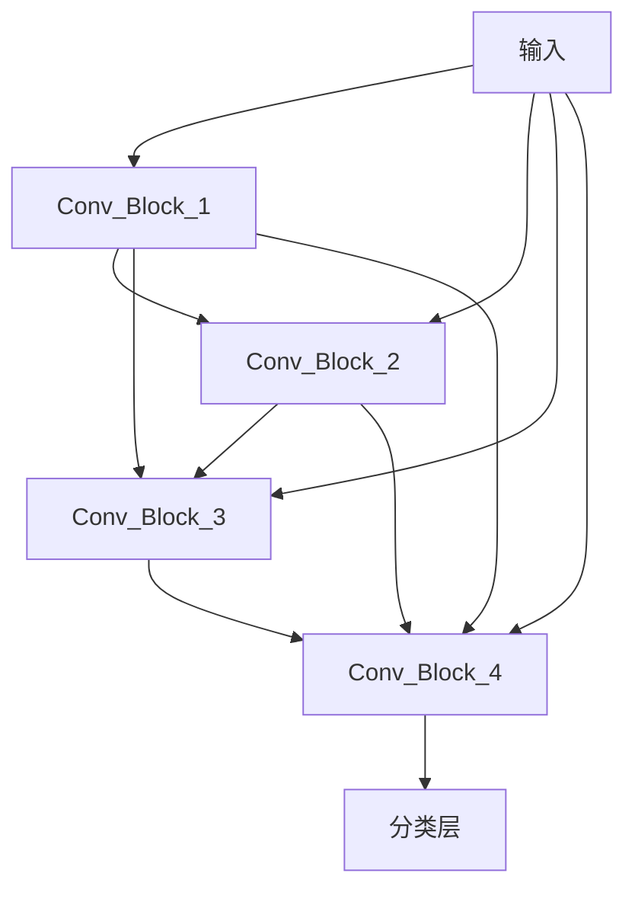
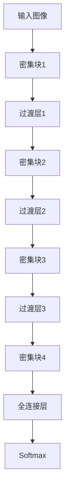

# DenseNet原理与代码实例讲解

## 1.背景介绍

在深度学习领域中,卷积神经网络(Convolutional Neural Networks, CNNs)已经取得了巨大的成功,在图像分类、目标检测、语义分割等计算机视觉任务上表现出色。然而,随着网络层数的增加,传统的CNN结构也面临了一些挑战,例如梯度消失/爆炸问题、参数过多导致的过拟合风险等。为了解决这些问题,DenseNet(Densely Connected Convolutional Networks)被提出,它通过引入密集连接的设计,有效地缓解了梯度传播问题,并且大幅减少了参数数量,提高了模型的效率。

### 1.1 CNN发展简史

从AlexNet到VGGNet、GoogleNet、ResNet等,CNN模型在结构上不断演进,层数越来越深、性能也越来越好。但是,随着网络深度的增加,信息传播路径也变得越来越长,会导致梯度在反向传播过程中发生衰减或爆炸,从而影响模型的收敛性和性能。

### 1.2 密集连接的灵感来源

DenseNet的设计灵感来自于ResNet中的残差连接(Residual Connection)。ResNet通过引入残差模块,使得输入可以直接传递到后面的层,从而缓解了信息传播过程中的梯度问题。DenseNet在此基础上进一步发展,采用了更加紧密的层与层之间的连接方式,形成了密集连接的网络结构。

## 2.核心概念与联系

### 2.1 密集连接(Dense Connectivity)

DenseNet的核心思想是在网络的每一层之间建立密集连接,即每一层不仅与下一层相连,还与其后面所有层相连。具体来说,第$l$层的输入不仅包括前一层的输出$x_{l-1}$,还包括了之前所有层的输出特征图的拼接,可以表示为:

$$x_l = H_l([x_0, x_1, ..., x_{l-1}])$$

其中,$x_0$是原始输入,而$H_l(\cdot)$表示第$l$层的操作,包括卷积(Convolution)、批量归一化(Batch Normalization)和激活函数(ReLU)等。通过这种密集连接方式,网络的每一层都可以直接访问之前所有层的特征图,从而有利于特征的复用和传播,缓解了梯度消失/爆炸问题。



### 2.2 渐进式生长(Growth Rate)

由于每一层的输入都包含了之前所有层的特征图拼接,因此特征图的维度会随着网络深度的增加而迅速增长,从而导致参数过多、计算量过大的问题。为了控制参数数量,DenseNet引入了一个新的超参数——渐进式生长率(Growth Rate),用$k$表示。具体地,每个卷积层产生的特征图个数就是$k$个,而不是传统CNN中通常采用的较大的值。通过适当设置$k$的值,可以有效地控制参数数量,同时保持足够的特征传播能力。

### 2.3 密集块(Dense Block)和过渡层(Transition Layer)

为了进一步提高计算效率,DenseNet将网络分为多个密集块(Dense Block)和过渡层(Transition Layer)。每个密集块由多个具有相同特征图大小的密集连接层组成,而过渡层则通过批量归一化、卷积和池化操作来减小特征图的尺寸,从而降低后续计算的复杂度。



通过这种设计,DenseNet在保持足够的特征传播能力的同时,也控制了参数数量和计算复杂度,从而实现了高效的端到端训练。

## 3.核心算法原理具体操作步骤 

DenseNet的核心算法原理可以概括为以下几个步骤:

1. **初始卷积层**: 对输入图像进行初始卷积操作,得到初始特征图。

2. **密集块(Dense Block)**: 
   - 对于第一个密集块,将初始特征图作为输入。
   - 对于后续的密集块,将前一个过渡层的输出作为输入。
   - 在密集块内部,每一层的输入是之前所有层输出特征图的拼接。
   - 每一层包含以下操作:批量归一化(BN) -> 卷积(Conv) -> 激活函数(ReLU)。
   - 密集块内的所有层都使用相同的特征图大小。

3. **过渡层(Transition Layer)**: 
   - 对密集块的输出进行批量归一化(BN)和卷积(Conv)操作。
   - 使用平均池化(Average Pooling)降低特征图的空间分辨率。

4. **重复步骤2和3**: 重复密集块和过渡层,直到达到所需的网络深度。

5. **全连接层和分类层**: 在网络的最后,添加一个全连接层和一个分类层(如Softmax),用于对输入图像进行分类。

通过上述步骤,DenseNet实现了特征复用和梯度直传,从而缓解了梯度消失/爆炸问题。同时,由于每一层只产生$k$个特征图,参数数量得到了有效控制,避免了过拟合的风险。

## 4.数学模型和公式详细讲解举例说明

为了更好地理解DenseNet的工作原理,我们来详细分析一下它的数学模型和公式。

### 4.1 密集连接公式

如前所述,DenseNet的核心思想是在网络的每一层之间建立密集连接。具体来说,第$l$层的输入$x_l$是之前所有层输出特征图$x_0, x_1, ..., x_{l-1}$的拼接,可以表示为:

$$x_l = H_l([x_0, x_1, ..., x_{l-1}])$$

其中,$x_0$是原始输入,而$H_l(\cdot)$表示第$l$层的操作,包括卷积(Convolution)、批量归一化(Batch Normalization)和激活函数(ReLU)等。

让我们用一个具体的例子来说明这个公式。假设我们有一个密集块,包含4层,每层的特征图个数为$k=4$。那么,第一层的输出$x_1$就是对输入$x_0$进行卷积操作后得到的4个特征图。第二层的输入$x_2$是$x_0$和$x_1$的拼接,即8个特征图。第三层的输入$x_3$是$x_0$、$x_1$和$x_2$的拼接,即12个特征图。最后,第四层的输入$x_4$是$x_0$、$x_1$、$x_2$和$x_3$的拼接,即16个特征图。

通过这种密集连接方式,每一层不仅可以利用当前层的特征,还可以直接访问之前所有层的特征,从而有利于特征的复用和传播,缓解了梯度消失/爆炸问题。

### 4.2 过渡层公式

为了控制参数数量和计算复杂度,DenseNet引入了过渡层(Transition Layer)。过渡层的作用是减小特征图的空间分辨率,从而降低后续计算的复杂度。

具体来说,假设密集块的输出为$x_l$,过渡层的操作可以表示为:

$$y = H_t(x_l)$$

其中,$H_t(\cdot)$包括以下操作:

1. 批量归一化(Batch Normalization): $BN(x_l)$
2. 卷积(Convolution): $Conv(BN(x_l))$,卷积核大小为$1\times1$,用于调整特征图的通道数。
3. 平均池化(Average Pooling): $AvgPool(Conv(BN(x_l)))$,池化窗口大小通常为$2\times2$,步长为2,用于降低特征图的空间分辨率。

通过这种方式,过渡层可以有效地减小特征图的尺寸,从而降低后续计算的复杂度,同时也控制了参数数量的增长。

### 4.3 参数计算公式

DenseNet的一个关键优势是参数数量相对较少,这主要得益于引入了渐进式生长率(Growth Rate)$k$。

假设DenseNet有$L$个密集块,每个密集块包含$m$层,输入图像的通道数为$c_0$,那么第$l$个密集块的输出特征图通道数为:

$$c_l = c_0 + k \times (l-1) \times m$$

其中,$k$是渐进式生长率,控制了每一层产生的新特征图的个数。

进一步地,如果我们假设每个卷积层的卷积核大小为$k_w \times k_h$,那么第$l$个密集块的参数数量可以计算为:

$$\text{params}_l = k^2 \times k_w \times k_h \times c_l \times m$$

通过适当设置$k$的值,我们可以有效地控制参数数量,同时保持足够的特征传播能力。

## 5.项目实践:代码实例和详细解释说明

为了更好地理解DenseNet的原理和实现,我们来看一个基于PyTorch的代码实例。在这个例子中,我们将构建一个DenseNet模型,并在CIFAR-10数据集上进行训练和评估。

### 5.1 导入必要的库

```python
import torch
import torch.nn as nn
import torch.nn.functional as F
import torch.optim as optim
from torchvision import datasets, transforms
```

### 5.2 定义DenseNet模块

```python
class Bottleneck(nn.Module):
    def __init__(self, in_planes, growth_rate):
        super(Bottleneck, self).__init__()
        self.bn1 = nn.BatchNorm2d(in_planes)
        self.conv1 = nn.Conv2d(in_planes, 4*growth_rate, kernel_size=1, bias=False)
        self.bn2 = nn.BatchNorm2d(4*growth_rate)
        self.conv2 = nn.Conv2d(4*growth_rate, growth_rate, kernel_size=3, padding=1, bias=False)

    def forward(self, x):
        out = self.conv1(F.relu(self.bn1(x)))
        out = self.conv2(F.relu(self.bn2(out)))
        out = torch.cat([out,x], 1)
        return out

class Transition(nn.Module):
    def __init__(self, in_planes, out_planes):
        super(Transition, self).__init__()
        self.bn = nn.BatchNorm2d(in_planes)
        self.conv = nn.Conv2d(in_planes, out_planes, kernel_size=1, bias=False)
        self.avg_pool = nn.AvgPool2d(2)

    def forward(self, x):
        out = self.conv(F.relu(self.bn(x)))
        out = self.avg_pool(out)
        return out

class DenseNet(nn.Module):
    def __init__(self, block, nblocks, growth_rate=12, reduction=0.5, num_classes=10):
        super(DenseNet, self).__init__()
        self.growth_rate = growth_rate

        num_planes = 2*growth_rate
        self.conv1 = nn.Conv2d(3, num_planes, kernel_size=3, padding=1, bias=False)

        self.dense1 = self._make_dense_layers(block, num_planes, nblocks[0])
        num_planes += nblocks[0]*growth_rate
        out_planes = int(math.floor(num_planes*reduction))
        self.trans1 = Transition(num_planes, out_planes)
        num_planes = out_planes

        self.dense2 = self._make_dense_layers(block, num_planes, nblocks[1])
        num_planes += nblocks[1]*growth_rate
        out_planes = int(math.floor(num_planes*reduction))
        self.trans2 = Transition(num_planes, out_planes)
        num_planes = out_planes

        self.dense3 = self._make_dense_layers(block, num_planes, nblocks[2])
        num_planes += nblocks[2]*growth_rate
        out_planes = int(math.floor(num_planes*reduction))
        self.trans3 = Transition(num_planes, out_planes)
        num_planes = out_planes

        self.dense4 = self._make_dense_layers(block, num_planes, nblocks[3])
        num_planes += nblocks[3]*growth_rate

        self.bn = nn.BatchNorm2d(num