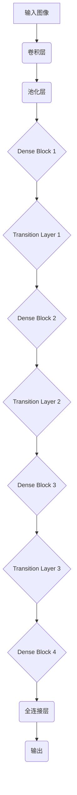
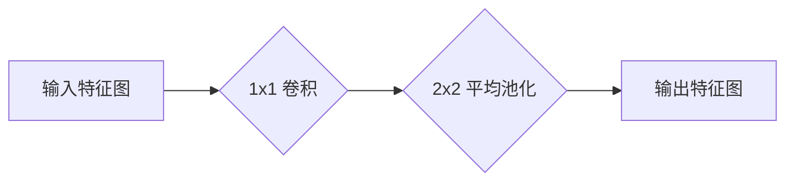

# DenseNet原理与代码实例讲解

## 1. 背景介绍

### 1.1 卷积神经网络的发展历程

卷积神经网络(Convolutional Neural Networks, CNN)是深度学习领域中最成功和最广泛使用的模型之一。自从AlexNet在2012年的ImageNet竞赛中获得巨大成功以来,CNN在计算机视觉、自然语言处理、语音识别等领域取得了卓越的成绩。然而,随着网络层数的增加,传统CNN模型也面临了一些挑战,例如梯度消失、梯度爆炸、过拟合等问题。

为了解决这些问题,研究人员提出了多种新型网络架构,其中DenseNet就是一种非常有趣和创新的网络结构。DenseNet由华伦顿大学的Gao Huang等人于2017年在论文"Densely Connected Convolutional Networks"中提出,并在多个基准测试中取得了优异的表现。

### 1.2 DenseNet的主要贡献

DenseNet的主要贡献有以下几点:

1. **密集连接(Dense Connectivity)**: 与传统CNN不同,DenseNet中的每一层都与其后面的所有层紧密连接,从而实现了特征重用,增强了特征传播,缓解了梯度消失问题。

2. **减少参数量**: 由于密集连接的设计,DenseNet能够在相同的参数量下构建更深的网络,提高了参数利用率。

3. **正则化效果**: 密集连接具有一定的正则化效果,有助于减轻过拟合问题。

4. **可扩展性强**: DenseNet的结构设计使得网络具有很强的可扩展性,可以根据需求轻松地增加或减少层数。

DenseNet在ImageNet、CIFAR、SVHN等多个数据集上都展现出了卓越的性能,在参数量相同的情况下,往往比其他网络结构具有更高的准确率。

## 2. 核心概念与联系

### 2.1 密集连接(Dense Connectivity)

DenseNet的核心思想就是密集连接(Dense Connectivity)。在传统的CNN中,每一层的输入仅来自于前一层的输出。而在DenseNet中,每一层不仅接收前一层的输出作为输入,还会接收其他层的输出作为额外的输入,从而实现了特征重用。具体来说,第l层的输入不仅包括前一层的输出$x_{l-1}$,还包括了之前所有层的输出$[x_0, x_1, ..., x_{l-1}]$的拼接。这种密集连接方式能够最大限度地重用特征,增强特征传播,从而有利于构建更深的网络。

密集连接的数学表达式如下:

$$x_l = H_l([x_0, x_1, ..., x_{l-1}])$$

其中,$x_l$表示第l层的输出,$H_l(\cdot)$表示第l层的非线性转换函数。

为了减少参数量和计算量,DenseNet采用了一种称为"bottleneck layer"的设计。具体来说,在每个密集块(Dense Block)中,每一层首先通过一个$1\times1$卷积层进行特征映射,将输入特征图的通道数降低,然后再进行$3\times3$卷积运算,最后再通过一个$1\times1$卷积层将特征图的通道数恢复到原来的水平。这种设计能够在保持精度的同时大大减少计算量和参数量。

### 2.2 DenseNet网络结构

DenseNet的整体网络结构由多个密集块(Dense Block)和过渡层(Transition Layer)组成。密集块是DenseNet的核心部分,它由多个密集连接的卷积层组成。过渡层则负责对密集块的输出进行压缩和下采样,以减少特征图的空间尺寸和通道数。

下图展示了DenseNet的整体网络结构:



在上图中,DenseNet首先通过一个普通的卷积层和池化层对输入图像进行初步处理。然后,图像数据流经多个密集块和过渡层,最终通过全连接层输出分类结果。

## 3. 核心算法原理具体操作步骤

### 3.1 密集块(Dense Block)

密集块是DenseNet的核心部分,它由多个密集连接的卷积层组成。每一层不仅接收前一层的输出作为输入,还会接收其他层的输出作为额外的输入,从而实现了特征重用。

密集块的具体操作步骤如下:

1. 对输入特征图进行$1\times1$卷积,将通道数降低,减少计算量。
2. 对步骤1的输出进行$3\times3$卷积,提取特征。
3. 将步骤2的输出与输入特征图进行拼接,得到新的特征图。
4. 重复步骤1-3,直到达到密集块设定的层数。

下图展示了一个密集块的内部结构:


在上图中,每一层的输出都会与之前所有层的输出进行拼接,从而实现了特征重用。这种密集连接方式能够增强特征传播,缓解梯度消失问题,有利于构建更深的网络。

### 3.2 过渡层(Transition Layer)

过渡层的主要作用是对密集块的输出进行压缩和下采样,以减少特征图的空间尺寸和通道数,从而控制计算量和内存占用。

过渡层的具体操作步骤如下:

1. 对密集块的输出进行$1\times1$卷积,将通道数降低,减少特征图的通道数。
2. 对步骤1的输出进行$2\times2$平均池化,将特征图的空间尺寸减半。

下图展示了一个过渡层的结构:



通过过渡层的压缩和下采样操作,DenseNet能够在保持精度的同时,有效地控制计算量和内存占用,从而支持构建更深的网络结构。

## 4. 数学模型和公式详细讲解举例说明

### 4.1 密集连接的数学表达式

如前所述,密集连接是DenseNet的核心思想。第l层的输入不仅包括前一层的输出$x_{l-1}$,还包括了之前所有层的输出$[x_0, x_1, ..., x_{l-1}]$的拼接。

密集连接的数学表达式如下:

$$x_l = H_l([x_0, x_1, ..., x_{l-1}])$$

其中,$x_l$表示第l层的输出,$H_l(\cdot)$表示第l层的非线性转换函数,通常包括批归一化(Batch Normalization)、激活函数(ReLU)和卷积操作。

具体来说,假设第l层的输入特征图有k个通道,前一层的输出$x_{l-1}$有$m_0$个通道,之前所有层的输出$[x_0, x_1, ..., x_{l-2}]$分别有$m_1, m_2, ..., m_{l-2}$个通道。那么,第l层的输入特征图将有$k + m_0 + m_1 + ... + m_{l-2}$个通道。

这种密集连接方式能够最大限度地重用特征,增强特征传播,从而有利于构建更深的网络。

### 4.2 bottleneck层的数学表达式

为了减少参数量和计算量,DenseNet采用了一种称为"bottleneck layer"的设计。在每个密集块中,每一层首先通过一个$1\times1$卷积层进行特征映射,将输入特征图的通道数降低,然后再进行$3\times3$卷积运算,最后再通过一个$1\times1$卷积层将特征图的通道数恢复到原来的水平。

假设第l层的输入特征图有$k_0$个通道,bottleneck层的输出通道数为$k$,那么bottleneck层的数学表达式如下:

$$x_l = H_l^{(3)}(H_l^{(2)}(H_l^{(1)}([x_0, x_1, ..., x_{l-1}])))$$

其中:

- $H_l^{(1)}(\cdot)$表示第一个$1\times1$卷积层,将输入特征图的通道数从$k_0$降低到$k$。
- $H_l^{(2)}(\cdot)$表示$3\times3$卷积层,提取特征。
- $H_l^{(3)}(\cdot)$表示第二个$1\times1$卷积层,将特征图的通道数从$k$恢复到$k_0$。

通过bottleneck层的设计,DenseNet能够在保持精度的同时,大大减少计算量和参数量。

### 4.3 过渡层的数学表达式

过渡层的主要作用是对密集块的输出进行压缩和下采样,以减少特征图的空间尺寸和通道数。

假设密集块的输出特征图有$k_0$个通道,过渡层的输出通道数为$k$,那么过渡层的数学表达式如下:

$$x_{trans} = P(C([x_0, x_1, ..., x_{l}]))$$

其中:

- $C(\cdot)$表示$1\times1$卷积层,将输入特征图的通道数从$k_0$降低到$k$。
- $P(\cdot)$表示$2\times2$平均池化层,将特征图的空间尺寸减半。

通过过渡层的压缩和下采样操作,DenseNet能够在保持精度的同时,有效地控制计算量和内存占用,从而支持构建更深的网络结构。

## 5. 项目实践:代码实例和详细解释说明

在这一部分,我们将通过PyTorch框架实现DenseNet,并对代码进行详细的解释说明。

### 5.1 定义DenseNet基本模块

首先,我们定义DenseNet中使用的基本模块,包括密集块(Dense Block)和过渡层(Transition Layer)。

```python
import torch
import torch.nn as nn

class _DenseLayer(nn.Sequential):
    """
    密集连接层
    """
    def __init__(self, num_input_features, growth_rate, bn_size, drop_rate):
        super(_DenseLayer, self).__init__()
        self.add_module('norm1', nn.BatchNorm2d(num_input_features)),
        self.add_module('relu1', nn.ReLU(inplace=True)),
        self.add_module('conv1', nn.Conv2d(num_input_features, bn_size *
                                            growth_rate, kernel_size=1, stride=1,
                                            bias=False)),
        self.add_module('norm2', nn.BatchNorm2d(bn_size * growth_rate)),
        self.add_module('relu2', nn.ReLU(inplace=True)),
        self.add_module('conv2', nn.Conv2d(bn_size * growth_rate, growth_rate,
                                            kernel_size=3, stride=1, padding=1,
                                            bias=False)),
        self.drop_rate = drop_rate

    def forward(self, x):
        new_features = super(_DenseLayer, self).forward(x)
        if self.drop_rate > 0:
            new_features = nn.Dropout(p=self.drop_rate)(new_features)
        return torch.cat([x, new_features], 1)

class _DenseBlock(nn.Sequential):
    """
    密集块
    """
    def __init__(self, num_layers, num_input_features, bn_size, growth_rate, drop_rate):
        super(_DenseBlock, self).__init__()
        for i in range(num_layers):
            layer = _DenseLayer(num_input_features + i * growth_rate, growth_rate,
                                bn_size, drop_rate)
            self.add_module('denselayer%d' % (i + 1), layer)

class _Transition(nn.Sequential):
    """
    过渡层
    """
    def __init__(self, num_input_features, num_output_features):
        super(_Transition, self).__init__()
        self.add_module('norm', nn.BatchNorm2d(num_input_features))
        self.add_module('relu', nn.ReLU(inplace=True))
        self.add_module('conv', nn.Conv2d(num_input_features, num_output_features,
                                          kernel_