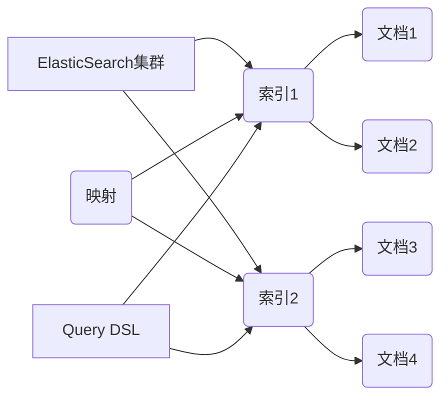

# ElasticSearch Query DSL原理与代码实例讲解

## 1. 背景介绍

### 1.1 全文搜索引擎概述

在大数据时代,海量数据的检索和分析是一个巨大的挑战。传统的关系型数据库在处理大规模数据时性能较差,难以满足实时搜索和分析的需求。全文搜索引擎应运而生,它能够快速地对大量非结构化或半结构化数据进行索引、搜索和分析。

### 1.2 ElasticSearch的崛起

ElasticSearch是一个基于Lucene构建的开源、分布式、RESTful接口的全文搜索引擎。它具有高可伸缩、高可靠、易管理等特点,成为全文搜索引擎领域的佼佼者。ElasticSearch提供了一套强大的查询语言Query DSL(Domain Specific Language),使得用户能够方便地进行复杂的搜索和聚合分析。

### 1.3 Query DSL的重要性

Query DSL是ElasticSearch的核心功能之一。掌握Query DSL,就能够最大限度地发挥ElasticSearch的搜索和分析能力。本文将深入探讨Query DSL的原理,结合代码实例进行讲解,帮助读者全面理解和应用这一利器。

## 2. 核心概念与联系

### 2.1 索引(Index)

ElasticSearch中的索引(Index)是一个存储相似文档(Document)的地方。可以把它类比为关系型数据库中的数据库(Database)。一个ElasticSearch集群可以包含多个索引。

### 2.2 文档(Document) 

文档是ElasticSearch中的最小数据单元,以JSON格式表示。文档归属于一个索引,类似于关系型数据库中一条记录归属于一张表。

### 2.3 映射(Mapping)

映射定义了一个索引中的文档应该如何被存储和索引。它类似于关系型数据库中表的结构定义(Schema)。映射中包含了每个字段的数据类型、分词方式等元数据。

### 2.4 Query DSL

Query DSL是一种灵活的、基于JSON的查询语言。它允许你使用结构化查询来查找和分析存储在ElasticSearch索引中的数据。Query DSL包含多种类型的查询,可以支持全文搜索、结构化搜索、地理位置搜索、模糊搜索等各种场景。

### 2.5 核心概念关系图



## 3. 核心算法原理具体操作步骤

### 3.1 倒排索引

ElasticSearch使用倒排索引(Inverted Index)的数据结构来实现快速的全文搜索。倒排索引中,每个单词(Term)都对应一个包含它的文档列表。当进行搜索时,首先找到查询词对应的文档列表,然后对这些文档进行评分、排序和返回。

倒排索引的构建步骤如下:

1. 文档分词:将文档内容按照一定的规则分割成多个单词(Term)。
2. 构建词典:对所有文档的分词结果进行去重,形成一个唯一的单词列表,即词典(Dictionary)。
3. 构建倒排表:对于词典中的每个单词,记录包含它的文档ID,形成倒排表(Postings List)。

### 3.2 相关性评分

ElasticSearch使用相关性评分(Relevance Score)来衡量文档与查询的匹配程度。常用的相关性评分算法包括:

1. TF-IDF:综合考虑词频(Term Frequency)和逆文档频率(Inverse Document Frequency)。
2. BM25:基于概率论的相关性评分算法,考虑了文档长度的影响。

### 3.3 查询解析与执行

当ElasticSearch接收到一个Query DSL查询请求时,会经过以下步骤:

1. 查询解析:将Query DSL转换为ElasticSearch内部的查询表示。
2. 查询优化:对查询进行优化,如缓存查询结果、重写查询等。
3. 查询执行:根据倒排索引和相关性评分算法,找到匹配的文档并返回。

## 4. 数学模型和公式详细讲解举例说明

### 4.1 TF-IDF

TF-IDF是一种常用的相关性评分算法。它的数学表达式为:

$$
tfidf(t,d) = tf(t,d) * idf(t)
$$

其中,$tf(t,d)$表示词$t$在文档$d$中的词频,$idf(t)$表示词$t$的逆文档频率,计算公式为:

$$
idf(t) = log(\frac{N}{df(t)})
$$

$N$为索引中的总文档数,$df(t)$为包含词$t$的文档数。

举例说明:假设有两个文档d1和d2,它们的内容分别为:

d1: "The quick brown fox jumps over the lazy dog"
d2: "The lazy dog is quick and brown"

对于查询"quick dog",文档d1的相关性评分为:

```
tf(quick, d1) = 1/9
tf(dog, d1) = 1/9
idf(quick) = log(2/2) = 0
idf(dog) = log(2/2) = 0

tfidf(quick, d1) = 1/9 * 0 = 0 
tfidf(dog, d1) = 1/9 * 0 = 0
```

文档d2的相关性评分为:

```
tf(quick, d2) = 1/8
tf(dog, d2) = 1/8
idf(quick) = log(2/2) = 0
idf(dog) = log(2/2) = 0

tfidf(quick, d2) = 1/8 * 0 = 0
tfidf(dog, d2) = 1/8 * 0 = 0
```

可以看出,由于两个词在所有文档中都出现,导致它们的逆文档频率为0,最终的TF-IDF评分也为0。这个例子说明了逆文档频率在相关性评分中的重要作用。

### 4.2 BM25 

BM25是另一种常用的相关性评分算法。它的数学表达式为:

$$
score(q,d) = \sum_{t \in q} idf(t) * \frac{tf(t,d) * (k1 + 1)}{tf(t,d) + k1 * (1 - b + b * \frac{|d|}{avgdl})}
$$

其中,$q$为查询,$d$为文档,$t$为查询中的词,$k1$和$b$为调节因子,$|d|$为文档长度,$avgdl$为索引中文档的平均长度。

BM25考虑了文档长度对相关性的影响。文档越长,包含查询词的概率越大,但是相关性却可能较低。因此,BM25通过文档长度归一化因子来惩罚较长的文档。

## 5. 项目实践:代码实例和详细解释说明

下面通过一个基于Python和ElasticSearch的代码实例,演示如何使用Query DSL进行搜索和聚合分析。

### 5.1 创建索引和映射

```python
from elasticsearch import Elasticsearch

# 连接ElasticSearch
es = Elasticsearch()

# 创建索引
index_name = "my_index"
if not es.indices.exists(index=index_name):
    es.indices.create(index=index_name)

# 定义映射
mapping = {
    "properties": {
        "title": {"type": "text"},
        "content": {"type": "text"},
        "publish_date": {"type": "date"},
        "author": {"type": "keyword"},
        "category": {"type": "keyword"}
    }
}
es.indices.put_mapping(index=index_name, body=mapping)
```

这段代码首先连接到ElasticSearch,然后创建了一个名为"my_index"的索引。接着,定义了索引的映射,包含了title、content、publish_date、author和category这几个字段。

### 5.2 索引文档

```python
# 索引文档
doc1 = {
    "title": "ElasticSearch Guide",
    "content": "This is a comprehensive guide to ElasticSearch",
    "publish_date": "2022-01-01",
    "author": "John Doe",
    "category": "Technology"
}
es.index(index=index_name, body=doc1)

doc2 = {
    "title": "Python Tutorial",
    "content": "A beginner's tutorial for Python programming",
    "publish_date": "2022-02-15",
    "author": "Jane Smith",
    "category": "Programming"
}
es.index(index=index_name, body=doc2)
```

这段代码索引了两个文档到"my_index"中。每个文档都是一个包含title、content等字段的JSON对象。

### 5.3 查询文档

```python
# 查询文档
query = {
    "query": {
        "bool": {
            "must": [
                {"match": {"title": "ElasticSearch"}},
                {"match": {"content": "guide"}}
            ],
            "filter": [
                {"term": {"category": "Technology"}}
            ]
        }
    }
}
res = es.search(index=index_name, body=query)
print(res["hits"]["hits"])
```

这段代码使用Query DSL定义了一个查询。该查询使用bool查询,包含以下条件:

1. must:title字段必须包含"ElasticSearch",content字段必须包含"guide"。
2. filter:category字段必须为"Technology"。

查询的结果会打印出来,包含了匹配的文档的详细信息。

### 5.4 聚合分析

```python
# 聚合分析
agg = {
    "size": 0,
    "aggs": {
        "category_count": {
            "terms": {"field": "category"}
        },
        "avg_publish_date": {
            "avg": {"field": "publish_date"}
        }
    }
}
res = es.search(index=index_name, body=agg)
print(res["aggregations"])
```

这段代码使用Query DSL定义了一个聚合分析。该聚合包含两部分:

1. category_count:按照category字段进行分组,统计每个分类的文档数量。
2. avg_publish_date:计算publish_date字段的平均值。

聚合的结果会打印出来,包含了每个分类的文档数量和发布日期的平均值。

## 6. 实际应用场景

ElasticSearch和Query DSL在很多实际场景中都有广泛应用,例如:

### 6.1 全文搜索

ElasticSearch最常见的应用是全文搜索。通过Query DSL,可以方便地实现各种复杂的搜索需求,如多字段搜索、模糊搜索、词语搜索等。

### 6.2 日志分析

ElasticSearch可以用于收集和分析各种日志数据,如应用程序日志、访问日志等。通过Query DSL,可以对日志进行搜索和聚合分析,快速定位问题、了解系统状态。

### 6.3 指标聚合

ElasticSearch还可以用于对各种指标数据进行聚合分析,如电商平台的销售数据、社交网络的用户行为数据等。通过Query DSL的聚合功能,可以方便地计算各种统计指标,如总销售额、平均访问时长等。

## 7. 工具和资源推荐

### 7.1 Kibana

Kibana是一个基于ElasticSearch的数据可视化平台。它提供了友好的用户界面,可以方便地进行数据的搜索、分析和可视化展示。

### 7.2 ElasticSearch官方文档

ElasticSearch官方提供了详尽的文档,包括入门教程、API参考、最佳实践等。建议开发者多多参考官方文档,全面了解ElasticSearch的功能和用法。

### 7.3 ElasticSearch社区

ElasticSearch拥有一个活跃的开源社区。开发者可以通过社区论坛、邮件列表等渠道,与其他开发者交流、学习和解决问题。

## 8. 总结:未来发展趋势与挑战

### 8.1 更智能的搜索和分析

随着人工智能和机器学习技术的发展,ElasticSearch有望实现更智能的搜索和分析功能。如通过自然语言处理和知识图谱,理解用户的搜索意图,提供更精准的搜索结果。

### 8.2 更好的性能和可扩展性

ElasticSearch需要不断优化其性能和可扩展性,以应对海量数据和高并发访问的挑战。未来ElasticSearch可能会采用更先进的索引和查询算法,以及更高效的分布式架构。

### 8.3 更多的数据源和应用集成

ElasticSearch有望与更多的数据源和应用系统进行集成,如关系型数据库、大数据平台、机器学习框架等。这将使得ElasticSearch能够支持更广泛的数据处理