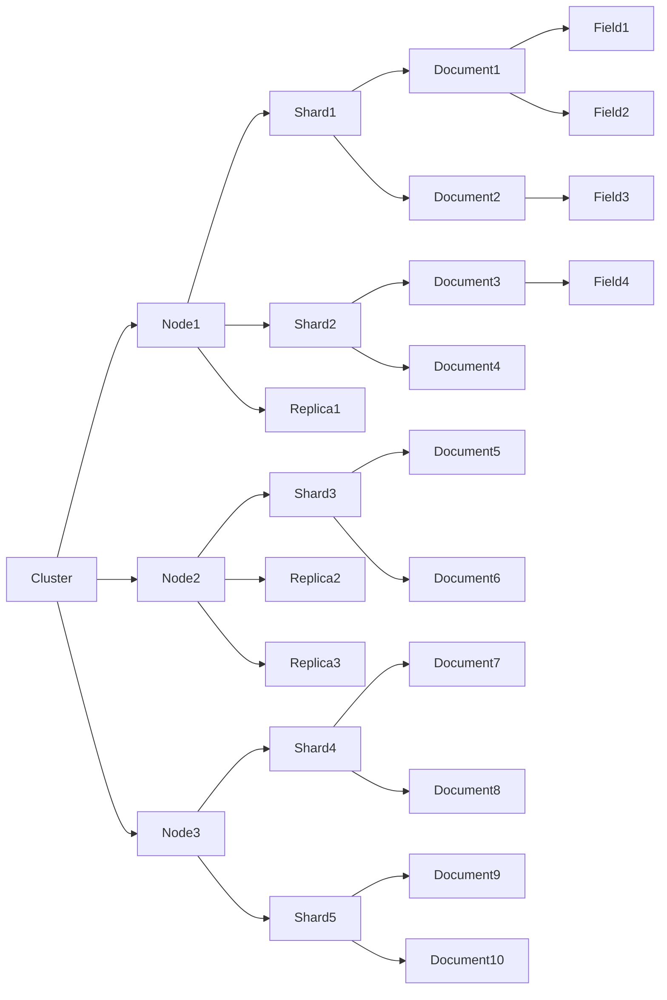
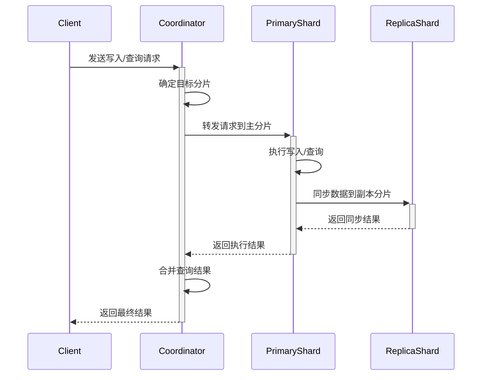

# ElasticSearch分布式搜索引擎原理与代码实例讲解

## 1. 背景介绍
### 1.1 搜索引擎的重要性
在当今大数据时代,海量信息的检索和分析成为了企业和个人的迫切需求。搜索引擎技术正是为了满足这一需求而生,其中ElasticSearch(简称ES)作为一款开源的分布式搜索引擎,以其强大的全文检索和近实时搜索能力,灵活的可扩展性,高可用性等特点,被广泛应用于日志分析、网站搜索、商品推荐等各个领域。

### 1.2 ElasticSearch的发展历程
ElasticSearch最初由Shay Banon开发,于2010年发布第一个版本。随后受到社区的广泛关注和积极贡献,迅速成长为最流行的开源搜索引擎之一。2015年,ElasticSearch公司与ELK Stack(ElasticSearch、Logstash、Kibana)合并,进一步推动了ElasticSearch生态的繁荣发展。

### 1.3 ElasticSearch的应用场景
ElasticSearch凭借其强大的功能,在诸多领域得到广泛应用,主要包括:

- 网站搜索:为网站提供高效的全文检索功能,提升用户体验。
- 日志分析:实时收集和分析各种日志数据,实现系统监控和问题排查。
- 商品搜索和推荐:帮助电商网站实现精准的商品搜索和个性化推荐。
- 数据分析:对海量数据进行多维度分析和可视化展示。
- 安全信息和事件管理:实时监测和分析安全日志,及时发现和响应安全威胁。

## 2. 核心概念与关联
要深入理解ElasticSearch的工作原理,首先需要了解其核心概念:

### 2.1 Index(索引)
Index是ElasticSearch存储数据的基本单位。一个Index由多个Shard(分片)组成,每个Shard都是一个独立的Lucene索引。Index可以理解为关系型数据库中的Database。

### 2.2 Document(文档)
Document是ElasticSearch中的最小数据单元,用JSON格式表示一条记录,包含多个Field(字段)。Document可以类比为关系型数据库中的一行记录。

### 2.3 Field(字段)
Field是组成Document的基本单位,一个Document包含多个Field,每个Field都有其对应的数据类型,如字符串、数值、布尔等。

### 2.4 Mapping(映射)  
Mapping定义了Index中的字段名称、数据类型等Meta信息,类似于关系型数据库中的Schema。ElasticSearch可以根据数据自动推断Mapping,也支持用户自定义Mapping。

### 2.5 Shard(分片)
Shard是ElasticSearch分布式存储的基本单元。Index中的数据被分散存储到多个Shard,每个Shard都是一个独立的Lucene实例,可以存储在集群中的不同节点上,从而实现水平扩展。

### 2.6 Replica(副本)
为了保证数据的高可用性,ElasticSearch允许为每个Shard创建多个Replica。Replica可以在Shard故障时提供数据备份和读取服务,提高了ElasticSearch的容错性和查询性能。

### 2.7 Cluster(集群)
ElasticSearch的Cluster由多个Node(节点)组成,每个Node都可以存储Shard和Replica,并参与数据的索引、查询等操作。Cluster通过选举一个Master Node来负责管理整个集群的状态。

下图展示了ElasticSearch核心概念之间的关系:



## 3. 核心算法原理与具体操作步骤
ElasticSearch的核心是对Lucene的封装和增强。Lucene是一个高性能、可扩展的全文检索库,提供了倒排索引、文本分析、评分排序等功能。ElasticSearch在此基础上,实现了分布式存储、请求路由、数据复制等特性。

### 3.1 倒排索引
倒排索引是实现全文检索的核心数据结构。其基本思想是:对文档内容分词,形成<词项,文档ID>的映射关系。查询时,先对查询语句分词,然后通过倒排索引快速获取包含查询词的文档ID集合,最后根据相关性算分对结果排序。

倒排索引的构建步骤如下:

1. 文本分析:对文档内容进行分词、去停用词、词干提取等处理。
2. 词项字典:将所有词项收集到一个有序字典中。
3. 倒排列表:记录每个词项出现在哪些文档中。
4. 索引优化:对倒排索引进行压缩,提高查询性能。

### 3.2 文本分析
文本分析是将非结构化文本转换为结构化数据的过程,为构建倒排索引做准备。ElasticSearch提供了丰富的分析器(Analyzer),可以对文本进行字符过滤、分词、词干提取等处理。常见的分析器包括:

- Standard Analyzer:默认分析器,对文本进行标准化、分词、小写转换。
- Whitespace Analyzer:按照空白字符对文本分词。 
- Keyword Analyzer:不做分词,将整个文本作为一个词项。
- Language Analyzer:提供多种语言的分词器,如中文分词器、日文分词器等。

用户还可以通过组合Character Filter、Tokenizer、Token Filter来自定义分析器,满足特定领域的文本分析需求。

### 3.3 评分排序
ElasticSearch使用 TF-IDF 算法对文档相关性进行评分,影响因素包括:

- Term Frequency(TF):查询词在文档中出现的频率,频率越高,相关性越大。
- Inverse Document Frequency(IDF):查询词在所有文档中出现的频率,频率越高,相关性越小。
- Field Length Norm:文档字段长度,字段越长,相关性越小。

除了TF-IDF,ElasticSearch还支持自定义相关性评分函数,如BM25、DFR等,可以更好地适应不同的搜索场景。

### 3.4 数据写入与查询流程

#### 3.4.1 数据写入
1. 客户端向 ElasticSearch 集群发送写入请求。
2. 请求到达协调节点,协调节点通过路由算法确定目标分片。
3. 协调节点将请求转发到主分片所在节点。
4. 主分片执行写入操作,并将数据同步到副本分片。
5. 所有副本分片写入成功后,主分片向协调节点返回成功响应。
6. 协调节点向客户端返回写入结果。

#### 3.4.2 数据查询
1. 客户端向 ElasticSearch 集群发送查询请求。
2. 请求到达协调节点,协调节点通过路由算法确定相关分片。
3. 协调节点将查询请求分发到相关分片(主分片或副本分片)。
4. 每个分片本地执行查询,返回结果给协调节点。
5. 协调节点合并各分片的查询结果,并进行全局排序。
6. 协调节点向客户端返回最终查询结果。



## 4. 数学模型和公式详细讲解举例说明
ElasticSearch中的相关性评分是基于概率检索模型和向量空间模型,其核心是TF-IDF权重计算公式。

### 4.1 TF-IDF权重计算
对于查询词 $q$ 和文档 $d$,TF-IDF权重计算公式为:

$$
w_{q,d} = tf_{q,d} \cdot idf_q
$$

其中,$tf_{q,d}$ 表示词频(Term Frequency),衡量查询词 $q$ 在文档 $d$ 中出现的频率:

$$
tf_{q,d} = \sqrt{f_{q,d}}
$$

$f_{q,d}$ 是 $q$ 在 $d$ 中的出现次数,开方处理可以减弱频率过高的影响。

$idf_q$ 表示逆文档频率(Inverse Document Frequency),衡量查询词 $q$ 在整个文档集合中的稀缺程度:

$$
idf_q = 1 + \log \frac{N}{n_q + 1}
$$

$N$ 是文档总数,$n_q$ 是包含 $q$ 的文档数。分母加1可以避免分母为0的情况。

举例说明:假设有1000个文档,其中包含词 "ElasticSearch" 的文档有10个,包含词 "搜索" 的文档有100个,则它们的逆文档频率为:

$idf_{ElasticSearch} = 1 + \log \frac{1000}{10 + 1} \approx 2.00$

$idf_{搜索} = 1 + \log \frac{1000}{100 + 1} \approx 1.00$

可见,"ElasticSearch"在文档集合中的区分度更高。如果某个文档中 "ElasticSearch" 出现2次,"搜索" 出现5次,则它们对文档的TF-IDF权重贡献为:

$w_{ElasticSearch,d} = \sqrt{2} \cdot 2.00 \approx 2.83$

$w_{搜索,d} = \sqrt{5} \cdot 1.00 \approx 2.24$

最终文档的相关性评分为各查询词权重之和,即 $2.83 + 2.24 = 5.07$。

### 4.2 向量空间模型
ElasticSearch使用向量空间模型(Vector Space Model)来表示查询和文档:

- 将所有词项看作向量空间中的一个维度。
- 每个文档和查询都被表示成一个向量。
- 文档向量中每个维度的值就是该词项的TF-IDF权重。
- 查询向量中每个维度的值通常为1(表示词项出现)或0(表示词项未出现)。

在向量空间中,可以通过计算查询向量和文档向量的夹角余弦来衡量它们的相似度:

$$
\cos \theta = \frac{\vec{q} \cdot \vec{d}}{\lVert \vec{q} \rVert \lVert \vec{d} \rVert} = \frac{\sum_{i=1}^n q_i \cdot d_i}{\sqrt{\sum_{i=1}^n q_i^2} \cdot \sqrt{\sum_{i=1}^n d_i^2}}
$$

其中,$\vec{q}$ 和 $\vec{d}$ 分别是查询向量和文档向量,$q_i$ 和 $d_i$ 是它们在第 $i$ 个维度上的值。夹角余弦越大,说明查询和文档的方向越接近,相关性越高。

## 5. 项目实践:代码实例和详细解释说明
下面通过一个实际的 ElasticSearch 项目来演示其核心功能和使用方法。该项目使用 Python 客户端与 ElasticSearch 进行交互,实现了索引创建、数据写入、全文检索等功能。

### 5.1 环境准备
首先需要安装 ElasticSearch 和 Python 客户端库:

```bash
# 安装 ElasticSearch
wget https://artifacts.elastic.co/downloads/elasticsearch/elasticsearch-7.9.1-linux-x86_64.tar.gz
tar -xzf elasticsearch-7.9.1-linux-x86_64.tar.gz
cd elasticsearch-7.9.1/bin
./elasticsearch

# 安装 Python 客户端
pip install elasticsearch
```

### 5.2 索引创建和映射定义
创建名为 "my_index" 的索引,并定义 Mapping: