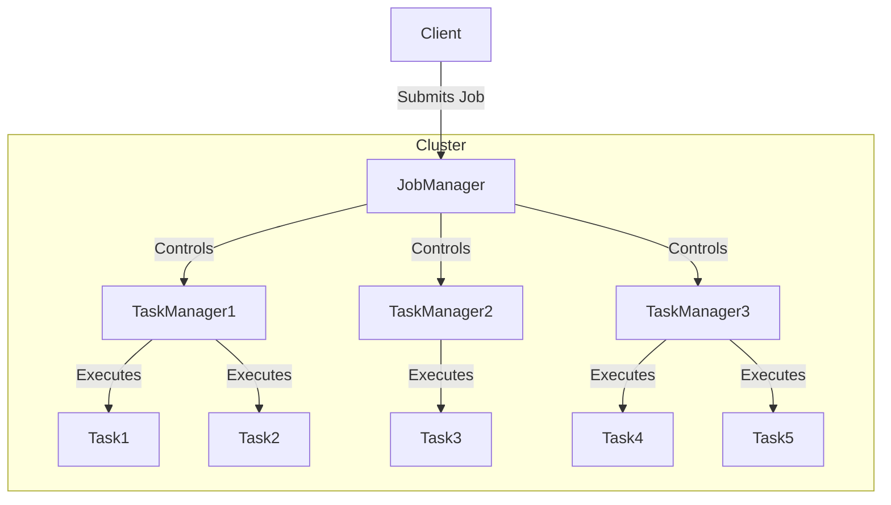

# Flink原理与代码实例讲解

## 1.背景介绍

### 1.1 什么是Flink

Apache Flink是一个开源的分布式流处理框架,用于对无界数据流进行有状态计算。它还支持批处理数据分析,可以在同一个系统中无缝地执行流处理和批处理程序。

Flink的核心是一个流处理引擎,它支持有状态计算、数据分布式缓存、异步快照和准确一次的状态一致性检查点。Flink的流处理引擎可以在数据中心中的多台机器上运行,支持内存计算,也可以将计算过程持久化到磁盘上。

### 1.2 Flink的特点

1. **事件驱动型(Event-driven)**: Flink是一个真正的流执行引擎,它支持事件驱动的应用程序,可以处理持续不断到来的事件流。

2. **有状态计算(Stateful Computation)**: Flink支持有状态计算,这意味着应用程序可以维护状态,并根据有状态信息对流数据进行计算。

3. **分布式和高可用**: Flink可以在集群环境中运行,支持高可用性。如果有任务失败,Flink会自动进行故障转移,重新启动失败的任务。

4. **精确一次的状态一致性(Exactly-once State Consistency)**: Flink提供了精确一次的状态一致性,即使在发生故障时也能够保证每个事件只被处理一次。

5. **低延迟和高吞吐量**: Flink的流处理引擎专为低延迟和高吞吐量而设计。

6. **支持事件时间和处理时间语义**: Flink支持基于事件时间和处理时间的窗口操作。

7. **内存管理**: Flink采用JVM内存管理,可以高效地管理内存。

8. **容错机制**: Flink通过检查点和重新启动机制实现容错,能够从故障中恢复。

### 1.3 Flink的应用场景

Flink可以应用于各种领域,包括但不限于:

- **实时分析**: 实时分析网站访问日志、服务器指标等数据,生成实时报表。
- **实时监控**: 实时监控系统、应用程序或网络的运行状态,及时发现异常情况。
- **实时预测**: 基于机器学习模型对实时数据进行预测,如欺诈检测、推荐系统等。
- **实时报警**: 对实时数据进行复杂事件处理,及时发出报警。
- **实时ETL**: 实时从各种数据源提取、转换和加载数据到数据仓库或湖仓。

## 2.核心概念与联系

### 2.1 Flink架构

Flink采用主从架构,包含以下几个核心组件:

1. **JobManager(主服务进程)**: 控制着整个应用程序的执行,协调分布式执行,调度任务,并发起检查点(checkpoints)和恢复等。
2. **TaskManagers(从服务进程)**: 执行实际的数据处理任务,每个TaskManager都是一个JVM进程,可以执行一个或多个子任务。
3. **Task(子任务)**: 实际执行数据处理代码的工作单元。
4. **Slots(Task Slots)**: TaskManager的并行度,表示TaskManager可以并行执行多少个Task。
5. **JobGraph(作业逻辑图)**: 描述了数据流的转换过程,包括算子(Operator)、数据流(Stream)等。
6. **ExecutionGraph(执行图)**: 根据JobGraph生成的物理执行计划,包含了所有可以并行执行的Task。



### 2.2 数据模型

Flink支持三种数据模型:

1. **DataStream(无界数据流)**: 用于处理持续不断到来的数据流,如事件日志、传感器数据等。
2. **DataSet(有界数据集)**: 用于处理有界的数据集,如文件或关系型数据库中的数据。
3. **Table(关系表)**: 基于流或批处理数据构建的逻辑表,支持类SQL查询。

### 2.3 时间语义

Flink支持三种时间语义:

1. **EventTime(事件时间)**: 根据事件在源头发生的时间进行处理。
2. **IngestionTime(摄入时间)**: 根据事件进入Flink的时间进行处理。
3. **ProcessingTime(处理时间)**: 根据操作算子处理事件的机器时间进行处理。

### 2.4 状态管理

Flink支持有状态计算,可以维护各种状态:

1. **Keyed State(键控状态)**: 根据键(key)对状态进行分区,每个键对应一个状态实例。
2. **Operator State(算子状态)**: 每个并行算子实例的状态,不受键控制。
3. **Raw Bytes(原始字节)**: 将状态以字节序列化方式存储在StateBackend中。

### 2.5 容错机制

Flink通过检查点(Checkpoint)和状态恢复机制实现容错:

1. **Barrier(栅栏)**: 标记流中数据的一致性切片。
2. **Checkpoint(检查点)**: 定期对算子状态进行持久化存储的一致性快照。
3. **StateBackend(状态后端)**: 存储检查点状态的持久化组件。

## 3.核心算法原理具体操作步骤

### 3.1 数据流转换

Flink提供了丰富的转换算子,用于转换DataStream和DataSet:

1. **Map**: 对每个元素执行指定的函数。
2. **FlatMap**: 对每个元素执行指定的函数,并将生成的所有元素放入结果流中。
3. **Filter**: 过滤掉不符合条件的元素。
4. **KeyBy**: 根据指定的键对数据流进行分区。
5. **Reduce**: 对相同键的数据流进行规约操作。
6. **Window**: 对数据流进行窗口操作,如滚动窗口、滑动窗口等。
7. **Union**: 合并两个或多个数据流。
8. **Connect/CoMap/CoFlatMap**: 连接两个数据流,并对它们进行操作。
9. **Split/Select**: 根据条件将一个数据流分割成多个流。

### 3.2 窗口操作

Flink支持多种窗口模型,用于对数据流进行分组和聚合操作:

1. **Tumbling Windows(滚动窗口)**: 窗口之间没有重叠,每个事件只属于一个窗口。
2. **Sliding Windows(滑动窗口)**: 窗口之间可以有重叠,一个事件可能属于多个窗口。
3. **Session Windows(会话窗口)**: 根据事件之间的活动模式动态划分窗口。
4. **Global Windows(全局窗口)**: 将所有事件归为一个窗口。

窗口操作可以与各种函数一起使用,如sum、min、max、reduce等。

### 3.3 状态管理

Flink的有状态计算依赖于状态管理机制:

1. **Keyed State(键控状态)**: 每个键对应一个状态实例,常用于实现有状态的转换操作。
2. **Operator State(算子状态)**: 每个并行算子实例维护一个状态实例,常用于实现有状态的源或汇。
3. **Raw Bytes(原始字节)**: 将状态以字节序列化方式存储在StateBackend中。

### 3.4 容错机制

Flink通过检查点和状态恢复机制实现容错:

1. **Barrier(栅栏)**: 标记流中数据的一致性切片。
2. **Snapshot(快照)**: 对算子状态进行持久化存储的一致性快照。
3. **StateBackend(状态后端)**: 存储检查点状态的持久化组件,如JobManager内存、文件系统等。
4. **Savepoint(保存点)**: 手动触发的一致性检查点,可用于停止作业、更新作业等。

## 4.数学模型和公式详细讲解举例说明

### 4.1 窗口模型

Flink支持多种窗口模型,每种模型都有自己的数学定义和计算公式。

#### 4.1.1 滚动窗口(Tumbling Window)

滚动窗口将数据流划分为一个个不重叠的窗口,每个事件只属于一个窗口。

给定窗口大小为$w$,数据流中的事件时间戳为$t_i$,则第$k$个窗口的范围为:

$$
\text{Window}_k = [k \cdot w, (k+1) \cdot w)
$$

每个事件$e_i$属于窗口$k$的条件为:

$$
k = \lfloor \frac{t_i}{w} \rfloor
$$

其中$\lfloor x \rfloor$表示向下取整。

#### 4.1.2 滑动窗口(Sliding Window)

滑动窗口允许窗口之间有重叠,一个事件可能属于多个窗口。

给定窗口大小为$w$,滑动步长为$s$,数据流中的事件时间戳为$t_i$,则第$k$个窗口的范围为:

$$
\text{Window}_k = [k \cdot s, k \cdot s + w)
$$

每个事件$e_i$属于窗口$k$的条件为:

$$
k_\text{start} \leq \lfloor \frac{t_i}{s} \rfloor < k_\text{end}
$$

其中$k_\text{start} = \lfloor \frac{t_i - w}{s} \rfloor + 1$, $k_\text{end} = \lfloor \frac{t_i}{s} \rfloor + 1$。

#### 4.1.3 会话窗口(Session Window)

会话窗口根据事件之间的活动模式动态划分窗口,如果两个事件之间的时间间隔超过了会话间隙,则它们属于不同的会话窗口。

给定会话间隙为$g$,数据流中的事件时间戳为$t_i$,则第$k$个会话窗口的范围为:

$$
\text{Window}_k = [t_\text{start}, t_\text{end})
$$

其中$t_\text{start}$是该会话的第一个事件的时间戳,$t_\text{end}$是最后一个事件的时间戳加上会话间隙$g$。

每个事件$e_i$属于窗口$k$的条件为:

$$
t_\text{start} \leq t_i < t_\text{end}
$$

### 4.2 触发器(Trigger)

Flink还支持自定义触发器(Trigger),用于控制窗口的生命周期。触发器可以基于各种条件来决定何时收集窗口结果、何时清除窗口等。

自定义触发器需要实现`Trigger`接口,并重写以下方法:

- `onElement(...)`: 处理新到达的元素。
- `onEventTime(...)`: 处理窗口的事件时间戳。
- `onProcessingTime(...)`: 处理窗口的处理时间戳。
- `clear(...)`: 清除窗口的状态。

触发器可以与各种窗口模型结合使用,实现更加灵活的窗口处理逻辑。

## 5.项目实践:代码实例和详细解释说明

### 5.1 WordCount示例

WordCount是一个经典的示例程序,用于统计文本中每个单词出现的次数。以下是使用Flink DataStream API实现WordCount的代码:

```java
// 创建执行环境
StreamExecutionEnvironment env = StreamExecutionEnvironment.getExecutionEnvironment();

// 从socket文本流获取输入数据
DataStream<String> text = env.socketTextStream("localhost", 9999);

// 分割单词
DataStream<Tuple2<String, Integer>> wordCounts = text
    .flatMap(new FlatMapFunction<String, Tuple2<String, Integer>>() {
        @Override
        public void flatMap(String value, Collector<Tuple2<String, Integer>> out) {
            String[] words = value.split(" ");
            for (String word : words) {
                out.collect(new Tuple2<>(word, 1));
            }
        }
    })
    // 按单词分组
    .keyBy(0)
    // 统计每个单词出现的次数
    .sum(1);

// 打印结果
wordCounts.print();

// 执行程序
env.execute("Word Count Example");
```

代码解释:

1. 创建`StreamExecutionEnvironment`执行环境。
2. 使用`socketTextStream`从socket文本流获取输入数据。
3. 使用`flatMap`将每行文本