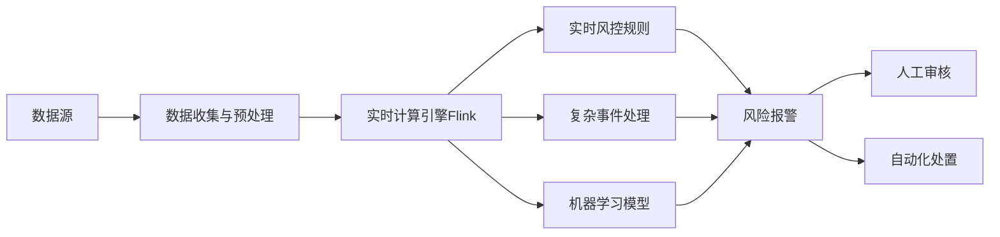

# Flink应用实战:金融风控与实时交易监控

## 1. 背景介绍

### 1.1 金融风控与实时交易监控的重要性
在当今高度数字化和自动化的金融市场中,实时风险控制和交易监控至关重要。金融机构需要及时发现和应对各种风险,如欺诈、洗钱、内幕交易等,以保护客户资产和维护金融市场的稳定。同时,实时监控交易行为也有助于优化交易策略、提高交易效率。

### 1.2 传统方案的局限性
传统的风控和监控系统通常采用批处理方式,存在时效性差、灵活性低等问题。它们难以满足当前金融业务对实时性、准确性和可扩展性的高要求。

### 1.3 Flink的优势
Apache Flink是一个高性能、分布式的流处理框架,具有低延迟、高吞吐、精确一次语义和良好的容错性等特点。基于Flink构建实时风控和交易监控系统,可以有效克服传统方案的不足,实现对海量交易数据的实时处理和分析。

## 2. 核心概念与联系

### 2.1 Flink架构与核心概念
#### 2.1.1 Flink运行时架构
- JobManager
- TaskManager
- Dispatcher
- ResourceManager

#### 2.1.2 数据流图(Dataflow Graph)
- Source
- Transformation
- Sink

#### 2.1.3 时间语义
- ProcessingTime
- EventTime
- IngestionTime

#### 2.1.4 状态管理
- KeyedState
- OperatorState

#### 2.1.5 容错机制
- CheckPoint
- StateBackend
- SavePoint

### 2.2 金融风控与交易监控中的关键指标
- 交易量与交易额
- 用户行为模式
- 资金流向
- 异常交易检测
- 风险评估与预警

### 2.3 Flink在金融风控与交易监控中的应用
Flink凭借其实时性、准确性和可扩展性,在金融风控和交易监控领域得到广泛应用。通过Flink可以实现:
- 实时欺诈检测
- 反洗钱
- 异常交易行为分析
- 实时风险计量
- 交易策略优化

下图展示了Flink在金融风控与交易监控中的典型应用架构:



## 3. 核心算法原理与具体操作步骤

### 3.1 数据准备与预处理
#### 3.1.1 数据接入
- 交易数据
- 用户行为数据
- 第三方数据

#### 3.1.2 数据清洗与转换
- 过滤无效数据
- 数据格式转换
- 数据脱敏

#### 3.1.3 数据分流与合并
- 将数据流按业务需求拆分
- 多源数据流的关联与聚合

### 3.2 实时特征工程
#### 3.2.1 特征提取
- 交易特征
- 用户特征
- 环境特征

#### 3.2.2 特征选择
- 特征重要性评估
- 特征筛选

#### 3.2.3 特征实时更新
- 滑动窗口
- 增量计算

### 3.3 复杂事件处理(CEP)
#### 3.3.1 模式定义
- 单个事件模式
- 组合事件模式
- 模式序列

#### 3.3.2 模式检测
- NFARunner
- SharedBuffer

#### 3.3.3 匹配事件处理
- 超时处理
- 模式输出

### 3.4 风险评估模型
#### 3.4.1 规则引擎
- 风险规则定义
- 规则匹配
- 规则更新

#### 3.4.2 统计学模型
- 异常检测
- 聚类分析

#### 3.4.3 机器学习模型
- 分类模型
- 预测模型

## 4. 数学模型与公式详解

### 4.1 移动平均(Moving Average)
移动平均是一种常用的时间序列分析方法,用于平滑短期波动,反映数据的长期趋势。在金融风控中,移动平均可用于计算交易量、价格等指标的趋势。

简单移动平均(SMA)公式:

$$SMA_t = \frac{1}{n} \sum_{i=0}^{n-1} p_{t-i}$$

其中,$p_t$表示第$t$期的价格,$n$为移动平均的时间窗口大小。

### 4.2 异常检测(Anomaly Detection)
异常检测旨在识别数据中偏离正常模式的个体。在金融风控中,异常检测可用于发现欺诈、洗钱等异常交易行为。

假设数据服从高斯分布,则异常分数(Anomaly Score)可定义为:

$$S(x) = \frac{(x-\mu)^2}{\sigma^2}$$

其中,$\mu$和$\sigma$分别为数据的均值和标准差。异常分数越高,表示该数据点越有可能是异常值。

### 4.3 序列模式挖掘(Sequential Pattern Mining)
序列模式挖掘用于发现数据序列中频繁出现的子序列。在金融风控中,序列模式挖掘可用于识别典型的交易行为模式。

给定一个事件序列数据库$S$,支持度(Support)定义为:

$$Sup(s) = \frac{|{S_i|s \subseteq S_i,S_i \in S}|}{|S|}$$

其中,$s$为候选序列,$S_i$为数据库中的序列。支持度反映了候选序列在数据库中出现的频率。

## 5. 项目实践:代码实例与详细解释

下面通过一个简单的Flink代码示例,演示如何实现交易数据的实时异常检测。

```java
// 定义交易数据的POJO类
public class Transaction {
    private String userId;
    private double amount;
    private long timestamp;
    // 构造函数、getter和setter方法
}

// 定义异常交易检测的规则
public class AnomalyDetector extends RichFlatMapFunction<Transaction, Alert> {
    private transient ValueState<Double> avgAmountState;
    private transient ValueState<Double> stdDevState;

    @Override
    public void open(Configuration parameters) {
        ValueStateDescriptor<Double> avgDescriptor = new ValueStateDescriptor<>("avg", Types.DOUBLE);
        ValueStateDescriptor<Double> stdDevDescriptor = new ValueStateDescriptor<>("std-dev", Types.DOUBLE);
        avgAmountState = getRuntimeContext().getState(avgDescriptor);
        stdDevState = getRuntimeContext().getState(stdDevDescriptor);
    }

    @Override
    public void flatMap(Transaction transaction, Collector<Alert> out) throws Exception {
        Double avgAmount = avgAmountState.value();
        Double stdDev = stdDevState.value();
        if (avgAmount == null || stdDev == null) {
            return;
        }
        double anomalyScore = Math.abs(transaction.getAmount() - avgAmount) / stdDev;
        if (anomalyScore > 3.0) { // 异常阈值设为3
            out.collect(new Alert(transaction.getUserId(), transaction.getAmount(), transaction.getTimestamp()));
        }
    }
}

// 定义Flink作业流程
DataStream<Transaction> transactions = ...;
DataStream<Alert> alerts = transactions
    .keyBy(Transaction::getUserId)
    .flatMap(new AnomalyDetector());

alerts.print(); // 输出检测到的异常交易
```

以上代码的主要步骤如下:

1. 定义`Transaction`类表示交易数据,包含用户ID、交易金额和时间戳等字段。

2. 定义`AnomalyDetector`类,继承自`RichFlatMapFunction`,用于实现异常交易检测逻辑。

3. 在`open()`方法中,初始化状态变量`avgAmountState`和`stdDevState`,分别用于存储每个用户的历史交易金额均值和标准差。

4. 在`flatMap()`方法中,对每个到来的交易事件,计算其异常分数,即偏离历史均值的程度。如果异常分数超过预定阈值(此处设为3),则输出异常警报。

5. 在主程序中,将交易数据流按用户ID分组,然后应用`AnomalyDetector`进行异常检测,最后输出检测结果。

该示例代码展示了如何使用Flink的状态管理和富函数API,实现基于统计学原理的实时异常检测。在实际应用中,可以进一步优化异常检测算法,并结合其他风控规则和模型,构建完整的风控系统。

## 6. 实际应用场景

Flink在金融领域的实际应用场景非常广泛,下面列举几个典型案例:

### 6.1 实时反欺诈
某大型银行使用Flink搭建了实时反欺诈平台。该平台能够在毫秒级延迟内检测出可疑交易,并及时阻断欺诈行为,大幅降低了银行的损失。

### 6.2 实时资金监控
某证券公司基于Flink实现了实时资金监控系统。该系统可以实时跟踪客户资金流向,识别异常资金转移行为,有效防范了内幕交易和市场操纵等违规行为。

### 6.3 实时交易分析
某金融科技公司利用Flink进行实时交易分析。通过对海量交易数据的实时处理和机器学习建模,该系统可以准确预测市场趋势,优化交易策略,显著提升了交易收益。

### 6.4 实时合规监控
某跨国银行使用Flink搭建了全球合规监控平台。该平台可以实时检测各地分支机构的合规风险,确保业务运营符合各地监管要求,有效防范合规风险。

## 7. 工具与资源推荐

### 7.1 Flink官方文档
Flink官方网站提供了全面的文档资源,包括快速入门指南、编程指南、API参考等。通过学习官方文档,可以系统掌握Flink的架构原理和使用方法。

链接: https://flink.apache.org/

### 7.2 Flink中文社区
Flink中文社区是国内Flink技术爱好者交流和分享的平台。社区提供了丰富的中文博客、教程和实践案例,对于初学者快速上手Flink非常有帮助。

链接: https://flink-learning.org.cn/

### 7.3 Ververica Platform
Ververica Platform是基于Flink构建的企业级流处理平台,提供了Flink应用的开发、部署和运维等全流程管理功能。使用Ververica Platform可以大幅简化Flink应用的实施过程。

链接: https://www.ververica.com/

### 7.4 Flink Forward大会
Flink Forward是Flink社区的年度盛会,汇聚了全球的Flink专家和实践者。通过参与大会,可以了解Flink技术的最新发展动向,学习实际应用经验。

链接: https://flink-forward.org/

## 8. 总结:未来发展趋势与挑战

Flink在金融风控与实时交易监控中展现了巨大的应用价值。未来,随着金融业务的数字化转型不断深入,Flink有望在更广泛的场景中发挥重要作用。

### 8.1 与AI技术的深度融合
Flink与机器学习、深度学习等AI技术的结合将成为大势所趋。通过Flink实时提取特征,并实时更新AI模型,可以实现风控和监控策略的自动优化和动态进化。

### 8.2 端到端的流处理应用
Flink将与其他流处理组件如Kafka、Pulsar等进一步集成,构建端到端的实时流处理应用。这种统一的架构可以显著降低系统复杂度,提高处理性能。

### 8.3 云原生部署与自动扩缩容
Flink将更好地支持云原生部署模式,实现按需使用和自动扩缩容。这将大幅提升系统的灵活性和成本效益,助力金融机构更敏捷地响应市场变化。

### 8.4 挑战与展望
- 流处理应用的标准化和最佳实践有待进一步成熟。
- 流处理系统的性能和可靠性仍需不断优化。
- 专业人才的培养和团队建设是推动技术落地的关键。
- 与传统架构和业务流程的融合需要长期努力。

金融风控与交易监控对Flink提出了极高的要求,但也为F