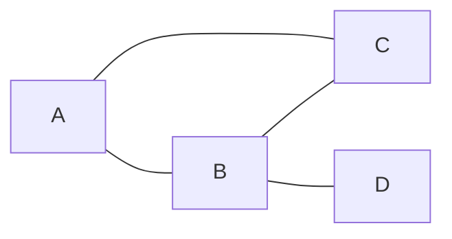
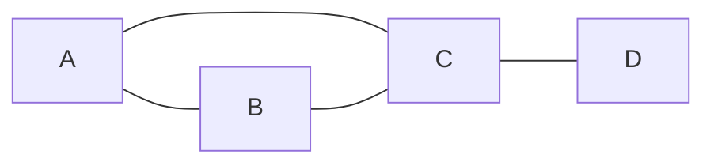
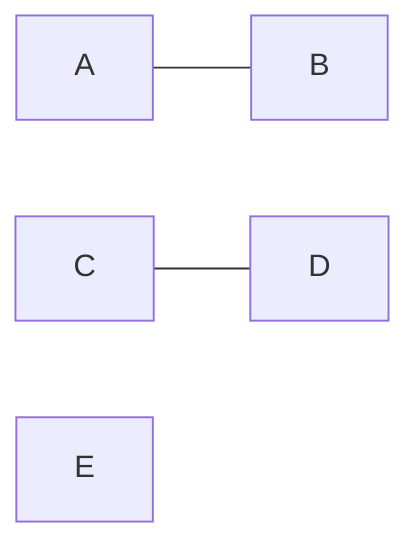
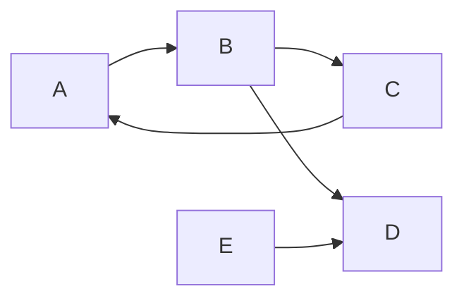

# Graph Edge原理与代码实例讲解

## 1.背景介绍
### 1.1 图论与图计算
图论是数学的一个分支,研究图这种数据结构的性质。图由顶点(Vertex)和边(Edge)组成,可以用来表示事物之间的关系网络。图计算是利用图论的理论知识,对图数据进行建模、分析、挖掘的过程。随着大数据时代的到来,图计算在社交网络、推荐系统、知识图谱等领域得到了广泛应用。

### 1.2 图数据库
传统的关系型数据库如MySQL在处理高度关联的数据时,查询效率较低。图数据库是专门为存储和查询图结构数据而设计的数据库系统,代表有Neo4j、JanusGraph等。相比关系型数据库,图数据库在处理复杂关联查询时具有天然优势。

### 1.3 图计算框架 
为了支持大规模图数据的高效计算,诞生了一系列分布式图计算框架,如Pregel、GraphLab、PowerGraph等。这些框架提供了方便的编程模型和并行计算能力,使得在海量图上进行复杂计算成为可能。其中Pregel是Google提出的BSP(Bulk Synchronous Parallel)模型在图计算领域的应用,成为了后续众多图计算框架的理论基础。

## 2.核心概念与联系
### 2.1 顶点(Vertex)
在图论中,顶点表示事物,是组成图的基本单元。例如在社交网络中,每个用户就是一个顶点。顶点通常由唯一ID标识,并附加一些属性信息,称为顶点属性。

### 2.2 边(Edge)
边表示顶点之间的关系,连接两个顶点。边可以是有向的,称为有向边;也可以是无向的,称为无向边。和顶点一样,边也可以携带属性信息,称为边属性。边是图的关键组成部分,图的很多重要性质,如连通性、路径等,都和边密切相关。

### 2.3 子图(Subgraph)
子图是原图的一部分,由原图的部分顶点和边组成。研究子图的性质对于分析整个图的结构具有重要意义。例如社区发现就是找到图中的一些紧密相连的子图。

### 2.4 路径(Path)和最短路径
路径是由一系列顶点和边首尾连接形成的序列,表示顶点之间的一条通路。路径上经过的边数称为路径长度。最短路径是指在所有连接两个顶点的路径中,长度最小的路径。最短路径在图分析、网络优化等问题中有重要应用。

### 2.5 连通图和强连通图
如果图中任意两个顶点之间都存在一条路径,则称该图为连通图。对于有向图,如果任意两个顶点之间都存在双向路径,则称为强连通图。连通性是图的一个重要性质,在图的遍历、划分等操作中需要考虑。

## 3.核心算法原理具体操作步骤
### 3.1 图的表示
#### 3.1.1 邻接矩阵
邻接矩阵使用二维数组表示图。设图有n个顶点,则邻接矩阵是一个n*n的方阵。当顶点i和j之间有边相连时,矩阵第i行第j列的元素值为1,否则为0。对于带权图,可以用边的权值代替1。邻接矩阵的优点是简单直观,缺点是不管图的边多少,空间复杂度都是O(n^2)。

#### 3.1.2 邻接表
邻接表是图的一种链式存储结构。每个顶点建立一个单链表,用来存储该顶点的所有邻接点。在有向图中,邻接表可以存储以该顶点为起点的出边,称为出边表;也可以存储以该顶点为终点的入边,称为入边表。相比邻接矩阵,邻接表更加节省空间,空间复杂度为O(V+E)。但是使用邻接表进行顶点查找时需要遍历链表,时间复杂度为O(n)。

### 3.2 图的遍历
#### 3.2.1 广度优先遍历(BFS)
广度优先遍历类似于树的层次遍历,先访问起始顶点,然后依次访问起始顶点的所有未被访问过的邻接点,再访问这些邻接点的所有未被访问过的邻接点,以此类推,直到所有顶点都被访问到。BFS通常借助队列实现:
1. 选择一个顶点作为起始点,将其加入队列;
2. 从队列中取出一个顶点,访问它,并将其所有未被访问过的邻接点加入队列;
3. 重复第2步,直到队列为空。

BFS可以用来求解最短路径问题。在BFS过程中,每个顶点到起始点的路径长度恰好是最短路径长度。

#### 3.2.2 深度优先遍历(DFS)
深度优先遍历类似于树的先序遍历,从起始顶点出发,沿着一条路径向前探索,直到无法继续为止,然后回溯到最近的岔路口,再从另一条路径向前探索,直到所有顶点都被访问到。DFS通常使用递归或栈实现:
1. 选择一个顶点作为起始点,将其标记为已访问;
2. 选择起始点的一个未被访问过的邻接点,递归地进行DFS;
3. 如果所有邻接点都已被访问,则回溯到前一个顶点;
4. 重复2-3步,直到所有顶点都被访问到。

DFS可以用来求解连通性问题,在DFS过程中,同一个连通分量的顶点会被先后访问到。DFS还可以用来求解环检测、拓扑排序等问题。

### 3.3 最小生成树算法
最小生成树是加权连通无向图的一棵权值最小的生成树。求最小生成树的经典算法有Prim算法和Kruskal算法。

#### 3.3.1 Prim算法
Prim算法基于贪心思想,每次选择一条连接树内顶点和树外顶点的权值最小的边,将树外顶点加入生成树,直到所有顶点都被加入。具体步骤如下:
1. 选择一个顶点作为初始顶点,加入生成树;
2. 从连接树内顶点和树外顶点的边中选取权值最小的边,将边的另一端顶点加入生成树;
3. 重复第2步,直到所有顶点都被加入生成树。

#### 3.3.2 Kruskal算法
Kruskal算法按照边的权值从小到大的顺序选取边,如果边的两个端点在不同的连通分量中,则将这条边加入生成树,合并两个连通分量。具体步骤如下:
1. 将图的所有边按照权值从小到大排序;
2. 从权值最小的边开始,如果边的两个端点在不同的连通分量中,则将该边加入生成树,合并两个连通分量;
3. 重复第2步,直到所有顶点都在同一个连通分量中。

### 3.4 最短路径算法
最短路径是指在加权图中,两个顶点之间权值和最小的路径。常见的最短路径算法有Dijkstra算法和Floyd算法。

#### 3.4.1 Dijkstra算法
Dijkstra算法基于贪心思想,用于求单源最短路径。每次选择距离起点最近的未访问顶点,更新其邻接点的距离,直到所有顶点都被访问到。具体步骤如下:
1. 初始化起点的距离为0,其他顶点的距离为无穷大;
2. 选择距离最小的未访问顶点u,将其标记为已访问;
3. 更新u的所有邻接点v的距离,如果dist[u]+w(u,v)<dist[v],则更新dist[v]=dist[u]+w(u,v);
4. 重复2-3步,直到所有顶点都被访问到。

#### 3.4.2 Floyd算法
Floyd算法用于求所有顶点对之间的最短路径,基于动态规划思想。Floyd算法的核心是状态转移方程:
$$
dist[i][j]=min(dist[i][j],dist[i][k]+dist[k][j])
$$
其中,dist[i][j]表示顶点i到顶点j的最短路径长度。这个方程的含义是,如果经过中间顶点k可以使i到j的距离变短,则更新dist[i][j]。Floyd算法的时间复杂度为O(n^3)。

## 4.数学模型和公式详细讲解举例说明
### 4.1 图的数学定义
图G由顶点集V和边集E组成,记为G=(V,E)。对于无向图,边是顶点的无序对,即(u,v)和(v,u)表示同一条边;对于有向图,边是顶点的有序对,即(u,v)表示从u指向v的边。如果图的边带有权值,则称为加权图,边(u,v)的权值记为w(u,v)。

### 4.2 度的概念
在无向图中,顶点v的度deg(v)表示与v相连的边数。在有向图中,以v为起点的边数称为v的出度odeg(v),以v为终点的边数称为v的入度ideg(v),两者之和为v的度deg(v)=odeg(v)+ideg(v)。

例如,对于下面这个无向图:



顶点A的度为2,B的度为3,C的度为2,D的度为1。

### 4.3 点独立集和边独立集
点独立集是图中的一个顶点子集,子集中任意两个顶点之间都没有边相连。边独立集是图中的一个边子集,子集中任意两条边都没有公共顶点。求最大点独立集和最大边独立集是NP难问题。

例如,对于下面这个无向图:



{A,D}是一个点独立集,{(A,B),(C,D)}是一个边独立集。

### 4.4 连通分量
无向图的极大连通子图称为连通分量。通过DFS或BFS可以找出图的所有连通分量。

例如,对于下面这个无向图:



图中有3个连通分量:{A,B}、{C,D}和{E}。

### 4.5 强连通分量
有向图的极大强连通子图称为强连通分量。Kosaraju算法和Tarjan算法都可以求出有向图的所有强连通分量。

例如,对于下面这个有向图:



图中有2个强连通分量:{A,B,C}和{D,E}。

## 5.项目实践：代码实例和详细解释说明
下面以C++为例,给出图的基本操作的代码实现。

### 5.1 图的表示
```cpp
// 邻接矩阵表示法
class Graph {
private:
    int n; // 顶点数
    int **adj; // 邻接矩阵
public:
    Graph(int n) {
        this->n = n;
        adj = new int*[n];
        for (int i = 0; i < n; i++) {
            adj[i] = new int[n];
            for (int j = 0; j < n; j++) {
                adj[i][j] = 0;
            }
        }
    }
    ~Graph() {
        for (int i = 0; i < n; i++) {
            delete[] adj[i];
        }
        delete[] adj;
    }
    void addEdge(int u, int v) {
        adj[u][v] = 1;
        adj[v][u] = 1;
    }
};

// 邻接表表示法
class Graph {
private:
    int n; // 顶点数
    vector<int> *adj; // 邻接表
public:
    Graph(int n) {
        this->n = n;
        adj = new vector<int>[n];
    }
    ~Graph() {
        delete[] adj;
    }
    void addEdge(int u, int v) {
        adj[u].push_back(v);
        adj[v].push_back(u);
    }
};
```

### 5.2 图的遍历
```cpp
// DFS
vector<bool> visited;
void dfs(int u) {
    visited[u] = true;
    for (int v : adj[u]) {
        if (!visited[v]) {
            dfs(v);
        }
    }
}

// BFS
vector<bool> visited;
void bfs(int s) {
    queue<int> q;
    