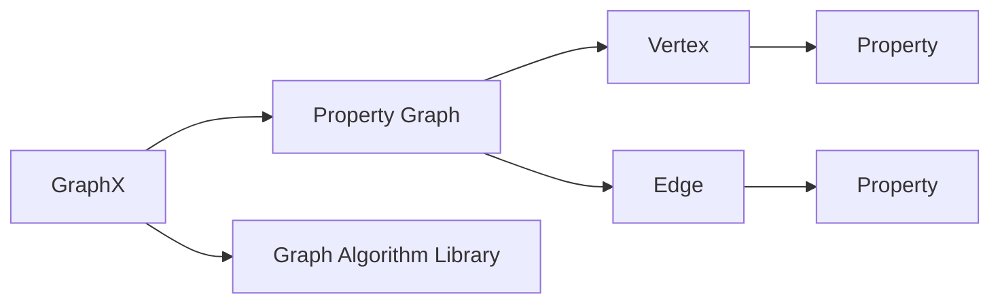

## 1.背景介绍

在大数据时代，图形处理已经成为了一个重要的研究领域。Apache Spark的GraphX是一种分布式图处理框架，它结合了数据并行和图并行的优点，能够高效地处理大规模图数据。本文将深入探讨GraphX的原理，并通过代码实例进行详细讲解。

## 2.核心概念与联系

### 2.1 图的基本概念

图是由节点（Vertex）和边（Edge）组成的结构，可以用来表示实体之间的关系。例如，社交网络可以被看作是一个图，其中的节点代表用户，边代表用户之间的友谊关系。

### 2.2 GraphX的核心概念

GraphX是Spark的一个扩展，用于图形计算。它提供了一种新的图抽象，即属性图（Property Graph），它将属性（Property）附加到图的节点和边上。此外，GraphX还提供了一套强大的图算法库，包括PageRank、连通组件等。



## 3.核心算法原理具体操作步骤

### 3.1 创建图

在GraphX中，图是通过`Graph`类来表示的。我们可以通过两个RDD（Resilient Distributed Datasets）来创建一个图，一个RDD用来表示节点，一个RDD用来表示边。

### 3.2 图的转换

GraphX提供了一系列的图转换操作，包括`mapVertices`、`mapEdges`和`mapTriplets`。这些操作可以用来对图的节点和边进行转换。

### 3.3 图的结构操作

GraphX还提供了一系列的图结构操作，包括`reverse`、`subgraph`和`mask`。这些操作可以用来改变图的结构。

### 3.4 图的聚合操作

GraphX提供了`aggregateMessages`操作，可以用来进行图的聚合操作。这个操作可以用来从图的边上收集信息，并将这些信息聚合到节点上。

## 4.数学模型和公式详细讲解举例说明

在GraphX中，图的节点和边都可以有属性。这可以用以下的数学模型来表示：

- 节点：$v_i = (vid_i, attr_i)$，其中$vid_i$是节点的ID，$attr_i$是节点的属性。
- 边：$e_i = (src_i, dst_i, attr_i)$，其中$src_i$是边的源节点ID，$dst_i$是边的目标节点ID，$attr_i$是边的属性。

在图的转换操作中，我们可以对节点和边的属性进行转换。例如，我们可以通过`mapVertices`操作将每个节点的属性加1：

```scala
val g2 = g.mapVertices((id, attr) => attr + 1)
```

在这个操作中，我们使用了一个函数$(id, attr) \to attr + 1$来对节点的属性进行转换。

## 5.项目实践：代码实例和详细解释说明

下面我们通过一个代码实例来说明如何在GraphX中创建和操作图。

首先，我们需要创建两个RDD来表示图的节点和边：

```scala
val vertexRDD: RDD[(Long, (String, Int))] = sc.parallelize(Array(
  (1L, ("Alice", 28)),
  (2L, ("Bob", 27)),
  (3L, ("Charlie", 22)),
  (4L, ("David", 29)),
  (5L, ("Ed", 16)),
  (6L, ("Fran", 35))
))

val edgeRDD: RDD[Edge[Int]] = sc.parallelize(Array(
  Edge(2L, 1L, 7),
  Edge(2L, 4L, 2),
  Edge(3L, 2L, 4),
  Edge(3L, 6L, 3),
  Edge(4L, 1L, 1),
  Edge(5L, 2L, 2),
  Edge(5L, 3L, 8),
  Edge(5L, 6L, 3)
))
```

然后，我们可以使用这两个RDD来创建一个图：

```scala
val graph: Graph[(String, Int), Int] = Graph(vertexRDD, edgeRDD)
```

接下来，我们可以对图进行一系列的操作。例如，我们可以使用`mapVertices`操作将每个节点的年龄加1：

```scala
val g2 = graph.mapVertices((id, attr) => (attr._1, attr._2 + 1))
```

最后，我们可以使用`triplets`操作来查看图的节点和边：

```scala
for (triplet <- g2.triplets.collect) {
  println(s"${triplet.srcAttr._1} likes ${triplet.dst