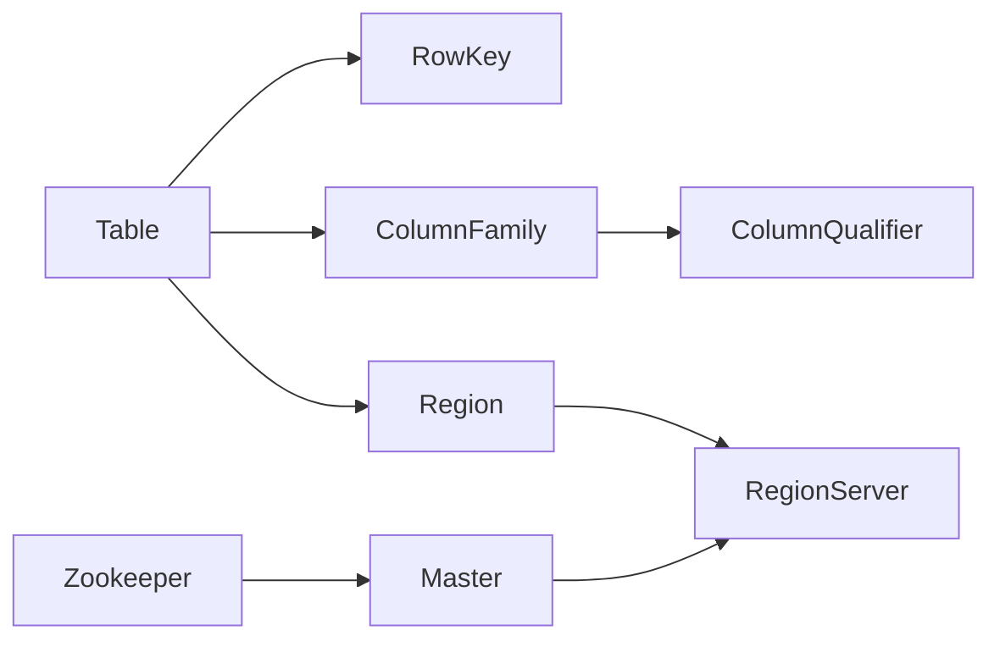

# HBase原理与代码实例讲解

## 1. 背景介绍

### 1.1 大数据处理的挑战

在当今大数据时代,海量数据的存储和处理已成为企业面临的重大挑战。传统的关系型数据库难以应对TB、PB级别的海量数据,无法满足高并发、高吞吐量的读写需求。为了解决这一难题,Apache HBase应运而生。

### 1.2 HBase的诞生

HBase是一个开源的、分布式的、多版本的、列式存储的NoSQL数据库。它构建于HDFS之上,为大数据场景下的随机、实时读写访问提供了支持。HBase的设计参考了Google的BigTable论文,旨在提供高可靠性、高性能、面向列的、可伸缩的分布式存储系统。

### 1.3 HBase的应用场景

HBase广泛应用于需要大规模数据存储和高并发访问的领域,如社交网络、电商推荐、金融风控、物联网等。它非常适合存储非结构化和半结构化的松散数据,支持动态增加数据列,并提供了高效的数据压缩和快速检索功能。

## 2. 核心概念与联系

### 2.1 RowKey、Column Family和Column Qualifier

- RowKey:类似于RDBMS中的主键,用于唯一标识一行数据。
- Column Family:列族,HBase中数据按列族组织存储,每个列族可包含多个列。列族需预先定义。
- Column Qualifier:列标识符,列族下的具体列,可动态增加。

### 2.2 Region和Region Server 

- Region:HBase自动把表水平切分成多个区域(Region),每个Region由一个Region Server管理。
- Region Server:负责管理和服务分配给它的Region。

### 2.3 Master和Zookeeper

- Master:管理整个HBase集群的状态,负责Region的分配、DDL操作等。
- Zookeeper:分布式协调服务,存储HBase的元数据信息,实现Master高可用。

以下是HBase核心概念之间的关系图:



## 3. 核心算法原理具体操作步骤

### 3.1 读请求处理流程

1. Client向Zookeeper请求meta表位置
2. Zookeeper返回meta表所在Region Server
3. Client访问meta表所在Region Server
4. 从meta表查询到目标数据的Region位置信息
5. 访问对应Region Server上的Region
6. Region Server定位到目标数据,返回给Client

### 3.2 写请求处理流程 

1. Client向Zookeeper请求meta表位置
2. Zookeeper返回meta表所在Region Server
3. Client访问meta表所在Region Server
4. 从meta表查询目标数据的Region位置信息
5. 访问对应Region Server,写入数据
6. 数据先写入MemStore,再刷写到HFile
7. 数据在多个Region Server之间复制,确保数据高可用

## 4. 数学模型和公式详细讲解举例说明

### 4.1 RowKey的散列与分区

HBase采用散列算法对RowKey进行预分区,以实现负载均衡。常见的RowKey散列方式包括:

- MD5散列:$MD5(RowKey) \bmod NumRegions$
- 字符串反转:$Reverse(RowKey)$
- 字符串拆分:$Split(RowKey)$

假设有1000个Region,RowKey为"user123456",采用MD5散列:
$MD5("user123456") \bmod 1000 = 567$
该行数据会被分配到第567个Region。

### 4.2 数据版本与时间戳

HBase中每个单元格都有时间戳,支持多版本数据存储。版本数 $n$ 可通过公式计算:

$n = Min(Max\_Versions, (Current\_Time - Cell\_Timestamp) / Version\_TTL)$

其中,$Max\_Versions$为配置的最大版本数,$Version\_TTL$为版本生命周期。

例如,设$Max\_Versions=3$,$Version\_TTL=86400$ (1天),当前时间戳为1622736000,某单元格时间戳为1622649600(1天前),则该单元格的版本数为:

$n = Min(3, (1622736000 - 1622649600) / 86400) = 1$

## 5. 项目实践：代码实例和详细解释说明

下面通过Java代码演示HBase的基本操作:

### 5.1 连接HBase

```java
Configuration conf = HBaseConfiguration.create();
conf.set("hbase.zookeeper.quorum", "localhost");  
conf.set("hbase.zookeeper.property.clientPort", "2181");
Connection conn = ConnectionFactory.createConnection(conf);
```

### 5.2 创建表

```java
Admin admin = conn.getAdmin();
HTableDescriptor table = new HTableDescriptor(TableName.valueOf("test_table"));
table.addFamily(new HColumnDescriptor("cf1"));
table.addFamily(new HColumnDescriptor("cf2"));
admin.createTable(table);
```

### 5.3 插入数据

```java
Table table = conn.getTable(TableName.valueOf("test_table"));
Put put = new Put(Bytes.toBytes("row1"));
put.addColumn(Bytes.toBytes("cf1"), Bytes.toBytes("name"), Bytes.toBytes("Tom"));
put.addColumn(Bytes.toBytes("cf1"), Bytes.toBytes("age"), Bytes.toBytes("28"));
put.addColumn(Bytes.toBytes("cf2"), Bytes.toBytes("city"), Bytes.toBytes("Beijing"));
table.put(put);
```

### 5.4 读取数据

```java
Table table = conn.getTable(TableName.valueOf("test_table"));
Get get = new Get(Bytes.toBytes("row1"));
Result result = table.get(get);
byte[] name = result.getValue(Bytes.toBytes("cf1"), Bytes.toBytes("name"));
byte[] age = result.getValue(Bytes.toBytes("cf1"), Bytes.toBytes("age"));
byte[] city = result.getValue(Bytes.toBytes("cf2"), Bytes.toBytes("city"));
System.out.println("name:" + Bytes.toString(name));
System.out.println("age:" + Bytes.toString(age));
System.out.println("city:" + Bytes.toString(city));
```

以上代码首先创建HBase连接,然后创建了一个名为"test_table"的表,添加了"cf1"和"cf2"两个列族。接着以"row1"为RowKey插入一行数据,并在"cf1"和"cf2"列族下添加若干列。最后,以"row1"为RowKey读取该行数据,并打印指定列的值。

## 6. 实际应用场景

HBase在实际业务场景中有广泛应用,例如:

### 6.1 社交网络

- 存储用户信息、好友关系、消息、动态等社交数据
- 实现好友推荐,用户关系链分析等功能

### 6.2 电商推荐

- 存储用户行为、商品、订单等数据
- 基于用户画像和历史行为进行商品推荐

### 6.3 金融风控

- 存储交易记录、用户信息等数据
- 实时监控异常交易,评估用户风险

### 6.4 物联网

- 存储传感器采集的海量时序数据
- 实现设备监控、数据分析等功能

## 7. 工具和资源推荐

- HBase官网:https://hbase.apache.org/
- HBase官方文档:https://hbase.apache.org/book.html
- HBase Java API:https://hbase.apache.org/apidocs/index.html
- HBase在线教程:https://www.tutorialspoint.com/hbase/
- 《HBase权威指南》:https://book.douban.com/subject/25740470/
- Cloudera HBase教程:https://www.cloudera.com/tutorials/getting-started-with-hbase.html

## 8. 总结：未来发展趋势与挑战

### 8.1 发展趋势

- 与大数据生态系统深度融合,如Spark、Flink等
- 云原生部署和自动扩容成为主流
- 二级索引、SQL支持等功能不断完善
- 在AI、机器学习等场景中发挥更大作用

### 8.2 面临的挑战

- 如何进一步降低运维复杂度
- 如何优化数据分布策略,应对数据倾斜
- 如何提升跨Region数据查询性能
- 如何更好地支持ACID事务

HBase作为大数据时代重要的NoSQL数据库,已在众多领域得到广泛应用。未来,HBase将与新兴技术深度结合,不断演进,为海量数据存储和实时处理提供更优解决方案,助力企业数字化转型。

## 9. 附录：常见问题与解答

### 9.1 HBase与Hive的区别是什么?

HBase是NoSQL数据库,适合实时随机读写;Hive是数据仓库,适合离线批处理分析。两者可以结合使用,Hive可将HBase作为数据源。

### 9.2 如何设计RowKey以获得最佳性能?

- RowKey应该散列,避免热点问题
- RowKey长度尽量短,减少存储空间
- RowKey应具有单调递增性,利于数据块索引
- 将经常一起读取的数据放在同一个RowKey下

### 9.3 HBase的数据备份和恢复机制是什么?

- 支持HDFS快照,可对表数据进行快照备份
- 支持导出数据为HFile,再导入到其他集群
- 可将HBase数据复制到Hive或者关系型数据库
- 利用HBase Replication实现集群间的数据同步

### 9.4 HBase的二级索引方案有哪些?

- 根据查询模式,冗余数据,建立复合RowKey
- 利用Coprocessor和全文搜索引擎如Solr、ES同步数据,构建二级索引
- 使用Phoenix构建二级索引
- 集成Kylin,实现基于Cube的多维分析

HBase作为一个高性能、可扩展、支持实时随机读写的分布式数据库,在大数据时代扮演着越来越重要的角色。深入理解HBase的原理和最佳实践,对于构建高效、可靠的大数据应用至关重要。

作者：禅与计算机程序设计艺术 / Zen and the Art of Computer Programming