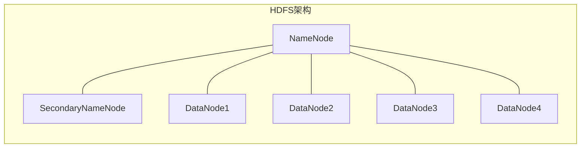
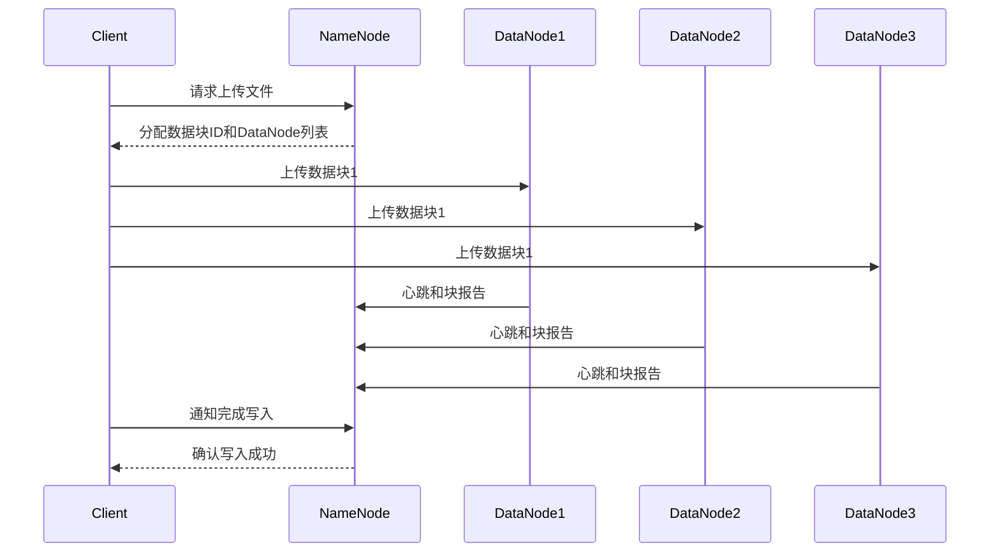
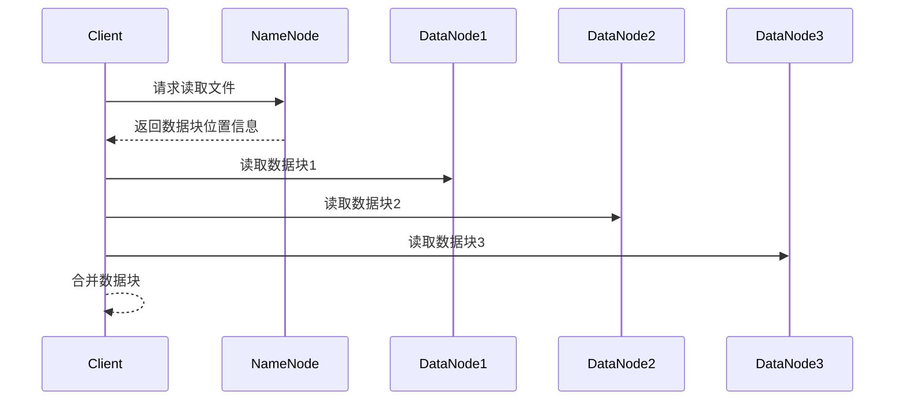

以下是对《HDFS原理与代码实例讲解》这一主题的详细阐述:

# HDFS原理与代码实例讲解

## 1.背景介绍

### 1.1 大数据时代的到来

随着互联网、物联网、人工智能等新兴技术的快速发展,海量的数据正以前所未有的规模和速度不断产生。传统的数据存储和处理方式已经无法满足当前大数据时代的需求,因此分布式存储和计算框架应运而生。Apache Hadoop就是一个革命性的分布式系统基础架构,被广泛应用于大数据处理领域。

### 1.2 HDFS概述

HDFS(Hadoop Distributed File System)是Hadoop项目的核心组件之一,是一个高度容错的分布式文件系统,能够运行在廉价的机器集群上,提供高吞吐量的数据访问。HDFS的设计理念是基于一次写入多次读取的模型,非常适合大数据分析场景下的大规模数据存储和批处理。

## 2.核心概念与联系  

### 2.1 HDFS架构

HDFS遵循主从架构模式,主要由以下三个组件组成:

- **NameNode(NN)**: 集群中的主控服务器,管理文件系统的命名空间和客户端对文件的访问操作。
- **DataNode(DN)**: 集群中的工作节点,负责存储实际的数据块。
- **SecondaryNameNode(2NN)**: 用于定期合并NameNode的编辑日志,防止NameNode的编辑日志过大。



### 2.2 HDFS文件块

HDFS采用了块存储的设计,一个文件被分割成一个个块(Block),块的默认大小为128MB。块存储在不同的DataNode上,以提供数据冗余备份和容错能力。

### 2.3 数据复制

为了实现数据的容错和高可用,HDFS采用了数据复制策略。默认情况下,每个数据块会有3个副本,分别存储在不同的DataNode上,以防止单点故障导致数据丢失。

## 3.核心算法原理具体操作步骤

### 3.1 写数据流程

1. 客户端向NameNode请求上传文件,NameNode检查目标文件是否已存在。
2. NameNode为文件在HDFS上分配一个新的数据块ID。
3. NameNode确定数据块的复制策略,选择多个DataNode存储数据块副本。
4. 客户端按顺序向DataNode上传数据块。
5. 在数据传输过程中,DataNode会定期向NameNode发送心跳和块报告,汇报块存储情况。
6. 如果某个DataNode失效,NameNode会确定失效的数据块,并在其他DataNode上复制新的副本。
7. 当所有数据块传输完毕,客户端通知NameNode完成文件写入。
8. NameNode将元数据更新到编辑日志中。



### 3.2 读数据流程

1. 客户端向NameNode请求读取文件。
2. NameNode获取文件的元数据,包括数据块位置信息。
3. 客户端根据块位置信息,直接从DataNode读取数据块。
4. 如果某个DataNode失效,客户端会从其他DataNode获取数据块副本。
5. 客户端合并所有数据块,重构出原始文件。



## 4.数学模型和公式详细讲解举例说明

### 4.1 数据复制策略

HDFS采用了基于机架感知的数据复制策略,即在不同机架上复制数据块副本,以提高容错能力。假设复制因子为3,则数据块的3个副本将分布在不同的机架上,如果一个机架发生故障,仍然可以从另一个机架读取数据。

设有$n$个机架,每个机架有$m$个DataNode,复制因子为$r$,则数据块副本在机架上的分布可用以下公式表示:

$$
\begin{cases}
n_1 = 1 \\
n_2 = \lfloor \frac{r-1}{n-1} \rfloor \\
n_3 = r - n_1 - n_2 \times (n-1)
\end{cases}
$$

其中:
- $n_1$表示在本机架上的副本数
- $n_2$表示在其他机架上的副本数(每个机架一个)
- $n_3$表示剩余的副本数,将随机分布在其他机架上

例如,当$n=3,m=4,r=3$时,数据块副本的分布为:
- 本机架上1个副本
- 其他两个机架上各1个副本

### 4.2 数据块放置策略

HDFS采用了基于机架感知的数据块放置策略,尽量将数据块副本分散在不同的机架上,以提高容错能力和数据可靠性。

设有$N$个DataNode,分布在$R$个机架上,复制因子为$r$,则数据块副本的放置策略如下:

1. 将第一个副本放在上传文件的DataNode所在的机架。
2. 将第二个副本放在不同机架的DataNode上。
3. 将剩余的副本随机放置在不同的DataNode上,尽量分散在不同的机架。

这种策略可以最大化数据可靠性,因为即使一个机架发生故障,仍然可以从其他机架读取数据。同时,由于副本分散在不同的机架,也提高了数据吞吐量。

## 5.项目实践:代码实例和详细解释说明

以下是一个基于Apache Hadoop的HDFS客户端示例代码,演示了如何创建目录、上传文件、读取文件和删除文件等基本操作。

```java
import org.apache.hadoop.conf.Configuration;
import org.apache.hadoop.fs.FileSystem;
import org.apache.hadoop.fs.Path;
import java.io.IOException;
import java.net.URI;

public class HDFSExample {
    public static void main(String[] args) throws IOException {
        // 配置HDFS文件系统
        Configuration conf = new Configuration();
        conf.set("fs.defaultFS", "hdfs://namenode:9000");
        FileSystem fs = FileSystem.get(URI.create("hdfs://namenode:9000"), conf);

        // 创建目录
        Path dir = new Path("/user/example");
        if (!fs.exists(dir)) {
            fs.mkdirs(dir);
            System.out.println("目录创建成功: " + dir);
        }

        // 上传文件
        Path localFile = new Path("local_file.txt");
        Path hdfsFile = new Path("/user/example/hdfs_file.txt");
        fs.copyFromLocalFile(localFile, hdfsFile);
        System.out.println("文件上传成功: " + hdfsFile);

        // 读取文件
        // ...

        // 删除文件
        fs.delete(hdfsFile, true);
        System.out.println("文件删除成功: " + hdfsFile);

        // 关闭文件系统
        fs.close();
    }
}
```

代码解释:

1. 首先配置HDFS文件系统,指定NameNode的地址和端口。
2. 通过`FileSystem.get()`方法获取HDFS文件系统实例。
3. 创建目录:`fs.mkdirs(dir)`。
4. 上传文件:`fs.copyFromLocalFile(localFile, hdfsFile)`。
5. 读取文件(省略)。
6. 删除文件:`fs.delete(hdfsFile, true)`。
7. 最后关闭文件系统:`fs.close()`。

## 6.实际应用场景

HDFS作为Hadoop生态系统的核心组件,广泛应用于各种大数据处理场景,例如:

- **网络日志分析**: 互联网公司需要分析海量的网络日志数据,以了解用户行为、优化网站性能等。HDFS可以存储和处理这些大规模的日志数据。

- **基因组学研究**: 基因组测序会产生大量的数据,需要高性能的存储和计算资源进行分析。HDFS可以存储和处理这些海量的基因组数据。

- **气象数据处理**: 气象部门需要处理来自全球各地的天气数据,用于天气预报和气候研究。HDFS可以存储和处理这些大规模的气象数据。

- **社交网络分析**: 社交网络公司需要分析用户的社交行为和关系数据,以改进产品和服务。HDFS可以存储和处理这些海量的社交数据。

- **物联网数据处理**: 物联网设备产生的海量数据需要存储和分析,以实现智能化管理和优化。HDFS可以存储和处理这些大规模的物联网数据。

## 7.工具和资源推荐

- **Apache Hadoop官网**: https://hadoop.apache.org/
- **HDFS官方文档**: https://hadoop.apache.org/docs/stable/hadoop-project-dist/hadoop-hdfs/HdfsDesign.html
- **HDFS命令行工具**: Hadoop提供了一系列命令行工具,如`hdfs dfs`命令,用于管理HDFS文件系统。
- **HDFS Web UI**: HDFS提供了基于Web的用户界面,可以查看集群状态、文件系统信息等。
- **HDFS监控工具**: 如Ganglia、Nagios等,用于监控HDFS集群的健康状况和性能指标。
- **HDFS第三方客户端**: 如Hue、Zeppelin等,提供了友好的Web界面,方便与HDFS交互。

## 8.总结:未来发展趋势与挑战

### 8.1 发展趋势

- **异构存储支持**: 未来HDFS将支持异构存储设备,如SSD、NVMe等,以提高I/O性能。
- **智能存储管理**: HDFS将采用机器学习和人工智能技术,实现智能的存储管理和优化。
- **安全性和隐私保护**: 随着数据隐私保护法规的不断完善,HDFS需要加强安全性和隐私保护措施。
- **云原生支持**: HDFS将更好地支持云原生环境,如Kubernetes等,实现更好的弹性和可扩展性。

### 8.2 挑战

- **元数据管理**: 随着数据规模的不断增长,NameNode管理元数据的压力将越来越大,需要优化元数据管理机制。
- **小文件问题**: HDFS在处理大量小文件时效率较低,需要优化小文件存储和访问策略。
- **异构计算框架支持**: HDFS需要更好地支持不同的计算框架,如Spark、Flink等,提高计算效率。
- **数据安全性**: 需要加强对数据的安全性保护,防止数据泄露和被恶意攻击。

## 9.附录:常见问题与解答

### 9.1 HDFS适合什么样的应用场景?

HDFS非常适合一次写入多次读取的大数据处理场景,如日志分析、数据挖掘等。但对于需要低延迟数据访问或者大量随机写操作的场景,HDFS可能不太适合。

### 9.2 HDFS如何实现高可用性?

HDFS通过数据复制和机架感知策略实现高可用性。每个数据块会有多个副本分布在不同的DataNode和机架上,即使某个DataNode或机架发生故障,仍然可以从其他节点读取数据。同时,HDFS还支持NameNode高可用性,通过配置多个NameNode实现元数据的热备份。

### 9.3 HDFS的局限性有哪些?

HDFS的主要局限性包括: