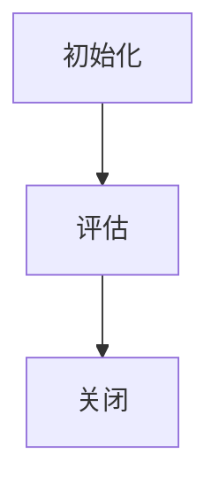

# Hive UDF自定义函数原理与代码实例讲解

## 1.背景介绍

作为一种流行的大数据处理框架,Apache Hive为用户提供了强大的SQL查询功能,可以轻松地处理存储在Hadoop分布式文件系统(HDFS)中的大规模数据集。然而,有时内置的Hive函数无法满足特定的业务需求,这时就需要开发人员自定义函数(User Defined Functions,UDF)来扩展Hive的功能。

Hive UDF允许开发人员使用Java、Python或其他语言编写自定义的函数逻辑,并将其集成到Hive中,以满足特定的数据处理需求。这些自定义函数可以执行各种操作,如数据转换、数据清理、复杂计算等,从而提高Hive的灵活性和可扩展性。

## 2.核心概念与联系

在深入探讨Hive UDF的原理和实现之前,让我们先了解一些核心概念:

### 2.1 UDF分类

Hive中的自定义函数主要分为以下几种类型:

1. **UDF (User Defined Functions)**: 这是最基本的函数类型,接受一个或多个标量值作为输入,并返回一个标量值作为输出。

2. **UDAF (User Defined Aggregation Functions)**: 用于对一组值执行聚合操作,例如求和、计数等。

3. **UDTF (User Defined Table-Valued Functions)**: 这种函数将一行输入数据转换为多行输出,常用于数据扩展或数据规范化。

4. **UDGenericFunc**: 这是一种通用函数类型,可以处理各种复杂的数据类型和操作。

### 2.2 UDF生命周期

Hive UDF的生命周期包括以下几个阶段:

1. **初始化 (Initialize)**: 在执行任何函数逻辑之前,Hive会调用UDF的初始化方法,允许开发人员进行必要的初始化操作。

2. **评估 (Evaluate)**: 这是UDF的核心部分,Hive会根据输入数据调用UDF的评估方法,执行自定义的函数逻辑。

3. **关闭 (Close)**: 在函数执行完毕后,Hive会调用UDF的关闭方法,允许开发人员进行必要的清理和资源释放操作。



## 3.核心算法原理具体操作步骤

### 3.1 UDF开发流程

开发Hive UDF的一般流程如下:

1. **定义函数接口**: 根据需求确定函数的输入参数和返回类型,并继承相应的UDF基类(如UDF、UDAF或UDTF)。

2. **实现函数逻辑**: 在相应的方法中(如`evaluate()`或`aggregate()`)编写自定义的函数逻辑。

3. **编译打包**: 将实现代码编译成JAR包。

4. **注册函数**: 在Hive中使用`CREATE TEMPORARY FUNCTION`或`CREATE FUNCTION`语句注册自定义函数。

5. **使用函数**: 在Hive查询中调用注册的自定义函数,就像使用内置函数一样。

### 3.2 UDF示例:字符串反转函数

让我们通过一个简单的示例来理解如何开发一个UDF。我们将创建一个函数,用于反转给定字符串。

1. **定义函数接口**:

```java
import org.apache.hadoop.hive.ql.exec.UDF;

public class ReverseString extends UDF {
    // 实现evaluate方法
}
```

2. **实现函数逻辑**:

```java
public String evaluate(String input) {
    if (input == null) {
        return null;
    }
    return new StringBuilder(input).reverse().toString();
}
```

3. **编译打包**:

将代码编译成JAR包,例如`reverse-string.jar`。

4. **注册函数**:

在Hive CLI中执行以下命令:

```sql
ADD JAR /path/to/reverse-string.jar;
CREATE TEMPORARY FUNCTION reverseString AS 'com.example.ReverseString';
```

5. **使用函数**:

```sql
SELECT reverseString('Hello, World!') FROM dummy;
```

这将输出反转后的字符串`'!dlroW ,olleH'`。

## 4.数学模型和公式详细讲解举例说明

在某些情况下,我们可能需要在Hive UDF中使用数学模型和公式来执行复杂的计算。以下是一个示例,展示如何在UDF中实现一个简单的线性回归模型。

线性回归是一种常用的机器学习算法,用于建立自变量和因变量之间的线性关系。给定一组数据点$(x_i, y_i)$,线性回归模型试图找到最佳拟合直线$y = mx + b$,其中$m$是斜率,$b$是截距。

我们可以使用最小二乘法来估计参数$m$和$b$,公式如下:

$$m = \frac{\sum_{i=1}^{n}(x_i - \bar{x})(y_i - \bar{y})}{\sum_{i=1}^{n}(x_i - \bar{x})^2}$$

$$b = \bar{y} - m\bar{x}$$

其中$\bar{x}$和$\bar{y}$分别表示$x$和$y$的均值。

让我们实现一个UDF,接受一组$(x, y)$数据点,并返回线性回归模型的斜率和截距。

```java
import org.apache.hadoop.hive.ql.exec.UDF;
import java.util.ArrayList;
import java.util.List;

public class LinearRegression extends UDF {
    public List<Double> evaluate(List<Double> xValues, List<Double> yValues) {
        if (xValues == null || yValues == null || xValues.size() != yValues.size()) {
            return null;
        }

        int n = xValues.size();
        double sumX = 0, sumY = 0, sumXY = 0, sumX2 = 0;

        for (int i = 0; i < n; i++) {
            double x = xValues.get(i);
            double y = yValues.get(i);
            sumX += x;
            sumY += y;
            sumXY += x * y;
            sumX2 += x * x;
        }

        double meanX = sumX / n;
        double meanY = sumY / n;

        double numerator = 0, denominator = 0;
        for (int i = 0; i < n; i++) {
            double x = xValues.get(i);
            double y = yValues.get(i);
            numerator += (x - meanX) * (y - meanY);
            denominator += (x - meanX) * (x - meanX);
        }

        double slope = numerator / denominator;
        double intercept = meanY - slope * meanX;

        List<Double> result = new ArrayList<>();
        result.add(slope);
        result.add(intercept);
        return result;
    }
}
```

在这个示例中,我们首先计算$x$和$y$的均值,然后使用公式计算斜率$m$和截距$b$。最后,我们将这两个值作为列表返回。

在Hive中,我们可以使用以下语句注册和调用这个UDF:

```sql
ADD JAR /path/to/linear-regression.jar;
CREATE TEMPORARY FUNCTION linearRegression AS 'com.example.LinearRegression';

SELECT linearRegression(x, y) FROM data;
```

这个示例展示了如何在Hive UDF中使用数学公式和模型来执行复杂的计算。根据具体需求,我们可以实现各种数学模型和算法,从而扩展Hive的功能。

## 5.项目实践:代码实例和详细解释说明

在本节中,我们将通过一个实际项目来演示如何开发和使用Hive UDF。我们将创建一个自定义函数,用于计算给定字符串的字符出现频率。

### 5.1 项目需求

假设我们有一个包含多行文本数据的Hive表,我们希望统计每行文本中各个字符出现的频率。为了实现这个需求,我们将开发一个UDTF(User Defined Table-Valued Function),将每行输入数据转换为多行输出,每行输出包含一个字符及其出现频率。

### 5.2 实现步骤

1. **定义函数接口**:

我们将继承`GenericUDTF`类,并实现`initialize`、`process`和`close`方法。

```java
import org.apache.hadoop.hive.ql.exec.UDFArgumentTypeException;
import org.apache.hadoop.hive.ql.metadata.HiveException;
import org.apache.hadoop.hive.ql.udf.generic.GenericUDTF;
import org.apache.hadoop.hive.serde2.objectinspector.ObjectInspector;
import org.apache.hadoop.hive.serde2.objectinspector.ObjectInspectorFactory;
import org.apache.hadoop.hive.serde2.objectinspector.StructObjectInspector;
import org.apache.hadoop.hive.serde2.objectinspector.primitive.PrimitiveObjectInspectorFactory;

import java.util.ArrayList;
import java.util.List;

public class CharFrequency extends GenericUDTF {
    private ObjectInspector inputOI;
    private Object[] forwardObj;

    @Override
    public StructObjectInspector initialize(ObjectInspector[] argOIs) throws UDFArgumentTypeException {
        if (argOIs.length != 1) {
            throw new UDFArgumentTypeException("CharFrequency expects exactly one argument");
        }

        inputOI = argOIs[0];

        List<String> fieldNames = new ArrayList<>();
        fieldNames.add("char");
        fieldNames.add("frequency");

        List<ObjectInspector> fieldOIs = new ArrayList<>();
        fieldOIs.add(PrimitiveObjectInspectorFactory.javaStringObjectInspector);
        fieldOIs.add(PrimitiveObjectInspectorFactory.javaIntObjectInspector);

        return ObjectInspectorFactory.getStandardStructObjectInspector(fieldNames, fieldOIs);
    }

    // 实现process方法
    // 实现close方法
}
```

2. **实现函数逻辑**:

在`process`方法中,我们将实现字符频率统计的核心逻辑。

```java
@Override
public void process(Object[] args) throws HiveException {
    String input = inputOI.getPrimitiveJavaObject(args[0]).toString();

    int[] charFrequencies = new int[128]; // 假设只考虑ASCII字符

    for (char c : input.toCharArray()) {
        charFrequencies[c]++;
    }

    List<Object> result = new ArrayList<>();
    for (int i = 0; i < charFrequencies.length; i++) {
        if (charFrequencies[i] > 0) {
            Object[] output = new Object[2];
            output[0] = String.valueOf((char) i);
            output[1] = charFrequencies[i];
            forward(output);
        }
    }
}
```

在`close`方法中,我们可以进行必要的清理操作。

```java
@Override
public void close() throws HiveException {
    // 执行清理操作
}
```

3. **编译打包**:

将代码编译成JAR包,例如`char-frequency.jar`。

4. **注册函数**:

在Hive CLI中执行以下命令:

```sql
ADD JAR /path/to/char-frequency.jar;
CREATE TEMPORARY FUNCTION charFrequency AS 'com.example.CharFrequency';
```

5. **使用函数**:

```sql
SELECT t.char, t.frequency
FROM (
  SELECT charFrequency(text) AS t
  FROM text_data
) temp
LATERAL VIEW EXPLODE(t) t AS t;
```

在这个查询中,我们首先使用`charFrequency`函数对`text_data`表中的每行文本进行处理,得到一个包含字符和频率的数组。然后,我们使用`LATERAL VIEW EXPLODE`将这个数组展开为多行,每行包含一个字符及其出现频率。

通过这个示例,我们可以看到如何在实际项目中开发和使用Hive UDTF。根据具体需求,我们可以实现各种自定义的数据转换和处理逻辑,从而扩展Hive的功能。

## 6.实际应用场景

Hive UDF在实际应用中有着广泛的应用场景,可以帮助我们解决各种复杂的数据处理问题。以下是一些常见的应用场景:

1. **数据清理和转换**: 自定义函数可用于执行各种数据清理和转换操作,例如去除空格、格式化日期、规范化数据等。这对于确保数据质量和一致性至关重要。

2. **复杂计算和算法实现**: 通过UDF,我们可以在Hive中实现各种复杂的计算和算法,例如机器学习算法、统计模型、金融计算等。这使得Hive不仅可以用于简单的数据查询,还可以执行更高级的数据分析任务。

3. **自定义业务逻辑**: 每个组织都有自己特定的业务需求和逻辑,自定义函数可以帮助我们将这些业务逻辑集成到Hive中,从而更好地支持特定的数据处理需求。

4. **数据安全和隐私保护**: 在处理敏感数据时,我们可以使用UDF来执行数据脱敏、加密或匿名化操作,以保护数据的安全性和隐私。

5. **