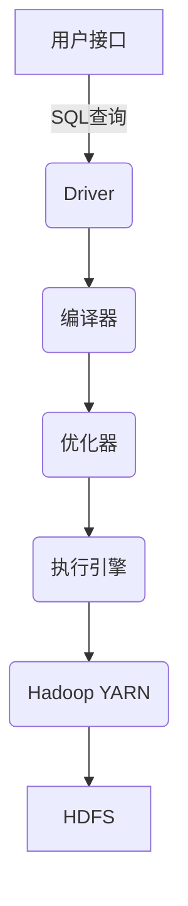

# Hive原理与代码实例讲解

## 1.背景介绍

Apache Hive 是一个建立在 Hadoop 之上的数据仓库基础构件,可以用来进行数据提取、转化、加载(ETL)操作,它将结构化的数据文件映射为一张数据库表,并且允许熟悉 SQL 的用户查询和管理存储在 Hadoop 分布式文件系统(HDFS)中的数据。Hive 的设计目标是通过类 SQL 查询,使用户拥有一个类似传统数据库的体验,从而降低了学习成本,提高了生产效率。

### 1.1 Hive 的优势

- **易用性**:Hive 的语法类似于 SQL,对于熟悉关系型数据库的用户来说很容易上手。
- **容错性**:Hive 是建立在 Hadoop 之上的,因此具有 Hadoop 的容错和可伸缩特性。
- **扩展性**:Hive 可以通过简单的方式扩展到更多节点上,从而支持更大的数据集。
- **成本低廉**:Hive 是开源的,并且可以运行在商用硬件上,因此成本相对较低。

### 1.2 Hive 的应用场景

- **数据仓库**:Hive 可以用作企业数据仓库,存储结构化的大数据集。
- **ETL 工具**:Hive 可以用于提取、转换和加载(ETL)数据,为数据分析做准备。
- **数据分析**:Hive 支持使用 SQL 查询语言进行数据分析。

## 2.核心概念与联系

### 2.1 Hive 的架构

Hive 的架构主要包括以下几个组件:



- **用户接口**:用户可以通过命令行或 Web UI 向 Hive 发送 SQL 查询。
- **Driver**:Driver 是 Hive 的主要组件,负责处理用户的查询请求。
- **编译器**:编译器将 SQL 查询转换为可执行的查询计划。
- **优化器**:优化器对查询计划进行优化,以提高查询效率。
- **执行引擎**:执行引擎负责在 Hadoop 集群上执行查询计划。
- **Hadoop YARN**:YARN 是 Hadoop 的资源管理和作业调度系统,用于管理和调度 Hive 作业。
- **HDFS**:HDFS 是 Hadoop 分布式文件系统,用于存储 Hive 的数据。

### 2.2 Hive 的数据模型

Hive 的数据模型类似于关系型数据库,包括以下几个核心概念:

- **数据库(Database)**:Hive 中的数据库类似于关系型数据库中的数据库,用于组织表。
- **表(Table)**:表是 Hive 中存储数据的基本单元,类似于关系型数据库中的表。
- **分区(Partition)**:分区是 Hive 中一种对表进行划分的技术,可以提高查询效率。
- **存储桶(Bucket)**:存储桶是 Hive 中一种对数据进行哈希分区的技术,可以提高数据的并行处理能力。

## 3.核心算法原理具体操作步骤

### 3.1 Hive 查询执行流程

Hive 的查询执行流程如下:

1. **解析**:Hive 解析 SQL 查询,将其转换为抽象语法树(AST)。
2. **类型检查**:Hive 对 AST 进行类型检查,确保查询的语义正确。
3. **逻辑优化**:Hive 对 AST 进行逻辑优化,如合并相同的子查询等。
4. **物理优化**:Hive 根据数据统计信息对查询计划进行物理优化,如选择合适的连接算法等。
5. **执行**:Hive 根据优化后的查询计划在 Hadoop 集群上执行查询。

### 3.2 Hive 查询优化

Hive 的查询优化主要包括以下几个方面:

- **投影剪裁**:只读取查询需要的列,减少数据传输量。
- **分区剪裁**:根据查询条件,只扫描需要的分区,减少数据扫描量。
- **连接优化**:选择合适的连接算法,如 Map-side Join、Bucket Map Join 等。
- **谓词下推**:将查询条件下推到存储层,减少数据传输量。
- **并行执行**:利用 Hadoop 的并行计算能力,提高查询效率。

## 4.数学模型和公式详细讲解举例说明

### 4.1 MapReduce 模型

Hive 的查询执行依赖于 Hadoop 的 MapReduce 模型。MapReduce 模型包括两个主要阶段:Map 阶段和 Reduce 阶段。

**Map 阶段**:

Map 阶段的输入是一组键值对 $(k_1, v_1)$,通过用户自定义的 Map 函数,生成一组新的键值对 $(k_2, v_2)$:

$$
Map(k_1, v_1) \rightarrow list(k_2, v_2)
$$

**Reduce 阶段**:

Reduce 阶段的输入是 Map 阶段的输出,对于每一个 key $k_2$,Reduce 函数会收集所有的 $(k_2, v_2)$ 对,并将它们合并为一个更小的值集合:

$$
Reduce(k_2, list(v_2)) \rightarrow list(v_3)
$$

MapReduce 模型的优点是可以并行化计算,提高处理效率。Hive 中的许多查询操作都是基于 MapReduce 模型实现的。

### 4.2 Join 算法

Hive 支持多种 Join 算法,常用的有:

- **Map-side Join**:当一个表足够小,可以完全加载到内存中时,可以使用 Map-side Join。它将小表加载到每个 Mapper 的内存中,然后扫描大表,在 Map 阶段完成 Join 操作。
- **Bucket Map Join**:当两个表都经过了 Bucket 操作时,可以使用 Bucket Map Join。它利用了 Bucket 的特性,将相同 Bucket 的数据分发到同一个 Reducer 上,从而减少了数据的洗牌开销。

## 5.项目实践:代码实例和详细解释说明

### 5.1 创建表

```sql
CREATE TABLE employees (
  emp_id INT,
  emp_name STRING,
  dept_id INT,
  salary FLOAT
)
ROW FORMAT DELIMITED
FIELDS TERMINATED BY ','
STORED AS TEXTFILE;
```

上面的语句在 Hive 中创建了一个名为 `employees` 的表,包含四个列:`emp_id`、`emp_name`、`dept_id`和`salary`。`ROW FORMAT DELIMITED`子句指定了数据文件的格式,`FIELDS TERMINATED BY`子句指定了列之间的分隔符为逗号(`,`)。`STORED AS TEXTFILE`子句指定了数据以纯文本格式存储。

### 5.2 加载数据

```sql
LOAD DATA LOCAL INPATH '/path/to/employees.txt' OVERWRITE INTO TABLE employees;
```

上面的语句将本地文件 `/path/to/employees.txt` 中的数据加载到 `employees` 表中。`LOCAL`关键字表示从本地文件系统加载数据,`INPATH`子句指定了数据文件的路径,`OVERWRITE`子句表示如果表中已经有数据,则覆盖掉。

### 5.3 查询数据

```sql
SELECT emp_name, dept_id, salary
FROM employees
WHERE dept_id = 10
ORDER BY salary DESC
LIMIT 5;
```

上面的语句从 `employees` 表中查询部门编号为 10 的员工的姓名、部门编号和薪资,按照薪资降序排列,并只返回前 5 条记录。

## 6.实际应用场景

Hive 在以下场景中得到了广泛应用:

- **网络日志分析**:Hive 可以用于分析网站访问日志,了解用户行为模式、流量趋势等。
- **电商数据分析**:Hive 可以用于分析电商平台的交易数据,了解销售情况、用户偏好等。
- **金融风控**:Hive 可以用于分析金融交易数据,识别异常行为,防范风险。
- **推荐系统**:Hive 可以用于分析用户行为数据,为用户推荐感兴趣的内容。

## 7.工具和资源推荐

- **Hive Web UI**:Hive 提供了一个基于 Web 的用户界面,可以方便地执行 SQL 查询和管理元数据。
- **Beeline**:Beeline 是 Hive 的命令行工具,可以用于执行 SQL 查询和管理元数据。
- **Hive 官方文档**:Hive 的官方文档(https://hive.apache.org/documentation.html)提供了详细的使用指南和参考资料。
- **Hive 书籍**:如《Hive 编程指南》、《Hive 实战》等书籍可以帮助更好地理解和使用 Hive。

## 8.总结:未来发展趋势与挑战

### 8.1 未来发展趋势

- **云原生支持**:Hive 将更好地支持云原生环境,如 Kubernetes 和云存储。
- **实时查询**:Hive 将支持实时查询,缩短数据处理延迟。
- **机器学习集成**:Hive 将更好地集成机器学习算法,支持在大数据上进行机器学习。
- **性能优化**:Hive 将继续优化查询性能,提高处理效率。

### 8.2 挑战

- **数据安全**:如何保护大数据环境中的数据安全是一个挑战。
- **数据质量**:如何确保大数据的质量和一致性是一个挑战。
- **技能缺口**:大数据技术发展迅速,人才短缺是一个挑战。

## 9.附录:常见问题与解答

### 9.1 Hive 和关系型数据库有什么区别?

Hive 和关系型数据库有以下几个主要区别:

- **数据存储**:Hive 将数据存储在 HDFS 上,而关系型数据库通常将数据存储在本地磁盘上。
- **查询语言**:Hive 使用类 SQL 语言,而关系型数据库使用标准 SQL 语言。
- **数据模型**:Hive 的数据模型基于文件,而关系型数据库的数据模型基于行和列。
- **查询执行**:Hive 的查询是通过 MapReduce 作业执行的,而关系型数据库通常使用查询优化器和执行引擎执行查询。

### 9.2 如何提高 Hive 的查询性能?

提高 Hive 查询性能的一些技巧包括:

- **分区**:对表进行分区,可以减少扫描的数据量。
- **存储桶**:使用存储桶可以提高连接操作的效率。
- **压缩**:压缩数据可以减少磁盘 I/O 和网络传输开销。
- **向量化查询**:启用向量化查询可以提高 CPU 利用率。
- **JVM 重用**:重用 JVM 可以避免频繁启动和停止 JVM 的开销。

### 9.3 如何在 Hive 中实现事务?

Hive 本身不支持事务,但是可以通过以下方式实现类似事务的功能:

- **Hive 事务(ACID)**:从 Hive 0.14 版本开始,Hive 支持基于 ORC 文件格式的 ACID 事务。
- **Hive 流**:Hive 流可以实现类似于事务的功能,如原子性、一致性和持久性。
- **外部事务管理器**:可以使用外部事务管理器,如 Apache Phoenix,来管理 Hive 中的事务。

作者:禅与计算机程序设计艺术 / Zen and the Art of Computer Programming