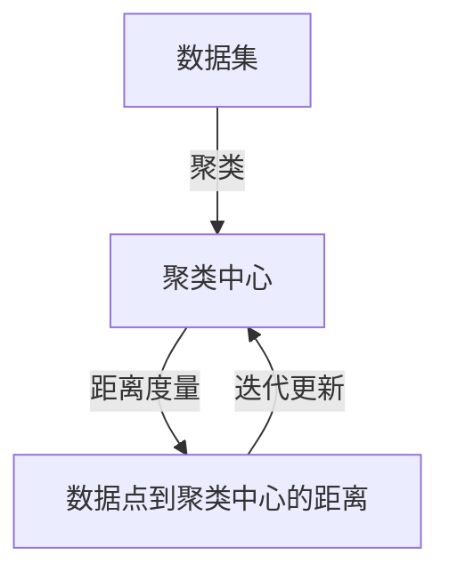

## 1.背景介绍

K-Means聚类是一种常见的无监督学习方法，用于将数据集划分为K个聚类。其基本思想是通过迭代寻找K个聚类的中心点，使得每个数据点到其所属聚类中心点的距离之和最小。这种方法在各种领域，如市场细分、社交网络分析、计算机视觉等都有广泛的应用。

## 2.核心概念与联系

K-Means聚类的核心概念包括聚类中心、距离度量和迭代更新。聚类中心是每个聚类的代表，一般为该聚类内所有点的均值；距离度量是衡量数据点之间相似度的方式，常见的有欧氏距离和余弦距离；迭代更新则是通过不断调整聚类中心，使得聚类效果逐渐优化。



## 3.核心算法原理具体操作步骤

K-Means算法的操作步骤可以分为以下几步：

1. 初始化：随机选择K个数据点作为初始的聚类中心。
2. 赋值：计算每个数据点到K个聚类中心的距离，将每个数据点分配给最近的聚类中心，形成K个聚类。
3. 更新：重新计算每个聚类的中心点，即每个聚类所有点的均值。
4. 检查：如果新的聚类中心与旧的聚类中心相差很小（小于预设的阈值），则算法收敛，停止迭代；否则，返回第2步。

## 4.数学模型和公式详细讲解举例说明

K-Means算法的目标是最小化每个数据点到其所属聚类中心的距离之和，即：

$$
\min \sum_{i=1}^{K} \sum_{x \in C_i} ||x - \mu_i||^2
$$

其中，$C_i$是第$i$个聚类，$\mu_i$是第$i$个聚类的中心，$||\cdot||$是欧氏距离。

例如，对于一个二维空间中的数据集，我们可以选择K=2，初始化两个聚类中心，然后通过迭代更新聚类中心，直到算法收敛。

## 5.项目实践：代码实例和详细解释说明

下面我们使用Python的sklearn库来实现K-Means聚类：

```python
from sklearn.cluster import KMeans
import numpy as np

# 创建一个数据集
X = np.array([[1, 2], [1, 4], [1, 0], [10, 2], [10, 4], [10, 0]])

# 初始化KMeans
kmeans = KMeans(n_clusters=2, random_state=0)

# 进行聚类
kmeans.fit(X)

# 输出聚类中心和每个点的标签
print(kmeans.cluster_centers_)
print(kmeans.labels_)
```

## 6.实际应用场景

K-Means聚类在许多实际应用场景中都有着广泛的应用。例如，在市场细分中，可以将客户根据购买行为、年龄、收入等特征进行聚类，以发现不同的客户群体；在社交网络分析中，可以将用户根据发布的内容、关注的人、互动频率等进行聚类，以发现社区结构；在计算机视觉中，可以将图像的像素进行聚类，以实现图像的分割和压缩。

## 7.工具和资源推荐

对于K-Means聚类，推荐使用Python的sklearn库，该库提供了丰富的机器学习算法，包括K-Means聚类，并且使用方便，文档详细。此外，还可以使用R的cluster库进行聚类分析。

## 8.总结：未来发展趋势与挑战

K-Means聚类是一种简单而有效的聚类方法，但也存在一些挑战，如初始聚类中心的选择会影响聚类结果，对噪声和异常值敏感，需要预先设定聚类的数量等。未来的发展趋势可能会向更多地考虑数据的结构和分布，以及结合其他机器学习方法，如深度学习，来提高聚类的效果。

## 9.附录：常见问题与解答

1. **问：K-Means聚类的K值如何选择？**
答：K值的选择通常依赖于对数据的理解和聚类的目标。一种常见的方法是使用肘部法则，即计算不同K值下的聚类误差，选择误差下降最快的点对应的K值。

2. **问：K-Means聚类对数据的分布有什么要求？**
答：K-Means聚类假设聚类是凸的并且具有相同的大小，这意味着它可能不适合处理某些类型的数据分布，如非凸的数据分布。

作者：禅与计算机程序设计艺术 / Zen and the Art of Computer Programming