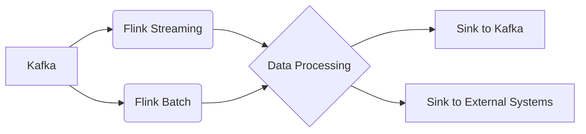

# Kafka-Flink整合原理与代码实例讲解

## 1. 背景介绍
### 1.1 Kafka概述
#### 1.1.1 Kafka是什么
#### 1.1.2 Kafka的特点
#### 1.1.3 Kafka在大数据领域的地位

### 1.2 Flink概述 
#### 1.2.1 Flink是什么
#### 1.2.2 Flink的特点
#### 1.2.3 Flink在实时计算领域的地位

### 1.3 为什么要整合Kafka和Flink
#### 1.3.1 Kafka与Flink各自的优势
#### 1.3.2 Kafka与Flink整合的意义
#### 1.3.3 Kafka与Flink整合后的效果

## 2. 核心概念与联系
### 2.1 Kafka中的核心概念
#### 2.1.1 Producer
#### 2.1.2 Consumer
#### 2.1.3 Broker
#### 2.1.4 Topic
#### 2.1.5 Partition

### 2.2 Flink中的核心概念
#### 2.2.1 DataStream
#### 2.2.2 DataSet
#### 2.2.3 Time
#### 2.2.4 Window
#### 2.2.5 State

### 2.3 Kafka与Flink核心概念的联系
#### 2.3.1 Kafka中的数据如何流入Flink
#### 2.3.2 Flink计算后的数据如何回流Kafka
#### 2.3.3 Kafka与Flink在数据处理上的协同

## 3. 核心算法原理具体操作步骤
### 3.1 Kafka-Flink整合的核心原理
#### 3.1.1 Kafka Consumer和Flink Kafka Connector
#### 3.1.2 Flink Kafka Connector的工作原理
#### 3.1.3 Kafka Partition与Flink Partition的对应关系

### 3.2 Kafka-Flink整合的具体操作步骤
#### 3.2.1 添加Flink Kafka Connector依赖
#### 3.2.2 Flink Streaming程序中整合Kafka
#### 3.2.3 Flink Batch程序中整合Kafka
#### 3.2.4 Kafka Topic创建与配置
#### 3.2.5 启动Kafka和Flink程序

## 4. 数学模型和公式详细讲解举例说明
### 4.1 Flink中的数据流模型
#### 4.1.1 Source
#### 4.1.2 Transformation
#### 4.1.3 Sink

### 4.2 Flink中的窗口模型
#### 4.2.1 Time Window
#### 4.2.2 Count Window
#### 4.2.3 Session Window

### 4.3 Flink中的状态模型
#### 4.3.1 Keyed State
#### 4.3.2 Operator State
#### 4.3.3 Broadcast State

### 4.4 Kafka中的数据模型
#### 4.4.1 Kafka中消息的数学表示
#### 4.4.2 Kafka中分区的数学表示
#### 4.4.3 Kafka中偏移量的数学表示

## 5. 项目实践：代码实例和详细解释说明
### 5.1 Flink Streaming整合Kafka完整代码示例
#### 5.1.1 Flink Streaming作为Kafka Consumer
#### 5.1.2 Flink Streaming作为Kafka Producer

### 5.2 Flink Streaming整合Kafka代码详解
#### 5.2.1 创建Kafka Consumer
#### 5.2.2 创建Kafka Producer
#### 5.2.3 Kafka与Flink Streaming程序主体逻辑

### 5.3 Flink Batch整合Kafka完整代码示例
#### 5.3.1 Flink Batch作为Kafka Consumer  
#### 5.3.2 Flink Batch作为Kafka Producer

### 5.4 Flink Batch整合Kafka代码详解
#### 5.4.1 创建Kafka Consumer
#### 5.4.2 创建Kafka Producer 
#### 5.4.3 Kafka与Flink Batch程序主体逻辑

## 6. 实际应用场景
### 6.1 实时日志流处理
#### 6.1.1 场景描述
#### 6.1.2 技术架构
#### 6.1.3 核心代码解析

### 6.2 实时数据聚合分析
#### 6.2.1 场景描述
#### 6.2.2 技术架构
#### 6.2.3 核心代码解析

### 6.3 实时数据管道
#### 6.3.1 场景描述
#### 6.3.2 技术架构
#### 6.3.3 核心代码解析

## 7. 工具和资源推荐
### 7.1 Kafka工具推荐
#### 7.1.1 Kafka Tool
#### 7.1.2 Kafka Manager
#### 7.1.3 Kafka Eagle

### 7.2 Flink工具推荐
#### 7.2.1 Flink Web UI
#### 7.2.2 Flink SQL Client
#### 7.2.3 Ververica Platform

### 7.3 学习资源推荐
#### 7.3.1 Kafka官方文档
#### 7.3.2 Flink官方文档
#### 7.3.3 Kafka与Flink整合最佳实践白皮书

## 8. 总结：未来发展趋势与挑战
### 8.1 Kafka未来的发展趋势
#### 8.1.1 Cloud-native Kafka
#### 8.1.2 Kafka和Serverless的结合
#### 8.1.3 Kafka在IoT领域的应用

### 8.2 Flink未来的发展趋势
#### 8.2.1 Flink SQL的进一步发展
#### 8.2.2 Flink AI的探索
#### 8.2.3 Flink与Serverless的结合

### 8.3 Kafka-Flink整合面临的挑战
#### 8.3.1 海量数据的存储与计算
#### 8.3.2 数据处理的低延迟与高吞吐
#### 8.3.3 容错与高可用

## 9. 附录：常见问题与解答
### 9.1 Kafka常见问题与解答
#### 9.1.1 Kafka如何保证数据不丢失？
#### 9.1.2 Kafka如何实现数据的有序性？
#### 9.1.3 Kafka中Leader和Follower的区别是什么？

### 9.2 Flink常见问题与解答
#### 9.2.1 Flink的exactly-once语义是如何实现的？
#### 9.2.2 Flink如何处理反压问题？
#### 9.2.3 Flink中Time和Window的关系是什么？

### 9.3 Kafka-Flink整合常见问题与解答
#### 9.3.1 Kafka与Flink的offset如何同步？
#### 9.3.2 Kafka Partition与Flink Partition不一致如何处理？
#### 9.3.3 Kafka-Flink整合需要注意哪些配置问题？

作者：禅与计算机程序设计艺术 / Zen and the Art of Computer Programming

以上是一篇关于Kafka-Flink整合原理与代码实例的技术博客文章的主要框架和内容。在实际撰写过程中，还需要对每个章节进行更详细的阐述和讲解，给出具体的原理分析、数学模型、代码示例以及最佳实践。同时，还要注意行文的逻辑性、专业性和可读性，力求给读者一个全面深入的Kafka-Flink整合指南。

Kafka和Flink是目前大数据领域备受关注的两大利器，将二者进行整合可以发挥各自的优势，实现实时、高吞吐、可扩展的海量数据处理。本文从背景介绍、核心概念、整合原理、代码实例、实际应用等多个维度对Kafka-Flink整合进行了全面系统的讲解，并在最后总结了未来的发展趋势和面临的挑战。相信通过本文的学习，读者可以对Kafka-Flink整合有一个清晰的认知，并能够在实际项目中灵活运用。

当然，Kafka-Flink整合并非一蹴而就，还有很多的优化空间和探索方向，需要广大开发者和研究者的共同努力。让我们携手并进，共同推动Kafka-Flink技术的发展和应用，为大数据时代贡献自己的力量！