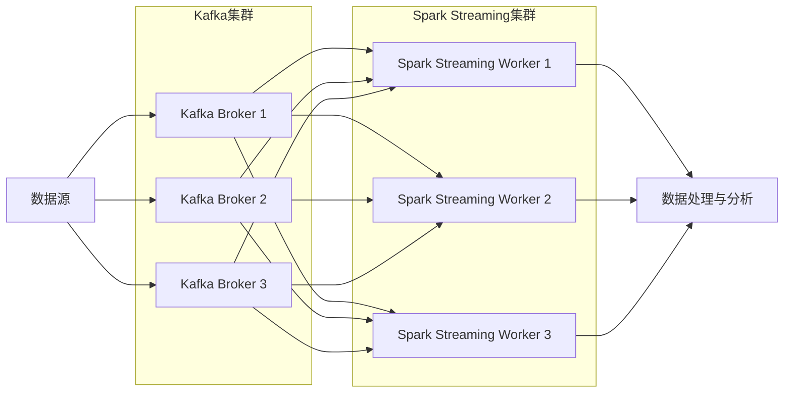

# Kafka-Spark Streaming整合原理与代码实例讲解

## 1.背景介绍

在当今大数据时代，实时数据处理和分析已经成为许多企业和组织的关键需求。Apache Kafka和Apache Spark Streaming作为两个领先的开源技术,在实时数据处理领域发挥着重要作用。

Apache Kafka是一个分布式流处理平台,它提供了一种高吞吐量、低延迟的消息队列服务,可以实现实时数据的持久化存储和传输。Kafka的设计理念是将消息持久化到磁盘,以提供高吞吐量和可靠性。它采用了分区和复制的机制,可以实现水平扩展和容错。

Apache Spark Streaming是Spark核心的一个扩展库,它支持实时数据流的处理和分析。Spark Streaming将实时数据流划分为一系列的小批量(micro-batches),并利用Spark的分布式计算引擎对这些小批量数据进行处理。这种微批处理模型可以提供近乎实时的数据处理能力,同时保持了Spark强大的容错和吞吐量特性。

将Kafka和Spark Streaming整合在一起,可以构建一个强大的实时数据处理和分析管道。Kafka作为数据源,可以持久化存储和传输实时数据流,而Spark Streaming则负责对这些数据流进行处理、转换和分析。这种整合方式具有以下优势:

1. **高吞吐量和低延迟**: Kafka提供了高吞吐量和低延迟的消息队列服务,可以高效地传输大量实时数据,而Spark Streaming则可以利用Spark的分布式计算引擎对这些数据进行实时处理和分析。

2. **容错和可靠性**: Kafka和Spark Streaming都采用了容错机制,可以确保数据处理的可靠性和持久性。Kafka通过复制和分区实现容错,而Spark Streaming则通过检查点(checkpoint)和重新计算(recomputation)机制来实现容错。

3. **可扩展性**: 由于Kafka和Spark都是分布式系统,因此它们都具有良好的可扩展性。可以通过添加更多的节点来水平扩展系统,以满足不断增长的数据量和计算需求。

4. **生态系统集成**: Kafka和Spark都拥有丰富的生态系统,可以与其他大数据技术(如Hadoop、Hive、Flume等)无缝集成,构建完整的大数据处理和分析平台。

综上所述,Kafka和Spark Streaming的整合为实时数据处理和分析提供了一种高效、可靠和可扩展的解决方案,在各种领域都有广泛的应用前景。



## 2.核心概念与联系

在深入探讨Kafka和Spark Streaming的整合原理之前,我们需要先了解一些核心概念:

### 2.1 Kafka核心概念

- **Topic**: Kafka中的消息是按主题(Topic)进行组织的,每个Topic可以被分为多个分区(Partition)。

- **Partition**: 分区是Kafka中最小的数据存储单元,每个分区都是一个有序的、不可变的消息序列。分区可以实现数据的并行处理和水平扩展。

- **Producer**: 生产者是向Kafka发送消息的客户端。

- **Consumer**: 消费者是从Kafka订阅并消费消息的客户端。

- **Consumer Group**: 消费者组是一组消费者的逻辑集合,它们共同消费一个或多个Topic中的消息。每个消费者组中的消费者只能消费Topic中的一部分分区。

- **Offset**: 偏移量是消费者在分区中消费消息的位置。

### 2.2 Spark Streaming核心概念

- **DStream(Discretized Stream)**: 离散化流,是Spark Streaming中的基本抽象,表示一个连续的数据流。DStream由一系列的RDD(Resilient Distributed Dataset)组成,每个RDD包含一个时间段内的数据。

- **Input DStream**: 输入DStream,用于从外部数据源(如Kafka、Flume等)获取数据流。

- **Receiver**: 接收器,用于从数据源获取数据并创建输入DStream。

- **Transformation**: 转换操作,用于对DStream进行转换和处理,如map、filter、join等。

- **Output Operation**: 输出操作,用于将处理后的DStream输出到外部系统,如文件系统、数据库等。

- **Window Operation**: 窗口操作,用于对DStream进行窗口化处理,如滑动窗口(sliding window)、滚动窗口(tumbling window)等。

### 2.3 Kafka与Spark Streaming整合

在Kafka与Spark Streaming的整合中,Kafka作为数据源,提供实时数据流,而Spark Streaming则负责对这些数据流进行处理和分析。Spark Streaming通过Kafka Direct Stream方式从Kafka消费数据,创建输入DStream。这种整合方式具有以下优势:

1. **高吞吐量和低延迟**: Kafka Direct Stream方式可以直接从Kafka的多个分区并行消费数据,提高了数据传输的吞吐量和降低了延迟。

2. **容错和可靠性**: Kafka和Spark Streaming都采用了容错机制,可以确保数据处理的可靠性和持久性。Kafka通过复制和分区实现容错,而Spark Streaming则通过检查点(checkpoint)和重新计算(recomputation)机制来实现容错。

3. **无需接收器(Receiver)**: 在Kafka Direct Stream方式下,Spark Streaming不需要使用接收器(Receiver)来获取数据,而是直接从Kafka消费数据,降低了系统的复杂性和资源消耗。

4. **自动重分区(Repartition)**: Kafka Direct Stream方式可以自动根据Kafka分区的数量来重新分区Spark Streaming的输入DStream,提高了数据处理的并行度。

5. **一次性语义(Exactly-Once Semantics)**: 通过Kafka和Spark Streaming的检查点机制,可以实现一次性语义,确保每条消息只被处理一次,避免数据丢失或重复处理。

## 3.核心算法原理具体操作步骤

### 3.1 Kafka Direct Stream原理

Kafka Direct Stream是Spark Streaming从Kafka消费数据的一种方式,它直接从Kafka的分区中读取数据,而不需要使用接收器(Receiver)。这种方式具有以下优势:

1. **高吞吐量和低延迟**: 由于直接从Kafka分区读取数据,可以充分利用Kafka的并行性和高吞吐量特性,提高数据传输的效率和降低延迟。

2. **无需接收器(Receiver)**: 不需要使用接收器(Receiver)来获取数据,降低了系统的复杂性和资源消耗。

3. **自动重分区(Repartition)**: 可以自动根据Kafka分区的数量来重新分区Spark Streaming的输入DStream,提高了数据处理的并行度。

4. **一次性语义(Exactly-Once Semantics)**: 通过Kafka和Spark Streaming的检查点机制,可以实现一次性语义,确保每条消息只被处理一次,避免数据丢失或重复处理。

Kafka Direct Stream的工作原理如下:

1. **创建输入DStream**: Spark Streaming通过`KafkaUtils.createDirectStream`方法创建一个输入DStream,指定Kafka的元数据(如Brokers列表、Topic、Consumer Group等)。

2. **获取Kafka分区信息**: Spark Streaming从Kafka获取Topic的分区信息,包括分区数量和分区偏移量(Offset)。

3. **创建RDD**: 对于每个批次(Batch),Spark Streaming会根据分区信息创建一个RDD,每个RDD分区对应一个Kafka分区。

4. **从Kafka读取数据**: 每个RDD分区从对应的Kafka分区中读取数据,形成一个新的RDD。

5. **转换和处理数据**: 对新生成的RDD进行转换和处理操作,如map、filter、join等。

6. **输出结果**: 将处理后的RDD输出到外部系统,如文件系统、数据库等。

7. **更新偏移量(Offset)**: 在每个批次结束时,Spark Streaming会将处理过的最新偏移量写入检查点(Checkpoint),以便在故障恢复时从上次的偏移量继续处理。

### 3.2 Kafka Direct Stream代码实现步骤

下面是使用Kafka Direct Stream方式从Kafka消费数据的代码实现步骤:

1. **导入必要的库和包**:

```scala
import org.apache.spark.streaming.kafka010._
import org.apache.kafka.common.serialization.StringDeserializer
import org.apache.spark.streaming.{Seconds, StreamingContext}
```

2. **创建SparkConf和StreamingContext**:

```scala
val sparkConf = new SparkConf().setAppName("KafkaSparkStreamingIntegration")
val ssc = new StreamingContext(sparkConf, Seconds(5))
```

3. **设置Kafka参数**:

```scala
val kafkaParams = Map[String, Object](
  "bootstrap.servers" -> "kafka-broker-1:9092,kafka-broker-2:9092",
  "key.deserializer" -> classOf[StringDeserializer],
  "value.deserializer" -> classOf[StringDeserializer],
  "group.id" -> "my-consumer-group",
  "auto.offset.reset" -> "latest",
  "enable.auto.commit" -> (false: java.lang.Boolean)
)
```

4. **创建输入DStream**:

```scala
val topics = Array("my-topic")
val stream = KafkaUtils.createDirectStream[String, String](
  ssc,
  LocationStrategies.PreferConsistent,
  ConsumerStrategies.Subscribe[String, String](topics, kafkaParams)
)
```

5. **处理和转换数据**:

```scala
val processedStream = stream.map(record => {
  // 对消息进行处理和转换
  val key = record.key
  val value = record.value
  // ...
})
```

6. **输出结果**:

```scala
processedStream.foreachRDD(rdd => {
  // 将处理后的RDD输出到外部系统
  rdd.foreach(record => {
    // ...
  })
})
```

7. **启动Streaming上下文**:

```scala
ssc.start()
ssc.awaitTermination()
```

在上面的代码中,我们首先导入了必要的库和包,然后创建了SparkConf和StreamingContext。接下来,我们设置了Kafka的参数,包括Broker列表、反序列化器、消费者组等。

然后,我们使用`KafkaUtils.createDirectStream`方法创建了一个输入DStream,指定了要消费的Topic和Kafka参数。接下来,我们可以对输入DStream进行处理和转换操作,如map、filter等。

最后,我们将处理后的DStream输出到外部系统,如文件系统或数据库。在每个批次结束时,Spark Streaming会自动更新偏移量(Offset)并写入检查点(Checkpoint)。

需要注意的是,在实际应用中,你可能还需要进行一些额外的配置和优化,如设置批次间隔、调整并行度、配置检查点目录等。

## 4.数学模型和公式详细讲解举例说明

在Kafka和Spark Streaming的整合中,涉及到一些重要的数学模型和公式,这些模型和公式可以帮助我们更好地理解和优化系统的性能。

### 4.1 小文件问题

在处理实时数据流时,如果将每个批次的输出直接写入文件系统,可能会产生大量的小文件。这种小文件问题会导致文件系统的元数据开销增加,从而降低系统的整体性能。

为了解决小文件问题,我们可以采用文件合并(File Coalescing)策略。文件合并的基本思想是将多个小文件合并为一个较大的文件,从而减少文件系统的元数据开销。

假设我们有一个时间窗口为$T$的数据流,每个批次的时间间隔为$\Delta t$,那么在时间窗口$T$内会产生$\frac{T}{\Delta t}$个批次。如果每个批次都单独写入一个文件,那么在时间窗口$T$内会产生$\frac{T}{\Delta t}$个小文件。

为了避免产生过多的小文件,我们可以设置一个合并因子$k$,表示每$k$个批次合并为一个文件。那么在时间窗口$T$内,将产生$\frac{T}{k \Delta t}$个较大的文件。

合并因子$k$的选择需要