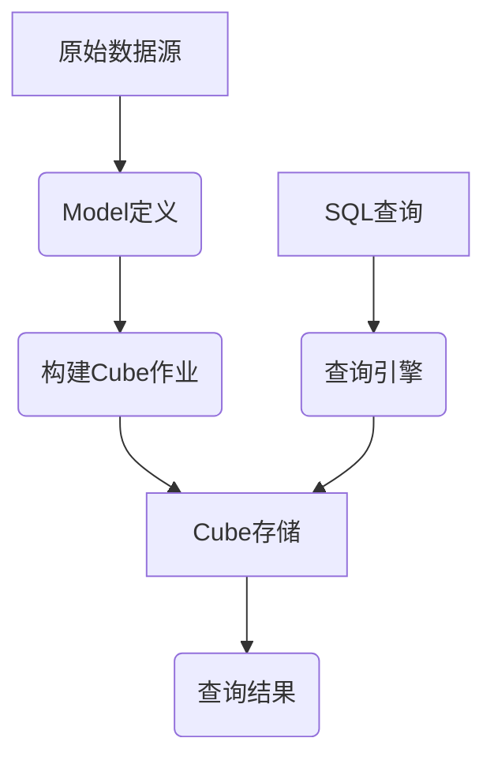

# Kylin原理与代码实例讲解

## 1.背景介绍

Apache Kylin是一款开源的分析型大数据处理引擎,旨在提供SQL查询在Hadoop之上的低延迟和高性能分析能力。它最初由eBay公司开发,后捐赠给Apache软件基金会,目前由Apache社区维护和持续开发。

在大数据时代,企业需要快速分析海量数据以获取洞见和做出数据驱动的决策。然而,在Hadoop这样的大数据平台上执行SQL查询通常需要扫描大量数据,导致查询延迟较高。Kylin通过预计算和存储数据立方体(Cube),从而显著提高了查询性能。

Kylin支持多种大数据源,如Hive、Kafka、Parquet等,并提供了ANSI SQL接口,使用户可以使用熟悉的SQL语言进行分析查询。它还支持高级OLAP功能,如滚动计算、层次结构维度等,满足企业复杂的分析需求。

## 2.核心概念与联系

Kylin的核心概念包括:

1. **Cube(数据立方体)**: Cube是Kylin的核心概念,代表预先计算和存储的数据集。它包含了来自不同维度的数据,并预先聚合以加速查询。

2. **Model(模型)**: Model定义了数据的来源、维度和度量,是构建Cube的基础。它描述了如何从原始数据中提取和转换数据。

3. **Job(作业)**: Job是Kylin中的一个执行单元,用于构建Cube、更新Cube、合并Cube等操作。

4. **Query Engine(查询引擎)**: 查询引擎负责将SQL查询转换为对Cube的访问,并从Cube中获取数据进行计算和返回结果。

5. **Metadata(元数据)**: Kylin使用元数据存储有关Cube、Model、Job等的信息,以管理和协调整个系统。

这些核心概念相互关联,共同构成了Kylin的整体架构。用户首先定义Model,Kylin根据Model构建Cube。当用户提交SQL查询时,查询引擎会将查询转换为对Cube的访问,从而获得高性能的查询结果。



## 3.核心算法原理具体操作步骤

Kylin的核心算法原理包括数据立方体构建、查询重写和查询执行等几个主要步骤:

### 3.1 数据立方体构建

Kylin采用了基于Cube的MOLAP(MultiDimensional OnLine Analytical Processing)技术,通过预计算和存储数据立方体来加速查询。数据立方体构建的主要步骤如下:

1. **数据抽取转换(ETL)**: 根据Model定义从原始数据源(如Hive表)中抽取、转换和加载相关数据。

2. **数据分区**: 将数据按照分区列(如时间维度)进行分区,以支持增量构建和并行计算。

3. **Cube计算**: 对分区数据执行多维数据分析,计算出不同维度组合下的聚合结果,构建数据立方体。

4. **Cube编码**: 对维度成员进行编码,将文本转换为数字,以减小存储空间和提高查询效率。

5. **Cube存储**: 将计算得到的数据立方体持久化存储,通常采用列式存储格式。

6. **Cube元数据更新**: 更新Cube的元数据信息,如维度、度量、分区等,以供查询引擎使用。

通过这些步骤,Kylin预先计算并存储了数据立方体,为查询提供了高效的数据访问路径。

### 3.2 查询重写

当用户提交SQL查询时,Kylin的查询重写模块会将SQL查询转换为对数据立方体的访问,以利用预计算的结果。主要步骤包括:

1. **查询解析**: 解析SQL查询,识别查询中的维度、度量、过滤条件等。

2. **Cube匹配**: 根据查询的维度、度量,匹配最佳的数据立方体。

3. **查询重写**: 将SQL查询重写为对匹配的数据立方体的访问,包括确定访问路径、应用编码等。

4. **查询计划生成**: 生成分布式执行计划,将重写后的查询分解为多个任务。

通过查询重写,Kylin能够充分利用预计算的数据立方体,避免了对原始数据的全量扫描,从而显著提高了查询性能。

### 3.3 查询执行

经过查询重写后,Kylin会执行分布式查询计划,从数据立方体中获取数据并进行计算。主要步骤包括:

1. **任务调度**: 将查询计划分解为多个任务,并调度这些任务在不同节点上并行执行。

2. **数据获取**: 从HDFS或其他存储系统中获取数据立方体数据。

3. **数据解码**: 对编码的维度成员进行解码,将数字转换回原始文本值。

4. **聚合计算**: 根据查询条件,对获取的数据进行进一步的聚合和计算。

5. **结果归并**: 将分布式任务的计算结果进行归并,得到最终查询结果。

6. **结果返回**: 将查询结果返回给用户或应用程序。

通过分布式并行计算,Kylin能够充分利用集群资源,提供高吞吐和低延迟的查询能力。

## 4.数学模型和公式详细讲解举例说明

在Kylin中,数学模型和公式主要应用于数据立方体的构建和查询计算过程。下面将详细介绍几个关键的数学模型和公式。

### 4.1 基数估计(Cardinality Estimation)

基数估计是查询优化器中一个关键的数学模型,用于估计查询过滤条件下的结果集大小。准确的基数估计有助于查询优化器选择最优的执行计划。

Kylin采用了基于采样的基数估计算法。对于每个维度列,Kylin会抽取一个样本,并构建一个直方图(Histogram)来近似描述该列值的分布。在查询时,根据过滤条件,从直方图中估计出满足条件的基数。

设有一个维度列$A$,过滤条件为$A \in [l, u]$,其中$l$和$u$分别为下界和上界。假设$A$的直方图由$n$个桶(bucket)组成,每个桶包含该桶中值的计数。则满足过滤条件的基数估计公式为:

$$\mathrm{EST}(A \in [l, u]) = \sum_{i=1}^{n} \begin{cases}
c_i & \text{if } [v_i^l, v_i^u] \subseteq [l, u] \\
\frac{v_i^u - \max(v_i^l, l) + 1}{v_i^u - v_i^l + 1} c_i & \text{if } [v_i^l, v_i^u] \cap [l, u] \neq \emptyset \\
0 & \text{otherwise}
\end{cases}$$

其中$c_i$表示第$i$个桶中值的计数,$(v_i^l, v_i^u)$表示第$i$个桶的值范围。

通过这种基于直方图的基数估计方法,Kylin可以较为准确地估计过滤条件下的结果集大小,从而选择更优的查询执行计划。

### 4.2 数据编码(Data Encoding)

为了减小数据存储空间并提高查询效率,Kylin采用了多种数据编码技术,将原始文本数据转换为数字编码。常用的编码方法包括字典编码(Dictionary Encoding)和位映射编码(Bit-mapped Encoding)。

#### 4.2.1 字典编码

字典编码将每个唯一的维度值映射为一个整数ID。设有一个维度列$A$,其取值范围为$\{a_1, a_2, \ldots, a_n\}$,则字典编码函数可表示为:

$$\mathrm{ENC}(a_i) = i,\quad i = 1, 2, \ldots, n$$

其中$\mathrm{ENC}(\cdot)$表示编码函数。通过字典编码,原始的文本值被替换为更紧凑的整数ID,从而减小了存储空间。

在查询时,需要对编码值进行解码,将整数ID转换回原始文本值。解码函数为字典编码函数的逆函数:

$$\mathrm{DEC}(i) = a_i,\quad i = 1, 2, \ldots, n$$

其中$\mathrm{DEC}(\cdot)$表示解码函数。

#### 4.2.2 位映射编码

位映射编码适用于基数较小的维度列,它将每个唯一值映射为一个位序列(bit sequence)。设有一个维度列$A$,其取值范围为$\{a_1, a_2, \ldots, a_n\}$,则位映射编码函数可表示为:

$$\mathrm{ENC}(a_i) = 2^{i-1},\quad i = 1, 2, \ldots, n$$

通过位映射编码,原始文本值被转换为二进制位序列。例如,如果$A$只有两个取值$\{a_1, a_2\}$,则$\mathrm{ENC}(a_1) = 1$,而$\mathrm{ENC}(a_2) = 2$。

位映射编码的优点是支持高效的位运算,如按位与、或、异或等,这在查询过滤和聚合计算中非常有用。例如,要检查一个值是否属于一个集合,只需对该集合中所有值的编码执行按位或操作,然后与目标值的编码进行比较即可。

### 4.3 分区裁剪(Partition Pruning)

分区裁剪是一种优化技术,通过剪枝不相关的分区,减少需要扫描的数据量,从而提高查询效率。

Kylin支持基于时间维度的分区,将数据按照时间段(如天、月、年)进行分区存储。设有一个时间维度$T$,其取值范围为$[t_1, t_2]$,被划分为$n$个分区$P_1, P_2, \ldots, P_n$,每个分区$P_i$包含时间范围$[t_i^l, t_i^u]$。

对于查询条件$T \in [l, u]$,分区裁剪的目标是找到所有相关分区的集合$\mathcal{R}$,其中:

$$\mathcal{R} = \{P_i \mid [t_i^l, t_i^u] \cap [l, u] \neq \emptyset\}$$

也就是说,只有与查询条件时间范围有交集的分区才需要被扫描和计算。

通过分区裁剪,Kylin可以避免对不相关数据的扫描,从而显著减少I/O开销和计算量,提升查询性能。

## 5.项目实践：代码实例和详细解释说明

在本节中,我们将通过一个示例项目来演示如何使用Kylin进行数据建模、Cube构建和SQL查询。

### 5.1 环境准备

首先,我们需要准备Kylin的运行环境。Kylin可以部署在Hadoop集群上,也可以在单机环境中运行。这里我们将在单机环境中进行演示。

1. 下载并解压Kylin二进制包,例如`apache-kylin-4.0.2-bin.tgz`。

2. 进入Kylin主目录,启动Kylin服务:

```bash
bin/kylin.sh start
```

3. 访问Kylin Web UI,默认地址为`http://localhost:7070`。

### 5.2 数据准备

我们将使用一个示例数据集`sample_order`来演示Kylin的使用。该数据集模拟了一个电商平台的订单数据,包含了订单信息、产品信息、用户信息等。

1. 将`sample_order`数据集加载到Hive中,创建表`DEFAULT.ORDER`。

2. 在Kylin Web UI中,创建一个新的Hive数据源,指向`DEFAULT.ORDER`表。

### 5.3 模型定义

接下来,我们需要定义一个模型(Model),描述如何从原始数据中提取和转换数据。

1. 在Kylin Web UI中,创建一个新的模型,命名为`order_model`。

2. 定义模型的事实表(Fact Table)为`DEFAULT.ORDER`。

3. 定义维度(Dimensions):
   - `ORDER_ID`: 订单ID
   - `LINE_ORDER_ID`: 订单行ID
   - `BUYER_LEVEL`: 买家级别
   - `SELLER_ID`: 卖家ID
   -