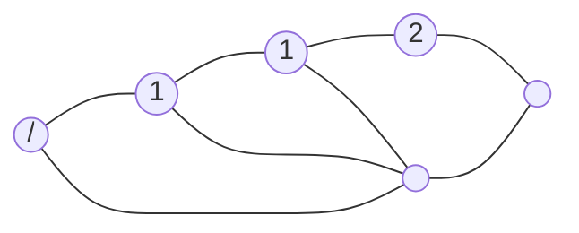

# K-最近邻KNN原理与代码实例讲解

## 1. 背景介绍
### 1.1 机器学习中的分类问题
在机器学习领域,分类问题是一个非常重要且常见的任务。分类的目标是根据已知类别的训练样本,通过学习得到一个分类模型或分类规则,然后使用该模型对新的未知类别样本进行分类。常见的分类算法包括决策树、支持向量机、朴素贝叶斯等。而K最近邻(K-Nearest Neighbor,KNN)算法以其简单直观、易于理解的特点,成为最基本且应用广泛的分类算法之一。

### 1.2 KNN算法的应用场景
KNN算法作为一种无参数的非线性分类方法,不需要对数据的分布做任何假设,对训练样本没有训练过程,是一种懒惰学习(lazy learning)算法。KNN在诸多领域都有广泛应用,例如:

- 文本分类:根据文本内容将其分类到预定义的类别中。
- 图像识别:根据图像的特征将其归类,如手写数字识别。  
- 基因分类:根据基因表达数据识别肿瘤的分子亚型。
- 推荐系统:根据用户过去的行为找到相似用户,为其推荐商品。

本文将详细介绍KNN算法的基本原理,并通过代码实例演示其应用。

## 2. 核心概念与联系
### 2.1 KNN的基本思想
KNN算法的基本思想是:如果一个样本在特征空间中的k个最相似(即特征空间中最邻近)的样本中的大多数属于某一个类别,则该样本也属于这个类别。

### 2.2 相似度/距离度量
KNN算法的关键在于如何度量样本之间的相似程度。通常使用的距离度量包括:

- 欧氏距离(Euclidean Distance):两点之间的直线距离。
- 曼哈顿距离(Manhattan Distance):两点在各坐标轴上的距离之和。
- 明可夫斯基距离(Minkowski Distance):欧氏距离和曼哈顿距离的一般形式。
- 余弦相似度(Cosine Similarity):计算两个向量夹角的余弦值作为相似度。

### 2.3 k值的选择
KNN中的参数k,即选取最近邻的数目,对分类结果有重要影响。k值选择过小,容易受到噪声点影响;k值选择过大,又容易受到样本不均衡的影响。一般根据交叉验证来选择最优的k值。

### 2.4 分类决策规则 
当找出k个最近邻样本后,可以采用多数表决(Majority Voting)的方法,即k个样本中出现次数最多的类别作为预测结果。也可以加权多数表决,即距离预测样本越近的近邻样本的投票权重越大。

## 3. 核心算法原理具体操作步骤
KNN算法可以分为以下几个步骤:

### 3.1 准备数据
收集已分类的训练数据,并将其表示为特征向量。对于文本可以使用词袋模型,对于图像可以使用像素值或SIFT等特征。

### 3.2 计算距离
对于待分类样本,分别计算其与每个训练样本的距离。常用的距离度量如欧氏距离:

$$
d(x,y) = \sqrt{\sum_{i=1}^n (x_i - y_i)^2}
$$

其中$x$和$y$为两个$n$维特征向量。

### 3.3 选取近邻
选取与待分类样本距离最近的k个训练样本,作为其近邻。k为人工设置的参数。

### 3.4 决策分类
根据k个近邻的类别,通过多数表决的方式决定待分类样本的类别。

$$
C(x) = \underset{c_j}{\arg\max} \sum_{x_i \in N_k(x)} I(y_i = c_j)
$$

其中$C(x)$为待分类样本$x$的预测类别,$c_j$为第$j$个类别,$N_k(x)$为$x$的k个近邻,$I$为示性函数。

## 4. 数学模型和公式详细讲解举例说明
下面以一个简单的二维数据集为例,直观展示KNN的分类过程。假设有一个二分类数据集如下图所示,其中实心点为第一类样本,空心点为第二类样本,绿色三角形为待分类样本。



当$k=3$时,与待分类样本最近的3个样本中有2个为第一类,1个为第二类,因此预测其为第一类。
假设两个样本的特征向量分别为$x_1=(1,2), x_2=(5,4)$,则其欧氏距离为:

$$
\begin{aligned}
d(x_1,x_2) &= \sqrt{(x_1^{(1)}-x_2^{(1)})^2 + (x_1^{(2)}-x_2^{(2)})^2} \\
&= \sqrt{(1-5)^2 + (2-4)^2} \\
&= \sqrt{(-4)^2+(-2)^2} \\
&= \sqrt{20} \\
&\approx 4.47
\end{aligned}
$$

## 5. 项目实践:代码实例和详细解释说明
下面使用Python和Sklearn库实现KNN算法,并应用于手写数字识别任务。

### 5.1 导入所需库

```python
from sklearn.neighbors import KNeighborsClassifier
from sklearn.datasets import load_digits
from sklearn.model_selection import train_test_split
from sklearn.metrics import accuracy_score
```

其中`KNeighborsClassifier`为KNN分类器,`load_digits`为手写数字数据集。

### 5.2 加载数据集并划分

```python
# 加载数据
digits = load_digits()
X, y = digits.data, digits.target

# 划分训练集和测试集 
X_train, X_test, y_train, y_test = train_test_split(X, y, test_size=0.3)
```

手写数字数据集共有1797个样本,每个样本由8x8像素的图像展开成64维特征向量。将数据划分为训练集和测试集。

### 5.3 训练模型

```python
# 创建KNN分类器
knn = KNeighborsClassifier(n_neighbors=5)

# 训练模型
knn.fit(X_train, y_train)
```

创建一个KNN分类器,设置近邻数`n_neighbors`为5。然后用训练集拟合模型。注意KNN算法训练过程仅仅是存储训练数据。

### 5.4 测试模型

```python
# 预测测试集
y_pred = knn.predict(X_test)

# 计算准确率
accuracy = accuracy_score(y_test, y_pred)
print("Accuracy:", accuracy)
```

用训练好的模型对测试集进行预测,并计算分类准确率。一般准确率可达90%以上。

### 5.5 调参优化

```python
# 选择最优k值
k_range = range(1, 20)
scores = []
for k in k_range:
    knn = KNeighborsClassifier(n_neighbors=k)
    knn.fit(X_train, y_train)
    y_pred = knn.predict(X_test)
    scores.append(accuracy_score(y_test, y_pred))

import matplotlib.pyplot as plt
plt.plot(k_range, scores)
plt.xlabel('Value of K')
plt.ylabel('Accuracy')
plt.show()
```

通过遍历不同的k值,计算相应的分类准确率,并绘制成曲线图。选择准确率最高点对应的k值作为最优参数。

## 6. 实际应用场景
KNN算法在许多实际场景中都有应用,下面列举几个典型案例:

### 6.1 推荐系统
在电商网站中,可以用KNN为用户推荐相似商品。将每个用户的购买记录、浏览记录等作为特征向量,计算用户之间的相似度,然后为目标用户推荐相似用户喜欢的商品。

### 6.2 人脸识别
将人脸图像的特征(如PCA、LBP特征)作为样本,用KNN构建人脸识别系统。当一张新人脸图像输入时,找出与其最相似的k张图像,并用多数表决法判断其身份。

### 6.3 异常检测
在工业生产中,可用KNN进行异常检测。将正常样本作为训练集,当有新样本输入时,计算其与正常样本的距离。如果该距离超过一定阈值,则判定为异常。

## 7. 工具和资源推荐
- Sklearn:机器学习库,包含了KNN等多种算法的实现。
- OpenCV:计算机视觉库,可用于图像特征提取等。
- Pandas:数据分析库,可用于数据预处理。
- CS231n:斯坦福大学计算机视觉课程,其中有KNN的详细讲解。
- 《统计学习方法》:李航著,详细介绍了KNN等多种机器学习算法。

## 8. 总结:未来发展趋势与挑战
### 8.1 算法优化
KNN算法的一大缺点是计算量大,因为要计算待分类样本与所有训练样本的距离。针对该问题,可以采用以下优化策略:

- kd树:通过构建样本的kd树,可以快速找到近邻样本。
- Ball Tree:通过构建样本的Ball Tree,在高维数据上效果更好。
- 哈希:通过局部敏感哈希等方法,将样本映射到哈希桶中,大大降低搜索范围。

### 8.2 距离度量学习
如何选择合适的距离度量函数,是直接影响KNN性能的关键因素。可以针对不同任务,通过度量学习的方法自动优化距离函数,如Large Margin Nearest Neighbor (LMNN)等。

### 8.3 样本不均衡问题
当不同类别样本数量相差悬殊时,KNN容易偏向数量多的类别。针对该问题,可以采取以下策略:

- 欠采样:从数量多的类别中随机去除一些样本。  
- 过采样:对数量少的类别样本进行复制。
- 阈值移动:将少数类样本的分类阈值适当降低。

### 8.4 拓展应用
KNN不仅可以用于分类,还可以用于回归、异常检测、推荐等多种任务。此外,KNN还可以与其他算法相结合,如KNN-SVM等。如何将KNN应用到更广泛的场景,是一个值得研究的方向。

## 9. 附录:常见问题与解答
### 9.1 KNN算法的主要优缺点是什么?

优点:
- 原理简单,易于实现。  
- 对异常值不敏感。
- 训练开销小,适用于小样本场景。
- 适用于多分类问题。

缺点:  
- 计算开销大,难以处理大数据。
- 样本不均衡问题严重。
- 输出无法给出概率估计。
- 对特征缩放敏感。

### 9.2 如何选择合适的k值?

k值的选择很大程度上取决于数据:
- k值越小,模型越复杂,容易过拟合。
- k值越大,模型越简单,容易欠拟合。

常用的方法是通过交叉验证选取在验证集上性能最优的k值。还要注意,k值最好选择奇数,以避免平票的情况。

### 9.3 如何处理KNN的高计算成本?

可以采取以下措施:
- 降维:使用PCA等方法降低特征维度。
- 特征选择:去除冗余特征。
- 数据归一化:使用标准化、归一化处理特征。
- 使用树结构:如kd树、Ball Tree等。
- 局部敏感哈希:将高维数据映射到低维空间。

### 9.4 KNN能否用于回归任务?

可以。将最近k个样本的标签取平均值作为预测值即可。这种方法称为k近邻回归(k-Nearest Neighbor Regression)。

作者:禅与计算机程序设计艺术 / Zen and the Art of Computer Programming