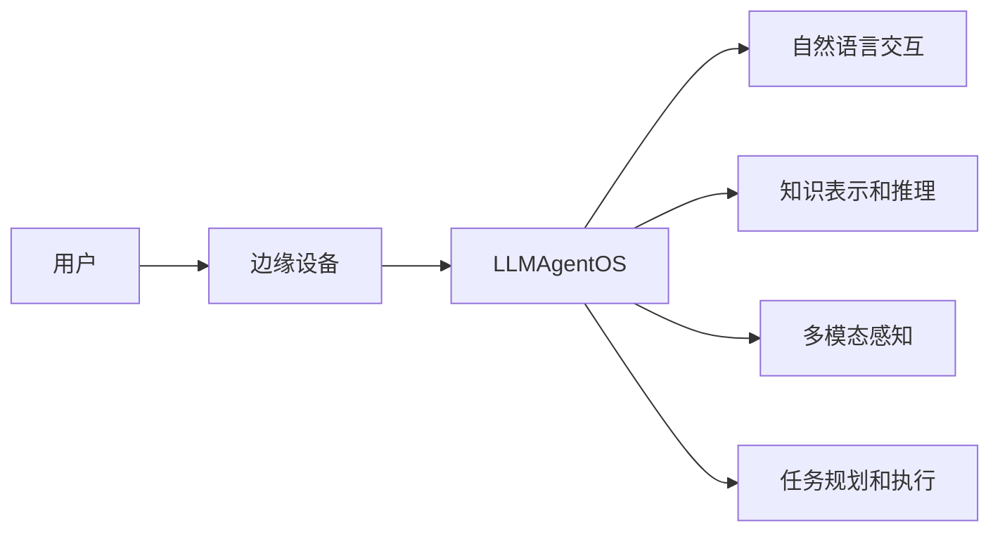

# LLMAgentOS的边缘计算应用:实现低延迟和高效率

## 1. 背景介绍

### 1.1 边缘计算的兴起

在过去几年中,随着物联网(IoT)、人工智能(AI)和5G等技术的快速发展,边缘计算已经成为一个热门话题。边缘计算是一种分布式计算范式,它将计算、存储和网络资源部署在靠近数据源或用户的网络边缘。与传统的云计算模式相比,边缘计算可以显著减少数据传输的延迟,提高服务质量,并实现实时决策。

### 1.2 LLMAgentOS的出现

最近,一种名为LLMAgentOS的新型操作系统引起了广泛关注。LLMAgentOS是一个基于大语言模型(Large Language Model, LLM)的智能代理操作系统。它利用先进的自然语言处理和机器学习技术,为各种应用程序提供智能化的交互和决策能力。LLMAgentOS的出现为边缘计算带来了新的机遇和挑战。

### 1.3 LLMAgentOS在边缘计算中的应用前景

将LLMAgentOS应用于边缘计算具有巨大的潜力。通过在网络边缘部署LLMAgentOS,我们可以实现低延迟、高效率的智能服务。这对于需要实时响应和本地决策的应用场景尤为重要,例如自动驾驶、工业控制、智能家居等。本文将深入探讨LLMAgentOS在边缘计算中的应用,分析其核心概念、算法原理、实践案例以及未来发展趋势。

## 2. 核心概念与联系

### 2.1 边缘计算的定义和特点

边缘计算是一种分布式计算模式,它将计算资源部署在靠近数据源或用户的网络边缘。与传统的云计算模式不同,边缘计算强调在本地处理数据,减少数据传输的延迟和带宽消耗。边缘计算的主要特点包括:

- 低延迟:数据在本地处理,无需经过长距离传输,可以显著减少响应时间。
- 高效率:通过在边缘设备上执行计算任务,可以减轻云端的负载,提高整体效率。
- 实时性:边缘计算支持实时数据处理和决策,适用于对时间敏感的应用场景。
- 隐私保护:数据在本地处理,减少了隐私泄露的风险。

### 2.2 LLMAgentOS的核心功能

LLMAgentOS是一个基于大语言模型的智能代理操作系统。它的核心功能包括:

- 自然语言交互:LLMAgentOS可以理解和生成自然语言,支持人机对话和语音交互。
- 知识表示和推理:通过大语言模型,LLMAgentOS可以表示和推理复杂的知识,实现智能决策。
- 多模态感知:LLMAgentOS可以处理文本、图像、音频等多种模态的数据,实现全面的环境感知。
- 任务规划和执行:LLMAgentOS可以根据用户需求,自主规划和执行任务,提供个性化服务。

### 2.3 LLMAgentOS与边缘计算的联系

LLMAgentOS和边缘计算的结合具有天然的优势。通过在边缘设备上部署LLMAgentOS,我们可以实现以下目标:

- 低延迟的智能交互:LLMAgentOS可以在本地处理用户的自然语言请求,提供实时响应。
- 高效的任务执行:LLMAgentOS可以利用边缘设备的计算资源,高效地完成各种任务。
- 隐私保护:用户的数据和交互记录可以在本地存储和处理,减少隐私泄露的风险。
- 弹性扩展:LLMAgentOS可以根据需求动态调整资源分配,实现弹性扩展。

下图展示了LLMAgentOS在边缘计算环境中的部署架构:



## 3. 核心算法原理具体操作步骤

### 3.1 大语言模型的训练

LLMAgentOS的核心是大语言模型。训练一个高质量的大语言模型需要以下步骤:

1. 数据准备:收集大量的文本数据,包括书籍、文章、对话记录等。
2. 数据清洗:对收集的数据进行清洗,去除噪声和无关信息。
3. 文本预处理:对文本数据进行分词、词性标注、命名实体识别等预处理操作。
4. 模型选择:选择合适的神经网络架构,如Transformer、BERT等。
5. 模型训练:使用预处理后的数据对模型进行训练,优化模型参数。
6. 模型评估:在测试集上评估模型的性能,如perplexity、BLEU等指标。
7. 模型部署:将训练好的模型部署到边缘设备上,供LLMAgentOS使用。

### 3.2 知识表示和推理

LLMAgentOS需要具备知识表示和推理的能力,以支持智能决策。常用的知识表示和推理方法包括:

1. 知识图谱:将知识以图的形式组织,节点表示实体,边表示实体之间的关系。
2. 规则推理:使用预定义的规则对知识进行推理,如一阶逻辑、产生式规则等。
3. 神经符号推理:将符号推理与神经网络相结合,利用神经网络学习符号之间的关系。
4. 因果推理:通过建立因果模型,推断事件之间的因果关系。

### 3.3 多模态感知和融合

LLMAgentOS需要处理多种模态的数据,如文本、图像、音频等。多模态感知和融合的步骤包括:

1. 特征提取:对不同模态的数据提取特征,如文本的词向量、图像的卷积特征等。
2. 特征对齐:将不同模态的特征映射到同一个语义空间,实现特征对齐。
3. 跨模态融合:使用注意力机制、门控机制等方法,将不同模态的特征进行融合。
4. 联合推理:基于融合后的特征,进行联合推理,生成最终的决策结果。

### 3.4 任务规划和执行

LLMAgentOS需要根据用户需求,自主规划和执行任务。任务规划和执行的步骤包括:

1. 任务理解:通过自然语言交互,理解用户的任务需求。
2. 任务分解:将复杂的任务分解为多个子任务,形成任务树。
3. 任务规划:根据任务树,生成最优的执行计划,考虑任务的依赖关系和资源约束。
4. 任务执行:按照执行计划,调度和执行各个子任务,并进行实时监控和调整。
5. 结果反馈:将任务执行结果反馈给用户,并根据反馈优化任务规划和执行策略。

## 4. 数学模型和公式详细讲解举例说明

### 4.1 Transformer模型

Transformer是一种广泛应用于大语言模型的神经网络架构。它的核心是自注意力机制(Self-Attention)和位置编码(Positional Encoding)。

自注意力机制可以捕捉序列中不同位置之间的依赖关系。对于一个输入序列 $X=(x_1,x_2,...,x_n)$,自注意力的计算过程如下:

$$
Attention(Q,K,V) = softmax(\frac{QK^T}{\sqrt{d_k}})V
$$

其中,$Q$,$K$,$V$分别表示查询(Query)、键(Key)和值(Value),它们是通过线性变换得到的:

$$
Q = XW_Q, K = XW_K, V = XW_V
$$

$W_Q$,$W_K$,$W_V$是可学习的参数矩阵。$d_k$是键向量的维度,用于缩放点积结果。

位置编码用于引入序列中的位置信息。对于位置$pos$和维度$i$,位置编码的计算公式为:

$$
PE(pos,2i) = sin(pos/10000^{2i/d_{model}})
$$
$$
PE(pos,2i+1) = cos(pos/10000^{2i/d_{model}})
$$

其中,$d_{model}$是模型的维度。

Transformer的编码器和解码器都由多个自注意力层和前馈神经网络层组成。通过堆叠这些层,Transformer可以学习到输入序列的高级表示。

### 4.2 知识图谱嵌入

知识图谱嵌入(Knowledge Graph Embedding)是将知识图谱中的实体和关系映射到低维连续向量空间的方法。常用的知识图谱嵌入模型包括TransE、TransR、ComplEx等。

以TransE为例,它将实体和关系都表示为向量,并假设对于一个三元组$(h,r,t)$,头实体$h$经过关系$r$的转换应该接近尾实体$t$。TransE的目标函数为:

$$
L = \sum_{(h,r,t)\in S}\sum_{(h',r,t')\in S'} max(0, \gamma + d(h+r,t) - d(h'+r,t'))
$$

其中,$S$是正样本三元组集合,$S'$是负样本三元组集合,$\gamma$是超参数,用于控制正负样本之间的间隔。$d$是距离函数,通常选择L1范数或L2范数。

通过最小化目标函数,TransE可以学习到实体和关系的低维向量表示,捕捉知识图谱中的语义信息。

### 4.3 因果推理

因果推理是从数据中发现事件之间的因果关系。常用的因果推理方法包括贝叶斯网络、因果图模型等。

贝叶斯网络是一种概率图模型,用有向无环图表示变量之间的依赖关系。对于一个贝叶斯网络,联合概率分布可以表示为:

$$
P(X_1,X_2,...,X_n) = \prod_{i=1}^n P(X_i|Pa(X_i))
$$

其中,$X_i$是第$i$个变量,$Pa(X_i)$是$X_i$的父节点集合。

通过学习贝叶斯网络的结构和参数,我们可以推断变量之间的因果关系。常用的学习算法包括期望最大化(EM)算法、梯度下降算法等。

因果图模型是另一种常用的因果推理方法。它使用有向无环图表示变量之间的因果关系,并引入了干预(Intervention)和反事实(Counterfactual)的概念。

对于一个因果图模型,我们可以通过do算子表示干预操作:

$$
P(Y|do(X=x)) = \sum_z P(Y|X=x,Z=z)P(Z=z)
$$

其中,$Z$是所有的中间变量。

通过因果图模型,我们可以回答"如果我们改变某个变量的值,其他变量会如何变化"这样的反事实问题。

## 5. 项目实践：代码实例和详细解释说明

下面是一个使用PyTorch实现Transformer模型的代码示例:

```python
import torch
import torch.nn as nn

class SelfAttention(nn.Module):
    def __init__(self, embed_size, num_heads):
        super().__init__()
        self.embed_size = embed_size
        self.num_heads = num_heads
        self.head_dim = embed_size // num_heads
        
        self.query = nn.Linear(embed_size, embed_size)
        self.key = nn.Linear(embed_size, embed_size)
        self.value = nn.Linear(embed_size, embed_size)
        self.out = nn.Linear(embed_size, embed_size)
    
    def forward(self, x):
        batch_size, seq_length, embed_size = x.size()
        
        query = self.query(x).view(batch_size, seq_length, self.num_heads, self.head_dim).transpose(1, 2)
        key = self.key(x).view(batch_size, seq_length, self.num_heads, self.head_dim).transpose(1, 2)
        value = self.value(x).view(batch_size, seq_length, self.num_heads, self.head_dim).transpose(1, 2)
        
        scores = torch.matmul(query, key.transpose(-2, -1)) / (self.head_dim ** 0.5)
        weights = torch.softmax(scores, dim=-1)
        context = torch.matmul(weights, value)
        
        context = context.transpose(1, 2).contiguous().view(