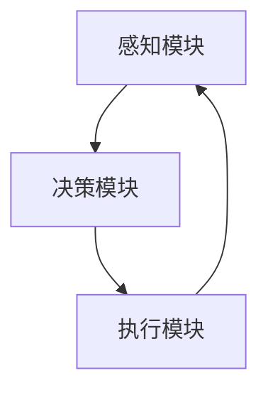

# LLM-based Agent

## 1. 背景介绍

### 1.1 人工智能的发展历程
#### 1.1.1 早期的人工智能
#### 1.1.2 机器学习的兴起  
#### 1.1.3 深度学习的突破

### 1.2 自然语言处理的进展
#### 1.2.1 早期的自然语言处理技术
#### 1.2.2 深度学习在自然语言处理中的应用
#### 1.2.3 Transformer模型的出现

### 1.3 大语言模型（LLM）的崛起
#### 1.3.1 GPT系列模型 
#### 1.3.2 BERT等预训练模型
#### 1.3.3 LLM的特点和优势

## 2. 核心概念与联系

### 2.1 Agent的定义和特点
#### 2.1.1 Agent的概念
#### 2.1.2 Agent的关键特征
#### 2.1.3 Agent与传统程序的区别

### 2.2 LLM在Agent中的作用
#### 2.2.1 LLM作为Agent的语言理解和生成模块
#### 2.2.2 LLM赋予Agent语言交互能力
#### 2.2.3 LLM为Agent提供知识和推理能力

### 2.3 LLM-based Agent的整体架构
#### 2.3.1 感知模块
#### 2.3.2 决策模块
#### 2.3.3 执行模块



## 3. 核心算法原理具体操作步骤

### 3.1 基于LLM的自然语言理解
#### 3.1.1 文本预处理
#### 3.1.2 Tokenization和Embedding
#### 3.1.3 上下文编码

### 3.2 基于LLM的对话管理
#### 3.2.1 对话状态跟踪
#### 3.2.2 对话策略学习
#### 3.2.3 回复生成

### 3.3 基于LLM的任务规划和执行
#### 3.3.1 任务分解
#### 3.3.2 动作序列生成
#### 3.3.3 执行监督和反馈

## 4. 数学模型和公式详细讲解举例说明

### 4.1 Transformer模型的数学原理
#### 4.1.1 Self-Attention机制
$Attention(Q,K,V) = softmax(\frac{QK^T}{\sqrt{d_k}})V$
#### 4.1.2 Multi-Head Attention
$$MultiHead(Q,K,V) = Concat(head_1, ..., head_h)W^O$$
$$head_i = Attention(QW_i^Q, KW_i^K, VW_i^V)$$
#### 4.1.3 位置编码
$PE_{(pos,2i)} = sin(pos/10000^{2i/d_{model}})$
$PE_{(pos,2i+1)} = cos(pos/10000^{2i/d_{model}})$

### 4.2 强化学习在对话策略中的应用
#### 4.2.1 Markov Decision Process（MDP）
$$S \times A \rightarrow P(S' | S, A)$$
$$R: S \times A \times S' \rightarrow \mathbb{R}$$
#### 4.2.2 Q-Learning算法
$$Q(s_t,a_t) \leftarrow Q(s_t,a_t) + \alpha [r_{t+1} + \gamma \max_a Q(s_{t+1},a) - Q(s_t,a_t)]$$
#### 4.2.3 策略梯度方法
$$\nabla_\theta J(\theta) = \mathbb{E}_{\tau \sim \pi_\theta}[\sum_{t=0}^T \nabla_\theta \log \pi_\theta(a_t|s_t) Q^{\pi_\theta}(s_t,a_t)]$$

## 5. 项目实践：代码实例和详细解释说明

### 5.1 使用Hugging Face Transformers库实现LLM
```python
from transformers import AutoTokenizer, AutoModelForCausalLM

tokenizer = AutoTokenizer.from_pretrained("gpt2")
model = AutoModelForCausalLM.from_pretrained("gpt2")

input_text = "Hello, how are you?"
input_ids = tokenizer.encode(input_text, return_tensors='pt')

output = model.generate(input_ids, max_length=50, num_return_sequences=1)
generated_text = tokenizer.decode(output[0], skip_special_tokens=True)

print(generated_text)
```

### 5.2 使用PyTorch实现Transformer模型
```python
import torch
import torch.nn as nn

class Transformer(nn.Module):
    def __init__(self, d_model, nhead, num_layers):
        super().__init__()
        self.encoder = TransformerEncoder(d_model, nhead, num_layers)
        self.decoder = TransformerDecoder(d_model, nhead, num_layers)
        
    def forward(self, src, tgt, src_mask=None, tgt_mask=None):
        encoder_output = self.encoder(src, src_mask)
        decoder_output = self.decoder(tgt, encoder_output, tgt_mask, None)
        return decoder_output
```

### 5.3 使用OpenAI Gym环境训练对话策略
```python
import gym
import numpy as np
from collections import deque

env = gym.make('DialogueEnv-v0')
q_table = np.zeros((env.observation_space.n, env.action_space.n))

for episode in range(1000):
    state = env.reset()
    done = False
    
    while not done:
        if np.random.uniform() < epsilon:
            action = env.action_space.sample()
        else:
            action = np.argmax(q_table[state])
            
        next_state, reward, done, _ = env.step(action)
        
        old_value = q_table[state, action]
        next_max = np.max(q_table[next_state])
        
        new_value = (1 - alpha) * old_value + alpha * (reward + gamma * next_max)
        q_table[state, action] = new_value
        
        state = next_state
```

## 6. 实际应用场景

### 6.1 智能客服
#### 6.1.1 客户咨询自动应答
#### 6.1.2 客户情绪分析与安抚
#### 6.1.3 个性化服务推荐

### 6.2 智能助手
#### 6.2.1 日程管理与提醒
#### 6.2.2 信息检索与知识问答  
#### 6.2.3 任务自动化执行

### 6.3 教育与培训
#### 6.3.1 智能教学助手
#### 6.3.2 个性化学习路径规划
#### 6.3.3 互动式练习与反馈

## 7. 工具和资源推荐

### 7.1 开源框架和库
#### 7.1.1 Hugging Face Transformers
#### 7.1.2 OpenAI Gym
#### 7.1.3 Rasa

### 7.2 预训练模型
#### 7.2.1 GPT-3
#### 7.2.2 BERT
#### 7.2.3 T5

### 7.3 数据集
#### 7.3.1 MultiWOZ
#### 7.3.2 Stanford Question Answering Dataset (SQuAD)
#### 7.3.3 Cornell Movie-Dialogs Corpus

## 8. 总结：未来发展趋势与挑战

### 8.1 LLM-based Agent的优势
#### 8.1.1 强大的语言理解和生成能力
#### 8.1.2 广泛的知识覆盖面
#### 8.1.3 灵活的任务适应性

### 8.2 未来发展方向
#### 8.2.1 多模态交互
#### 8.2.2 个性化和情感化
#### 8.2.3 知识的持续学习和更新

### 8.3 面临的挑战
#### 8.3.1 数据偏见和隐私问题
#### 8.3.2 可解释性和可控性
#### 8.3.3 伦理与安全考量

## 9. 附录：常见问题与解答

### 9.1 LLM-based Agent与传统的规则或检索型chatbot有何区别？
LLM-based Agent具有更强的语言理解和生成能力，能够处理更加开放和复杂的对话场景。传统chatbot通常基于预定义的规则或检索知识库，难以应对灵活多变的对话。

### 9.2 LLM-based Agent能否完全取代人工客服？
目前LLM-based Agent在很多场景下可以为人工客服提供辅助和支持，提高效率和服务质量。但在处理复杂问题和情感交互时，仍然需要人工客服的参与。未来随着技术的进步，LLM-based Agent有望承担更多的客服工作。

### 9.3 如何保证LLM-based Agent生成的内容的可靠性和安全性？
需要在训练数据和生成过程中加入必要的过滤和约束机制，避免生成有害、虚假或偏见的内容。同时要建立完善的人工审核和反馈机制，持续优化和更新模型。还需要在应用中提供明确的免责声明，告知用户生成内容的局限性。

作者：禅与计算机程序设计艺术 / Zen and the Art of Computer Programming