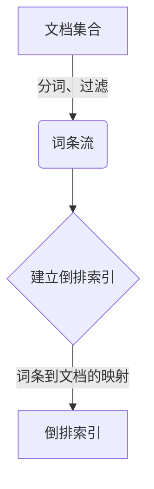
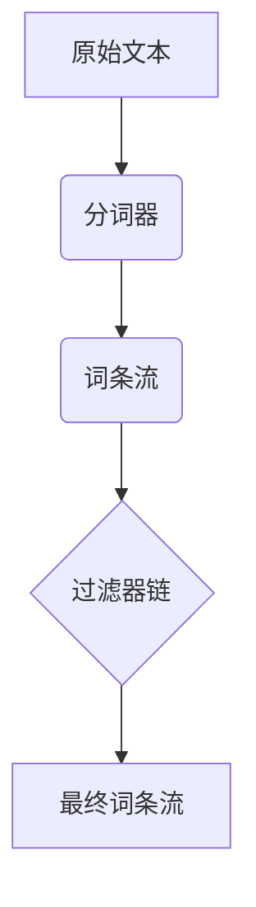
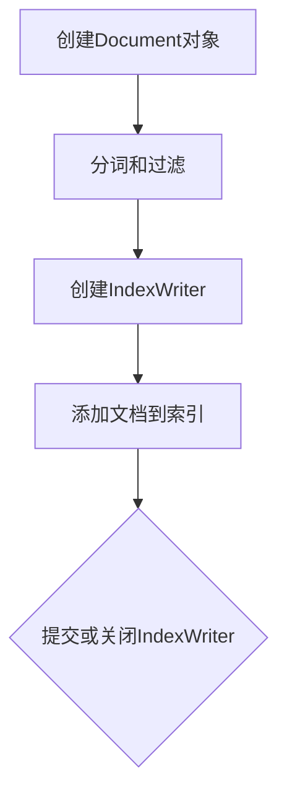
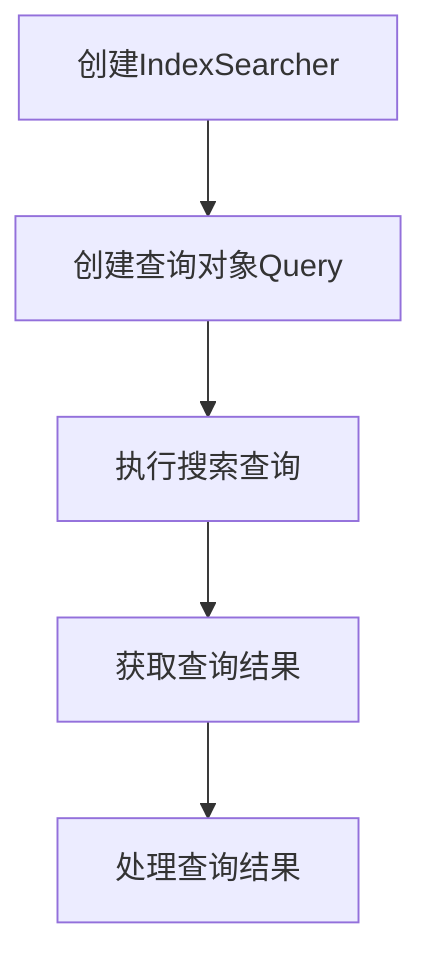

# Lucene原理与代码实例讲解

## 1.背景介绍

在当今信息时代,数据的爆炸性增长使得有效地存储、检索和处理海量数据成为一个巨大的挑战。作为一种高性能、可扩展的全文搜索引擎库,Lucene凭借其卓越的性能和灵活性,在企业级搜索应用中得到了广泛的应用。无论是构建网站搜索、电子商务平台、知识库还是日志分析系统,Lucene都可以提供强大的全文检索功能。

Lucene最初由Doug Cutting在1997年创建,最早是作为Apache Jakarta项目的一个子项目。随后,由于其优秀的性能和灵活性,Lucene迅速发展成为Apache软件基金会的一个顶级项目。目前,Lucene已成为事实上的全文搜索引擎标准,被广泛应用于各种领域,包括开源项目(如Elasticsearch、Solr)和商业产品(如Compass、Fast等)。

## 2.核心概念与联系

### 2.1 倒排索引(Inverted Index)

Lucene的核心是基于倒排索引的全文搜索引擎。倒排索引是一种将文档与其包含的词条相关联的数据结构,它可以快速找到包含特定词条的文档。与传统的正向索引相比,倒排索引将文档作为索引项,词条作为索引键,从而实现了高效的全文搜索。



### 2.2 分词器(Analyzer)

分词器是Lucene中一个非常重要的概念,它负责将文本分解为单个词条(term)的过程。Lucene提供了多种分词器,如标准分词器(StandardAnalyzer)、白空格分词器(WhitespaceAnalyzer)、英语分词器(EnglishAnalyzer)等。用户也可以自定义分词器以满足特定需求。



### 2.3 索引写入器(IndexWriter)

IndexWriter是Lucene中用于创建和修改索引的组件。它负责将文档的词条信息写入到倒排索引中,同时维护索引的结构和元数据。IndexWriter支持添加、更新和删除文档操作,并提供了事务控制和多线程写入等高级功能。

### 2.4 索引搜索器(IndexSearcher)

IndexSearcher是Lucene中用于执行搜索查询的组件。它可以从倒排索引中高效地检索与查询相匹配的文档,并根据相关性评分对结果进行排序。IndexSearcher支持各种查询类型,如词条查询、短语查询、布尔查询等,并提供了丰富的查询解析和优化功能。

### 2.5 查询解析器(QueryParser)

QueryParser是Lucene中用于解析查询字符串并生成查询对象的组件。它支持多种查询语法,如布尔运算符、通配符、短语查询等,并可以根据需要进行自定义扩展。QueryParser将用户输入的查询字符串转换为Lucene内部的查询对象,以便进行搜索操作。

## 3.核心算法原理具体操作步骤 

### 3.1 索引创建流程

1. **创建文档对象(Document)**: 首先,需要创建一个或多个Document对象,每个Document对象代表一个要索引的文档。Document由多个Field组成,每个Field存储文档的一个属性,如标题、内容、作者等。

2. **分词和过滤**: 对文档的文本内容进行分词和过滤处理,将其转换为一系列词条(Term)。Lucene提供了多种分词器(Analyzer)和过滤器(TokenFilter)供选择,也可以自定义实现。

3. **创建IndexWriter**: 创建IndexWriter对象,用于向索引中添加文档。IndexWriter负责管理索引的创建、更新和删除操作。

4. **添加文档到索引**: 使用IndexWriter的addDocument()方法将Document对象添加到索引中。IndexWriter会将文档的词条信息写入到倒排索引中。

5. **提交或关闭IndexWriter**: 在添加完所有文档后,可以调用IndexWriter的commit()方法将更改提交到索引中,或者调用close()方法关闭IndexWriter并自动提交。



### 3.2 搜索查询流程

1. **创建IndexSearcher**: 创建IndexSearcher对象,用于从索引中执行搜索查询。IndexSearcher提供了高效的搜索功能,可以从倒排索引中快速检索与查询相匹配的文档。

2. **创建查询对象(Query)**: 根据用户输入的查询字符串,使用QueryParser或其他方式创建查询对象(Query)。Query对象封装了搜索条件和查询语法。

3. **执行搜索查询**: 调用IndexSearcher的search()方法,传入查询对象(Query),执行搜索操作。search()方法会返回一个TopDocs对象,其中包含与查询匹配的文档ID列表和相关性评分。

4. **获取查询结果**: 遍历TopDocs中的文档ID列表,使用IndexSearcher的doc()方法获取每个文档的Document对象,从中提取所需的字段值。

5. **处理查询结果**: 根据需求对查询结果进行进一步处理,如排序、分页、高亮显示等。



## 4.数学模型和公式详细讲解举例说明

### 4.1 TF-IDF算法

在Lucene中,文档与查询的相关性评分主要基于TF-IDF(Term Frequency-Inverse Document Frequency)算法。TF-IDF算法综合考虑了词条在文档中出现的频率(Term Frequency)和词条在整个文档集合中的稀有程度(Inverse Document Frequency),从而计算出每个词条对文档的重要性。

#### 4.1.1 词条频率(Term Frequency)

词条频率(TF)是指一个给定的词条在文档中出现的次数。一般来说,一个词条在文档中出现的次数越多,它对该文档的重要性就越高。但是,词条的重要性不可能无限制地随着出现次数的增加而线性增长,因此需要对词条频率进行一定的归一化处理。Lucene使用以下公式计算归一化的词条频率:

$$
tf(t,d) = \frac{sqrt{freq(t,d)}}{norm(d)}
$$

其中:
- $t$ 表示词条(term)
- $d$ 表示文档(document)
- $freq(t,d)$ 表示词条 $t$ 在文档 $d$ 中出现的原始频率
- $norm(d)$ 是一个归一化因子,用于防止长文档过于占优势

#### 4.1.2 逆向文档频率(Inverse Document Frequency)

逆向文档频率(IDF)是一个衡量词条在整个文档集合中稀有程度的指标。一个在所有文档中广泛出现的词条,其重要性应当较低;而一个仅在少数文档中出现的词条,其重要性应当较高。IDF的计算公式如下:

$$
idf(t) = 1 + log\frac{N}{df(t)}
$$

其中:
- $t$ 表示词条(term)
- $N$ 表示文档集合中文档的总数
- $df(t)$ 表示包含词条 $t$ 的文档数量

#### 4.1.3 TF-IDF算法

将词条频率(TF)和逆向文档频率(IDF)相结合,即可得到TF-IDF算法,用于计算每个词条对文档的重要性:

$$
tfidf(t,d) = tf(t,d) \times idf(t)
$$

对于一个查询,Lucene会计算每个查询词条在每个文档中的TF-IDF值,然后将这些值相加,得到该文档与查询的相关性评分。评分越高,表示文档与查询的相关性越高。

### 4.2 矢量空间模型(Vector Space Model)

除了TF-IDF算法之外,Lucene还支持基于矢量空间模型(Vector Space Model)的相似度计算。在矢量空间模型中,每个文档和查询都被表示为一个高维向量,其中每个维度对应一个词条,值为该词条的TF-IDF值。文档与查询的相似度可以通过计算它们向量之间的夹角余弦值(cosine similarity)来衡量。

假设有一个文档向量 $\vec{d}$ 和一个查询向量 $\vec{q}$,它们的夹角余弦相似度可以用以下公式计算:

$$
sim(\vec{d},\vec{q}) = \frac{\vec{d} \cdot \vec{q}}{|\vec{d}||\vec{q}|} = \frac{\sum_{i=1}^{n}d_iq_i}{\sqrt{\sum_{i=1}^{n}d_i^2}\sqrt{\sum_{i=1}^{n}q_i^2}}
$$

其中:
- $n$ 表示向量的维数(词条数量)
- $d_i$ 和 $q_i$ 分别表示文档向量和查询向量在第 $i$ 个维度上的值(即第 $i$ 个词条的TF-IDF值)

夹角余弦相似度的取值范围为 $[0,1]$,值越大表示文档与查询越相似。

## 5.项目实践：代码实例和详细解释说明

以下是一个使用Lucene进行索引创建和搜索查询的Java代码示例,并对关键步骤进行了详细注释说明。

```java
import org.apache.lucene.analysis.standard.StandardAnalyzer;
import org.apache.lucene.document.Document;
import org.apache.lucene.document.Field;
import org.apache.lucene.document.TextField;
import org.apache.lucene.index.DirectoryReader;
import org.apache.lucene.index.IndexReader;
import org.apache.lucene.index.IndexWriter;
import org.apache.lucene.index.IndexWriterConfig;
import org.apache.lucene.queryparser.classic.QueryParser;
import org.apache.lucene.search.IndexSearcher;
import org.apache.lucene.search.Query;
import org.apache.lucene.search.ScoreDoc;
import org.apache.lucene.search.TopDocs;
import org.apache.lucene.store.Directory;
import org.apache.lucene.store.RAMDirectory;

import java.io.IOException;

public class LuceneExample {

    private static final String CONTENTS = "contents";

    public static void main(String[] args) throws IOException {
        // 创建内存索引目录
        Directory indexDir = new RAMDirectory();

        // 创建索引写入器
        IndexWriterConfig config = new IndexWriterConfig(new StandardAnalyzer());
        IndexWriter indexWriter = new IndexWriter(indexDir, config);

        // 创建并添加文档到索引
        indexWriter.addDocument(createDocument("This is a test document."));
        indexWriter.addDocument(createDocument("Another test document."));

        // 关闭索引写入器
        indexWriter.close();

        // 创建索引搜索器
        IndexReader indexReader = DirectoryReader.open(indexDir);
        IndexSearcher indexSearcher = new IndexSearcher(indexReader);

        // 创建查询解析器
        QueryParser queryParser = new QueryParser(CONTENTS, new StandardAnalyzer());

        // 执行搜索查询
        Query query = queryParser.parse("test");
        TopDocs topDocs = indexSearcher.search(query, 10);

        // 输出搜索结果
        System.out.println("Found " + topDocs.totalHits + " documents:");
        for (ScoreDoc scoreDoc : topDocs.scoreDocs) {
            Document doc = indexSearcher.doc(scoreDoc.doc);
            System.out.println(doc.get(CONTENTS));
        }

        // 关闭索引搜索器和索引读取器
        indexReader.close();
    }

    private static Document createDocument(String contents) {
        Document doc = new Document();
        doc.add(new TextField(CONTENTS, contents, Field.Store.YES));
        return doc;
    }
}
```

代码解释:

1. 创建内存索引目录`RAMDirectory`用于存储索引数据。

2. 创建`IndexWriterConfig`对象,并使用`StandardAnalyzer`作为分词器。

3. 创建`IndexWriter`对象,并将其与索引目录关联。

4. 使用`createDocument`方法创建两个`Document`对象,每个文档包含一个`TextField`字段,用于存储文本内容。

5. 调用`IndexWriter`的`addDocument`方法将文档添加到索引中。

6. 关闭`IndexWriter`以提交索引更改