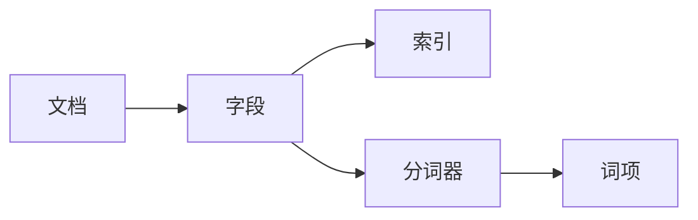

# Lucene原理与代码实例讲解

## 1. 背景介绍
在信息爆炸的时代，如何从海量数据中快速准确地检索出所需信息，成为了一个亟待解决的问题。Apache Lucene作为一个高性能、可扩展的信息检索(IR)库，广泛应用于各种搜索引擎和企业内部搜索中。它提供了一个简单却强大的应用程序接口(API)，使得开发者能够构建索引和执行搜索，而无需深入了解其底层复杂的实现细节。

## 2. 核心概念与联系
在深入Lucene之前，我们需要理解几个核心概念及其之间的联系：

- **文档(Document)**: 在Lucene中，文档是信息检索的基本单位，它可以包含多个不同的字段(Field)。
- **字段(Field)**: 字段是文档的一个属性，比如标题、作者、内容等，字段可以是存储的(Stored)，也可以是索引的(Indexed)。
- **索引(Index)**: 索引是通过对文档中的字段进行索引构建的数据结构，它使得我们能够快速检索文档。
- **分词器(Tokenizer)**: 分词器负责将字段文本拆分成一系列的词项(Term)。
- **词项(Term)**: 词项是文档中的一个单词，是搜索的基本单位。



## 3. 核心算法原理具体操作步骤
Lucene的核心算法原理可以分为索引构建和搜索查询两部分：

### 索引构建
1. **文档处理**: 将待索引的文档分解成字段。
2. **文本分词**: 对每个字段的文本内容进行分词处理，生成词项。
3. **索引创建**: 根据词项创建倒排索引(Inverted Index)。

### 搜索查询
1. **查询解析**: 将用户输入的查询字符串解析成查询对象。
2. **查询执行**: 在索引中查找匹配的文档。
3. **结果排序**: 根据相关性对匹配的文档进行排序。

## 4. 数学模型和公式详细讲解举例说明
在Lucene中，文档的相关性评分是通过一个数学模型来计算的，该模型基于向量空间模型(Vector Space Model)和布尔模型(Boolean Model)。

### 相关性评分公式
$$
score(q, d) = coord(q, d) \cdot queryNorm(q) \cdot \sum_{t \in q} (tf(t \in d) \cdot idf(t)^2 \cdot termBoost(t) \cdot norm(t, d))
$$

其中：
- $q$ 是查询
- $d$ 是文档
- $coord(q, d)$ 是查询和文档匹配词项的比例
- $queryNorm(q)$ 是查询规范化因子
- $tf(t \in d)$ 是词项$t$在文档$d$中的频率
- $idf(t)$ 是词项$t$的逆文档频率
- $termBoost(t)$ 是词项$t$的提升因子
- $norm(t, d)$ 是字段长度规范化因子

通过这个公式，Lucene能够计算出查询和每个文档的相关性评分，从而对搜索结果进行排序。

## 5. 项目实践：代码实例和详细解释说明
为了更好地理解Lucene的工作原理，我们将通过一个简单的代码示例来展示如何使用Lucene创建索引和执行搜索。

### 创建索引
```java
import org.apache.lucene.analysis.standard.StandardAnalyzer;
import org.apache.lucene.document.*;
import org.apache.lucene.index.IndexWriter;
import org.apache.lucene.index.IndexWriterConfig;
import org.apache.lucene.store.Directory;
import org.apache.lucene.store.RAMDirectory;

public class LuceneIndexingExample {
    public static void main(String[] args) throws IOException {
        // 创建内存索引库
        Directory directory = new RAMDirectory();
        // 使用标准分词器
        StandardAnalyzer analyzer = new StandardAnalyzer();
        // 配置IndexWriter
        IndexWriterConfig config = new IndexWriterConfig(analyzer);
        // 创建IndexWriter
        IndexWriter iwriter = new IndexWriter(directory, config);
        
        // 创建文档并添加字段
        Document doc = new Document();
        doc.add(new StringField("title", "Lucene in Action", Field.Store.YES));
        doc.add(new TextField("content", "Lucene is a powerful search library", Field.Store.YES));
        
        // 将文档写入索引
        iwriter.addDocument(doc);
        iwriter.close();
    }
}
```

### 执行搜索
```java
import org.apache.lucene.analysis.standard.StandardAnalyzer;
import org.apache.lucene.document.Document;
import org.apache.lucene.index.DirectoryReader;
import org.apache.lucene.queryparser.classic.QueryParser;
import org.apache.lucene.search.*;
import org.apache.lucene.store.Directory;

public class LuceneSearchingExample {
    public static void main(String[] args) throws Exception {
        // 创建内存索引库
        Directory directory = new RAMDirectory();
        // 使用标准分词器
        StandardAnalyzer analyzer = new StandardAnalyzer();
        // 创建IndexReader
        DirectoryReader ireader = DirectoryReader.open(directory);
        // 创建IndexSearcher
        IndexSearcher isearcher = new IndexSearcher(ireader);
        
        // 解析查询字符串
        QueryParser parser = new QueryParser("content", analyzer);
        Query query = parser.parse("powerful");
        
        // 执行搜索
        ScoreDoc[] hits = isearcher.search(query, 10).scoreDocs;
        // 遍历搜索结果
        for (ScoreDoc hit : hits) {
            Document hitDoc = isearcher.doc(hit.doc);
            System.out.println(hitDoc.get("title"));
        }
        ireader.close();
        directory.close();
    }
}
```

在这个示例中，我们首先创建了一个索引，并向其中添加了一个包含标题和内容字段的文档。然后，我们执行了一个简单的搜索查询，并打印出匹配的文档标题。

## 6. 实际应用场景
Lucene被广泛应用于各种场景，包括但不限于：

- **网站搜索**: 提供网站内部的内容搜索功能。
- **企业搜索**: 帮助企业内部检索文档、邮件和数据库中的信息。
- **电子商务**: 在电商平台上为用户提供商品搜索服务。
- **数据分析**: 分析大量文本数据，提取有价值的信息。

## 7. 工具和资源推荐
为了更好地使用Lucene，以下是一些有用的工具和资源：

- **Apache Lucene官方网站**: 提供最新的Lucene版本和文档。
- **Lucene in Action**: 一本深入讲解Lucene使用和原理的书籍。
- **Elasticsearch**: 基于Lucene构建的开源搜索和分析引擎。
- **Solr**: 另一个流行的开源搜索平台，基于Lucene。

## 8. 总结：未来发展趋势与挑战
随着人工智能和机器学习技术的发展，Lucene和搜索技术的未来将更加智能化和个性化。挑战包括处理更加复杂的查询、提高搜索的准确性和速度、以及保护用户隐私。

## 9. 附录：常见问题与解答
**Q1: Lucene和数据库有什么区别？**
A1: Lucene是一个全文搜索库，专注于文本检索，而数据库是用于存储和管理数据的系统，通常支持结构化查询语言(SQL)。

**Q2: Lucene如何保证索引的实时性？**
A2: Lucene通过近实时搜索(Near Real-Time Search)功能，可以在文档被索引后很短的时间内就可被搜索到。

**Q3: Lucene的性能如何优化？**
A3: 可以通过优化索引结构、使用更高效的分词器和查询缓存等方法来提高Lucene的性能。

作者：禅与计算机程序设计艺术 / Zen and the Art of Computer Programming