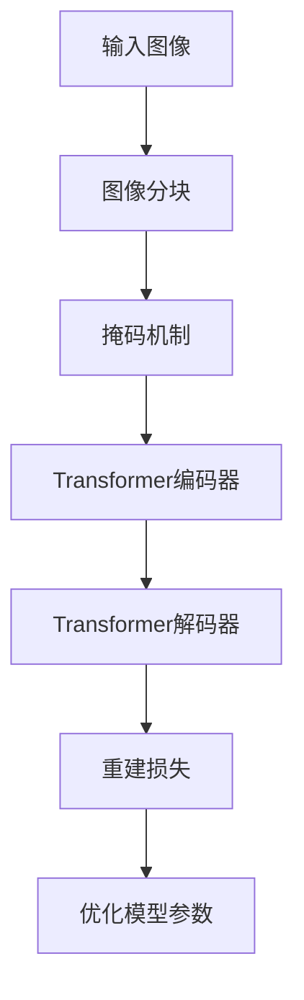

# MAE特征与注意力机制的时空融合

## 1. 背景介绍

随着深度学习在计算机视觉领域的蓬勃发展,基于注意力机制的视觉Transformer模型展现出了卓越的性能。然而,传统的Transformer架构通常只关注图像的空间维度,而忽视了时间维度的信息。为了解决这一问题,MAE(Masked Autoencoders)被提出,旨在融合时间和空间两个维度的特征,从而提高视觉理解的准确性和鲁棒性。

## 2. 核心概念与联系

### 2.1 注意力机制(Attention Mechanism)

注意力机制是深度学习中一种广泛应用的技术,它允许模型在处理输入数据时,动态地分配不同的注意力权重。这种机制有助于模型关注输入数据中最相关的部分,从而提高模型的性能和解释能力。

### 2.2 Transformer

Transformer是一种基于注意力机制的序列到序列模型,最初被应用于自然语言处理领域。它通过自注意力(Self-Attention)机制捕捉输入序列中元素之间的长程依赖关系,从而有效地建模序列数据。

### 2.3 视觉Transformer

视觉Transformer是将Transformer应用于计算机视觉任务的一种方法。它将图像分割为多个patch(图像块),并将这些patch序列化输入到Transformer模型中。通过自注意力机制,视觉Transformer能够学习图像中不同区域之间的关系,从而提高对视觉数据的理解能力。

### 2.4 MAE(Masked Autoencoders)

MAE是一种新型的自监督学习方法,它通过掩码机制随机遮挡输入图像的一部分区域,然后训练模型重建被遮挡的区域。这种方法可以促使模型学习到更加丰富和鲁棒的视觉表示。

## 3. 核心算法原理具体操作步骤

MAE的核心算法原理可以分为以下几个步骤:

1. **图像分块(Image Patching)**:将输入图像分割为多个patch,每个patch代表图像的一个小区域。

2. **掩码机制(Masking)**:随机选择一部分patch,并将它们的像素值设置为0(掩码)。

3. **编码器(Encoder)**:将未被掩码的patch输入到Transformer编码器中,生成对应的特征表示。

4. **解码器(Decoder)**:将编码器的输出特征作为条件,通过Transformer解码器重建被掩码的patch。

5. **重建损失(Reconstruction Loss)**:计算重建的patch与原始patch之间的差异,作为模型的训练目标。

通过这种自监督的方式,MAE可以学习到图像的丰富表示,而无需依赖大量的人工标注数据。



## 4. 数学模型和公式详细讲解举例说明

MAE的核心思想是通过重建被掩码的图像区域来学习视觉表示。我们可以使用均方误差(Mean Squared Error, MSE)作为重建损失函数:

$$\mathcal{L}_\text{recon} = \frac{1}{N} \sum_{i=1}^{N} \left\lVert \hat{x}_i - x_i \right\rVert_2^2$$

其中,
- $N$是被掩码的patch数量
- $\hat{x}_i$是重建的patch
- $x_i$是原始的patch

为了提高模型的泛化能力,MAE还引入了一个额外的正则化项,即掩码比例损失(Masking Ratio Loss):

$$\mathcal{L}_\text{ratio} = \left\lVert m - \alpha \right\rVert_2^2$$

其中,
- $m$是实际的掩码比例
- $\alpha$是目标掩码比例(通常设置为0.75)

最终的损失函数是重建损失和掩码比例损失的加权和:

$$\mathcal{L} = \mathcal{L}_\text{recon} + \lambda \mathcal{L}_\text{ratio}$$

其中$\lambda$是一个超参数,用于平衡两个损失项的重要性。

通过最小化这个损失函数,MAE可以学习到鲁棒和丰富的视觉表示,从而提高在下游任务(如图像分类、目标检测等)上的性能。

## 5. 项目实践:代码实例和详细解释说明

以下是一个使用PyTorch实现MAE的简单示例:

```python
import torch
import torch.nn as nn
import torch.nn.functional as F

# 定义MAE模型
class MAE(nn.Module):
    def __init__(self, patch_size, embed_dim, encoder_depth, decoder_depth, num_heads, mask_ratio=0.75):
        super().__init__()
        self.patch_size = patch_size
        self.embed_dim = embed_dim
        self.encoder_depth = encoder_depth
        self.decoder_depth = decoder_depth
        self.num_heads = num_heads
        self.mask_ratio = mask_ratio

        # 图像分块
        self.patch_embed = nn.Conv2d(3, embed_dim, kernel_size=patch_size, stride=patch_size)

        # 编码器和解码器
        self.encoder = nn.TransformerEncoder(nn.TransformerEncoderLayer(embed_dim, num_heads), encoder_depth)
        self.decoder = nn.TransformerDecoder(nn.TransformerDecoderLayer(embed_dim, num_heads), decoder_depth)

        # 重建头
        self.recon_head = nn.Linear(embed_dim, patch_size ** 2 * 3)

    def forward(self, x):
        # 图像分块
        patches = self.patch_embed(x).flatten(2).transpose(1, 2)  # (batch_size, embed_dim, num_patches)

        # 掩码机制
        mask = torch.bernoulli(torch.full(patches.shape[:2], self.mask_ratio)).unsqueeze(-1)
        unmasked_patches = patches * (1 - mask)
        masked_patches = patches * mask

        # 编码器
        encoded = self.encoder(unmasked_patches)

        # 解码器
        decoded = self.decoder(masked_patches, encoded)

        # 重建
        recon = self.recon_head(decoded).transpose(1, 2).reshape(x.shape)

        return recon

# 示例用法
model = MAE(patch_size=16, embed_dim=512, encoder_depth=6, decoder_depth=6, num_heads=8)
input_image = torch.randn(1, 3, 224, 224)  # 输入图像
recon_image = model(input_image)  # 重建图像
```

在这个示例中,我们定义了一个MAE模型,它包含以下几个主要组件:

1. `patch_embed`:将输入图像分割为多个patch,并将每个patch映射到一个embedding向量。
2. `encoder`:基于Transformer编码器,对未被掩码的patch进行编码,生成特征表示。
3. `decoder`:基于Transformer解码器,利用编码器的输出和被掩码的patch,重建被掩码的区域。
4. `recon_head`:将解码器的输出映射回原始图像的像素空间,得到重建的图像。

在`forward`函数中,我们首先将输入图像分块并应用掩码机制。然后,将未被掩码的patch输入编码器,得到编码特征。接下来,将被掩码的patch和编码特征输入解码器,得到重建的patch。最后,通过`recon_head`将重建的patch映射回原始图像空间,得到最终的重建图像。

通过这个示例,我们可以看到MAE的核心思想是利用自监督的方式,通过重建被掩码的图像区域来学习丰富的视觉表示。

## 6. 实际应用场景

MAE作为一种自监督学习方法,可以广泛应用于各种计算机视觉任务,例如:

1. **图像分类(Image Classification)**:通过在大型数据集上预训练MAE模型,可以获得强大的视觉表示能力。然后,将预训练的MAE模型作为初始化权重,在下游的图像分类任务上进行微调,可以显著提高分类性能。

2. **目标检测(Object Detection)**:MAE可以捕捉图像中不同区域之间的关系,这对于目标检测任务非常有帮助。我们可以将MAE与现有的目标检测模型(如Faster R-CNN)结合,提高检测精度。

3. **语义分割(Semantic Segmentation)**:MAE学习到的丰富视觉表示可以很好地捕捉图像的语义信息,有助于像素级别的语义分割任务。

4. **图像生成(Image Generation)**:MAE的解码器可以用于生成高质量的图像,这为图像生成任务提供了一种新的思路。

5. **视频理解(Video Understanding)**:由于MAE融合了时间和空间两个维度的特征,因此它在视频理解任务(如动作识别、视频描述等)中具有潜在的应用前景。

总的来说,MAE作为一种通用的自监督学习框架,为各种计算机视觉任务提供了强大的视觉表示能力,并有望推动这些领域的进一步发展。

## 7. 工具和资源推荐

如果您对MAE感兴趣并希望进一步探索,以下是一些推荐的工具和资源:

1. **开源实现**:
   - [MAE官方实现(PyTorch)](https://github.com/facebookresearch/mae)
   - [MAE第三方实现(TensorFlow)](https://github.com/sayannath/MAE-TensorFlow)

2. **预训练模型**:
   - [Facebook AI Research提供的预训练MAE模型](https://github.com/facebookresearch/mae#pretrained-models)
   - [HuggingFace提供的预训练MAE模型](https://huggingface.co/models?search=mae)

3. **教程和博客**:
   - [MAE论文解读(中文)](https://zhuanlan.zhihu.com/p/461520173)
   - [MAE入门教程(英文)](https://www.analyticsvidhya.com/blog/2022/05/a-gentle-introduction-to-masked-autoencoders-mae/)
   - [MAE在计算机视觉中的应用(英文)](https://towardsdatascience.com/masked-autoencoders-for-computer-vision-tasks-4c0d1e6b1e74)

4. **视频资源**:
   - [MAE论文讲解(英文)](https://www.youtube.com/watch?v=RI_Q8qvY9bk)
   - [MAE在PyTorch中的实现(英文)](https://www.youtube.com/watch?v=xVgmJxsxvxM)

5. **相关论文**:
   - [MAE原论文](https://arxiv.org/abs/2111.06377)
   - [MAE在视频理解中的应用](https://arxiv.org/abs/2201.08383)
   - [MAE在图像生成中的应用](https://arxiv.org/abs/2205.08073)

通过利用这些工具和资源,您可以更深入地了解MAE的原理和实现细节,并将其应用于实际的计算机视觉任务中。

## 8. 总结:未来发展趋势与挑战

MAE作为一种新兴的自监督学习方法,在计算机视觉领域展现出了巨大的潜力。然而,它也面临一些挑战和未来的发展方向:

1. **高效的预训练策略**:MAE的预训练过程通常需要大量的计算资源和时间。探索更高效的预训练策略,以缩短训练时间和降低计算开销,是未来的一个重要方向。

2. **多模态融合**:MAE目前主要关注视觉数据,将其与其他模态(如文本、语音等)进行融合,可以进一步提高模型的理解能力。

3. **注意力机制的改进**:尽管注意力机制在MAE中发挥了关键作用,但它也存在一些局限性,如注意力漂移和计算复杂度高等问题。探索新型的注意力机制或替代方案,可能会进一步提升MAE的性能。

4. **理论基础的深入研究**:MAE背后的理论基础还有待进一步探索和完善,例如掩码机制对模型性能的影响、不同掩码策略的优缺点等。

5. **泛化能力的提高**:虽然MAE展现出了良好的泛化能力,但在一些极端情况下(如噪声、遮挡等),它的性能可能会受到影响。提高MAE在各种环境下的鲁棒性和泛化能力是一个重要的挑战。

6. **应用范围的扩展**:MAE目前主要应用于计算机视觉领域,将其原理和思想扩展到其他领域(如自然语言处理、语音识别等),可能会带来新的突破和发现。

总的来说,MAE作为一种创新的自