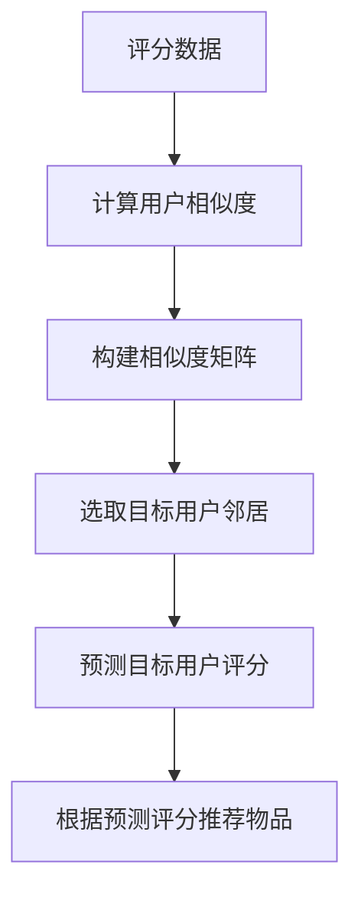

# Mahout推荐算法原理与代码实例讲解

## 1.背景介绍

### 1.1 推荐系统的重要性

在当今信息时代,我们被海量的数据所包围,但真正对我们有价值的信息却很少。推荐系统的出现正是为了解决这一问题,它能够根据用户的兴趣爱好、历史行为等数据,为用户推荐感兴趣的商品、信息或内容,从而提高用户的使用体验和系统的转化率。

推荐系统已广泛应用于电商网站、视频网站、新闻资讯、社交网络等多个领域,成为了提高用户粘性和营收的重要手段。以亚马逊为例,其个性化推荐系统可以为用户推荐感兴趣的图书、电子产品等,个性化推荐功能可以带来30%的销售收入。

### 1.2 Mahout简介

Apache Mahout是一个可扩展的机器学习库,旨在帮助开发人员更容易地创建智能应用程序。它大量使用了Apache Hadoop库,并在其之上实现了一些核心的机器学习算法,支持四大核心功能:推荐、聚类、分类和挖掘频繁项集。

Mahout中的推荐引擎包含了多种常用的推荐算法,如基于用户的协同过滤、基于物品的协同过滤、基于矩阵分解的协同过滤等,可以满足不同场景下的推荐需求。本文将重点介绍Mahout中的推荐算法原理及其实现细节。

## 2.核心概念与联系

在介绍具体算法之前,我们先了解一些推荐系统中的核心概念:

### 2.1 用户-物品评分矩阵

推荐系统的数据通常以用户-物品评分矩阵的形式存在,如下所示:

```
       物品1 物品2 物品3 物品4
用户A   4     ?     2     3
用户B   ?     5     ?     ?  
用户C   ?     ?     4     ?
用户D   ?     2     ?     5
```

其中"?"表示用户对该物品没有评分记录。评分矩阵是一个稀疏矩阵,我们的目标是基于已知的评分数据,预测用户对未评分物品的可能评分,从而为用户推荐感兴趣的物品。

### 2.2 相似度计算

推荐算法的核心在于计算用户或物品之间的相似度。常用的相似度计算方法有:

1. **欧氏距离**
2. **皮尔逊相关系数**
3. **余弦相似度**
4. **调整余弦相似度**

其中,皮尔逊相关系数和调整余弦相似度是最常用的相似度计算方法。

### 2.3 推荐算法分类

推荐算法主要分为以下几类:

- **协同过滤算法**
  - 基于用户的协同过滤
  - 基于物品的协同过滤
  - 基于模型的协同过滤(矩阵分解)
- **基于内容的推荐**
- **混合推荐算法**

其中,协同过滤算法是推荐系统中应用最广泛的一类算法。

## 3.核心算法原理具体操作步骤

### 3.1 基于用户的协同过滤算法

基于用户的协同过滤算法的核心思想是,对于目标用户,找到与其有相似兴趣爱好的其他用户,然后根据这些"相邻用户"对物品的评分情况,为目标用户推荐物品。算法步骤如下:

1. **计算用户之间的相似度**
   通常使用皮尔逊相关系数或调整余弦相似度来计算任意两个用户之间的相似度。
2. **构建用户相似度矩阵**
   将所有用户两两之间的相似度值存储到一个矩阵中。
3. **选取与目标用户最相似的N个用户作为邻居**
   从相似度矩阵中选取与目标用户相似度值最高的N个用户作为邻居。
4. **预测评分并推荐物品**
   基于这些邻居用户对物品的评分情况,为目标用户预测对未评分物品的可能评分,并根据预测评分从高到低推荐物品。

该算法的优点是简单、高效,但缺点是无法处理新增用户和新增物品的"冷启动"问题。

### 3.2 基于物品的协同过滤算法  

基于物品的协同过滤算法与基于用户的算法类似,只是计算相似度的对象从用户变成了物品。算法步骤如下:

1. **计算物品之间的相似度**
   使用调整余弦相似度等方法计算任意两个物品之间的相似度。
2. **构建物品相似度矩阵**
3. **选取与目标物品最相似的N个物品作为邻居**
4. **预测评分并推荐物品**
   基于目标用户对这些邻居物品的评分情况,预测该用户对目标物品的可能评分,并根据预测评分从高到低推荐物品。

该算法的优点是可以有效解决"冷启动"问题,但缺点是计算量较大,对于商品数量较多的场景可能会效率低下。

### 3.3 基于矩阵分解的协同过滤算法

基于模型的协同过滤算法中,最常用的就是基于矩阵分解的算法。它的核心思想是将用户-物品评分矩阵拆分为两个低维稠密矩阵的乘积,从而发现用户和物品的潜在因子,并基于这些潜在因子计算预测评分。

具体来说,算法会将用户-物品评分矩阵R近似拆分为两个矩阵P和Q的乘积:

$$R \approx P^TQ$$

其中P是一个$n*k$矩阵,对应着n个用户的k个隐含特征;Q是一个$m*k$矩阵,对应着m个物品的k个隐含特征。通过优化P和Q,使得$P^TQ$足够逼近R,就可以基于P和Q计算预测评分并推荐物品了。

常见的矩阵分解算法包括:

- **基于正则化的最小二乘法(RegSVD)**
- **基于梯度下降的最小二乘法(FunkSVD)**
- **基于交替最小二乘的隐语义模型(ALS-WR)**
- **非负矩阵分解(NMF)**

这些算法在计算复杂度、收敛速度、准确性等方面各有特点,需要根据实际场景进行选择。

### 3.4 算法流程图

以基于用户的协同过滤算法为例,其核心流程可用如下Mermaid流程图表示:



## 4.数学模型和公式详细讲解举例说明

### 4.1 相似度计算公式

常用的相似度计算公式有:

1. **欧氏距离**

   欧氏距离用于计算两个向量之间的距离,距离越小则相似度越高。对于两个用户$u$和$v$,欧氏距离定义为:

   $$dist(u,v) = \sqrt{\sum_{i \in I}(r_{ui} - r_{vi})^2}$$

   其中$I$是两个用户都评分过的物品集合,$r_{ui}$和$r_{vi}$分别表示用户$u$和$v$对物品$i$的评分。

2. **皮尔逊相关系数**

   皮尔逊相关系数用于衡量两个变量之间的线性相关程度,取值范围在[-1,1]之间。对于两个用户$u$和$v$,皮尔逊相关系数定义为:

   $$w_{uv} = \frac{\sum_{i \in I}(r_{ui} - \overline{r_u})(r_{vi} - \overline{r_v})}{\sqrt{\sum_{i \in I}(r_{ui} - \overline{r_u})^2}\sqrt{\sum_{i \in I}(r_{vi} - \overline{r_v})^2}}$$

   其中$\overline{r_u}$和$\overline{r_v}$分别表示用户$u$和$v$的平均评分。

3. **余弦相似度**

   余弦相似度用于计算两个向量的夹角余弦值,取值范围在[0,1]之间。对于两个物品$i$和$j$,余弦相似度定义为:

   $$sim(i,j) = \frac{\sum_{u \in U}r_{ui}r_{uj}}{\sqrt{\sum_{u \in U}r_{ui}^2}\sqrt{\sum_{u \in U}r_{uj}^2}}$$

   其中$U$是所有对物品$i$和$j$都评分过的用户集合。

4. **调整余弦相似度**

   调整余弦相似度在余弦相似度的基础上,对评分数据进行了去中心化处理,从而提高了准确性。对于两个物品$i$和$j$,调整余弦相似度定义为:

   $$sim(i,j) = \frac{\sum_{u \in U}(r_{ui} - \overline{r_u})(r_{uj} - \overline{r_u})}{\sqrt{\sum_{u \in U}(r_{ui} - \overline{r_u})^2}\sqrt{\sum_{u \in U}(r_{uj} - \overline{r_u})^2}}$$

   其中$\overline{r_u}$表示用户$u$的平均评分。

这些公式可以根据具体场景进行选择和调整。比如,对于评分数据存在较大用户偏置的情况,使用调整余弦相似度会更加合适。

### 4.2 矩阵分解模型

在基于矩阵分解的协同过滤算法中,我们需要优化矩阵P和Q,使得$P^TQ$足够逼近原始评分矩阵R。常用的优化目标函数如下:

$$\min_{P,Q} = \sum_{(u,i) \in R}(r_{ui} - p_u^Tq_i)^2 + \lambda(\|P\|^2 + \|Q\|^2)$$

其中:
- $r_{ui}$是用户$u$对物品$i$的实际评分
- $p_u$是用户$u$的隐含特征向量
- $q_i$是物品$i$的隐含特征向量
- $\lambda$是正则化系数,用于防止过拟合

不同的优化算法对该目标函数的求解方式不同,比如:

- **基于正则化的最小二乘法(RegSVD)**使用奇异值分解(SVD)的方式求解
- **基于梯度下降的最小二乘法(FunkSVD)**使用梯度下降的方式迭代求解
- **基于交替最小二乘的隐语义模型(ALS-WR)**使用交替最小二乘的方式迭代求解

以FunkSVD算法为例,它的梯度下降更新规则为:

$$\begin{align*}
p_u &\gets p_u + \gamma\left((r_{ui} - p_u^Tq_i)q_i - \lambda p_u\right)\\
q_i &\gets q_i + \gamma\left((r_{ui} - p_u^Tq_i)p_u - \lambda q_i\right)
\end{align*}$$

其中$\gamma$是学习率。通过不断迭代更新$p_u$和$q_i$,直到目标函数收敛,就可以得到最终的隐含特征矩阵P和Q。

### 4.3 评估指标

为了评估推荐算法的效果,我们通常使用以下几种指标:

1. **平均绝对误差(MAE)** 

   MAE用于评估预测评分与实际评分之间的平均误差,值越小表示预测效果越好。

   $$MAE = \frac{\sum_{(u,i) \in T}|r_{ui} - \hat{r}_{ui}|}{|T|}$$

   其中$T$是测试集,$r_{ui}$是实际评分,$\hat{r}_{ui}$是预测评分。

2. **均方根误差(RMSE)**

   RMSE也用于评估预测评分与实际评分之间的误差,与MAE的区别是对误差进行了平方处理,对异常点更加敏感。

   $$RMSE = \sqrt{\frac{\sum_{(u,i) \in T}(r_{ui} - \hat{r}_{ui})^2}{|T|}}$$

3. **准确率(Precision)和召回率(Recall)**

   这两个指标常用于评估推荐系统的效果,其中准确率表示推荐物品中