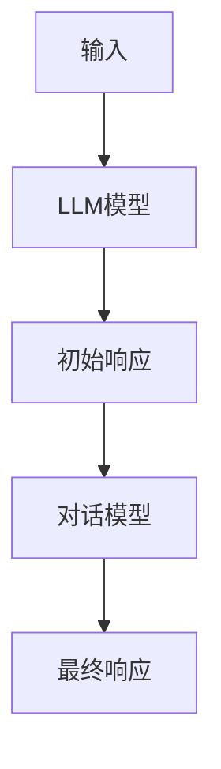

# Megatron-Turing NLG原理与代码实例讲解

## 1.背景介绍

### 1.1 自然语言生成(NLG)的重要性

在当今的数字时代,人工智能技术正在迅速发展,自然语言处理(NLP)已成为其中的关键领域之一。NLP旨在使计算机能够理解和生成人类语言,而自然语言生成(NLG)则是NLP的一个重要分支,专注于根据结构化数据自动生成自然语言文本。

NLG技术在诸多领域发挥着重要作用,例如:

- 数据解释和报告自动生成
- 对话系统和虚拟助手
- 内容创作和新闻撰写
- 说明文档和指令生成
- 广告和营销文案创作

随着大数据和人工智能的不断发展,NLG技术将变得越来越重要,因为它可以帮助人类从海量数据中提取有价值的见解,并以自然语言的形式呈现出来。

### 1.2 Megatron-Turing NLG的重要性

Megatron-Turing NLG是一种先进的自然语言生成模型,由谷歌的人工智能研究团队开发。它结合了大型语言模型(如GPT-3)的强大生成能力和对话模型的互动性,旨在生成高质量、上下文相关的自然语言响应。

Megatron-Turing NLG的主要特点包括:

- 基于大规模语料库训练,具有广博的知识
- 支持多轮对话,能够理解和跟踪上下文
- 生成流畅、连贯、富有内涵的自然语言
- 可控性强,能够根据需求调整生成风格和内容

该模型在各种NLG应用中表现出色,如对话系统、内容创作、数据解释等,因此受到了广泛关注。本文将深入探讨Megatron-Turing NLG的核心原理、算法和实现细节,并通过代码示例加深读者的理解。

## 2.核心概念与联系

### 2.1 自然语言生成(NLG)

自然语言生成(NLG)是一种将结构化数据转换为自然语言文本的技术。它通常包括以下几个关键步骤:

1. **数据分析**: 从原始数据中提取相关信息。
2. **文本规划**: 确定要传达的信息和结构。
3. **句子生成**: 将规划好的内容转换为自然语言句子。
4. **实现**: 将生成的句子组合成连贯的段落或文档。

传统的NLG系统通常采用基于规则或模板的方法,但近年来,基于神经网络的端到端方法(如seq2seq模型)在NLG领域取得了长足进步。

### 2.2 大型语言模型(LLM)

大型语言模型(LLM)是一种基于海量文本数据训练的神经网络模型,旨在捕捉自然语言的统计规律。LLM通常采用Transformer等注意力机制,能够建模长距离依赖关系,生成高质量的自然语言文本。

著名的LLM包括GPT-3、BERT、XLNet等。这些模型在NLG、机器翻译、问答系统等多个领域表现出色。然而,LLM也存在一些缺陷,如缺乏对话能力、生成偏差等,需要进一步改进。

### 2.3 对话模型

对话模型是一种专门用于生成上下文相关响应的语言模型。它们能够理解和跟踪对话历史,生成与当前上下文相关的自然语言回复。

常见的对话模型包括基于序列到序列(seq2seq)的模型、基于检索的模型和融合了两者的混合模型。这些模型广泛应用于虚拟助手、客户服务机器人等对话系统中。

### 2.4 Megatron-Turing NLG模型

Megatron-Turing NLG模型是谷歌研究团队提出的一种创新型NLG模型,它将大型语言模型(LLM)和对话模型的优点融合在一起。

该模型的核心思想是:首先使用LLM生成高质量的初始响应,然后通过对话模型对响应进行上下文调整,使其更加贴合对话场景。这种方法结合了LLM生成流畅自然语言的能力和对话模型理解上下文的优势。

Megatron-Turing NLG模型的架构如下所示:



在实践中,Megatron-Turing NLG模型展现出了卓越的性能,能够生成高质量、上下文相关的自然语言响应,在多个NLG任务中表现优异。

## 3.核心算法原理具体操作步骤

Megatron-Turing NLG模型的核心算法原理可以分为以下几个主要步骤:

### 3.1 LLM生成初始响应

第一步是使用大型语言模型(LLM)生成高质量的初始响应。这个过程通常采用以下步骤:

1. **输入编码**: 将输入数据(如对话历史、提示等)编码为LLM可以理解的形式,通常是词嵌入或子词嵌入序列。
2. **LLM前向传播**: 将编码后的输入传递给LLM,经过多层Transformer解码器,生成初始响应的概率分布。
3. **词汇解码**: 根据概率分布,采用贪婪搜索或束搜索等策略,生成最可能的初始响应文本。

在这一步骤中,LLM的作用是利用其在大规模语料库上训练获得的语言理解和生成能力,生成通顺、富有内涵的初始响应。

### 3.2 对话模型上下文调整

虽然LLM生成的初始响应质量较高,但可能与当前对话上下文不太贴合。因此,第二步是使用对话模型对初始响应进行上下文调整,使其更加契合对话场景。这个过程包括以下步骤:

1. **上下文编码**: 将对话历史和初始响应编码为对话模型可以理解的形式,通常是序列形式的词嵌入或子词嵌入。
2. **对话模型前向传播**: 将编码后的上下文输入传递给对话模型,经过多层Transformer编码器和解码器,生成调整后响应的概率分布。
3. **词汇解码**: 根据概率分布,采用贪婪搜索或束搜索等策略,生成最终的上下文相关响应文本。

在这一步骤中,对话模型的作用是捕捉对话上下文,并根据上下文对初始响应进行必要的修改和调整,使其更加贴合当前场景。

### 3.3 响应生成和反馈

经过上述两个步骤,Megatron-Turing NLG模型就能够生成高质量、上下文相关的自然语言响应。生成的响应可以用于各种NLG应用,如对话系统、内容创作、数据解释等。

在实际应用中,还可以引入人类反馈机制,根据用户对生成响应的评价,对LLM和对话模型进行进一步微调,不断提高响应质量。这种人机交互式学习有助于模型更好地适应特定领域和场景。

## 4.数学模型和公式详细讲解举例说明

Megatron-Turing NLG模型的核心是大型语言模型(LLM)和对话模型,它们都基于Transformer架构。下面我们将详细介绍Transformer的数学原理。

### 4.1 Transformer架构

Transformer是一种全新的基于注意力机制的序列到序列模型,它不依赖于循环神经网络(RNN)和卷积神经网络(CNN),而是完全基于注意力机制来捕捉输入和输出之间的长距离依赖关系。

Transformer的主要组成部分包括:

- **嵌入层**: 将输入序列(如词或子词)映射为嵌入向量。
- **编码器**: 由多个相同的编码器层组成,用于捕捉输入序列的上下文信息。
- **解码器**: 由多个相同的解码器层组成,用于生成输出序列。
- **注意力机制**: 在编码器和解码器内部使用,用于计算不同位置之间的相关性得分。

Transformer的核心是注意力机制,它能够有效地建模长距离依赖关系,克服了RNN的梯度消失问题。

### 4.2 缩放点积注意力

缩放点积注意力(Scaled Dot-Product Attention)是Transformer中使用的主要注意力机制。它的数学表达式如下:

$$
\text{Attention}(Q, K, V) = \text{softmax}\left(\frac{QK^T}{\sqrt{d_k}}\right)V
$$

其中:

- $Q$ 是查询(Query)矩阵,表示当前位置需要关注的信息。
- $K$ 是键(Key)矩阵,表示其他位置的信息。
- $V$ 是值(Value)矩阵,表示需要更新的值。
- $d_k$ 是缩放因子,用于防止点积过大导致的梯度饱和。

注意力机制的作用是计算查询与所有键的相关性得分,然后使用这些得分对值进行加权求和,得到当前位置的注意力表示。

### 4.3 多头注意力

为了捕捉不同子空间的信息,Transformer引入了多头注意力(Multi-Head Attention)机制。它将查询、键和值分别线性投影到不同的子空间,对每个子空间分别计算注意力,然后将所有注意力结果拼接起来。数学表达式如下:

$$
\begin{aligned}
\text{MultiHead}(Q, K, V) &= \text{Concat}(head_1, \dots, head_h)W^O\\
\text{where } head_i &= \text{Attention}(QW_i^Q, KW_i^K, VW_i^V)
\end{aligned}
$$

其中 $W_i^Q$、$W_i^K$、$W_i^V$ 和 $W^O$ 是可学习的线性投影矩阵。多头注意力机制能够从不同的子空间获取信息,提高了模型的表示能力。

### 4.4 前馈神经网络

除了注意力子层,Transformer的编码器和解码器还包含前馈神经网络(Feed-Forward Network)子层,用于对每个位置的表示进行非线性变换。它的数学表达式如下:

$$
\text{FFN}(x) = \max(0, xW_1 + b_1)W_2 + b_2
$$

其中 $W_1$、$W_2$、$b_1$ 和 $b_2$ 是可学习的参数。前馈神经网络可以为每个位置的表示引入非线性变换,提高模型的表示能力。

通过上述注意力机制和前馈神经网络的组合,Transformer能够有效地捕捉长距离依赖关系,并对输入序列进行高质量的编码和解码,从而实现优秀的自然语言生成性能。

## 5.项目实践: 代码实例和详细解释说明

为了更好地理解Megatron-Turing NLG模型的实现细节,我们提供了一个基于PyTorch的代码示例。该示例包括LLM和对话模型的实现,以及整个NLG流程的集成。

### 5.1 LLM模型实现

我们首先定义一个基于Transformer解码器的LLM模型。该模型接受输入序列,并生成初始响应。

```python
import torch
import torch.nn as nn
from transformers import TransformerDecoder

class LLM(nn.Module):
    def __init__(self, vocab_size, d_model, nhead, num_layers, dim_feedforward):
        super(LLM, self).__init__()
        self.embedding = nn.Embedding(vocab_size, d_model)
        self.decoder = TransformerDecoder(d_model, nhead, num_layers, dim_feedforward)
        self.output = nn.Linear(d_model, vocab_size)

    def forward(self, input_ids, target_ids=None):
        input_emb = self.embedding(input_ids)
        output = self.decoder(input_emb)
        output = self.output(output)
        return output
```

在这个实现中,我们使用PyTorch的`TransformerDecoder`模块作为LLM的核心。输入序列首先通过嵌入层映射为嵌入向量,然后传递给Transformer解码器进行处理。最后,解码器的输出通过一个线性层映射回词汇空间,得到每个词的概率分布。

### 5.2 对话模型实现

接下来,我们