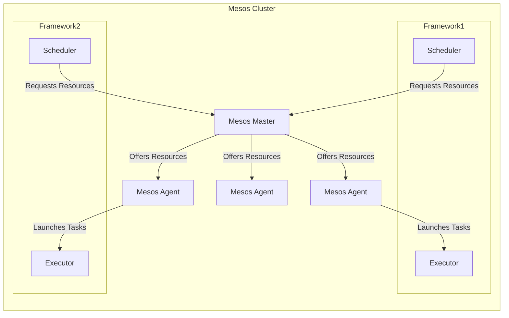

# Mesos原理与代码实例讲解

## 1.背景介绍

在当今的云计算和大数据时代，资源管理和调度已经成为了一个关键的挑战。随着应用程序和服务的不断增加,以及基础设施的日益复杂,有效地管理和利用计算资源变得至关重要。Apache Mesos是一个开源的集群管理系统,旨在高效地共享和管理整个数据中心的资源。

Mesos的核心理念是将数据中心视为一个共享的资源池,并提供一种通用的资源管理和调度机制。它允许不同的框架(Frameworks)在同一个集群上运行,并动态地分配资源。这种设计使得Mesos能够支持各种不同的工作负载,如大数据处理、微服务、批处理作业等。

Mesos的设计灵感来自于谷歌的Borg系统,但它采用了一种更加分散和可扩展的架构。它的主要目标是提供一个可靠、高效和可扩展的资源管理平台,以满足现代数据中心的需求。

## 2.核心概念与联系

### 2.1 Mesos架构

Mesos的架构由以下几个核心组件组成:

1. **Mesos Master**:集群的中心管理节点,负责接收资源请求,并根据调度策略分配资源给不同的框架。
2. **Mesos Agent**:运行在每个节点上的代理程序,负责管理节点上的任务执行和资源隔离。
3. **Framework**:运行在Mesos集群上的应用程序或服务,它们通过调度器(Scheduler)向Mesos Master请求资源。
4. **Executor**:由框架启动的进程,用于执行任务并管理其生命周期。

这些组件通过高效的资源协商协议进行交互,实现了资源的动态分配和任务的调度执行。



### 2.2 资源模型

Mesos采用了一种通用的资源模型,可以描述和管理各种类型的资源,包括CPU、内存、磁盘、网络等。这种资源模型使得Mesos能够支持各种不同的工作负载,并实现资源的高效利用。

每个资源都由一个名称和一个标量值来表示,例如`cpus:2`表示2个CPU核心。Mesos还支持资源的细粒度划分,例如将CPU核心划分为更小的份额。

### 2.3 两层调度器

Mesos采用了一种两层调度器的设计,分为Mesos Master和框架调度器(Scheduler)。

- **Mesos Master**:负责跨框架的资源分配,根据资源供给情况向不同的框架发送资源offers。
- **框架调度器**:根据应用程序的需求,决定是否接受Mesos Master提供的资源offers,并启动相应的任务。

这种设计使得Mesos能够支持多种调度策略,并允许框架根据自身的需求实现定制化的调度算法。

## 3.核心算法原理具体操作步骤

### 3.1 资源协商协议

Mesos的核心算法是基于资源协商协议(Resource Negotiation Protocol)实现的。该协议定义了Mesos Master、Mesos Agent和框架调度器之间的交互过程,用于动态地分配和管理资源。

协商过程如下:

1. **资源发现**:Mesos Agent会周期性地向Mesos Master报告其管理的资源情况,包括可用的CPU、内存、磁盘等。
2. **资源提供**:Mesos Master根据收集到的资源信息,将可用资源打包成资源offers,并向注册的框架调度器发送。
3. **资源请求**:框架调度器根据应用程序的需求,决定是否接受Mesos Master提供的资源offers。如果接受,则向Mesos Master发送资源请求。
4. **资源分配**:Mesos Master收到资源请求后,将相应的资源分配给请求的框架调度器。
5. **任务启动**:框架调度器收到分配的资源后,会在相应的Mesos Agent节点上启动executor进程,执行实际的任务。

这种协商过程确保了资源的动态分配和高效利用,同时也提供了框架级别的隔离和安全性。

### 3.2 资源隔离

为了确保不同框架之间的资源隔离,Mesos采用了操作系统级别的容器技术,如Linux Cgroups和Namespaces。每个任务都会被限制在一个独立的容器中运行,以防止资源的过度使用或干扰。

Mesos Agent负责创建和管理这些容器,并监控任务的资源使用情况。如果某个任务超出了分配的资源限制,Mesos Agent会终止该任务,以保护整个系统的稳定性。

### 3.3 容错和恢复

为了提高系统的可靠性和容错能力,Mesos采用了多种机制:

1. **主备Mesos Master**:Mesos支持多个Mesos Master实例,其中一个作为主节点,其他作为备节点。当主节点发生故障时,备节点可以自动接管,确保集群的正常运行。
2. **重新调度**:如果某个任务由于节点故障或其他原因而失败,框架调度器可以向Mesos Master请求重新调度该任务。
3. **检查点(Checkpoint)**:Mesos Master和框架调度器会定期将状态信息写入持久存储,以便在发生故障时能够恢复。

这些机制确保了Mesos集群的高可用性和容错能力,能够在发生故障时快速恢复,最大限度地减少服务中断。

## 4.数学模型和公式详细讲解举例说明

在Mesos的资源管理和调度过程中,涉及到一些数学模型和算法,用于优化资源利用率和任务调度效率。

### 4.1 资源模型

Mesos采用了一种通用的资源模型,将资源表示为一个向量:

$$\vec{r} = (r_1, r_2, \ldots, r_n)$$

其中,每个$r_i$表示一种资源的数量,如CPU核心数、内存大小等。这种表示方式使得Mesos能够统一管理和调度各种类型的资源。

在资源分配过程中,Mesos需要确保分配的资源不超过集群的总资源量。设$\vec{R}$为集群的总资源向量,$\vec{r}_1, \vec{r}_2, \ldots, \vec{r}_m$为已分配给$m$个框架的资源向量,则必须满足:

$$\sum_{i=1}^{m} \vec{r}_i \leq \vec{R}$$

### 4.2 资源调度算法

Mesos支持多种资源调度算法,用于决定如何将资源分配给不同的框架。常见的算法包括:

1. **先到先服务(First Come, First Served, FCFS)**:按照资源请求的时间顺序进行分配,最先发出请求的框架优先获得资源。
2. **公平共享(Fair Sharing)**:根据框架的权重,按比例分配资源,确保每个框架都能获得公平的资源份额。
3. **优先级调度(Priority Scheduling)**:根据框架的优先级进行调度,高优先级的框架优先获得资源。

以公平共享算法为例,设$w_i$为第$i$个框架的权重,则该框架应获得的资源份额为:

$$\vec{r}_i = \frac{w_i}{\sum_{j=1}^{m} w_j} \vec{R}$$

Mesos Master会根据这个公式计算每个框架的资源份额,并尽可能接近这个目标值进行资源分配。

### 4.3 资源过度使用检测

为了防止任务过度使用资源,Mesos采用了一种基于统计学的异常检测算法。

设$\vec{x}_t$为时间$t$时某个任务的资源使用量向量,Mesos会计算该任务在一段时间内的资源使用量均值$\vec{\mu}$和方差$\vec{\sigma}^2$:

$$\vec{\mu} = \frac{1}{T} \sum_{t=1}^{T} \vec{x}_t$$

$$\vec{\sigma}^2 = \frac{1}{T} \sum_{t=1}^{T} (\vec{x}_t - \vec{\mu})^2$$

如果某个时间点$t_0$的资源使用量$\vec{x}_{t_0}$超出了$\vec{\mu} + k\vec{\sigma}$的范围(其中$k$是一个常数,通常取值为3或更大),则认为该任务出现了资源过度使用的情况。

Mesos Agent会监控每个任务的资源使用情况,一旦检测到异常,就会终止该任务,以保护集群的稳定性。

## 5.项目实践:代码实例和详细解释说明

为了更好地理解Mesos的工作原理,我们来看一个简单的示例项目。该项目包含一个简单的Python框架,用于在Mesos集群上运行Word Count任务。

### 5.1 环境准备

首先,我们需要安装和配置Mesos集群。可以参考官方文档进行安装和配置。

### 5.2 框架实现

我们的Python框架包含两个主要组件:调度器(Scheduler)和执行器(Executor)。

**调度器(Scheduler)**

调度器负责向Mesos Master请求资源,并在获得资源后启动执行器进程。以下是一个简单的调度器实现:

```python
import sys
from threading import Thread

import mesos.interface
from mesos.interface import mesos_pb2
from mesos.native import MesosSchedulerDriver

class WordCountScheduler(mesos.interface.Scheduler):
    def __init__(self, executor):
        self.executor = executor

    def resourceOffers(self, driver, offers):
        for offer in offers:
            tasks = []
            task = self.create_task(offer)
            tasks.append(task)

            driver.launchTasks(offer.id, tasks)

    def create_task(self, offer):
        task = mesos_pb2.TaskInfo()
        task.task_id.value = str(uuid.uuid4())
        task.slave_id.value = offer.slave_id.value
        task.name = "Word Count"
        task.executor.MergeFrom(self.executor)

        cpus = task.resources.add()
        cpus.name = "cpus"
        cpus.type = mesos_pb2.Value.SCALAR
        cpus.scalar.value = 1

        mem = task.resources.add()
        mem.name = "mem"
        mem.type = mesos_pb2.Value.SCALAR
        mem.scalar.value = 128

        return task

if __name__ == "__main__":
    executor = mesos_pb2.ExecutorInfo()
    executor.executor_id.value = "WordCount"
    executor.command.value = "python word_count_executor.py"

    framework = WordCountScheduler(executor)
    driver = MesosSchedulerDriver(framework, sys.argv[1], sys.argv[2])
    driver.run()
```

这个调度器实现了`Scheduler`接口的`resourceOffers`方法,用于接收Mesos Master发送的资源offers。当收到offers时,它会创建一个Word Count任务,并将其启动在相应的Mesos Agent节点上。

**执行器(Executor)**

执行器负责运行实际的Word Count任务。以下是一个简单的执行器实现:

```python
import sys
import mesos.native

from mesos.interface import mesos_pb2

class WordCountExecutor(mesos.interface.Executor):
    def launchTask(self, driver, task):
        def run_task(task_data):
            with open("input.txt", "r") as f:
                content = f.read()
            words = content.split()
            word_count = len(words)
            print(f"Word count: {word_count}")

        thread = Thread(target=run_task, args=(task,))
        thread.start()

    def frameworkMessage(self, driver, message):
        pass

if __name__ == "__main__":
    print("Starting Word Count Executor")
    driver = mesos.native.MesosExecutorDriver(WordCountExecutor())
    sys.exit(0 if driver.run() == mesos_pb2.Status.DRIVER_STOPPED else 1)
```

这个执行器实现了`Executor`接口的`launchTask`方法,用于执行实际的Word Count任务。在这个示例中,任务会读取一个名为`input.txt`的文件,统计其中单词的数量,并将结果打印出来。

### 5.3 运行示例

要运行这个示例,我们需要先启动Mesos Master和Mesos Agent,然后运行调度器:

```bash
# 