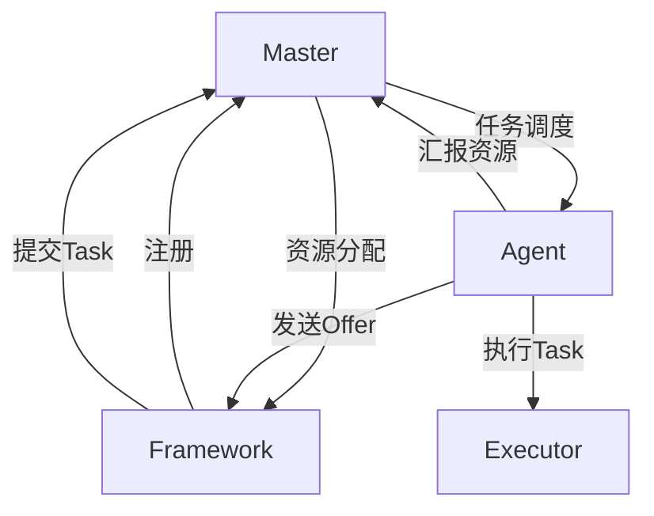

# Mesos原理与代码实例讲解

## 1.背景介绍
### 1.1 Mesos是什么
Mesos是一个开源的分布式资源管理框架,它可以在集群中动态地共享资源,并将应用程序部署到共享节点池中。Mesos最初由加州大学伯克利分校的AMPLab开发,现在由Apache软件基金会维护。

### 1.2 Mesos的发展历程
- 2009年,Mesos项目在加州大学伯克利分校启动
- 2011年,Twitter开始使用Mesos
- 2013年,Mesos成为Apache孵化器项目
- 2016年,Mesos成为Apache顶级项目

### 1.3 Mesos的优势
- 可扩展性:Mesos可以轻松扩展到数万个节点
- 容错性:Mesos使用ZooKeeper实现Master的高可用
- 资源隔离:Mesos使用Linux Container实现不同框架之间的资源隔离
- 多框架支持:Mesos支持多种不同的大数据处理框架,如Spark、Hadoop、MPI等
- 丰富的调度策略:Mesos提供了DRF、Bin Packing等多种资源调度算法

## 2.核心概念与联系
### 2.1 Master
Master是Mesos的核心组件,负责管理整个集群的资源和任务调度。Master运行在独立的机器上,通过选举产生,可以避免单点故障。

### 2.2 Agent
Agent运行在集群的各个节点上,负责管理本节点的资源,如CPU、内存等,并向Master汇报。当用户提交任务时,Master会将任务分配给合适的Agent执行。

### 2.3 Framework
Framework是基于Mesos开发的应用程序或者计算框架,如Spark、Hadoop等。每个Framework包含两个主要组件:
- Scheduler:注册到Master,并获取资源来运行任务
- Executor:在Agent上运行,执行具体的任务

### 2.4 Task
Task是Framework提交给Mesos的最小执行单元,每个Task都会被分配到一个Agent上运行。Task可以是一个短期的作业,如Spark的一个stage;也可以是一个长期运行的服务,如HDFS的DataNode。

### 2.5 Offer
Offer是Agent发给Framework的一个资源邀约,包含Agent上可用的资源,如CPU、内存等。Framework可以决定是否接受Offer,如果接受,则在Offer上分配Task。

### 2.6 核心概念关系图


## 3.核心算法原理具体操作步骤
### 3.1 资源分配算法
Mesos使用DRF(Dominant Resource Fairness)算法来实现多资源的公平分配。DRF算法的基本思想是:
1. 对于每个用户,找到其任务所占资源份额最大的一类资源,称为主导资源
2. 将资源分配给主导资源占比最小的用户,直到其主导资源占比与其他用户相同
3. 重复步骤2,直到所有资源分配完毕

例如,考虑两个用户,每个用户需要<cpu,mem>资源:
- 用户A:<1,4>
- 用户B:<3,1> 

对于用户A,内存是主导资源;对于用户B,CPU是主导资源。DRF会将资源分配给用户B,直到两个用户的主导资源占比相同。最终分配结果:
- A:<1/3,4/7>
- B:<2/3,3/7>

### 3.2 任务调度算法
Mesos默认使用Bin Packing算法来实现任务的调度,目标是最小化Agent的数量。具体步骤如下:
1. 将Agent按照可用资源从大到小排序
2. 从排序后的Agent列表中,找到第一个可以满足Task资源需求的Agent
3. 如果找到,则将Task分配给该Agent;否则,等待新的Agent加入或者资源释放

例如,集群中有三个Agent,可用资源如下:
- Agent1:<4,4>  
- Agent2:<2,8>
- Agent3:<6,2>

当前有两个Framework,每个Framework有两个Task,资源需求如下:
- Framework1:Task1<1,1>,Task2<2,1>
- Framework2:Task3<1,4>,Task4<2,2>

调度过程:
1. 将Agent按照可用资源排序:Agent3>Agent1>Agent2
2. Task1分配给Agent3,剩余资源<5,1>
3. Task2无法分配,因为没有足够的内存
4. Task3分配给Agent1,剩余资源<3,3>  
5. Task4分配给Agent1,剩余资源<1,1>

最终分配结果:
- Agent1:Task3,Task4
- Agent2:空闲 
- Agent3:Task1

### 3.3 容错机制
Mesos使用ZooKeeper实现Master和Framework的容错。
- 对于Master,Mesos使用Hot Standby模式,通过选举产生Active Master。当Active Master失效时,Standby Master会接管集群。
- 对于Framework,Mesos支持Framework实现自己的容错机制。例如,Spark使用Lineage和Checkpoint来实现容错。

## 4.数学模型和公式详细讲解举例说明
### 4.1 DRF算法模型
DRF的目标是最大化每个用户的主导资源份额。假设系统有$R$类资源,第$i$类资源的总量为$C_i$。共有$U$个用户,第$u$个用户分配到第$i$类资源的量为$A_{u,i}$。定义用户$u$在资源$i$上的份额为:

$$D_{u,i}=\frac{A_{u,i}}{C_i}$$

用户$u$的主导资源份额为:

$$s_u=\max_{i=1}^R D_{u,i}$$

DRF算法的目标是最大化最小主导资源份额,即:

$$\max \min_{u=1}^U s_u$$

例如,考虑一个系统,包含9个CPU和18GB内存,有两个用户:
- 用户A:Task需求<1 CPU,4 GB>
- 用户B:Task需求<3 CPU,1 GB>

则资源总量为:$C_{cpu}=9$,$C_{mem}=18$。

假设系统为用户A分配3个Task,为用户B分配2个Task,则:
- 用户A:$A_{A,cpu}=3$,$A_{A,mem}=12$,主导资源份额$s_A=\frac{12}{18}=\frac{2}{3}$ 
- 用户B:$A_{B,cpu}=6$,$A_{B,mem}=2$,主导资源份额$s_B=\frac{6}{9}=\frac{2}{3}$

可见,此时两个用户的主导资源份额相等,满足DRF的公平性要求。

### 4.2 Bin Packing模型
Bin Packing是一个经典的组合优化问题,形式化描述如下:
给定$N$个物品,每个物品有重量$w_i$,以及$M$个箱子,每个箱子有容量$c_j$。目标是用最少的箱子装下所有物品。

用决策变量$x_{ij}$表示物品$i$是否装入箱子$j$:

$$
x_{ij}=
\begin{cases}
1, & 物品i装入箱子j \\
0, & 否则
\end{cases}
$$

则Bin Packing可以表示为如下的整数规划模型:

$$
\begin{align*}
\min \quad & \sum_{j=1}^M y_j \\
\mbox{s.t.} \quad & \sum_{i=1}^N w_ix_{ij} \le c_jy_j, \forall j=1,\ldots,M \\
& \sum_{j=1}^M x_{ij} = 1, \forall i=1,\ldots,N \\
& y_j \in \{0,1\}, \forall j=1,\ldots,M \\
& x_{ij} \in \{0,1\}, \forall i=1,\ldots,N, j=1,\ldots,M
\end{align*}
$$

其中,$y_j$表示箱子$j$是否被使用。第一个约束表示每个箱子的容量限制,第二个约束表示每个物品只能装入一个箱子。

在Mesos中,Agent对应箱子,Task对应物品,Bin Packing算法用于将Task分配到最少的Agent上,从而提高集群的资源利用率。

## 5.项目实践：代码实例和详细解释说明
下面通过一个简单的Python代码示例,演示如何使用Mesos的API实现一个自定义的Framework。

```python
from mesos.interface import Scheduler
from mesos.interface import mesos_pb2

class MyScheduler(Scheduler):

    def registered(self, driver, framework_id, master_info):
        print("Framework registered with id: {}".format(framework_id))

    def resourceOffers(self, driver, offers):
        for offer in offers:
            print("Received offer: {}".format(offer))
            # 检查offer的资源是否满足task需求
            if self.is_offer_sufficient(offer):
                # 创建task
                task = self.create_task(offer) 
                # 接受offer,并在offer上启动task
                driver.launchTasks(offer.id, [task])
            else:
                # 拒绝offer
                driver.declineOffer(offer.id)

    def statusUpdate(self, driver, update):
        print("Task {} is in state {}".format(update.task_id, update.state))

    def is_offer_sufficient(self, offer):
        # 检查offer的cpu和mem是否满足task需求
        cpus = self.get_resource(offer.resources, 'cpus')
        mem = self.get_resource(offer.resources, 'mem')
        return cpus >= TASK_CPU and mem >= TASK_MEM

    def create_task(self, offer):
        # 创建一个Mesos Task
        task = mesos_pb2.TaskInfo()
        task.task_id.value = str(uuid.uuid4())
        task.slave_id.value = offer.slave_id.value
        task.name = "MyTask"

        # 设置task的资源需求
        cpus = task.resources.add()
        cpus.name = "cpus"
        cpus.type = mesos_pb2.Value.SCALAR
        cpus.scalar.value = TASK_CPU

        mem = task.resources.add()
        mem.name = "mem"
        mem.type = mesos_pb2.Value.SCALAR
        mem.scalar.value = TASK_MEM

        # 设置task的命令
        task.command.value = "echo hello && sleep 10"
        return task

    def get_resource(self, res_list, name):
        # 从offer的资源列表中获取特定资源的数量
        for res in res_list:
            if res.name == name:
                return res.scalar.value
        return 0.0

if __name__ == '__main__':
    # 配置Framework信息
    framework = mesos_pb2.FrameworkInfo()
    framework.user = ""
    framework.name = "MyFramework"
    framework.checkpoint = True

    # 创建Scheduler和MesosSchedulerDriver
    scheduler = MyScheduler()
    driver = MesosSchedulerDriver(
        scheduler, framework, "zk://localhost:2181/mesos"
    )

    # 启动Framework
    status = driver.run()
    if status == mesos_pb2.DRIVER_STOPPED:
        exit_code = 0
    else:
        exit_code = 1
    driver.stop()
```

代码说明:
1. 自定义一个Scheduler类`MyScheduler`,继承自`mesos.interface.Scheduler`,并实现了几个关键方法:
   - `registered()`:当Framework成功注册到Mesos时被调用
   - `resourceOffers()`:当Framework收到Offer时被调用,在此方法中决定是否接受Offer,并创建Task
   - `statusUpdate()`:当Task状态发生变化时被调用
2. 在`resourceOffers()`中,首先检查Offer的资源是否满足Task的需求,如果满足,则创建一个Task,并在Offer上启动该Task;否则拒绝Offer。
3. 在`create_task()`中,创建一个Mesos Task对象,设置Task的资源需求和命令,并返回。
4. 在`is_offer_sufficient()`中,检查Offer的CPU和内存资源是否满足Task的需求。
5. 在`get_resource()`中,从Offer的资源列表中获取特定类型资源的数量。
6. 在`main`函数中,首先配置Framework的信息,然后创建Scheduler对象和MesosSchedulerDriver对象,最后启动Framework。

以上就是一个简单的Mesos Framework示例,通过这个示例,我们可以了解Mesos Framework的基本编写方法和流程。在实际应用中,我们还需要考虑更多的因素,如容错、数据本地性等,以构建一个健壮高效的分布式系统。

## 6.实际应用场景
Mesos作为一个通用的资源管理平台,在实际生产环境中有广泛的应用,下面列举几个典型的应用场景。

### 6.1 大数据处理
Mesos可以很好地支持各种大数据处理