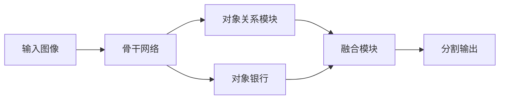
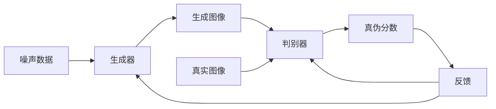

# OCRNet与生成对抗网络：提升分割精度，生成逼真图像

## 1.背景介绍

在计算机视觉和图像处理领域,图像分割和图像生成是两个重要且具有挑战性的任务。图像分割旨在将图像划分为多个语义区域,而图像生成则是基于某些条件或数据生成新的逼真图像。近年来,深度学习技术的发展为这两个任务带来了突破性的进展。

OCRNet(Object Context Reasoning for Semantic Segmentation)是一种用于语义分割的深度神经网络模型,它通过对象上下文推理有效地提高了分割精度。与此同时,生成对抗网络(Generative Adversarial Networks,GANs)则是一种用于生成逼真图像的强大模型,它通过生成器和判别器之间的对抗训练,能够生成高质量、难以区分的图像。

结合OCRNet和GANs不仅可以提高图像分割的性能,还能生成逼真的图像,为各种应用场景带来巨大的潜力。本文将深入探讨这两种技术的原理、实现方式以及它们的结合应用。

## 2.核心概念与联系

### 2.1 OCRNet

OCRNet是一种用于语义分割的深度神经网络模型,它的核心思想是通过对象上下文推理来提高分割精度。在传统的分割模型中,往往只关注像素级别的特征,而忽视了对象之间的关系和上下文信息。OCRNet通过引入对象关系模块(Object Relation Module)和对象银行(Object Bank),能够有效地捕获对象之间的关系和上下文信息,从而提高分割性能。



### 2.2 生成对抗网络(GANs)

生成对抗网络(GANs)是一种用于生成逼真图像的深度学习模型。它由两个网络组成:生成器(Generator)和判别器(Discriminator)。生成器的目标是生成逼真的图像,而判别器则旨在区分生成的图像和真实图像。通过生成器和判别器之间的对抗训练,生成器不断优化以产生更加逼真的图像,而判别器也不断提高区分真伪图像的能力。



### 2.3 OCRNet与GANs的联系

OCRNet和GANs看似是两个不同的模型,但它们却有着内在的联系。OCRNet旨在提高图像分割的精度,而GANs则能够生成逼真的图像。将这两种技术结合,我们不仅可以利用OCRNet获得高质量的分割结果,还可以使用GANs基于分割结果生成逼真的图像。这种结合可以为各种应用场景带来巨大的潜力,例如图像编辑、数据增强、虚拟现实等。

此外,OCRNet和GANs在技术层面也有一些相似之处。它们都利用了深度神经网络的强大能力,并通过对抗训练的方式优化模型。因此,研究这两种技术的结合不仅有实际应用价值,也能够促进相关理论和算法的发展。

## 3.核心算法原理具体操作步骤

### 3.1 OCRNet原理和操作步骤

OCRNet的核心思想是通过对象上下文推理来提高分割精度。它的主要操作步骤如下:

1. **骨干网络提取特征**:输入图像首先通过一个骨干网络(如ResNet或VGG)提取特征图。

2. **对象关系模块**:特征图被送入对象关系模块,该模块通过自注意力机制捕获对象之间的关系,生成对象关系表示。

3. **对象银行**:对象银行是一个包含常见对象原型的内存库。对象关系表示与对象银行中的原型进行匹配,以获得对象上下文信息。

4. **融合模块**:将对象关系表示和对象上下文信息融合,生成增强的特征表示。

5. **分割输出**:增强的特征表示被送入分割头,输出最终的分割结果。

通过对象上下文推理,OCRNet能够有效地利用对象之间的关系和上下文信息,从而提高分割精度。

### 3.2 GANs原理和操作步骤

生成对抗网络(GANs)的核心思想是通过生成器和判别器之间的对抗训练,生成逼真的图像。其主要操作步骤如下:

1. **初始化生成器和判别器**:生成器和判别器都是深度神经网络,通常使用卷积神经网络(CNN)或其变体。

2. **生成器生成图像**:生成器从一个噪声分布(如高斯噪声或均匀噪声)采样,并将其映射到图像空间,生成一个假图像。

3. **判别器区分真伪**:判别器接收真实图像和生成器生成的假图像,并输出一个概率分数,表示输入图像是真实的概率。

4. **计算损失函数**:根据判别器的输出,计算生成器损失和判别器损失。生成器的目标是最大化判别器被欺骗的概率,而判别器的目标是最大化正确区分真伪图像的概率。

5. **反向传播和优化**:通过反向传播算法计算梯度,并使用优化算法(如Adam或RMSProp)更新生成器和判别器的参数。

6. **重复训练**:重复步骤2-5,直到生成器生成的图像足够逼真,判别器无法可靠地区分真伪图像。

通过这种对抗训练过程,生成器和判别器相互竞争,最终达到一种动态平衡,生成器能够生成高质量、难以区分的图像。

## 4.数学模型和公式详细讲解举例说明

### 4.1 OCRNet数学模型

OCRNet的核心数学模型包括对象关系模块和对象银行。

**对象关系模块**:该模块使用自注意力机制捕获对象之间的关系。给定一个特征图 $X \in \mathbb{R}^{C \times H \times W}$,其中 $C$ 是通道数, $H$ 和 $W$ 分别是高度和宽度。我们首先将特征图展平为 $X' \in \mathbb{R}^{N \times C}$,其中 $N = H \times W$ 是特征向量的数量。然后,我们计算自注意力权重矩阵 $A \in \mathbb{R}^{N \times N}$:

$$A = \text{softmax}(X'X'^T)$$

通过将 $A$ 与 $X'$ 相乘,我们可以获得对象关系表示 $R \in \mathbb{R}^{N \times C}$:

$$R = AX'$$

**对象银行**:对象银行是一个包含 $K$ 个对象原型的内存库,表示为 $B \in \mathbb{R}^{K \times C}$。我们将对象关系表示 $R$ 与对象银行 $B$ 进行匹配,以获得对象上下文信息 $C \in \mathbb{R}^{N \times C}$:

$$C = \text{softmax}(RB^T)B$$

最后,将对象关系表示 $R$ 和对象上下文信息 $C$ 融合,得到增强的特征表示 $F \in \mathbb{R}^{N \times C}$:

$$F = \gamma R + \beta C$$

其中 $\gamma$ 和 $\beta$ 是可学习的缩放系数。

通过对象上下文推理,OCRNet能够有效地利用对象之间的关系和上下文信息,从而提高分割精度。

### 4.2 GANs数学模型

生成对抗网络(GANs)的数学模型包括生成器和判别器的损失函数。

**生成器损失函数**:生成器的目标是生成足够逼真的图像,以欺骗判别器。因此,生成器损失函数可以定义为:

$$\mathcal{L}_G = -\mathbb{E}_{z \sim p_z(z)}[\log D(G(z))]$$

其中 $z$ 是从噪声分布 $p_z(z)$ 采样的噪声向量, $G(z)$ 是生成器生成的假图像, $D(\cdot)$ 是判别器输出的真实概率分数。生成器旨在最小化这个损失函数,以最大化判别器被欺骗的概率。

**判别器损失函数**:判别器的目标是正确区分真实图像和生成的假图像。因此,判别器损失函数可以定义为:

$$\mathcal{L}_D = -\mathbb{E}_{x \sim p_\text{data}(x)}[\log D(x)] - \mathbb{E}_{z \sim p_z(z)}[\log(1 - D(G(z)))]$$

其中 $x$ 是从真实数据分布 $p_\text{data}(x)$ 采样的真实图像。判别器旨在最小化这个损失函数,以最大化正确区分真伪图像的概率。

在训练过程中,生成器和判别器通过交替优化的方式进行对抗训练。生成器旨在最小化 $\mathcal{L}_G$,而判别器旨在最小化 $\mathcal{L}_D$。这种对抗训练过程可以被视为一个最小-最大博弈问题:

$$\min_G \max_D \mathcal{L}(D, G) = \mathbb{E}_{x \sim p_\text{data}(x)}[\log D(x)] + \mathbb{E}_{z \sim p_z(z)}[\log(1 - D(G(z)))]$$

通过这种对抗训练,生成器和判别器相互竞争,最终达到一种动态平衡,生成器能够生成高质量、难以区分的图像。

## 5.项目实践:代码实例和详细解释说明

在这一部分,我们将提供一个基于PyTorch的OCRNet和GANs实现示例,并对关键代码进行详细解释。

### 5.1 OCRNet实现

```python
import torch
import torch.nn as nn

class ObjectRelationModule(nn.Module):
    def __init__(self, in_channels, key_channels, value_channels):
        super().__init__()
        self.attention = nn.MultiheadAttention(in_channels, num_heads=8, batch_first=True)
        self.key_proj = nn.Linear(in_channels, key_channels)
        self.value_proj = nn.Linear(in_channels, value_channels)

    def forward(self, x):
        batch_size, channels, height, width = x.size()
        x = x.view(batch_size, channels, height * width).permute(0, 2, 1)
        key = self.key_proj(x)
        value = self.value_proj(x)
        relation, _ = self.attention(value, key, key)
        return relation.permute(0, 2, 1).view(batch_size, -1, height, width)

class ObjectBank(nn.Module):
    def __init__(self, in_channels, num_prototypes):
        super().__init__()
        self.prototypes = nn.Parameter(torch.randn(num_prototypes, in_channels))

    def forward(self, relation):
        batch_size, channels, height, width = relation.size()
        relation = relation.view(batch_size, channels, height * width).permute(0, 2, 1)
        context = torch.matmul(relation, self.prototypes.t())
        context = torch.matmul(context, self.prototypes)
        return context.permute(0, 2, 1).view(batch_size, -1, height, width)

class OCRNet(nn.Module):
    def __init__(self, backbone, num_classes, num_prototypes):
        super().__init__()
        self.backbone = backbone
        self.relation_module = ObjectRelationModule(backbone.out_channels, 256, 256)
        self.object_bank = ObjectBank(backbone.out_channels, num_prototypes)
        self.fusion = nn.Conv2d(backbone.out_channels * 2, backbone.out_channels, kernel_size=1)
        self.classifier = nn.Conv2d(backbone.out_channels, num_classes, kernel_size=1)

    def forward(self, x):
        features = self.backbone(x)
        relation = self.relation_module(features)
        context = self.object_bank(relation)
        fused = self.fusion(torch.cat([features, context], dim=1))
        output = self.classifier(fused)
        return output
```

在这个实现中,我们首先定义了 `ObjectRelationModule` 类,它使用多头自注意力机制捕获对象之间的关系。`ObjectBank` 类则实现了对象银行,用于存储和匹配对象原型。

`OCRNet` 类是整个模型的主体,它包含