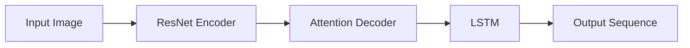

# OCRNet对抗攻击与防御：保障模型安全，提升鲁棒性

## 1. 背景介绍

### 1.1 OCR技术概述
OCR(Optical Character Recognition,光学字符识别)是利用光学技术和计算机技术把印刷或书写的文字转换成计算机可以识别的数字信号的一种自动识别技术。它是文档图像识别领域的一个重要分支,在文档电子化、邮政编码自动分拣、车牌自动识别、银行支票处理等领域有着广泛的应用。

### 1.2 深度学习在OCR中的应用
近年来,随着深度学习技术的飞速发展,OCR技术也取得了突破性进展。基于深度学习的OCR模型在精度、速度、泛化能力等方面远超传统方法。一些代表性的工作如CRNN[1]、RARE[2]、ASTER[3]等,都展现了深度学习OCR的强大性能。

### 1.3 对抗攻击对OCR模型的威胁
然而,深度学习模型存在一个严重的安全隐患,即容易受到对抗攻击(Adversarial Attack)。通过在输入图像中添加人眼难以察觉的微小扰动,就可以欺骗模型做出错误预测。这种现象最早由Szegedy等人[4]发现,后来在图像分类、目标检测等领域被广泛研究。而OCR模型同样面临这一威胁。

### 1.4 对抗防御的重要意义
OCR技术在身份认证、财务系统、法律文书等关键领域有着重要应用,OCR模型一旦被恶意攻击导致识别错误,后果不堪设想。因此研究OCR模型的对抗攻击与防御具有重要意义,这不仅是保障OCR系统安全的需要,也是提升OCR模型鲁棒性、推动OCR技术进步的重要课题。

## 2. 核心概念与联系

### 2.1 对抗样本
对抗样本(Adversarial Example)指的是在原始样本的基础上,通过添加精心设计的微小扰动,使得机器学习模型对其做出错误判断的样本。形式化地,令 $f$ 为机器学习模型, $x$ 为输入样本, $y$ 为 $x$ 的真实标签,如果存在扰动 $\delta$ 使得:

$$f(x+\delta) \neq y \quad s.t. \quad \|\delta\|_p \leq \epsilon$$

其中 $\|\cdot\|_p$ 表示 $L_p$ 范数, $\epsilon$ 为扰动的上界。那么 $\tilde{x} = x + \delta$ 就是一个对抗样本。

### 2.2 白盒攻击与黑盒攻击
根据攻击者掌握的模型信息的多少,对抗攻击可分为白盒攻击和黑盒攻击两大类:

- 白盒攻击(White-box Attack):攻击者完全了解目标模型的结构和参数,可以利用模型的梯度信息生成对抗样本。代表性方法有FGSM[5]、PGD[6]、C&W[7]等。 

- 黑盒攻击(Black-box Attack):攻击者无法访问目标模型的内部信息,只能通过模型的输入输出生成对抗样本。常见方法有迁移攻击[8]、基于查询的攻击[9]、基于替代模型的攻击[10]等。

### 2.3 对抗训练
对抗训练(Adversarial Training)是目前最有效的对抗防御方法之一。其核心思想是在模型训练过程中主动生成对抗样本,将其加入训练集,提高模型的对抗鲁棒性。令 $\mathcal{D}$ 为原始训练集, $\mathcal{\tilde{D}}$ 为对抗样本集,则对抗训练的目标函数可表示为:

$$\underset{\theta}{\arg\min} \mathbb{E}_{(x,y)\sim \mathcal{D}} \left[ \mathcal{L}(f_{\theta}(x),y) + \max_{\|\delta\|_p \leq \epsilon} \mathcal{L}(f_{\theta}(x+\delta),y) \right]$$

其中 $\theta$ 为模型参数, $\mathcal{L}$ 为损失函数。对抗训练在图像分类等领域取得了很好的防御效果[11]。

### 2.4 概念之间的联系
对抗样本是对抗攻击的"武器",攻击者利用白盒或黑盒的方式生成对抗样本,试图欺骗模型。而对抗训练则利用对抗样本来"疫苗接种",增强模型抵御攻击的能力。它们之间你来我往,攻防转换,推动着对抗机器学习技术的不断发展。

## 3. 核心算法原理具体操作步骤

### 3.1 OCRNet模型结构
OCRNet[12]是一种基于编码器-解码器结构的OCR模型。编码器采用ResNet提取图像特征,解码器采用注意力机制和LSTM预测字符序列。模型结构如下图所示:



### 3.2 白盒攻击算法-FGSM
FGSM(Fast Gradient Sign Method)[5]是一种基于梯度的白盒攻击算法,通过沿着梯度方向添加扰动生成对抗样本。具体步骤如下:

1. 输入原始图像 $x$ 和目标标签 $y$
2. 计算损失函数 $\mathcal{L}$ 对输入 $x$ 的梯度:

$$\nabla_x \mathcal{L}(f(x),y)$$

3. 根据梯度符号生成对抗扰动:

$$\delta = \epsilon \cdot \text{sign}(\nabla_x \mathcal{L}(f(x),y))$$

4. 将扰动添加到原始图像得到对抗样本:

$$\tilde{x} = x + \delta$$

5. 将对抗样本 $\tilde{x}$ 输入模型,观察是否攻击成功

### 3.3 黑盒攻击算法-基于迁移的攻击
基于迁移的黑盒攻击利用不同模型之间的对抗样本迁移性。即在一个替代模型上生成对抗样本,将其迁移到目标模型上攻击。步骤如下:

1. 训练一个与目标模型结构相似的替代模型 $f'$
2. 利用白盒攻击算法(如FGSM)在替代模型 $f'$ 上生成对抗样本 $\tilde{x}$
3. 将对抗样本 $\tilde{x}$ 迁移到目标模型 $f$ 进行攻击,观察是否成功

### 3.4 对抗训练防御算法
OCRNet的对抗训练算法基于PGD(Projected Gradient Descent)生成对抗样本,步骤如下:

1. 输入原始训练样本 $(x,y)$
2. 随机初始化扰动 $\delta$,满足 $\|\delta\|_{\infty} \leq \epsilon$
3. 进行 $K$ 步PGD迭代:
   
   for $k=1$ to $K$ do
   
   $\quad \delta \gets \text{Proj}(\delta + \alpha \cdot \text{sign}(\nabla_x \mathcal{L}(f_{\theta}(x+\delta),y)))$
   
   end for

4. 得到对抗样本 $\tilde{x} = x + \delta$
5. 将原始样本 $x$ 和对抗样本 $\tilde{x}$ 一起加入训练集,训练OCRNet模型

其中 $\text{Proj}$ 为投影操作,将扰动 $\delta$ 限制在 $\epsilon$ 范围内。$\alpha$ 为迭代步长。

## 4. 数学模型和公式详细讲解举例说明

### 4.1 OCRNet的注意力机制
OCRNet的解码器采用注意力机制来聚焦图像的不同区域。在第 $t$ 个时间步,解码器的隐状态 $s_t$ 与编码器的输出特征 $h$ 进行注意力计算,得到注意力权重 $\alpha_t$:

$$e_{ti} = v^T \tanh(Ws_t + Vh_i + b)$$

$$\alpha_{ti} = \frac{\exp(e_{ti})}{\sum_{j=1}^L \exp(e_{tj})}$$

其中 $v,W,V,b$ 为注意力机制的可学习参数。$L$ 为特征序列长度。

根据注意力权重,可以计算第 $t$ 步的上下文向量 $c_t$:

$$c_t = \sum_{i=1}^L \alpha_{ti} h_i$$

$c_t$ 与 $s_t$ 拼接后输入LSTM进行解码预测。通过注意力机制,模型可以在不同时间步关注图像的不同区域,提高识别准确率。

### 4.2 FGSM的损失函数
FGSM攻击算法中的损失函数 $\mathcal{L}$ 一般选择交叉熵损失。对于OCR任务,可以将预测的字符序列与真实标签序列计算交叉熵。设真实标签为 $y=(y_1,\dots,y_T)$,模型预测概率为 $p=(p_1,\dots,p_T)$,则损失函数为:

$$\mathcal{L} = -\sum_{t=1}^T y_t \log p_t$$

最小化该损失函数,就可以得到使模型预测错误的对抗样本。

### 4.3 PGD的投影操作
PGD攻击算法中的投影操作 $\text{Proj}$ 用于将扰动限制在 $\epsilon$ 范围内。对于 $L_{\infty}$ 范数约束,投影操作为:

$$\text{Proj}(\delta) = \min(\max(\delta,-\epsilon),\epsilon)$$

即将扰动的每个元素裁剪到 $[-\epsilon,\epsilon]$ 区间内。这保证了对抗样本与原始样本的差异不会过大,维持了对抗样本的隐蔽性。

举例来说,假设原始图像为 $x=[0.2,0.5,0.8]$,扰动上界 $\epsilon=0.1$,当前扰动为 $\delta=[0.05,-0.15,0.08]$,则经过投影操作后:

$$\text{Proj}(\delta) = [0.05,-0.10,0.08]$$

扰动的第2个元素被裁剪到了 $-\epsilon=-0.1$,使其满足约束条件。

## 5. 项目实践：代码实例和详细解释说明

下面给出了OCRNet对抗训练的PyTorch代码示例:

```python
import torch
import torch.nn as nn

# OCRNet模型定义
class OCRNet(nn.Module):
    def __init__(self):
        super(OCRNet,self).__init__()
        self.encoder = ResNet()
        self.decoder = AttentionDecoder()
        
    def forward(self,x):
        feature = self.encoder(x)
        output = self.decoder(feature)
        return output
        
# PGD攻击函数        
def pgd_attack(model, x, y, epsilon, alpha, num_steps):
    delta = torch.zeros_like(x, requires_grad=True)
    for t in range(num_steps):
        loss = nn.CrossEntropyLoss()(model(x+delta),y)
        loss.backward()
        delta.data = (delta + alpha*delta.grad.sign()).clamp(-epsilon,epsilon)
        delta.grad.zero_()
    return delta.detach()

# 对抗训练函数
def adv_train(model, train_loader, epsilon, alpha, num_steps):
    optimizer = torch.optim.Adam(model.parameters())
    for x, y in train_loader:
        x_adv = x + pgd_attack(model,x,y,epsilon,alpha,num_steps)
        optimizer.zero_grad()
        loss = nn.CrossEntropyLoss()(model(x),y) + nn.CrossEntropyLoss()(model(x_adv),y)
        loss.backward()
        optimizer.step()

# 主函数        
def main():
    model = OCRNet()
    train_loader = DataLoader(train_data)
    epsilon = 0.1
    alpha = 0.01
    num_steps = 10
    num_epochs = 20
    
    for epoch in range(num_epochs):
        adv_train(model,train_loader,epsilon,alpha,num_steps)
        
    torch.save(model.state_dict(),'adv_trained_ocrnet.pth')
    
if __name__ == '__main__':
    main()
```

代码解释如下:

1. 定义了OCRNet模型类,包含编码器(ResNet)和解码器(AttentionDecoder)两部分。
2. pgd_attack函数实现了PGD攻击算法,输入原始样本 x 和标签 y,输出对抗扰动 delta。
3. adv