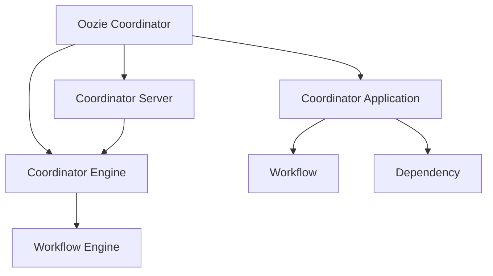

## 1. 背景介绍

Oozie是一个基于Hadoop的工作流引擎，它可以协调和管理Hadoop作业的执行。Oozie支持多种类型的作业，包括MapReduce、Pig、Hive、Sqoop等。Oozie的核心概念是工作流（Workflow）和协调器（Coordinator）。本文将重点介绍Oozie协调器的原理和代码实例。

## 2. 核心概念与联系

Oozie协调器是一种用于协调和管理作业执行的机制。它可以根据一定的时间规则和依赖关系来触发作业的执行。Oozie协调器的核心概念包括：

- 协调器应用程序（Coordinator Application）：定义了协调器的时间规则和依赖关系，以及需要执行的作业信息。
- 协调器引擎（Coordinator Engine）：负责解析协调器应用程序，生成作业执行计划，并触发作业的执行。
- 协调器服务器（Coordinator Server）：提供协调器引擎的服务，接收协调器应用程序的提交请求，并将其提交给协调器引擎进行处理。

Oozie协调器与Oozie工作流的关系如下图所示：



## 3. 核心算法原理具体操作步骤

Oozie协调器的核心算法原理是基于时间规则和依赖关系来触发作业的执行。具体操作步骤如下：

1. 定义协调器应用程序：定义协调器的时间规则和依赖关系，以及需要执行的作业信息。协调器应用程序可以使用XML格式进行定义。
2. 提交协调器应用程序：将协调器应用程序提交给协调器服务器进行处理。
3. 解析协调器应用程序：协调器服务器将协调器应用程序解析成协调器引擎可以理解的格式。
4. 生成作业执行计划：协调器引擎根据协调器应用程序中定义的时间规则和依赖关系，生成作业执行计划。
5. 触发作业的执行：协调器引擎根据作业执行计划，触发作业的执行。

## 4. 数学模型和公式详细讲解举例说明

Oozie协调器的实现并不涉及数学模型和公式。

## 5. 项目实践：代码实例和详细解释说明

下面是一个简单的Oozie协调器应用程序的示例：

```xml
<coordinator-app name="my-coordinator" frequency="5" start="2022-01-01T00:00Z" end="2022-01-02T00:00Z" timezone="UTC" xmlns="uri:oozie:coordinator:0.5">
  <controls>
    <timeout>60</timeout>
    <concurrency>1</concurrency>
  </controls>
  <datasets>
    <dataset name="input-dataset" frequency="5" initial-instance="2022-01-01T00:00Z" timezone="UTC">
      <uri-template>hdfs://localhost:9000/user/input/${YEAR}/${MONTH}/${DAY}/${HOUR}/${MINUTE}</uri-template>
      <done-flag></done-flag>
    </dataset>
  </datasets>
  <input-events>
    <data-in name="input" dataset="input-dataset">
      <instance>${coord:current(0)}</instance>
    </data-in>
  </input-events>
  <output-events>
    <data-out name="output" dataset="output-dataset">
      <instance>${coord:current(0)}</instance>
    </data-out>
  </output-events>
  <action>
    <workflow>
      <app-path>hdfs://localhost:9000/user/workflow/workflow.xml</app-path>
      <configuration>
        <property>
          <name>input</name>
          <value>${input}</value>
        </property>
        <property>
          <name>output</name>
          <value>${output}</value>
        </property>
      </configuration>
    </workflow>
  </action>
</coordinator-app>
```

上述示例中，定义了一个名为“my-coordinator”的协调器应用程序，它的时间规则是每5分钟执行一次，执行时间从2022年1月1日0时0分开始，到2022年1月2日0时0分结束。该协调器应用程序依赖一个名为“input-dataset”的数据集，数据集的URI模板为“hdfs://localhost:9000/user/input/${YEAR}/${MONTH}/${DAY}/${HOUR}/${MINUTE}”，表示数据集的路径是以年、月、日、小时、分钟为单位的。该协调器应用程序的输出数据集为“output-dataset”，输出数据集的URI模板与输入数据集相同。该协调器应用程序的执行动作是执行一个名为“workflow.xml”的工作流，工作流的输入参数为“input”和“output”。

## 6. 实际应用场景

Oozie协调器可以应用于各种需要协调和管理作业执行的场景，例如：

- 数据仓库ETL作业的调度和管理。
- 数据分析作业的调度和管理。
- 数据挖掘作业的调度和管理。

## 7. 工具和资源推荐

- Oozie官方文档：https://oozie.apache.org/docs/
- Oozie协调器应用程序示例：https://oozie.apache.org/docs/4.3.0/CoordinatorFunctionalSpec.html#Example_Coordinator_Application

## 8. 总结：未来发展趋势与挑战

随着大数据技术的不断发展，Oozie协调器在数据处理和分析领域的应用越来越广泛。未来，Oozie协调器将面临更多的挑战和机遇，例如：

- 更高效的作业调度和管理。
- 更灵活的作业依赖关系管理。
- 更好的作业监控和调优。

## 9. 附录：常见问题与解答

暂无。


作者：禅与计算机程序设计艺术 / Zen and the Art of Computer Programming