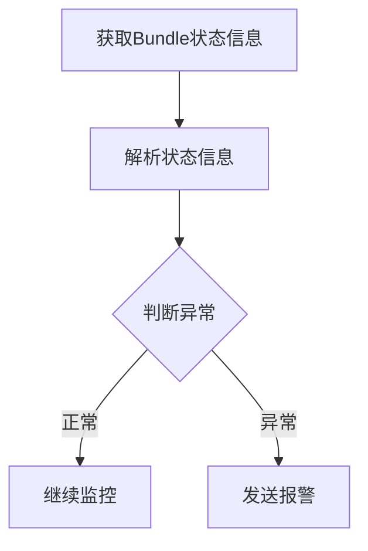

# OozieBundle监控与报警：实时掌握工作流运行状态

## 1.背景介绍

在大数据时代,数据处理工作流程日益复杂,需要协调和监控大量的作业任务。Apache Oozie作为一种工作流调度系统,可以有效管理这些复杂的数据处理流程。其中,OozieBundle作为Oozie的高级功能,可以将多个工作流编排在一起,实现更高层次的任务管理。

然而,由于OozieBundle涉及多个工作流的协调,其运行状态的监控和异常报警就变得更加重要。实时掌握OozieBundle的运行状态,及时发现并处理异常,对于确保数据处理的高效和准确至关重要。

## 2.核心概念与联系

### 2.1 Oozie概念

Apache Oozie是一种用于管理Hadoop作业(如Java MapReduce、Pig作业、Hive作业等)的工作流调度系统。它将多个作业连接成有向无环图(DAG),按照特定的顺序执行。

Oozie有三个核心概念:

- **Workflow(WF)**: 控制着作业的执行顺序。
- **Coordinator(CR)**: 根据时间频率(如每天、每小时等)触发Workflow的执行。
- **Bundle(BUN)**: 将多个Coordinator组合在一起,实现更高层次的任务管理。

### 2.2 OozieBundle

OozieBundle是Oozie中最高层次的抽象,它将多个Coordinator组合在一起,形成一个更大的工作单元。每个Coordinator都有自己的时间触发条件和工作流,而Bundle则负责协调和管理这些Coordinator。

Bundle的优势在于,它允许以层次化的方式组织复杂的数据处理流程,使得管理和监控变得更加简单。同时,Bundle还支持并行执行多个Coordinator,提高了处理效率。

### 2.3 监控和报警的重要性

由于OozieBundle涉及多个Coordinator和Workflow的协调,其运行状态的监控就变得尤为重要。如果某个环节出现异常,可能会导致整个数据处理流程中断或产生错误数据,从而影响后续的业务决策。

及时发现和处理OozieBundle中的异常,不仅可以确保数据处理的准确性,还能提高整个系统的可靠性和效率。因此,建立高效的监控和报警机制,实时掌握OozieBundle的运行状态,对于保证业务的正常运行至关重要。

## 3.核心算法原理具体操作步骤

OozieBundle的监控和报警涉及以下几个主要步骤:

1. **获取Bundle状态信息**
2. **解析状态信息**
3. **判断异常**
4. **发送报警**



### 3.1 获取Bundle状态信息

要监控OozieBundle的运行状态,首先需要获取Bundle的状态信息。Oozie提供了多种方式来获取这些信息,包括:

1. **Oozie Web UI**: 通过Web界面查看Bundle的状态、进度、日志等信息。
2. **Oozie命令行工具**: 使用`oozie`命令查询Bundle的状态。
3. **Oozie Java API**: 使用Oozie的Java客户端API编程获取Bundle状态。
4. **Oozie REST API**: 通过HTTP请求与Oozie服务器交互,获取Bundle状态信息。

其中,使用REST API是一种更加灵活和可扩展的方式,可以方便地将监控系统与Oozie集成。

### 3.2 解析状态信息

获取到Bundle的状态信息后,需要对其进行解析,提取出关键的监控指标。Bundle的状态信息通常包括:

- **Bundle ID**: 唯一标识Bundle的ID。
- **应用路径(AppPath)**: Bundle对应的应用程序路径。
- **状态(Status)**: Bundle的当前状态,如RUNNING、SUCCEEDED、KILLED等。
- **启动时间(StartTime)**: Bundle的启动时间。
- **结束时间(EndTime)**: Bundle的结束时间(如果已结束)。
- **koordinator(Coordinators)**: 该Bundle包含的Coordinator列表及其状态。

解析这些信息后,我们可以获得Bundle的整体运行情况,以及每个Coordinator的具体状态。

### 3.3 判断异常

根据解析出的状态信息,我们需要判断Bundle是否存在异常情况。常见的异常包括:

1. **Bundle处于异常状态**,如KILLED、FAILED等。
2. **Bundle运行时间过长**,超出预期的时间范围。
3. **Coordinator存在异常**,如部分Coordinator处于KILLED或FAILED状态。

我们可以根据预先设置的阈值和规则,对这些异常情况进行检测。例如,如果Bundle运行时间超过24小时,或者有任何一个Coordinator处于FAILED状态,就可以判定为异常。

### 3.4 发送报警

一旦检测到异常情况,我们需要触发报警机制,通知相关人员尽快处理。报警方式可以是:

1. **发送邮件或短信**,将异常信息发送给指定的收件人。
2. **调用报警系统API**,将异常信息推送到统一的报警平台。
3. **记录日志**,将异常信息写入日志文件,以备后续分析和跟踪。

在发送报警时,我们需要包含足够的上下文信息,如Bundle ID、异常类型、发生时间等,以便快速定位和处理问题。

## 4.数学模型和公式详细讲解举例说明

在OozieBundle的监控和报警过程中,我们可以使用一些数学模型和公式来量化和评估Bundle的运行状况。

### 4.1 Bundle运行时间模型

我们可以使用Bundle的启动时间和结束时间,计算出Bundle的实际运行时间:

$$
运行时间 = 结束时间 - 启动时间
$$

根据不同的业务场景,我们可以设置一个期望的最大运行时间阈值$T_{max}$。如果Bundle的实际运行时间超过这个阈值,就可以判定为异常:

$$
异常 = \begin{cases}
True, & \text{if 运行时间} > T_{max}\\
False, & \text{otherwise}
\end{cases}
$$

例如,如果我们设置$T_{max} = 24\text{小时}$,那么任何运行时间超过24小时的Bundle都会被标记为异常。

### 4.2 Coordinator成功率模型

对于一个包含多个Coordinator的Bundle,我们可以计算所有Coordinator的成功率,作为评估Bundle整体运行质量的指标。

设Bundle包含$n$个Coordinator,其中$m$个Coordinator处于成功(SUCCEEDED)状态,那么Bundle的Coordinator成功率可以计算为:

$$
成功率 = \frac{m}{n}
$$

我们可以设置一个最小成功率阈值$R_{min}$,如果Bundle的Coordinator成功率低于这个阈值,就可以判定为异常:

$$
异常 = \begin{cases}
True, & \text{if 成功率} < R_{min}\\
False, & \text{otherwise}
\end{cases}
$$

例如,如果我们设置$R_{min} = 0.9$,那么任何Coordinator成功率低于90%的Bundle都会被标记为异常。

通过结合运行时间模型和成功率模型,我们可以更全面地评估OozieBundle的运行状况,及时发现和处理异常情况。

## 5.项目实践:代码实例和详细解释说明

为了更好地理解OozieBundle的监控和报警过程,我们提供了一个基于Python的实例项目。该项目使用Oozie的REST API获取Bundle状态信息,并实现了异常检测和邮件报警功能。

### 5.1 获取Bundle状态信息

我们使用Python的`requests`库发送HTTP请求,从Oozie服务器获取Bundle状态信息。

```python
import requests

# Oozie服务器地址
OOZIE_URL = 'http://oozie.example.com:11000/oozie'

# 获取Bundle信息的API端点
BUNDLE_INFO_API = '/v2/job/?bundle-id={bundle_id}&show=info'

def get_bundle_info(bundle_id):
    """获取Bundle的状态信息"""
    url = OOZIE_URL + BUNDLE_INFO_API.format(bundle_id=bundle_id)
    response = requests.get(url)
    response.raise_for_status()
    return response.json()
```

在`get_bundle_info`函数中,我们构造了Oozie REST API的URL,并使用`requests.get`方法发送GET请求。如果请求成功,函数会返回Bundle的状态信息(JSON格式)。

### 5.2 解析状态信息

接下来,我们需要从JSON数据中提取关键的监控指标,如Bundle状态、启动时间、结束时间等。

```python
def parse_bundle_info(bundle_info):
    """解析Bundle状态信息"""
    bundle_id = bundle_info['id']
    app_path = bundle_info['appPath']
    status = bundle_info['status']
    start_time = bundle_info['startTime']
    end_time = bundle_info['endTime']
    coordinators = bundle_info['coordinators']

    # 解析Coordinator状态
    coordinator_statuses = []
    for coord in coordinators:
        coord_id = coord['coordJobId']
        coord_status = coord['status']
        coordinator_statuses.append((coord_id, coord_status))

    return {
        'bundle_id': bundle_id,
        'app_path': app_path,
        'status': status,
        'start_time': start_time,
        'end_time': end_time,
        'coordinator_statuses': coordinator_statuses
    }
```

在`parse_bundle_info`函数中,我们从JSON数据中提取出Bundle ID、应用路径、状态、启动时间、结束时间,以及每个Coordinator的ID和状态。这些信息被组织成一个Python字典,方便后续的异常检测和报警。

### 5.3 检测异常

根据第3节介绍的算法原理,我们实现了两个异常检测函数:检测Bundle运行时间是否过长,以及检测Coordinator是否存在失败情况。

```python
import datetime

# 最大运行时间阈值(24小时)
MAX_RUNTIME = datetime.timedelta(days=1)

def is_bundle_running_too_long(start_time, end_time):
    """检测Bundle运行时间是否过长"""
    if end_time:
        runtime = end_time - start_time
        return runtime > MAX_RUNTIME
    else:
        # 如果Bundle还在运行,暂时不判断为异常
        return False

def has_failed_coordinators(coordinator_statuses):
    """检测是否有Coordinator失败"""
    failed_statuses = ['KILLED', 'FAILED']
    for coord_id, status in coordinator_statuses:
        if status in failed_statuses:
            return True
    return False
```

在`is_bundle_running_too_long`函数中,我们计算Bundle的运行时间,并与预设的最大运行时间阈值(`MAX_RUNTIME`)进行比较。如果运行时间超过阈值,函数返回`True`。

在`has_failed_coordinators`函数中,我们遍历每个Coordinator的状态,如果发现任何一个Coordinator处于`KILLED`或`FAILED`状态,函数就返回`True`。

### 5.4 发送报警邮件

如果检测到异常情况,我们就需要触发报警机制。在这个示例项目中,我们使用Python的`smtplib`模块发送报警邮件。

```python
import smtplib

# SMTP服务器配置
SMTP_SERVER = 'smtp.example.com'
SMTP_PORT = 587
SMTP_USER = 'monitoring@example.com'
SMTP_PASSWORD = 'your_password'

# 收件人列表
RECIPIENTS = ['admin1@example.com', 'admin2@example.com']

def send_alert_email(bundle_info, alert_message):
    """发送报警邮件"""
    bundle_id = bundle_info['bundle_id']
    app_path = bundle_info['app_path']
    status = bundle_info['status']

    subject = f'OozieBundle异常报警: {bundle_id}'
    body = f'应用路径: {app_path}\n'
    body += f'Bundle状态: {status}\n\n'
    body += alert_message

    msg = f'Subject: {subject}\n\n{body}'

    with smtplib.SMTP(SMTP_SERVER, SMTP_PORT) as server:
        server.starttls()
        server.login(SMTP_USER, SMTP_PASSWORD)
        for recipient in RECIPIENTS:
            server.sendmail(SMTP_USER, recipient, msg)
```

在`send_alert_email`函数中,我们构造了邮件的主题和正文内容,包括Bundle ID、应用路径、状态,以及具体的异常信息。然后,我们使用`smtplib.SMTP`连接SMTP服务器,并发送邮件给指定的收件人列表(`RECIPIENTS`)。

### 5.5 主函数

最后,我们编写主函数,将上述各个模块组合在一起,实现完整的监控和报警流程。

```