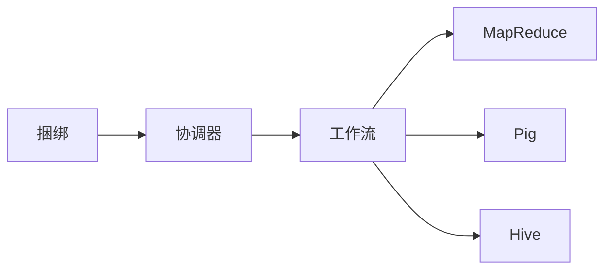

# Oozie原理与代码实例讲解

## 1. 背景介绍
在大数据处理领域，工作流的管理和自动化是至关重要的。Apache Oozie作为一个开源的工作流调度系统，专为Hadoop作业设计，它允许用户创建包含多个作业的复杂工作流，并以依赖关系的方式来执行它们。Oozie的出现极大地简化了Hadoop作业的管理和协调，使得数据工程师和科学家能够更高效地处理数据。

## 2. 核心概念与联系
Oozie的核心概念包括工作流（Workflow），协调器（Coordinator），和捆绑（Bundle）。工作流是一系列作业的集合，这些作业可以是MapReduce, Pig, Hive等。协调器用于定时启动工作流，而捆绑则是对多个协调器的封装，用于跨多个工作流的管理。



## 3. 核心算法原理具体操作步骤
Oozie工作流的执行基于有向无环图（DAG），每个节点代表一个作业或者动作，边代表作业之间的依赖关系。当一个作业完成后，Oozie会根据DAG中的依赖关系来触发下一个作业的执行。

## 4. 数学模型和公式详细讲解举例说明
Oozie的调度算法可以用图论中的拓扑排序来描述。给定一个有向无环图$ G = (V, E) $，其中$ V $是节点集合，$ E $是边集合，拓扑排序是对$ V $的所有节点的线性排列，使得对于任何边$ (u, v) \in E $，$ u $在排列中都出现在$ v $之前。

$$
\text{拓扑排序算法：}
\begin{align*}
&L \leftarrow \text{空列表，存放已排序的节点} \\
&S \leftarrow \text{所有没有前驱节点的节点集合} \\
&\text{while } S \text{ 非空 do} \\
&\quad \text{从 } S \text{ 中移除一个节点 } n \\
&\quad \text{将 } n \text{ 插入到 } L \text{ 的末尾} \\
&\quad \text{对于每个从 } n \text{ 出发的边 } e \text{ do} \\
&\quad \quad \text{移除边 } e \text{ 从图中} \\
&\quad \quad \text{如果 } e \text{ 的目标节点 } m \text{ 没有其他前驱节点，则将 } m \text{ 加入 } S \\
&\text{如果图中还有边，则图中至少有一个环}
\end{align*}
$$

## 5. 项目实践：代码实例和详细解释说明
以下是一个简单的Oozie工作流的XML配置示例，它定义了一个Hive作业：

```xml
<workflow-app xmlns="uri:oozie:workflow:0.5" name="hive-workflow">
    <start to="hive-node"/>
    <action name="hive-node">
        <hive xmlns="uri:oozie:hive-action:0.5">
            <job-tracker>${jobTracker}</job-tracker>
            <name-node>${nameNode}</name-node>
            <script>${hiveScript}</script>
        </hive>
        <ok to="end"/>
        <error to="fail"/>
    </action>
    <kill name="fail">
        <message>Hive failed, error message[${wf:errorMessage(wf:lastErrorNode())}]</message>
    </kill>
    <end name="end"/>
</workflow-app>
```

在这个配置中，`<start>`标签定义了工作流的起始点，`<action>`标签定义了一个Hive作业，`<hive>`标签内部包含了作业的配置信息，如作业追踪器、名称节点和Hive脚本的位置。`<ok>`和`<error>`标签定义了作业成功或失败后的转向。

## 6. 实际应用场景
Oozie广泛应用于数据仓库的数据ETL过程、大数据分析任务的定时执行、以及基于数据的复杂依赖关系的工作流管理。例如，金融机构可能会使用Oozie来定时执行风险分析模型，电商公司可能会用它来处理每日的用户行为日志。

## 7. 工具和资源推荐
- Apache Oozie官方文档：提供详细的安装指南、用户手册和API文档。
- Hue：一个开源的Hadoop用户界面，提供了一个易于使用的Oozie工作流编辑器。
- Oozie Workflow Generator：一个可以帮助生成Oozie工作流配置的工具。

## 8. 总结：未来发展趋势与挑战
随着云计算和容器化技术的发展，Oozie面临着与云原生服务整合的挑战。未来，Oozie需要更好地支持Kubernetes等容器管理平台，以便在更动态的环境中调度和管理工作流。

## 9. 附录：常见问题与解答
Q1: Oozie是否支持除了Hadoop之外的其他类型的作业？
A1: Oozie主要设计用于Hadoop生态系统中的作业，但它也可以通过Shell动作来调用外部系统的作业。

Q2: Oozie工作流是否支持条件逻辑？
A2: 是的，Oozie工作流支持决策节点，可以根据条件来控制工作流的执行路径。

Q3: 如何监控Oozie工作流的执行状态？
A3: 可以通过Oozie的Web UI或者使用Oozie的REST API来监控工作流的状态。

作者：禅与计算机程序设计艺术 / Zen and the Art of Computer Programming