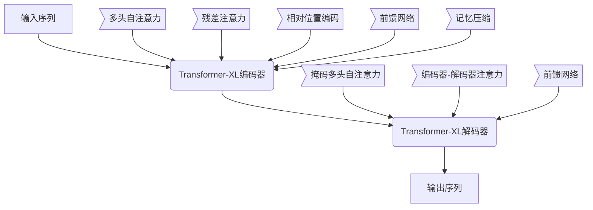

# PaLM原理与代码实例讲解

## 1.背景介绍

### 1.1 人工智能的发展历程

人工智能(Artificial Intelligence, AI)是当代科技发展的前沿领域,自20世纪50年代问世以来,已经取得了长足的进步。从早期的专家系统、机器学习,到近年来的深度学习和大规模预训练语言模型,AI技术不断突破,在越来越多的领域展现出强大的能力。

### 1.2 大规模语言模型的兴起

作为AI发展的重要分支,自然语言处理(Natural Language Processing, NLP)技术也在不断演进。传统的NLP方法主要基于规则和统计模型,但存在一定的局限性。2017年,谷歌的Transformer模型和自注意力机制的提出,为大规模预训练语言模型奠定了基础。2018年,OpenAI推出GPT模型,首次展示了大规模语言模型在各种NLP任务中的卓越表现,掀起了预训练语言模型的热潮。

### 1.3 PaLM模型的重要意义

在这一背景下,谷歌于2022年发布了PaLM(Pathway Language Model)模型,这是一个采用了全新架构的大规模语言模型。PaLM不仅在规模上达到了惊人的5.4亿参数,而且在训练数据、模型结构和训练策略等多个方面都有创新,展现出了卓越的性能表现。PaLM被认为是迄今为止最强大的多功能语言模型之一,在广泛的任务上均表现出色,标志着大模型时代的到来。

## 2.核心概念与联系  

### 2.1 自注意力机制(Self-Attention)

自注意力机制是Transformer模型的核心,它允许模型捕捉输入序列中任意两个位置之间的关系,而不再受限于序列的顺序。这种全局依赖建模能力大大增强了模型的表达能力。

自注意力机制通过查询(Query)、键(Key)和值(Value)之间的运算来计算注意力权重,并据此对值向量进行加权求和,生成新的表示。具体来说,给定一个输入序列$X = (x_1, x_2, ..., x_n)$,自注意力的计算过程如下:

$$\begin{aligned}
Q &= X \cdot W_Q \\
K &= X \cdot W_K\\
V &= X \cdot W_V\\
\text{Attention}(Q, K, V) &= \text{softmax}(\frac{Q \cdot K^T}{\sqrt{d_k}}) \cdot V
\end{aligned}$$

其中$W_Q, W_K, W_V$分别是可学习的投影矩阵,用于将输入$X$映射到查询(Query)、键(Key)和值(Value)空间;$d_k$是每个键/查询向量的维度,用于缩放点积的结果。

### 2.2 多头注意力机制(Multi-Head Attention)

为了进一步提高模型的表达能力,Transformer引入了多头注意力机制。多头注意力允许模型从不同的表示子空间捕捉不同的关系,并将这些不同子空间的信息融合起来,从而提高了模型的建模能力。

具体来说,多头注意力首先通过不同的线性投影将输入$X$映射到$h$个子空间,对每个子空间分别执行自注意力操作,然后将所有子空间的注意力输出进行拼接并经过另一个线性变换,得到最终的多头注意力输出:

$$\begin{aligned}
\text{MultiHead}(Q, K, V) &= \text{Concat}(\text{head}_1, ..., \text{head}_h) \cdot W_O\\
\text{where } \text{head}_i &= \text{Attention}(Q \cdot W_i^Q, K \cdot W_i^K, V \cdot W_i^V)
\end{aligned}$$

其中$W_i^Q, W_i^K, W_i^V$是子空间$i$对应的线性投影矩阵,$W_O$是最终的线性变换矩阵。

### 2.3 前馈神经网络(Feed-Forward Network)

除了多头自注意力子层之外,Transformer的编码器和解码器中还包含了前馈全连接神经网络子层,用于为序列中的每个位置执行位置wise的非线性变换,进一步提高模型的表达能力。

前馈神经网络的计算过程如下:

$$\text{FFN}(x) = \max(0, xW_1 + b_1)W_2 + b_2$$

其中$W_1, W_2$是可学习的权重矩阵,$b_1, b_2$是可学习的偏置向量。通常采用ReLU作为激活函数。

### 2.4 Transformer编解码器架构

Transformer是一种基于自注意力机制的序列到序列(Seq2Seq)模型,由编码器(Encoder)和解码器(Decoder)两部分组成。

编码器的作用是将输入序列映射到一个连续的表示空间中,由多个相同的层组成,每一层包括多头自注意力子层和前馈神经网络子层。

解码器也由多个相同的层组成,除了包含与编码器类似的多头自注意力子层和前馈神经网络子层之外,还引入了一个额外的注意力子层,用于对编码器的输出序列进行注意力计算,捕捉输入和输出序列之间的依赖关系。

### 2.5 PaLM的Transformer-XL架构

PaLM模型采用了改进的Transformer-XL架构,相比原始的Transformer架构,Transformer-XL引入了一些新的设计,以更好地捕捉长距离依赖关系。

其核心创新包括:

1. **残差注意力机制(Residual Attention)**:在原有的自注意力机制基础上,增加了一个独立的注意力分支,用于直接捕捉当前位置与之前所有位置之间的依赖关系。

2. **相对位置编码(Relative Positional Encoding)**:在原有的绝对位置编码基础上,引入了相对位置编码,使模型能够更好地学习相对位置信息。

3. **记忆压缩(Memory Compression)**:通过记忆压缩机制,模型可以更高效地利用历史信息,降低了对长期记忆的需求。

这些创新设计使得Transformer-XL能够更好地捕捉长距离依赖关系,从而提高了模型的性能表现。

## 3.核心算法原理具体操作步骤

### 3.1 PaLM模型架构

PaLM模型的整体架构如下图所示:

可以看到,PaLM模型由一个Transformer-XL编码器和一个Transformer-XL解码器组成。编码器的主要创新包括:

1. 多头自注意力
2. 残差注意力
3. 相对位置编码
4. 前馈网络
5. 记忆压缩

解码器则在原有的Transformer解码器基础上,增加了掩码多头自注意力(Masked Multi-Head Attention)和编码器-解码器注意力(Encoder-Decoder Attention)两个子层。

### 3.2 输入表示

在输入PaLM模型之前,需要将原始文本序列转换为模型可以理解的表示形式。PaLM采用的是子词(Subword)表示,具体步骤如下:

1. **词元化(Tokenization)**: 将输入文本按空格等分隔符拆分为词元序列。

2. **子词编码(Subword Encoding)**: 使用基于字节对编码(Byte-Pair Encoding, BPE)的子词编码算法,将词元序列转换为子词序列。这种方式可以有效减少词表的大小,并处理未见词元。

3. **添加特殊标记(Special Tokens)**: 在子词序列的开头和结尾分别添加特殊的起始标记`<s>`和结束标记`</s>`。

4. **位置编码(Positional Encoding)**: 为每个子词添加位置编码,使模型能够捕捉序列的位置信息。

最终得到的是一个包含子词ID和位置编码的序列表示,作为PaLM模型的输入。

### 3.3 Transformer-XL编码器

编码器的作用是将输入序列映射到一个连续的表示空间中。PaLM采用的是改进的Transformer-XL编码器架构,具体计算过程如下:

1. **多头自注意力**:对输入序列执行标准的多头自注意力操作,捕捉序列中元素之间的依赖关系。

2. **残差注意力**:在多头自注意力的基础上,增加一个独立的注意力分支,用于直接捕捉当前位置与之前所有位置之间的依赖关系。残差注意力的计算过程如下:

   $$\begin{aligned}
   Q_r &= X \cdot W_Q^r\\
   K_r &= R \cdot W_K^r\\
   V_r &= R \cdot W_V^r\\
   \text{Residual Attn}(Q_r, K_r, V_r) &= \text{softmax}(\frac{Q_r \cdot K_r^T}{\sqrt{d_k}}) \cdot V_r
   \end{aligned}$$

   其中$R$是记忆张量,用于存储之前所有位置的表示;$W_Q^r, W_K^r, W_V^r$是可学习的投影矩阵。

3. **相对位置编码**:在原有的绝对位置编码基础上,引入相对位置编码,使模型能够更好地学习相对位置信息。相对位置编码的计算过程如下:

   $$\begin{aligned}
   \text{RelPosEnc}(Q, K) &= A_K \cdot \text{RelativePositions}(Q, K)\\
   \text{Attention}(Q, K, V) &= \text{softmax}(\frac{Q \cdot K^T + \text{RelPosEnc}(Q, K)}{\sqrt{d_k}}) \cdot V
   \end{aligned}$$

   其中$A_K$是可学习的相对位置编码矩阵;$\text{RelativePositions}(Q, K)$计算查询和键之间的相对位置。

4. **前馈网络**:对自注意力的输出执行前馈全连接网络变换,提高模型的表达能力。

5. **记忆压缩**:通过记忆压缩机制,模型可以更高效地利用历史信息,降低了对长期记忆的需求。记忆压缩的计算过程如下:

   $$\begin{aligned}
   M_t &= \text{Compress}(H_t, M_{t-1}, g_U, g_R)\\
   H_t &= \text{LayerNorm}(H_t + \text{FF}(H_t))
   \end{aligned}$$

   其中$M_t$是当前时刻的记忆张量;$H_t$是当前层的输出;$g_U$和$g_R$分别是用于更新和检索记忆的门控函数。

经过上述步骤,编码器即可将输入序列映射到一个连续的表示空间中,为后续的解码器提供信息。

### 3.4 Transformer-XL解码器

解码器的作用是根据编码器的输出,生成目标序列。PaLM采用的是改进的Transformer-XL解码器架构,具体计算过程如下:

1. **掩码多头自注意力**:对解码器的输入序列执行掩码多头自注意力操作,捕捉序列中元素之间的依赖关系,但遮蔽掉当前位置之后的信息。

2. **编码器-解码器注意力**:将解码器的输出与编码器的输出进行注意力计算,捕捉输入和输出序列之间的依赖关系。

3. **前馈网络**:对注意力的输出执行前馈全连接网络变换,提高模型的表达能力。

4. **生成概率计算**:对前馈网络的输出执行一个线性变换和softmax操作,得到每个位置生成不同子词的概率分布。

   $$P(y_t | y_{<t}, X) = \text{softmax}(H_t \cdot W_o)$$

   其中$H_t$是当前时刻的解码器输出;$W_o$是可学习的输出投影矩阵。

通过上述步骤,解码器可以根据编码