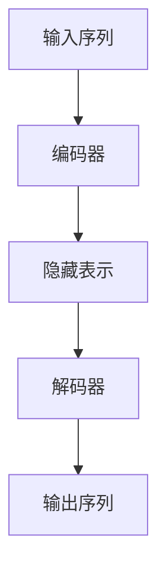

# PaLM原理与代码实例讲解

## 1.背景介绍

在人工智能领域，语言模型（Language Model, LM）一直是研究的热点。近年来，随着深度学习技术的发展，语言模型的性能得到了显著提升。PaLM（Pathways Language Model）是Google推出的一种新型语言模型，它在多个自然语言处理任务中表现出色。本文将深入探讨PaLM的核心概念、算法原理、数学模型、实际应用场景，并提供代码实例和详细解释。

## 2.核心概念与联系

### 2.1 PaLM简介

PaLM是基于Google的Pathways系统构建的语言模型。Pathways是一种新的机器学习架构，旨在提高模型的效率和可扩展性。PaLM利用Pathways的多任务学习能力，能够在多个任务上共享知识，从而提高模型的泛化能力。

### 2.2 语言模型的基本概念

语言模型的目标是预测给定上下文的下一个词。传统的语言模型如n-gram模型通过统计方法实现，而现代的语言模型如BERT、GPT-3则利用深度学习技术，特别是Transformer架构。

### 2.3 PaLM与其他语言模型的区别

PaLM与BERT、GPT-3等模型的主要区别在于其多任务学习能力和高效的训练架构。PaLM不仅能够处理单一任务，还能在多个任务之间共享知识，提高整体性能。

## 3.核心算法原理具体操作步骤

### 3.1 Transformer架构

PaLM基于Transformer架构，Transformer由编码器和解码器组成。编码器负责将输入序列转换为隐藏表示，解码器则根据隐藏表示生成输出序列。



### 3.2 多任务学习

PaLM利用Pathways系统的多任务学习能力，在训练过程中同时处理多个任务。每个任务都有自己的损失函数，最终的损失是各个任务损失的加权和。

### 3.3 训练过程

1. 数据预处理：将原始数据转换为模型可接受的格式。
2. 模型初始化：初始化Transformer模型的参数。
3. 多任务训练：同时训练多个任务，更新模型参数。
4. 模型评估：在验证集上评估模型性能。

## 4.数学模型和公式详细讲解举例说明

### 4.1 语言模型的数学定义

语言模型的目标是最大化给定序列的概率。对于一个序列 $X = (x_1, x_2, ..., x_n)$，其概率可以表示为：

$$
P(X) = P(x_1, x_2, ..., x_n) = \prod_{i=1}^{n} P(x_i | x_1, x_2, ..., x_{i-1})
$$

### 4.2 Transformer的自注意力机制

自注意力机制是Transformer的核心。对于输入序列 $X$，自注意力机制计算每个词与其他词的相关性。具体公式如下：

$$
\text{Attention}(Q, K, V) = \text{softmax}\left(\frac{QK^T}{\sqrt{d_k}}\right)V
$$

其中，$Q$、$K$、$V$分别是查询、键和值矩阵，$d_k$是键的维度。

### 4.3 多任务学习的损失函数

在多任务学习中，PaLM的总损失函数是各个任务损失的加权和：

$$
L_{\text{total}} = \sum_{i=1}^{m} \alpha_i L_i
$$

其中，$L_i$是第$i$个任务的损失，$\alpha_i$是其权重。

## 5.项目实践：代码实例和详细解释说明

### 5.1 环境配置

首先，确保安装了必要的Python库：

```bash
pip install transformers torch
```

### 5.2 数据预处理

假设我们有一个文本数据集，首先进行数据预处理：

```python
from transformers import BertTokenizer

tokenizer = BertTokenizer.from_pretrained('bert-base-uncased')
texts = ["Hello, world!", "PaLM is a powerful language model."]
inputs = tokenizer(texts, return_tensors='pt', padding=True, truncation=True)
```

### 5.3 模型初始化

初始化一个简单的Transformer模型：

```python
from transformers import BertModel

model = BertModel.from_pretrained('bert-base-uncased')
outputs = model(**inputs)
```

### 5.4 多任务训练

假设我们有两个任务：文本分类和序列标注。定义损失函数并进行训练：

```python
import torch
from torch import nn

class MultiTaskModel(nn.Module):
    def __init__(self, model):
        super(MultiTaskModel, self).__init__()
        self.model = model
        self.classifier = nn.Linear(model.config.hidden_size, 2)  # 分类任务
        self.tagger = nn.Linear(model.config.hidden_size, 10)    # 序列标注任务

    def forward(self, input_ids, attention_mask):
        outputs = self.model(input_ids, attention_mask=attention_mask)
        sequence_output = outputs.last_hidden_state
        pooled_output = outputs.pooler_output
        classification_logits = self.classifier(pooled_output)
        tagging_logits = self.tagger(sequence_output)
        return classification_logits, tagging_logits

multi_task_model = MultiTaskModel(model)
criterion = nn.CrossEntropyLoss()
optimizer = torch.optim.Adam(multi_task_model.parameters(), lr=1e-5)

# 假设我们有标签
classification_labels = torch.tensor([1, 0])
tagging_labels = torch.tensor([[1, 2, 0], [3, 4, 0]])

# 训练步骤
multi_task_model.train()
optimizer.zero_grad()
classification_logits, tagging_logits = multi_task_model(inputs['input_ids'], inputs['attention_mask'])
classification_loss = criterion(classification_logits, classification_labels)
tagging_loss = criterion(tagging_logits.view(-1, 10), tagging_labels.view(-1))
total_loss = classification_loss + tagging_loss
total_loss.backward()
optimizer.step()
```

## 6.实际应用场景

### 6.1 自然语言理解

PaLM在自然语言理解任务中表现出色，如文本分类、情感分析和问答系统。

### 6.2 机器翻译

PaLM可以用于高质量的机器翻译，特别是在多语言环境中，其多任务学习能力能够显著提高翻译质量。

### 6.3 对话系统

PaLM在对话系统中也有广泛应用，能够生成自然流畅的对话，提高用户体验。

## 7.工具和资源推荐

### 7.