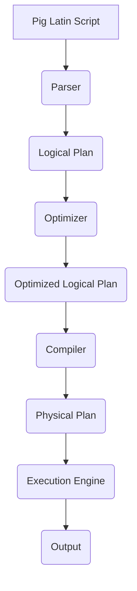

# Pig大规模数据分析平台原理与代码实例讲解

## 1.背景介绍

在当今大数据时代，海量数据的存储和处理成为了一个巨大的挑战。Apache Pig作为一种高级数据流语言,旨在简化大规模数据集的分析过程。它提供了一种类似SQL的语法,使开发人员能够专注于数据分析逻辑,而不必过多关注底层MapReduce实现细节。Pig可以在各种执行环境中运行,如Apache Hadoop、Apache Tez和Apache Spark等。

## 2.核心概念与联系

### 2.1 Pig Latin

Pig Latin是Pig的脚本语言,用于表达数据分析流程。它提供了一组丰富的操作符,如过滤(FILTER)、投影(FOREACH)、连接(JOIN)等,用于转换和操作数据。Pig Latin脚本可以被编译成一系列MapReduce作业,并在底层执行引擎上运行。

### 2.2 数据模型

Pig采用了一种灵活的数据模型,可以处理各种结构化和非结构化数据。它的基本数据单元是Tuple(元组),类似于关系数据库中的行。多个Tuple组成了一个Bag(背包),相当于关系数据库中的表。此外,Pig还支持Map(映射)和嵌套数据结构。

### 2.3 执行模式

Pig提供了两种执行模式:本地模式和MapReduce模式。本地模式适用于小规模数据集和开发测试,而MapReduce模式则用于大规模数据处理,可以利用Hadoop集群的并行计算能力。

### 2.4 架构概览

Pig的架构可以分为以下几个主要组件:

1. **Parser(解析器)**: 将Pig Latin脚本解析为逻辑计划。
2. **Optimizer(优化器)**: 对逻辑计划进行优化,如投影列裁剪、过滤器下推等。
3. **Compiler(编译器)**: 将优化后的逻辑计划编译为物理计划,即一系列MapReduce作业。
4. **Execution Engine(执行引擎)**: 在底层执行环境(如Hadoop或Tez)上运行物理计划。



## 3.核心算法原理具体操作步骤

### 3.1 数据加载

Pig提供了多种加载数据的方式,包括从本地文件系统、HDFS或HBase等数据源读取数据。以下是从HDFS加载数据的示例:

```pig
-- 加载HDFS上的数据文件
records = LOAD '/user/data/input' USING PigStorage(',') AS (id:int, name:chararray, age:int);
```

在上述示例中,`LOAD`操作符用于从HDFS路径`/user/data/input`加载数据文件。`USING PigStorage(',')`指定了使用逗号作为字段分隔符。最后,`AS`子句定义了数据的Schema,包括三个字段:整数类型的`id`、字符串类型的`name`和整数类型的`age`。

### 3.2 数据转换

Pig Latin提供了丰富的操作符用于转换和操作数据,如`FILTER`、`FOREACH`、`JOIN`等。以下是一些常见操作示例:

```pig
-- 过滤年龄大于30的记录
filtered_records = FILTER records BY age > 30;

-- 投影并添加新列
projected_records = FOREACH filtered_records GENERATE id, name, age, (age + 10) AS new_age;

-- 基于id字段连接两个数据集
joined_records = JOIN projected_records BY id, other_data BY id;
```

在上述示例中,首先使用`FILTER`操作符过滤出年龄大于30的记录。然后,`FOREACH`操作符用于投影特定列,并添加一个新的`new_age`列,其值为原始`age`加10。最后,使用`JOIN`操作符基于`id`字段将两个数据集连接起来。

### 3.3 数据聚合

Pig Latin还支持各种聚合操作,如`GROUP`、`COGROUP`、`CUBE`等。以下是一个使用`GROUP`进行聚合的示例:

```pig
-- 按名字分组,计算每个组的平均年龄
grouped_records = GROUP records BY name;
avg_age = FOREACH grouped_records GENERATE
    group AS name,
    AVG(records.age) AS avg_age;
```

在这个示例中,首先使用`GROUP`操作符按照`name`字段对记录进行分组。然后,`FOREACH`操作符遍历每个组,使用`AVG`函数计算每个组的平均年龄,并生成一个新的数据集,包含`name`和`avg_age`两个字段。

## 4.数学模型和公式详细讲解举例说明

在数据分析过程中,Pig Latin还支持使用各种数学函数和用户自定义函数(UDF)。以下是一些常见的数学函数示例:

- `$sqrt(x)$`: 计算x的平方根
- `$pow(x, y)$`: 计算x的y次幂
- `$log(x)$`: 计算x的自然对数
- `$exp(x)$`: 计算e的x次幂

此外,Pig Latin还支持使用统计函数,如`AVG`、`SUM`、`COUNT`等。以下是一个使用`SUM`函数计算总和的示例:

```pig
-- 计算所有记录的age之和
total_age = FOREACH records GENERATE SUM(age) AS total_age;
```

在这个示例中,`FOREACH`操作符遍历所有记录,使用`SUM`函数计算所有`age`字段的总和,并生成一个新的数据集,只包含`total_age`一个字段。

除了内置函数,Pig Latin还支持使用用户自定义函数(UDF)。UDF可以用Java或其他语言编写,并在Pig Latin脚本中调用。以下是一个使用UDF计算两个数字的最大值的示例:

```pig
-- 定义并注册UDF
DEFINE max_udf com.example.MaxUDF();

-- 使用UDF
records = FOREACH records GENERATE id, name, age, max_udf(age, 30) AS max_age;
```

在这个示例中,首先使用`DEFINE`语句定义并注册了一个名为`max_udf`的UDF,该UDF实现了计算两个数字最大值的功能。然后,在`FOREACH`操作符中使用`max_udf`函数,计算每条记录的`age`和30的最大值,并生成一个新的`max_age`字段。

## 5.项目实践:代码实例和详细解释说明

### 5.1 示例数据集

假设我们有一个包含用户购买记录的数据集,存储在HDFS上的`/user/data/purchases`路径下。该数据集的格式如下:

```
1,Alice,book,19.99
2,Bob,phone,499.99
1,Alice,headphone,29.99
3,Charlie,laptop,999.99
2,Bob,book,14.99
```

每条记录包含四个字段:用户ID、用户名、购买商品和购买金额。

### 5.2 Pig Latin脚本

以下是一个Pig Latin脚本,用于对上述数据集进行分析:

```pig
-- 加载数据
purchases = LOAD '/user/data/purchases' USING PigStorage(',') AS (userId:int, userName:chararray, product:chararray, amount:double);

-- 过滤金额大于100的记录
expensive_purchases = FILTER purchases BY amount > 100.0;

-- 按用户分组,计算每个用户的总购买金额
grouped_purchases = GROUP expensive_purchases BY userId;
user_totals = FOREACH grouped_purchases GENERATE
    group AS userId,
    SUM(expensive_purchases.amount) AS total_amount;

-- 排序并输出结果
sorted_totals = ORDER user_totals BY total_amount DESC;
STORE sorted_totals INTO '/user/data/output';
```

以下是对该脚本的详细解释:

1. 首先,使用`LOAD`操作符从HDFS路径`/user/data/purchases`加载数据,并定义数据的Schema。
2. 然后,使用`FILTER`操作符过滤出购买金额大于100的记录。
3. 接下来,使用`GROUP`操作符按照`userId`字段对记录进行分组。
4. 在每个组内,使用`FOREACH`操作符和`SUM`函数计算每个用户的总购买金额,生成一个新的数据集`user_totals`。
5. 最后,使用`ORDER`操作符按照`total_amount`字段对`user_totals`数据集进行降序排序,并使用`STORE`操作符将结果存储到HDFS路径`/user/data/output`。

运行该脚本后,`/user/data/output`路径下将包含以下结果:

```
3,999.99
2,514.98
1,49.98
```

结果显示,用户3的总购买金额最高,为999.99;用户2的总购买金额为514.98;用户1的总购买金额为49.98。

## 6.实际应用场景

Pig在各种领域都有广泛的应用,包括但不限于以下几个场景:

1. **网络日志分析**: 分析网站或应用程序的用户行为日志,了解用户偏好、流量模式等信息,从而优化产品和服务。

2. **电子商务数据处理**: 处理电子商务网站的订单数据、交易记录等,进行销售分析、库存管理等。

3. **社交网络分析**: 分析社交网络中的用户关系、信息传播等,为推荐系统、广告投放等提供支持。

4. **金融风险分析**: 分析金融交易数据,识别潜在的风险和欺诈行为。

5. **生物信息学**: 处理基因组数据、蛋白质序列等,用于基因表达分析、疾病研究等。

6. **物联网数据处理**: 处理来自各种传感器和设备的海量数据,用于预测维护、优化资源利用等。

总的来说,Pig非常适合处理结构化和半结构化的大规模数据集,能够简化数据分析过程,提高开发效率。

## 7.工具和资源推荐

除了Pig本身,还有一些其他工具和资源可以帮助您更好地使用Pig进行大数据分析:

1. **Pig界面工具**:
   - Apache Pig UI: Pig自带的基于Web的用户界面,可以方便地编写、执行和监控Pig作业。
   - Pig工具集成到Hadoop生态系统工具中,如Hue、Zeppelin等。

2. **集成开发环境(IDE)**:
   - IntelliJ IDEA: 支持Pig脚本编写、调试和执行。
   - Eclipse: 通过插件支持Pig开发。

3. **Pig学习资源**:
   - Apache Pig官方文档: https://pig.apache.org/docs/latest/
   - Pig编程指南(Programming Pig): https://github.com/apache/pig/tree/trunk/docs
   - Pig实战视频教程: https://www.edureka.co/blog/apache-pig-tutorial/

4. **Pig社区**:
   - Apache Pig邮件列表: https://pig.apache.org/mail-lists.html
   - Pig Stack Overflow标签: https://stackoverflow.com/questions/tagged/apache-pig

利用这些工具和资源,您可以更高效地编写和调试Pig脚本,加速大数据分析过程。

## 8.总结:未来发展趋势与挑战

Pig作为一种高级数据流语言,极大地简化了大规模数据分析过程。然而,随着大数据技术的不断发展,Pig也面临着一些挑战和发展趋势:

1. **性能优化**: 虽然Pig已经提供了一些优化策略,但仍有进一步优化的空间,如更智能的查询优化、更高效的执行引擎等。

2. **流式处理支持**: 随着实时数据处理需求的增加,Pig需要提供更好的流式处理支持,以便处理持续不断的数据流。

3. **机器学习集成**: 将Pig与机器学习框架(如Apache Spark MLlib)更紧密地集成,可以简化机器学习管道的构建和部署。

4. **云原生支持**: 随着云计算的普及,Pig需要更好地支持云原生环境,如Kubernetes集群等。

5. **可视化和交互式分析**: 提供更友好的可视化界面和交互式分析工具,降低大数据分析的门槛。

6. **社区活跃度**: 保持Pig社区的活跃度,吸引更多的贡献者和用户,推动Pig的持续发展。

总的来说,Pig作为一种成熟的大数据分析工具,仍有广阔的发展空间。通过不断优化和创新,Pig将继续在大数据分析领域发挥重要作用。

## 9.附录:常见问题与解答

1. **Pig与Hive有什么区别?**