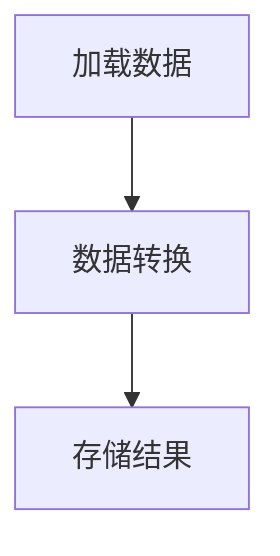

## 1.背景介绍
在现代数据驱动的世界中，数据的管理和维护成为了企业的首要任务之一。Apache Pig是一个开源的数据流程脚本语言，它被设计用来处理大数据集。Pig的主要优势在于其能够处理大量的数据，以及其灵活的脚本语言，可以轻松地进行数据转换和分析。

## 2.核心概念与联系
Pig的核心概念包括Pig Latin脚本语言和Pig运行环境。Pig Latin是一种过程式的脚本语言，它提供了一种简洁的方式来表达数据转换和分析。Pig运行环境是一个Java库，它提供了执行Pig Latin脚本的运行时环境。

## 3.核心算法原理具体操作步骤
Pig的数据处理流程主要包括以下几个步骤：

1. 加载数据：使用LOAD语句从数据源加载数据到Pig的数据模型中。
2. 数据转换：使用各种Pig Latin语句（如FILTER，GROUP，JOIN等）对数据进行转换和分析。
3. 存储结果：使用STORE语句将处理后的数据保存到数据源中。



## 4.数学模型和公式详细讲解举例说明
Pig使用数据模型来表示加载到内存中的数据。Pig的数据模型包括原子数据类型（如int，float，string等），元组（一个有序的字段集合），包（一个无序的元组集合）和映射（一个键值对集合）。例如，以下是一个元组的例子：

```pig
(1, 'John', 25)
```

## 5.项目实践：代码实例和详细解释说明
以下是一个简单的Pig Latin脚本的例子，它从一个CSV文件中加载数据，然后对数据进行过滤和分组，最后将结果存储到一个新的文件中。

```pig
A = LOAD 'data.csv' USING PigStorage(',') AS (id:int, name:chararray, age:int);
B = FILTER A BY age > 18;
C = GROUP B BY name;
D = FOREACH C GENERATE group, COUNT(B);
STORE D INTO 'result.csv' USING PigStorage(',');
```

## 6.实际应用场景
Pig广泛应用于大数据处理和分析场景，如日志处理，数据清洗，数据转换和数据分析等。

## 7.工具和资源推荐
推荐使用Apache Pig官方网站提供的资源，包括Pig的下载链接，用户指南，API文档，以及各种教程和示例。

## 8.总结：未来发展趋势与挑战
随着大数据技术的发展，Pig将面临更多的挑战和机遇。一方面，数据的规模和复杂性将不断增加，这需要Pig提供更高效和灵活的数据处理能力。另一方面，新的数据处理技术，如Spark和Flink，将对Pig构成竞争，这需要Pig不断创新和改进。

## 9.附录：常见问题与解答
1. Q: Pig和SQL有什么区别？
   A: Pig是一种过程式的脚本语言，它更适合复杂的数据转换和分析。而SQL是一种声明式的查询语言，它更适合简单的数据查询和报告。

2. Q: Pig可以处理哪些类型的数据？
   A: Pig可以处理各种类型的数据，包括结构化的数据（如CSV，JSON），半结构化的数据（如日志文件），以及非结构化的数据（如文本文件）。

作者：禅与计算机程序设计艺术 / Zen and the Art of Computer Programming