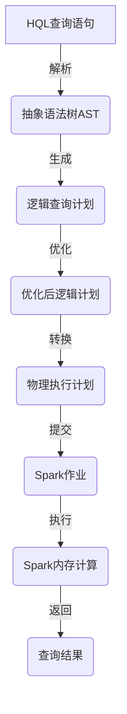

# PrestoonSpark：利用Spark加速Hive查询

## 1. 背景介绍

在大数据时代,数据量的爆炸式增长给传统的数据处理系统带来了巨大的挑战。Apache Hive作为建立在Hadoop之上的数据仓库工具,支持使用类SQL语言进行数据查询,为大数据分析提供了重要支持。然而,Hive的MapReduce计算框架在处理大规模数据集时存在延迟高、效率低下等问题。

为了解决这一瓶颈,业界提出了多种优化方案,其中一个有效途径就是利用Spark的内存计算能力来加速Hive的查询过程。Apache Spark作为统一的内存大数据处理引擎,具有高度的容错性和可伸缩性,能够快速高效地处理大数据。PrestoonSpark就是一种将Hive和Spark相结合的解决方案,旨在充分利用Spark强大的内存计算能力,从而显著提升Hive的查询性能。

## 2. 核心概念与联系

### 2.1 Apache Hive

Apache Hive是建立在Hadoop之上的数据仓库工具,它将结构化的数据文件映射为一张数据库表,并提供类SQL查询语言HQL(Hive Query Language)来管理和查询这些数据。Hive的核心组件包括:

- **Metastore**: 存储数据库、表、列等元数据信息。
- **Driver**: 将HQL语句转化为一系列MapReduce任务。
- **Compiler**: 将HQL语句编译为可执行的查询计划。
- **Execution Engine**: 执行查询计划,调度MapReduce任务。

### 2.2 Apache Spark

Apache Spark是一种快速、通用的集群计算系统,可用于大数据处理。它的核心是弹性分布式数据集(Resilient Distributed Dataset, RDD),支持内存计算,并提供了多种高级API,如Spark SQL、Spark Streaming等。Spark的主要组件包括:

- **Spark Core**: 实现了Spark的基本功能,如任务调度、内存管理等。
- **Spark SQL**: 支持结构化数据的处理,提供了SQL查询优化器。
- **Spark Streaming**: 用于实时流式数据处理。
- **MLlib**: 机器学习算法库。
- **GraphX**: 用于图形计算和并行图形处理。

### 2.3 PrestoonSpark

PrestoonSpark是将Hive和Spark相结合的一种解决方案,旨在利用Spark的内存计算能力来加速Hive的查询过程。它的核心思想是将Hive的查询语句转换为Spark作业,并在Spark上执行查询计划。PrestoonSpark的主要优势包括:

- **高性能**: 利用Spark的内存计算能力,可以显著提升查询性能。
- **低延迟**: 避免了MapReduce的启动开销和磁盘I/O,降低了查询延迟。
- **兼容性**: 可以直接使用Hive的HQL语句,无需修改现有代码。
- **资源利用率高**: 可以共享Spark集群资源,提高集群利用率。

## 3. 核心算法原理具体操作步骤

PrestoonSpark的核心算法原理可以分为以下几个步骤:

1. **查询语句解析**: 首先,PrestoonSpark会将用户提交的HQL查询语句进行解析,生成抽象语法树(Abstract Syntax Tree, AST)。

2. **逻辑计划生成**: 基于AST,PrestoonSpark会生成逻辑查询计划,对查询进行优化,如谓词下推、投影剪裁等。

3. **物理计划生成**: 将逻辑计划转换为可执行的物理计划,包括选择合适的Spark算子,如map、filter、join等。

4. **Spark作业提交**: 将物理计划转换为Spark作业,并提交到Spark集群执行。

5. **Spark作业执行**: Spark集群执行查询计划,利用内存计算加速数据处理过程。

6. **结果返回**: 最终将查询结果返回给Hive客户端。

整个过程可以用下面的流程图来描述:



## 4. 数学模型和公式详细讲解举例说明

在PrestoonSpark中,查询优化是一个关键环节,其中涉及到多种数学模型和公式,我们来详细讲解其中的一些核心内容。

### 4.1 代价模型

为了选择最优的执行计划,PrestoonSpark需要评估每个候选计划的代价,通常使用代价模型来估算执行代价。常见的代价模型包括:

- **基于统计信息的代价模型**:利用表和列的统计信息(如行数、基数等)来估算代价。

- **基于硬件的代价模型**:考虑硬件特性(如CPU、内存、网络等)对代价的影响。

假设有两个表R和S,分别有$r$和$s$行,需要执行连接操作$R \Join S$。如果使用基于统计信息的代价模型,连接操作的代价可以用下面的公式估算:

$$
Cost(R \Join S) = r \times s
$$

这个公式假设连接是一个嵌套循环,需要对R中的每一行,扫描S中的所有行。如果有更多的统计信息(如选择率、基数等),代价模型会更加精确。

### 4.2 查询重写

查询重写是查询优化的一种重要技术,通过等价变换将查询转换为更高效的形式。常见的重写规则包括:

- **谓词下推**:将过滤条件尽可能下推到数据源,减少数据传输量。
- **投影剪裁**:只读取查询所需的列,避免不必要的数据读取。
- **常量折叠**:将常量表达式预先计算,减少运行时开销。

例如,对于查询`SELECT x, y FROM R WHERE x > 10 AND y < 20`,可以应用谓词下推和投影剪裁,转换为`SELECT x, y FROM (SELECT x, y FROM R WHERE x > 10) T WHERE y < 20`。这样可以先过滤掉x <= 10的行,再过滤y >= 20的行,减少了数据传输量。

### 4.3 自动向量化

自动向量化是一种编译器优化技术,通过利用CPU的SIMD(单指令多数据)指令集,可以显著提升数据处理的吞吐量。对于大规模数据处理,自动向量化可以带来显著的性能提升。

假设需要对一个长度为n的数组A进行元素求和操作,如果使用标量代码,时间复杂度为O(n)。而如果使用向量化代码,可以将多个元素打包成向量,利用SIMD指令并行计算,时间复杂度可以降低到O(n/k),其中k是向量长度。

例如,对于一个长度为8的浮点数数组,使用AVX2指令集(256位宽度),可以将8个元素打包成一个向量,只需要一条指令就可以完成8个元素的加法操作。这种优化在大数据场景下可以带来数量级的性能提升。

## 5. 项目实践:代码实例和详细解释说明

接下来,我们通过一个实际的项目实践来演示如何使用PrestoonSpark加速Hive查询。我们将使用一个简单的示例数据集,包含两个表:员工表(employee)和部门表(department)。

### 5.1 数据准备

首先,我们需要在Hive中创建两个表,并导入示例数据:

```sql
-- 创建员工表
CREATE TABLE employee (
  id INT,
  name STRING,
  dept_id INT,
  salary DOUBLE
)
ROW FORMAT DELIMITED
FIELDS TERMINATED BY ',';

-- 导入员工数据
LOAD DATA LOCAL INPATH '/path/to/employee.csv' OVERWRITE INTO TABLE employee;

-- 创建部门表
CREATE TABLE department (
  id INT,
  name STRING
)
ROW FORMAT DELIMITED
FIELDS TERMINATED BY ',';

-- 导入部门数据
LOAD DATA LOCAL INPATH '/path/to/department.csv' OVERWRITE INTO TABLE department;
```

### 5.2 启用PrestoonSpark

要在Hive中启用PrestoonSpark,需要设置一些配置参数:

```sql
SET spark.yarn.queue=queuename; -- 设置Spark作业队列
SET spark.master=yarn; -- 设置Spark运行模式为YARN
SET hive.execution.engine=spark; -- 设置Hive使用Spark作为执行引擎
```

### 5.3 查询示例

现在,我们可以使用HQL查询语句,并由PrestoonSpark在Spark上执行。例如,查询每个部门的员工平均工资:

```sql
SELECT d.name, AVG(e.salary) AS avg_salary
FROM employee e
JOIN department d ON e.dept_id = d.id
GROUP BY d.name;
```

PrestoonSpark会将这个查询转换为Spark作业,利用Spark SQL的查询优化器和内存计算能力进行高效执行。

### 5.4 代码解释

下面是一个简化版的Scala代码,展示了PrestoonSpark如何将HQL查询转换为Spark作业:

```scala
// 1. 解析HQL语句
val ast = HiveParser.parseQuery(hqlQuery)

// 2. 生成逻辑计划
val logicalPlan = HiveLogicalPlanGenerator.generateLogicalPlan(ast)

// 3. 查询优化
val optimizedPlan = HiveQueryOptimizer.optimize(logicalPlan)

// 4. 生成物理计划
val physicalPlan = HivePhysicalPlanGenerator.generatePhysicalPlan(optimizedPlan)

// 5. 转换为Spark作业
val sparkPlan = SparkPlanGenerator.generateSparkPlan(physicalPlan)

// 6. 提交Spark作业
val result = sparkContext.runJob(sparkPlan)

// 7. 返回结果
HiveResultFormatter.formatResult(result)
```

这段代码展示了PrestoonSpark的核心流程,包括解析、优化、生成执行计划、转换为Spark作业等步骤。在每个步骤中,PrestoonSpark都会应用相应的优化策略,如谓词下推、投影剪裁、连接重写等,以生成更高效的执行计划。

## 6. 实际应用场景

PrestoonSpark可以应用于各种需要进行大规模数据分析的场景,例如:

- **互联网公司**:分析用户行为数据、日志数据等,为产品优化、广告投放等提供支持。
- **金融行业**:分析交易数据、风险数据等,用于风险管理、反欺诈等。
- **制造业**:分析生产数据、设备数据等,实现预测性维护、优化生产流程。
- **电信运营商**:分析通信数据、用户数据等,进行网络优化、用户画像等。
- **政府机构**:分析人口数据、经济数据等,为决策提供数据支持。

总的来说,任何需要处理海量数据的场景都可以考虑使用PrestoonSpark,以提高数据分析的效率和性能。

## 7. 工具和资源推荐

在使用PrestoonSpark进行大数据分析时,以下工具和资源可能会很有帮助:

- **Apache Hive**:官方网站提供了丰富的文档、教程和社区支持。
- **Apache Spark**:官方网站提供了详细的文档、示例代码和社区资源。
- **Spark Packages**:一个集中存储和共享Spark包的网站,可以找到各种Spark相关的库和工具。
- **Databricks**:提供基于云的Spark平台,支持交互式数据分析和协作。
- **Zeppelin Notebook**:一个基于Web的交互式数据分析工具,支持多种语言和数据源。
- **Hue**:一个开源的Web界面,可以方便地管理和查询Hive数据。

此外,一些著名的书籍和在线课程也可以帮助你更好地学习和使用PrestoonSpark,例如:

- 《Learning Spark: Lightning-Fast Data Analytics》
- 《Advanced Analytics with Spark: Patterns for Learning from Data at Scale》
- Coursera上的"Big Data Analysis with Scala and Spark"课程
- edX上的"Data Science and Analytics with Spark"课程

## 8. 总结:未来发展趋势与挑战

PrestoonSpark通过将Hive和Spark相结合,充分利用了Spark的内存计算能力,显著提升了Hive的查询性能。然而,随着数据量的持续增长和新硬件架构的出现,大数据处理技术仍然面临着一些挑战和发展趋势: