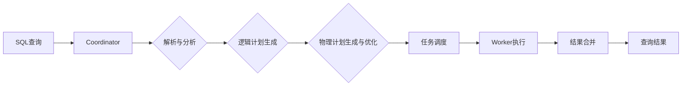

# Presto原理与代码实例讲解

## 1.背景介绍
### 1.1 大数据查询引擎的发展历程
### 1.2 Presto的诞生与发展
### 1.3 Presto的主要特点与优势

## 2.核心概念与联系
### 2.1 Presto的整体架构
#### 2.1.1 Coordinator
#### 2.1.2 Worker 
#### 2.1.3 Connector
### 2.2 Presto的查询执行流程
#### 2.2.1 解析与分析
#### 2.2.2 逻辑计划生成
#### 2.2.3 物理计划生成与优化
#### 2.2.4 任务调度与执行
### 2.3 Presto的数据模型
#### 2.3.1 Row
#### 2.3.2 Block
#### 2.3.3 Page
### 2.4 Presto核心概念之间的关系



## 3.核心算法原理具体操作步骤
### 3.1 查询解析与分析
#### 3.1.1 词法分析
#### 3.1.2 语法分析
#### 3.1.3 语义分析
### 3.2 逻辑计划生成算法
#### 3.2.1 关系代数表达式
#### 3.2.2 谓词下推优化
#### 3.2.3 列裁剪优化  
### 3.3 物理计划生成与优化
#### 3.3.1 代价模型
#### 3.3.2 动态规划算法
#### 3.3.3 启发式规则优化
### 3.4 任务调度算法
#### 3.4.1 任务划分
#### 3.4.2 任务调度策略
#### 3.4.3 数据本地性优化

## 4.数学模型和公式详细讲解举例说明
### 4.1 查询代价估算模型
#### 4.1.1 I/O代价估算
$Cost_{I/O} = \sum_i Size(Table_i) \times CostFactor_{I/O}$
#### 4.1.2 CPU代价估算 
$Cost_{CPU} = \sum_i Cardinality(Table_i) \times CostFactor_{CPU}$
#### 4.1.3 网络传输代价估算
$Cost_{Network} = \sum_i TransferSize(Table_i) \times CostFactor_{Network}$
### 4.2 基于代价的优化模型
$Cost(Plan) = Cost_{I/O} + Cost_{CPU} + Cost_{Network}$
$BestPlan = argmin(Cost(Plan)), Plan \in AllPlans$
### 4.3 数据倾斜检测模型
#### 4.3.1 基于标准差的倾斜检测
$Skewness_{\sigma} = \frac{\sigma}{\mu}$
#### 4.3.2 基于直方图的倾斜检测
$Skewness_H = \frac{|H_i - \overline{H}|}{\overline{H}}$

## 5.项目实践：代码实例和详细解释说明
### 5.1 Presto安装与部署
#### 5.1.1 单机模式
#### 5.1.2 集群模式
### 5.2 Presto与Hive集成 
#### 5.2.1 配置Hive Connector
#### 5.2.2 Hive元数据同步
### 5.3 编写Presto UDF
#### 5.3.1 标量函数
```java
public class ReverseFunction extends ScalarFunction {
    @ScalarFunction("reverse")
    @SqlType(StandardTypes.VARCHAR)
    public static Slice reverse(@SqlType(StandardTypes.VARCHAR) Slice slice) {
        return SliceUtf8.reverse(slice);
    }
}
```
#### 5.3.2 聚合函数
```java
public class GeometricMeanAggregation extends AggregationFunction<GeometricMeanAggregation.State, Double> {
    @InputFunction
    public static void input(State state, @SqlType(StandardTypes.DOUBLE) double value) {
        state.setCount(state.getCount() + 1);
        state.setProduct(state.getProduct() * value);
    }
    
    @CombineFunction
    public static void combine(State state, State otherState) {
        state.setCount(state.getCount() + otherState.getCount());
        state.setProduct(state.getProduct() * otherState.getProduct());
    }

    @OutputFunction(StandardTypes.DOUBLE)
    public static void output(State state, BlockBuilder out) {
        long count = state.getCount();
        if (count == 0) {
            out.appendNull();
        } else {
            double geometricMean = Math.pow(state.getProduct(), 1.0 / count);
            DOUBLE.writeDouble(out, geometricMean);
        }
    }
}
```
### 5.4 Presto查询优化实例
#### 5.4.1 大表Join小表
#### 5.4.2 分区裁剪
#### 5.4.3 动态过滤器
#### 5.4.4 Group By优化

## 6.实际应用场景
### 6.1 用户行为分析
#### 6.1.1 PV/UV统计
#### 6.1.2 留存分析
#### 6.1.3 漏斗分析
### 6.2 广告数据分析
#### 6.2.1 广告点击率预估
#### 6.2.2 广告收益统计
### 6.3 金融风控
#### 6.3.1 反欺诈
#### 6.3.2 信用评分

## 7.工具和资源推荐
### 7.1 Presto Web UI
### 7.2 Presto CLI
### 7.3 Presto Benchmark
### 7.4 Presto文档与社区

## 8.总结：未来发展趋势与挑战
### 8.1 Presto在云原生环境中的应用
### 8.2 Presto在机器学习领域的探索 
### 8.3 Presto查询加速技术
### 8.4 Presto面临的挑战与机遇

## 9.附录：常见问题与解答
### 9.1 Presto与Hive/Spark的对比
### 9.2 Presto的内存管理机制
### 9.3 Presto的容错与高可用
### 9.4 Presto的查询诊断与调优

作者：禅与计算机程序设计艺术 / Zen and the Art of Computer Programming