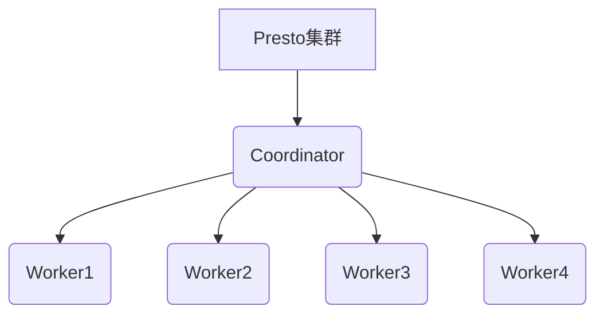
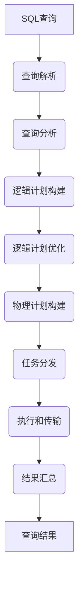

# Presto数据源连接：畅游数据海洋，连接无限可能

## 1.背景介绍

### 1.1 数据时代的到来

在当今时代，数据已经成为了企业和组织的关键资产。随着数据量的爆炸式增长,如何高效地处理和分析海量数据成为了一个巨大的挑战。传统的数据库系统往往难以满足现代数据分析的需求,因为它们在处理大规模数据集时存在性能瓶颈。

### 1.2 大数据处理的需求

为了解决这一问题,大数据技术应运而生。Apache Hadoop生态系统中的各种组件为存储和处理海量数据提供了强大的解决方案。然而,即使有了Hadoop,分析师和数据工程师仍然面临着数据孤岛的挑战。企业中的数据通常分散在多个异构数据源中,如关系数据库、NoSQL数据库、数据湖等,导致数据访问和集成变得困难。

### 1.3 Presto的出现

Apache Presto是一个开源的分布式SQL查询引擎,旨在为交互式分析查询提供高性能和可扩展性。它支持连接各种异构数据源,使用户能够以SQL的方式无缝访问和处理来自不同系统的数据。Presto的出现为数据分析带来了全新的可能性,它打破了数据孤岛,让数据分析变得更加高效和灵活。

## 2.核心概念与联系

### 2.1 Presto架构概述

Presto采用了主从架构,由一个协调器(Coordinator)和多个工作节点(Worker)组成。协调器负责解析SQL查询、制定执行计划并将任务分发给工作节点。工作节点则负责实际执行查询任务,并将结果返回给协调器。



### 2.2 连接器(Connector)

Presto的强大之处在于其丰富的连接器生态系统。连接器是Presto与各种异构数据源进行交互的接口,它们负责读取和写入数据。Presto内置了多种流行的连接器,如Hive、MySQL、PostgreSQL、Kafka等,同时也支持通过插件机制添加自定义连接器。

### 2.3 查询优化

为了提高查询性能,Presto采用了多种优化策略,包括:

- 代价模型优化器:根据数据统计信息选择最优的执行计划。
- 向量化执行引擎:利用现代CPU的SIMD指令集进行批量数据处理。
- 代码生成:动态生成专用代码以避免虚拟机开销。
- 分布式查询执行:将查询任务分发到多个工作节点并行执行。

## 3.核心算法原理具体操作步骤

### 3.1 查询生命周期

一个典型的Presto查询经历以下几个阶段:

1. **查询解析**: 将SQL语句解析为抽象语法树(AST)。
2. **查询分析**: 对AST进行语义分析,包括类型检查、视图解析等。
3. **逻辑计划构建**: 根据查询语义构建逻辑执行计划。
4. **逻辑计划优化**: 对逻辑计划进行一系列优化,如投影剪裁、谓词下推等。
5. **物理计划构建**: 将优化后的逻辑计划转换为物理执行计划。
6. **任务分发**: 协调器将物理计划分解为多个任务,并分发给工作节点执行。
7. **执行和传输**: 工作节点执行任务,并通过管道或分区传输中间结果。
8. **结果汇总**: 协调器汇总工作节点的结果并返回给客户端。



### 3.2 查询优化算法

Presto采用了多种优化算法来提高查询性能,包括:

1. **投影剪裁(Projection Pruning)**: 只读取查询所需的列,减少I/O开销。
2. **谓词下推(Predicate Pushdown)**: 将过滤条件下推到数据源,减少传输的数据量。
3. **连接重排(Join Reordering)**: 优化连接顺序以减少中间结果大小。
4. **成本模型优化(Cost-Based Optimization)**: 根据数据统计信息选择最优的执行计划。
5. **动态过滤(Dynamic Filtering)**: 在执行过程中动态传递过滤条件,减少不必要的数据处理。
6. **自适应查询(Adaptive Query)**: 根据运行时统计信息动态调整执行计划。

## 4.数学模型和公式详细讲解举例说明

在查询优化过程中,Presto广泛使用了数学模型和公式来估计执行计划的代价,从而选择最优的执行方式。

### 4.1 代价模型

Presto使用基于代价的优化器(Cost-Based Optimizer)来选择最优的执行计划。代价模型包括以下几个主要组成部分:

- $统计信息$: 包括表和列的基本统计信息,如行数、数据大小、distinct值数量等。
- $I/O代价$: 读取或写入数据所需的I/O开销,与数据大小和存储格式相关。
- $CPU代价$: 执行查询操作所需的CPU开销,与数据量和操作复杂度相关。
- $网络代价$: 在分布式环境中传输数据所需的网络开销,与数据量和网络带宽相关。

执行计划的总代价可以用以下公式表示:

$$
总代价 = \sum_{操作节点} (I/O代价 + CPU代价) + \sum_{网络传输} 网络代价
$$

优化器的目标是找到总代价最小的执行计划。

### 4.2 选择性估计

在优化过程中,估计过滤条件的选择性(selectivity)是一个关键步骤。选择性表示满足条件的数据占总数据的比例。准确的选择性估计可以帮助优化器做出更好的决策。

Presto使用基于直方图的方法来估计选择性。对于等值条件,它使用等深直方图(Equi-Height Histogram)来估计distinct值的分布。对于范围条件,它使用等宽直方图(Equi-Width Histogram)来估计值的分布。

例如,对于条件 `WHERE age BETWEEN 20 AND 30`,选择性可以用以下公式计算:

$$
选择性 = \frac{直方图桶[20,30]的行数}{总行数}
$$

### 4.3 连接大小估计

在优化连接顺序时,估计连接结果的大小是一个关键步骤。Presto使用基于直方图的方法来估计连接结果的基数(cardinality)。

对于内连接,结果的基数可以用以下公式估计:

$$
基数_{内连接} = \frac{基数_A \times 基数_B}{max(V(A.join\_key), V(B.join\_key))}
$$

其中 $V(X)$ 表示列 $X$ 的distinct值数量。

对于外连接,结果的基数可以用以下公式估计:

$$
基数_{左外连接} = 基数_A + 基数_{内连接} - \frac{基数_A \times 基数_B}{max(V(A.join\_key), V(B.join\_key))}
$$

根据估计的基数大小,优化器可以选择最优的连接顺序和连接算法。

## 5.项目实践：代码实例和详细解释说明

### 5.1 连接Hive数据源

Hive是Apache Hadoop生态系统中的数据仓库,广泛用于存储和查询结构化数据。Presto内置了Hive连接器,可以直接查询Hive中的表。

首先,我们需要在Presto的`etc/catalog`目录下创建一个Hive连接器的属性文件,例如`hive.properties`:

```properties
connector.name=hive-hadoop2
hive.metastore.uri=thrift://localhost:9083
```

然后,我们就可以使用SQL查询Hive表了:

```sql
SHOW SCHEMAS FROM hive;
USE hive.default;
SELECT * FROM orders LIMIT 10;
```

### 5.2 连接MySQL数据库

MySQL是流行的开源关系数据库,Presto也提供了MySQL连接器。

首先,创建MySQL连接器的属性文件`etc/catalog/mysql.properties`:

```properties
connector.name=mysql
connection-url=jdbc:mysql://localhost:3306
connection-user=root
connection-password=password
```

然后,就可以查询MySQL数据库中的表了:

```sql
SHOW SCHEMAS FROM mysql;
USE mysql.employees;
SELECT * FROM employees LIMIT 10;
```

### 5.3 自定义连接器

除了内置的连接器,Presto还支持通过插件机制添加自定义连接器。这为访问专有数据源提供了灵活性。

以下是一个简单的文件连接器的示例,它可以读取本地文件系统中的CSV文件:

```java
import com.facebook.presto.spi.*;
// ...

public class FileConnector implements ConnectorFactory {
    // ...

    @Override
    public Connector create(String connectorId, Map<String, String> properties) {
        // 解析连接器属性
        String directory = properties.get("file.directory");

        // 创建元数据管理器
        ConnectorMetadataFactory metadataFactory = new FileMetadataFactory(directory);

        // 创建分割管理器
        ConnectorSplitManager splitManager = new FileSplitManager(metadataFactory);

        // 创建页源提供器
        ConnectorPageSourceProvider pageSourceProvider = new FilePageSourceProvider();

        return new FileConnector(metadataFactory, splitManager, pageSourceProvider);
    }
}
```

开发自定义连接器需要实现多个接口,包括元数据管理、分割管理和页源提供等。这个过程相对复杂,但它为访问任何数据源提供了无限可能。

## 6.实际应用场景

Presto的高性能和灵活性使其在多个领域都有广泛的应用:

### 6.1 交互式分析

Presto最初的设计目标就是为交互式分析查询提供高性能。它可以在几秒钟内扫描数十亿行数据,满足了数据分析师对低延迟查询的需求。

### 6.2 ETL和数据集成

由于Presto能够连接多种异构数据源,它成为了数据ETL(提取、转换、加载)和数据集成的理想工具。通过SQL,可以方便地从不同系统中提取数据,进行转换和加载到目标系统中。

### 6.3 机器学习特征工程

在机器学习领域,特征工程是一个关键步骤。Presto可以高效地从大规模数据集中提取特征,为机器学习模型提供优质的输入数据。

### 6.4 流数据处理

虽然Presto最初是为批处理查询设计的,但它也可以用于流数据处理。通过连接Kafka等流数据源,Presto可以实时查询和分析流数据。

### 6.5 云数据湖分析

在云环境中,数据湖成为了存储和处理大数据的主要方式。Presto可以高效地查询云数据湖中的数据,成为了云数据分析的重要工具。

## 7.工具和资源推荐

### 7.1 Presto UI

Presto UI是一个基于Web的监控和管理界面,它提供了查询执行、资源利用率、工作节点状态等信息。通过Presto UI,我们可以方便地监控集群运行情况,并进行故障排查。

### 7.2 Presto CLI

Presto CLI是一个命令行工具,用于执行SQL查询和管理Presto集群。它提供了自动补全、查询历史记录等功能,方便了交互式查询。

### 7.3 Presto JDBC驱动

Presto提供了JDBC驱动程序,可以让各种应用程序通过标准的JDBC接口访问Presto。这使得Presto可以无缝集成到BI工具、ETL工具和其他数据应用中。

### 7.4 Presto社区

Presto拥有一个活跃的开源社区,包括邮件列表、Stack Overflow等渠道。社区是获取帮助、分享经验和了解最新动态的好地方。

### 7.5 Presto文档

Presto的官方文档(https://prestodb.io/docs/)是学习和使用Presto的重要资源。它包含了安装指南、SQL参