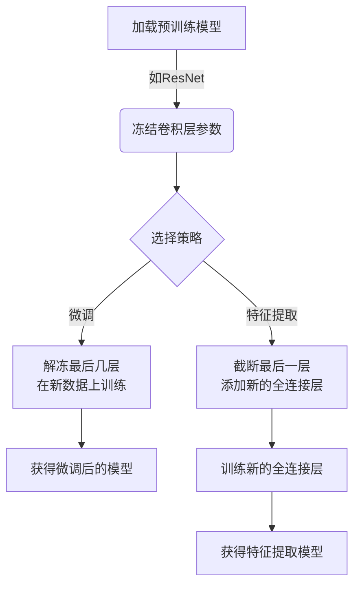

# PyTorch实现迁移学习：进阶篇

## 1.背景介绍

在深度学习时代,训练一个高质量的模型通常需要大量的计算资源和海量的标记数据。然而,在实际应用场景中,我们常常面临数据和计算资源有限的困境。迁移学习(Transfer Learning)为我们提供了一种有效的解决方案,它可以利用在大型数据集上预先训练好的模型,将学习到的知识迁移到新的任务和领域上,从而减少了训练数据和计算资源的需求。

PyTorch是一个流行的深度学习框架,提供了强大的迁移学习功能。本文将深入探讨PyTorch中迁移学习的实现方法,包括微调(Fine-tuning)和特征提取(Feature Extraction)等技术,并结合实际案例进行详细分析和代码实现。

### 1.1 什么是迁移学习?

迁移学习是一种机器学习技术,它允许我们将在一个领域学习到的知识应用到另一个相似但不同的领域。在深度学习中,这意味着我们可以利用在大型数据集(如ImageNet)上预训练的模型,将其迁移到新的任务中,而不是从头开始训练。

迁移学习的核心思想是:在相似的任务之间存在一些共享的低层次特征,我们可以利用这些共享特征作为知识迁移的基础。例如,在图像分类任务中,不同类别的图像在低层次上可能共享边缘、纹理等特征。因此,我们可以在大型数据集上预训练一个模型,让它学习这些通用的低层次特征,然后在新的任务上进行微调,使模型适应新的数据分布。

### 1.2 为什么使用迁移学习?

相比从头训练模型,使用迁移学习技术有以下优势:

1. **减少数据需求**: 预训练模型已经在大型数据集上学习了丰富的特征表示,因此在新的任务上只需要较少的数据就可以进行微调,从而节省了数据标注的成本。

2. **加速训练过程**: 由于模型的大部分参数已经在预训练阶段得到初始化,因此在新任务上只需要微调部分参数,可以大大减少训练时间。

3. **提高模型性能**: 利用预训练模型作为起点,可以获得更好的初始化参数,从而提高模型在新任务上的性能表现。

4. **降低计算资源需求**: 相比从头训练复杂的深度神经网络模型,迁移学习只需要对部分参数进行微调,因此计算资源需求较低。

## 2.核心概念与联系

### 2.1 预训练模型

预训练模型(Pre-trained Model)是迁移学习的基础。它是在大型公开数据集(如ImageNet)上训练得到的深度神经网络模型,已经学习到了通用的特征表示。常见的预训练模型包括VGG、ResNet、Inception等。

在PyTorch中,我们可以直接从`torchvision.models`模块加载这些预训练模型。例如,加载预训练的ResNet-50模型:

```python
import torchvision.models as models
resnet50 = models.resnet50(pretrained=True)
```

### 2.2 微调(Fine-tuning)

微调是迁移学习中最常用的技术之一。它的思路是:首先,将预训练模型的大部分层(如卷积层)的参数冻结,只保留最后几层(如全连接层)可训练;然后,在新的任务数据上训练这些可训练层,使模型适应新的数据分布。

在PyTorch中,我们可以使用`requires_grad`属性来控制参数是否可训练。例如,冻结预训练模型的卷积层参数:

```python
for param in resnet50.parameters():
    param.requires_grad = False
```

### 2.3 特征提取(Feature Extraction)

特征提取是另一种常用的迁移学习技术。它的思路是:将预训练模型当作一个固定的特征提取器,利用它提取输入数据的特征表示;然后,在这些特征的基础上,训练一个新的分类器(如全连接层)来完成新的任务。

在PyTorch中,我们可以通过截断预训练模型的最后一层,然后添加新的全连接层来实现特征提取。例如,对ResNet-50进行特征提取:

```python
resnet50 = models.resnet50(pretrained=True)
num_ftrs = resnet50.fc.in_features
resnet50 = nn.Sequential(*list(resnet50.children())[:-1])
classifier = nn.Linear(num_ftrs, num_classes)
```

### 2.4 Mermaid流程图

下面是迁移学习在PyTorch中的实现流程图:



## 3.核心算法原理具体操作步骤

在PyTorch中实现迁移学习的核心步骤如下:

1. **加载预训练模型**

   首先,我们需要从`torchvision.models`模块加载预训练模型,如ResNet、VGG等。例如,加载ResNet-50:

   ```python
   import torchvision.models as models
   resnet50 = models.resnet50(pretrained=True)
   ```

2. **冻结预训练模型参数**

   为了保留预训练模型中学习到的特征表示,我们需要冻结大部分层(如卷积层)的参数,只保留最后几层可训练。我们可以使用`requires_grad`属性来控制参数是否可训练:

   ```python
   for param in resnet50.parameters():
       param.requires_grad = False
   ```

3. **选择迁移学习策略**

   根据具体任务和数据情况,选择合适的迁移学习策略:微调或特征提取。

   - **微调(Fine-tuning)**

     如果新任务与预训练任务相似,且有足够的训练数据,我们可以采用微调策略。具体步骤如下:

     a. 解冻预训练模型的最后几层(如全连接层),使其参数可训练:

     ```python
     for param in resnet50.fc.parameters():
         param.requires_grad = True
     ```

     b. 在新的任务数据上训练这些可训练层,使模型适应新的数据分布。

   - **特征提取(Feature Extraction)**

     如果新任务与预训练任务差异较大,或者训练数据有限,我们可以采用特征提取策略。具体步骤如下:

     a. 截断预训练模型的最后一层(如全连接层):

     ```python
     resnet50 = nn.Sequential(*list(resnet50.children())[:-1])
     ```

     b. 添加新的全连接层,作为新任务的分类器:

     ```python
     num_ftrs = resnet50.fc.in_features
     classifier = nn.Linear(num_ftrs, num_classes)
     ```

     c. 在新的任务数据上,训练这个新添加的全连接层。

4. **训练和评估**

   根据选择的策略,在新的任务数据上训练模型。可以使用PyTorch提供的优化器(如SGD、Adam等)和损失函数(如交叉熵损失)进行训练。同时,我们还需要在验证集上评估模型的性能,以防止过拟合。

5. **模型保存和加载**

   训练完成后,我们可以使用PyTorch提供的`torch.save`和`torch.load`函数来保存和加载模型。这样,我们就可以在需要时重新加载训练好的模型,而不需要从头开始训练。

以上是PyTorch实现迁移学习的核心步骤。在实际应用中,我们还需要根据具体任务和数据情况进行一些调整和优化,如数据预处理、超参数调整等。

## 4.数学模型和公式详细讲解举例说明

在深度学习中,神经网络模型的训练过程可以用数学公式来描述。下面我们将详细介绍迁移学习中涉及的数学模型和公式。

### 4.1 损失函数

在迁移学习中,我们通常使用交叉熵损失函数(Cross-Entropy Loss)来衡量模型的预测结果与真实标签之间的差异。交叉熵损失函数的数学表达式如下:

$$
\mathcal{L}(\boldsymbol{y}, \hat{\boldsymbol{y}}) = -\sum_{i=1}^{C} y_i \log(\hat{y}_i)
$$

其中:

- $\boldsymbol{y}$ 是真实标签的一热编码向量,长度为 $C$ (类别数)
- $\hat{\boldsymbol{y}}$ 是模型预测的概率分布向量,长度也为 $C$
- $y_i$ 和 $\hat{y}_i$ 分别表示 $\boldsymbol{y}$ 和 $\hat{\boldsymbol{y}}$ 中第 $i$ 个元素的值

在PyTorch中,我们可以使用`nn.CrossEntropyLoss`来计算交叉熵损失。

### 4.2 优化算法

在迁移学习中,我们需要使用优化算法来更新模型参数,使损失函数最小化。常用的优化算法包括随机梯度下降(SGD)和自适应优化算法(如Adam)等。

**1. 随机梯度下降(SGD)**

SGD是一种简单而有效的优化算法,它通过计算损失函数关于模型参数的梯度,并沿着梯度的反方向更新参数,从而最小化损失函数。SGD的更新规则如下:

$$
\boldsymbol{w}_{t+1} = \boldsymbol{w}_t - \eta \nabla_{\boldsymbol{w}} \mathcal{L}(\boldsymbol{w}_t)
$$

其中:

- $\boldsymbol{w}_t$ 表示第 $t$ 次迭代时的模型参数向量
- $\eta$ 是学习率(Learning Rate),控制每次更新的步长
- $\nabla_{\boldsymbol{w}} \mathcal{L}(\boldsymbol{w}_t)$ 是损失函数关于 $\boldsymbol{w}_t$ 的梯度

在PyTorch中,我们可以使用`torch.optim.SGD`来实现SGD优化器。

**2. Adam优化算法**

Adam是一种自适应学习率的优化算法,它可以根据梯度的一阶矩估计和二阶矩估计动态调整每个参数的学习率。Adam的更新规则如下:

$$
\begin{aligned}
\boldsymbol{m}_t &= \beta_1 \boldsymbol{m}_{t-1} + (1 - \beta_1) \boldsymbol{g}_t \\
\boldsymbol{v}_t &= \beta_2 \boldsymbol{v}_{t-1} + (1 - \beta_2) \boldsymbol{g}_t^2 \\
\hat{\boldsymbol{m}}_t &= \frac{\boldsymbol{m}_t}{1 - \beta_1^t} \\
\hat{\boldsymbol{v}}_t &= \frac{\boldsymbol{v}_t}{1 - \beta_2^t} \\
\boldsymbol{w}_{t+1} &= \boldsymbol{w}_t - \eta \frac{\hat{\boldsymbol{m}}_t}{\sqrt{\hat{\boldsymbol{v}}_t} + \epsilon}
\end{aligned}
$$

其中:

- $\boldsymbol{m}_t$ 和 $\boldsymbol{v}_t$ 分别是梯度的一阶矩估计和二阶矩估计
- $\beta_1$ 和 $\beta_2$ 是控制一阶矩估计和二阶矩估计的指数衰减率
- $\hat{\boldsymbol{m}}_t$ 和 $\hat{\boldsymbol{v}}_t$ 是对应的偏差修正值
- $\epsilon$ 是一个很小的常数,用于避免分母为零

在PyTorch中,我们可以使用`torch.optim.Adam`来实现Adam优化器。

### 4.3 正则化

在迁移学习中,我们通常需要对模型进行正则化,以防止过拟合。常用的正则化方法包括L1正则化和L2正则化。

**1. L1正则化**

L1正则化也称为最小绝对收缩和选择算子(LASSO),它通过对模型参数的L1范数加上惩罚项,来实现参数的稀疏性。L1正则化的数学表达式如下:

$$
\Omega(\boldsymbol{w}) = \lambda \sum_{i=1}^{d} |w_i|
$$

其中:

- $\bolds